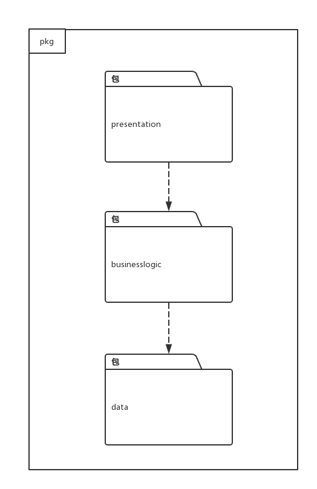
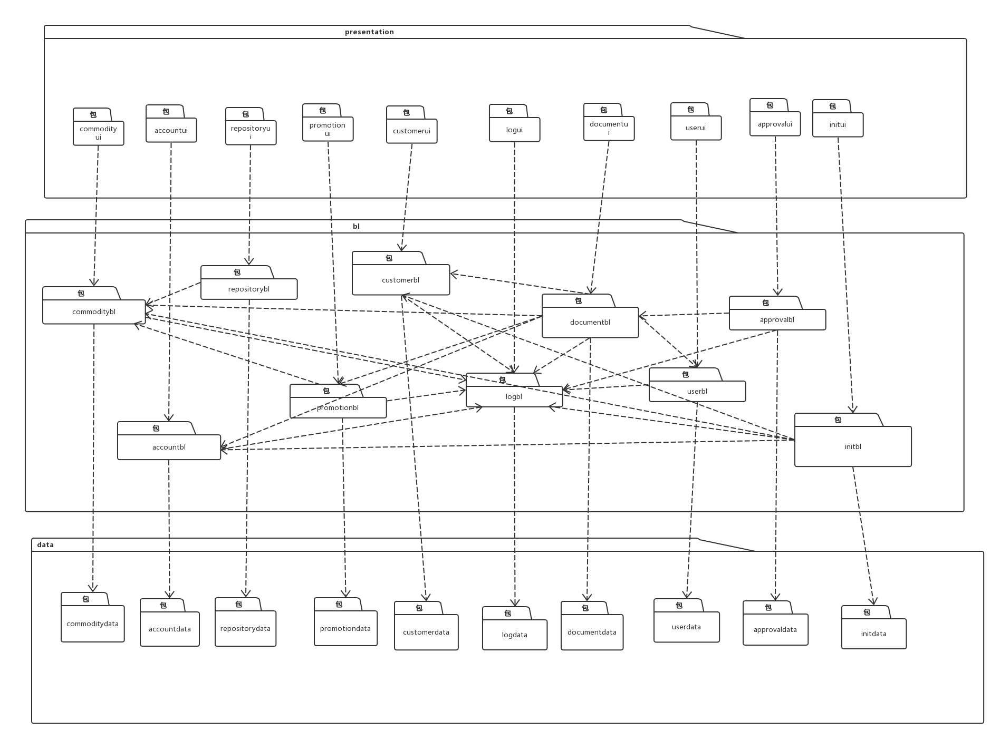
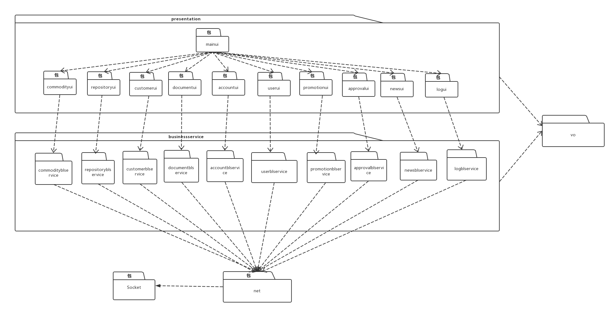
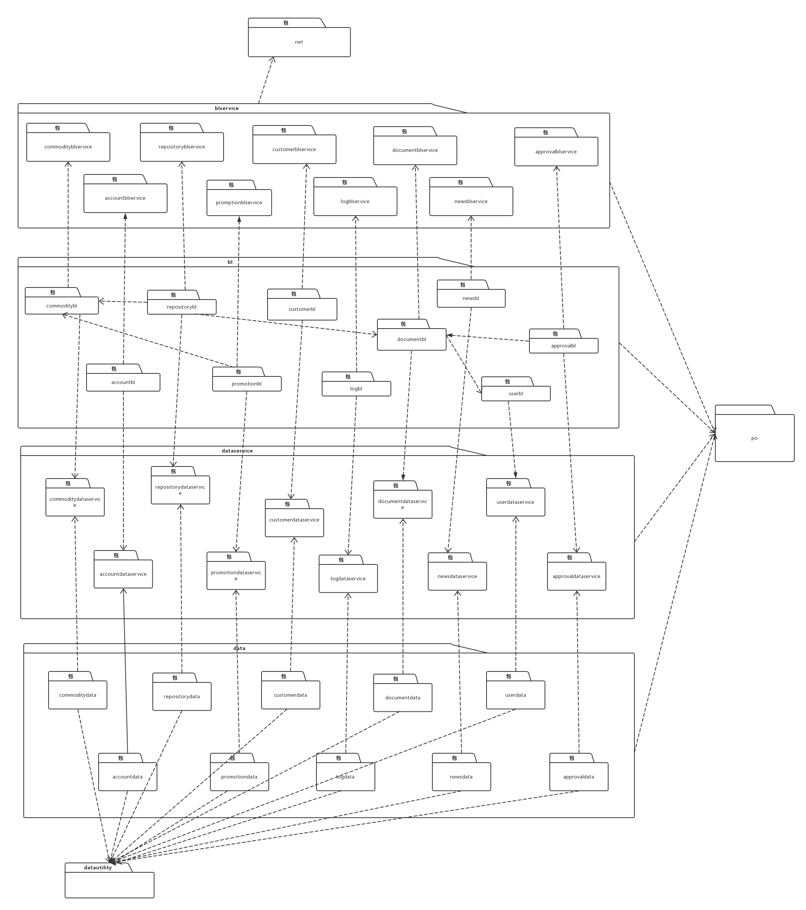
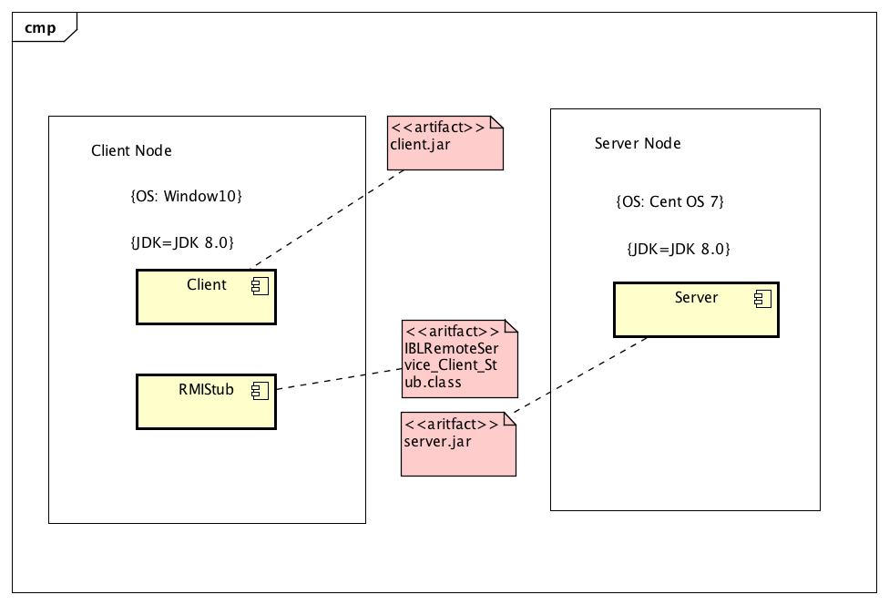
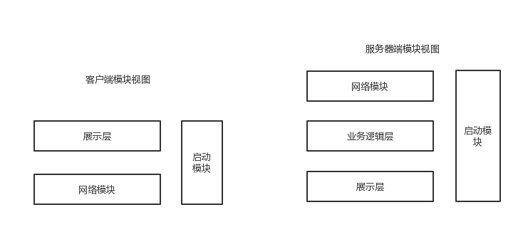

# 体系结构描述文档

## 目录

[TOC]

## 更新历史

| 修改人员 | 日期         | 变更原因                                     | 版本号   |
| ---- | ---------- | ---------------------------------------- | ----- |
| 廖均达  | 2017.10.11 | 完成逻辑包图与开发包图设计                            | 0.01  |
| 訾源   | 2017.10.17 | 修正逻辑包和开发包设计的重大失误                         | 0.02  |
| 訾源   | 2017.10.22 | 整合库存管理人员部分进入文档，添加接口说明文字、图片、以及表格，增加信息视角、运行时进程图、物理部署图 | 1.0.0 |

## 引言

### 编制目的

本报告详细完成对灯具照明行业进销存系统的概要设计，达到指导详细设计和开发的目的，同时实现测试人员及用户的沟通。
本报告面向开发人员、测试人员及最终用户编写，是了解系统的导航。

## 产品概述

参考灯具照明行业进销存系统用例文档和灯具照明行业进销存系统软件规格说明中对产品的概括描述。

## 逻辑视角

灯具照明行业进销存系统中，选择了分层体系结构的风格，将系统分为3层（展示层、业务逻辑层、数据层）能够很好的示意整个高层抽象。展示层包括GUI页面的实现，业务逻辑层包含业务逻辑处理的实现，数据层负责数据的持久化和访问。分层体系结构的逻辑视角和逻辑设计方案如图1和图二所示。

- 图一

- 图二

## 组合视角

### 开发包图

灯具照明行业灯具进销存系统的最终开发包设计如下表所示

| 开发（物理）包               | 依赖的其他开发包                                 |
| --------------------- | ---------------------------------------- |
| mainui                | commodityui repositoryui customerui documentui accountui userui approvalui promotionui logui |
| commodityui           | commodityblservice javafx vo             |
| commodityblservice    | Javarmi vo                               |
| commoditybl           | commodityblservice commoditydataservice po |
| commoditydataservice  | commoditydata po                         |
| commoditydata         | databaseutility po                       |
| repositoryui          | repositoryblservice javafx               |
| repositoryblservice   | Javarmi vo                               |
| repositorybl          | commoditybl repositoryblservice repositorydataservice po documentbl |
| repositorydataservice | repositorydata po                        |
| repositorydata        | po databaseutility                       |
| customerui            | customerblservice vo javafx              |
| customerbl            | customerblservice customerdataservice po documentbl |
| customerblservice     | Javarmi                                  |
| customerdata          | databaseutility customerdataservice po   |
| customerdataservice   | po                                       |
| documentui            | documentblservice vo javafx commodityui  |
| documentbl            | documentblservice documentdataservice po userbl |
| documentblservice     | Javarmi                                  |
| documentdata          | databaseutility documentdataservice po   |
| documentdataservice   | po                                       |
| accountui             | accountblservice javafx vo               |
| accountblservice      | Javarmi vo                               |
| accountbl             | acccountblservice accountdataservice po  |
| accountdataservice    | po                                       |
| accountdata           | accountdataservice po databaseutility    |
| userui                | userblservice javafx                     |
| userblservice         | Javarmi vo                               |
| userbl                | userblservice userdataservice po         |
| userdataservice       | po                                       |
| userdata              | userdataservice po databaseutility       |
| approvalui            | javafx, approvalblservice, vo            |
| approvalblservice     | Javarmi , vo                             |
| approvalbl            | approvalblservice, approvaldataservice, documentbl, po |
| approvaldataservice   | po                                       |
| approvaldata          | approvaldataservice, po, databaseutility |
| promotionui           | javafx, promotionblservice,vo            |
| promotionblservice    | javarmi,vo                               |
| promotionbl           | promtionblservice,  promtiondataservice, commoditybl, po |
| promotiondataservice  | po                                       |
| promotiondata         | promotiondataservice, po, databaseutility |
| logui                 | javafx, logblservice, vo                 |
| logblservice          | javarmi, vo                              |
| logbl                 | logblservice, logdataservice, po         |
| logdataservice        | po                                       |
| logdata               | logdataservice, po, databaseutility      |
| javarmi               |                                          |
| javafx                |                                          |
| databaseutility       | JDBC                                     |

- 客户端开发包图

- 服务器端开发包图

#### 运行时进程

在灯具进销存系统中，会有多个客户端进程和一个服务器端进程，其进程图如下图所示。结合部署图，客户端进程是在客户端机器上运行，服务器端进程是在服务器端机器上运行。

#### 物理部署

灯具进销存系统中客户端构建是放在客户端机器上，服务器端构建是放在服务器端机器上。在客户端节点上，还要部署 RMIStub 构件。由于 Java RMI 构件输入 JDK 8.0 的一部分，所以，在系统 JDK 环境已经设置好的情况下，不需要在独立部署。部署图入下图所示。

## 接口视角

### 模块的职责

服务器端模块和客户端模块视图入下图所示。

客户端和服务器端各层的职责分别由下面两张表来说明

| 层       | 职责                      |
| ------- | ----------------------- |
| 启动模块    | 负责初始化网络通信机制，启动用户界面      |
| 用户界面层   | 基于窗口的灯具进销存客户端用户界面       |
| 客户端网络模块 | 利用 Java RMI 机制查找 RMI 服务 |

| 层        | 职责                                |
| -------- | --------------------------------- |
| 启动模块     | 负责初始化网络通信机制，启动程序                  |
| 业务逻辑层    | 对客户端需要在服务器端进行的请求进行处理，并执行相应的业务逻辑   |
| 服务器端网络模块 | 利用 Java RMI 机制开启 RMI 服务，注册 RMI 服务 |
| 数据层      | 负责数据的持久化及数据访问接口                   |

每一层只是使用下方直接接触的层。层与层之间仅仅是通过接口的调用来完成的。层与层之间调用的接口如下表所示。

| 接口                                       | 服务调用方     | 服务提供方     |
| ---------------------------------------- | --------- | --------- |
| CommodityBLService, AccountBLService, RepositoryBLService, PromotionBLService, CustomerBLService, LogBLService, DocumentBLService, ApprovalBLService, UserBLService | 客户端展示层    | 服务器端业务逻辑层 |
| CommodityDataService, AccountDataService, RepositoryDataService, PromotionDataService, CustomerDataService, LogDataService, DocunmentDataService, ApprovalDataService, UserDataService | 服务器端业务逻辑层 | 服务器端数据层   |

### 用户界面层的分解

根据需求，系统存在 ***<u>（待填写）</u>***个用户界面：商品/商品分类管理界面，库存盘点界面，库存查看界面，创建库存报损/报溢单界面，创建库存报警单界面，单据历史信息查询界面 ***<u>（待填写完整）</u>***。

界面转跳如下图所示。

***<u>（待插入图片******）</u>***

用户界面类如下：

#### 用户界面层模块职责

| 模块        | 职责                        |
| --------- | ------------------------- |
| MainFrame | 界面MainFrame，负责界面的显示和界面的跳转 |

#### 用户界面层模块的接口规范

### 业务逻辑层的分解

业务逻辑层包括多个针对显示界面的业务逻辑处理对象。

业务逻辑层设计如下：

#### 业务逻辑层模块的职责

 ***<u>（待填写完整）</u>***。

| 模块           | 职责                           |
| ------------ | ---------------------------- |
| CommodityBL  | 实现商品管理、商品分类管理所需要的服务          |
| RepositoryBL | 实现库存查询、库存快照所需要的服务            |
| DocBL        | 实现各种单据界面、历史单据查询、部分单据审批所需要的服务 |

#### 业务逻辑模块的接口规范

##### Commoditybl 模块接口规范

- 提供的服务

  | 名称                            | 条目   | 详情                                       |
  | ----------------------------- | ---- | ---------------------------------------- |
  |                               | 语法   | `public ArrayList<CommodityVO> getCommodityList ()throws RemoteException` |
  | Commodity.getCommodityList    | 前置条件 | 无                                        |
  |                               | 后置条件 | 返回所有商品列表                                 |
  |                               | 语法   | `public ResultMessage addCommodity(CommodityVO newCommodity) throws RemoteException` |
  | Commodity.addCommodity        | 前置条件 | 输入任意非空名称、非空类型、已经存在的商品分类、大于零的数量以及大于零的成本价格 |
  |                               | 后置条件 | 增加新的商品，更新持久化存储内容                         |
  |                               | 语法   | `public ArrayList<CommodityVO> findCommodityByName(String commodityName)throws RemoteException` |
  | Commodity.findCommodityByName | 前置条件 | 输入任意非空商品名称                               |
  |                               | 后置条件 | 根据商品名称查找是否存在相应的商品，若存在匹配的商品则返回相应`ArrayList<CommodityVO>`对象，若不存在匹配项则返回`null` |
  |                               | 语法   | `public CommodityVO findCommodityById(String id)throws RemoteException` |
  | Commodity.findCommodityById   | 前置条件 | 输入不违反商品id格式的字符串                          |
  |                               | 后置条件 | 根据商品id查找是否存在相应的商品，如果存在与输入id完全相同的产品，返回一个CommodityVO对象，否则返回null |
  |                               | 语法   | `public ResultMessage deleteCommodity(String id)throws RemoteException` |
  | Commodity.deleteCommodity     | 前置条件 | 输入不违反商品id格式的字符串                          |
  |                               | 后置条件 | 如果存在与输入商品id对应的商品，删除商品。返回ResultMessage    |
  |                               | 语法   | `public ResultMessage modifyCommodity(CommodityVO commodity)throws RemoteException` |
  | Commodity.modifyCommodity     | 前置条件 | 输入一个非空的CommodityVO对象                     |
  |                               | 后置条件 | 返回ResultMessage                          |

- 需要的服务

| 服务名                                      | 服务              |
| ---------------------------------------- | --------------- |
| CommodityDataService.getAll()            | 得到目前存储的所有商品数据对象 |
| CommodityDataService.find(String id)     | 根据ID得到商品数据对象    |
| CommodityDataService.insert(CommodityPO po) | 插入单一持久化对象       |
| CommodityDataService.update(CommodityPO po) | 更新单一持久化对象       |
| CommodityDataService.delete(CommodityPO po) | 删除单一持久化对象       |
| CommodityDataService.findByName(String name) | 根据名称查找多个持久化对象   |

##### Repositorybl 模块接口规范

- 提供的服务

  | 名称                              | 条目   | 详情                                       |
  | ------------------------------- | ---- | ---------------------------------------- |
  |                                 | 语法   | `public ArrayList<RepositoryChangeVO> getRepositoryChanges (long startTime, long endTime)throws RemoteException` |
  | Repository.getRepositoryChanges | 前置条件 | 无                                        |
  |                                 | 后置条件 | 返回在startTime和endTime之间（两边均包含）之间所有的库存变化   |
  |                                 | 语法   | `public RepositoryTableVO getRepositoryTable()throws RemoteException` |
  | Repository.getRepositoryTable   | 前置条件 | 无                                        |
  |                                 | 后置条件 | 返回GMT-8时区当前日期的库存快照，包括当天的各种商品的名称，型号，库存数量，库存均价，批次，批号，出厂日期。 |

- 需要的服务

| 服务名                                      | 服务          |
| ---------------------------------------- | ----------- |
| RepositoryDataService.get(long start, long end) | 获取时间段内的库存变化 |

##### Documentbl 模块的接口规范

- 提供的服务

  | 名称                               | 条目   | 详情                                       |
  | -------------------------------- | ---- | ---------------------------------------- |
  |                                  | 语法   | `public ResultMessage addAlertDoc (AlertDocVO alertDoc)throws RemoteException` |
  | AlertDoc.addAlertDoc             | 前置条件 | 传入一个非空的AlertDocVO对象，其中的数据域alertDocItems的长度必须大于0 |
  |                                  | 后置条件 | 返回是否成功添加库存报警单                            |
  |                                  | 语法   | `public AlertDocVO getAlertDoc (int docId)throws RemoteException` |
  | AlertDoc.getAlertDoc             | 前置条件 | 传入一个合法的库存报警单编号                           |
  |                                  | 后置条件 | 返回报警单编号对应的库存报警单对象                        |
  |                                  | 语法   | `public ArrayList<AlertDocVO> getAlertDocs(String userid)throws RemoteException` |
  | AlertDoc.getAlertDocs            | 前置条件 | 输入有效的关键字                                 |
  |                                  | 后置条件 | 根据关键字查找是否存在相应的账户，若存在匹配的账户则返回相应`Account`对象，若不存在匹配项则返回`null` |
  |                                  | 语法   | `public void triggered(RepositoryChangeVO change)throws RemoteException` |
  | Doc.triggered                    | 前置条件 | 输入非空的一个RepositoryChange对象                |
  |                                  | 后置条件 | 标记所有因为库存变化导致不满足的库存报警单、存入数据库              |
  |                                  | 语法   | `public ArrayList<HistoryDoc> getHistoryDocs(String useid)throws RemoteException` |
  | HistroyDoc.getHistoryDocs        | 前置条件 | 输入有效的用户ID                                |
  |                                  | 后置条件 | 返回用户历史单据信息                               |
  |                                  | 语法   | `public ReturnMessage addLossAndGainDoc (LossAndGainDocPO lossAndGainDoc)throws RemoteException` |
  | LossAndGainDoc.addLossAndGainDoc | 前置条件 | 传入一个非空的LossAndGainDocPO对象，其中的数据域lossAndGainDocItems的长度必须大于0 |
  |                                  | 后置条件 | 返回是否成功添加库存报损/报溢单                         |

- 需要的服务

| 服务名                                      | 服务            |
| ---------------------------------------- | ------------- |
| DocDataService.insert(DocPO doc)         | 插入Doc         |
| DocDataService.find(String id)           | 根据ID得到Doc对象   |
| DocDataService.update(DocPO doc)         | 更新单一持久化对象     |
| DocDataService.findByTime(long start, long end) | 获取时间段内的全部单据信息 |
| DocDataService.findByUser(String userid) | 获取某一用户的全部单据信息 |

##### accountbl 模块的接口规范

- 提供的服务

  | 名称                     | 条目   | 详情                                       |
  | ---------------------- | ---- | ---------------------------------------- |
<<<<<<< HEAD
  |                        | 语法   | `public ArrayList<Account> getAccountList ()throws RemoteException` |
  | Account.getAccountList | 前置条件 | 得到数据                                     |
  |                        | 后置条件 | 返回账户列表                                   |
  |                        | 语法   | `public void addAccount(String name, String amount)throws RemoteException` |
  | Account.addAccount     | 前置条件 | 金额，名称符合输入规则                              |
  |                        | 后置条件 | 增加新的账户，更新持久化存储内容                         |
  |                        | 语法   | `public Account findAccount(String keyword)throws RemoteException` |
  | Account.findAccount    | 前置条件 | 输入有效的关键字                                 |
  |                        | 后置条件 | 根据关键字查找是否存在相应的账户，若存在匹配的账户则返回相应`Account`对象，若不存在匹配项则返回`null` |
  |                        | 语法   | `public Account getAccount(String name)throws RemoteException` |
  | Account.getAccount     | 前置条件 | 输入有效的账户名称                                |
  |                        | 后置条件 | 得到数据，返回名称对应的`Account`对象                  |
  |                        | 语法   | `public void deleteAccount(String name)throws RemoteException` |
  | Account.deleteAccount  | 前置条件 | 输入有效的账户名称                                |
  |                        | 后置条件 | 删除相应的账户，更新持久化存储内容                        |
  |                        | 语法   | `public void modifyAccount(String name)throws RemoteException` |
=======
  |                        | 语法   | `public ArrayList<AccountVO> getAccountList ()` |
  | Account.getAccountList | 前置条件 | 得到数据                                     |
  |                        | 后置条件 | 返回账户列表                                   |
  |                        | 语法   | `public ResultMessage addAccount(String name, String amount)` |
  | Account.addAccount     | 前置条件 | 金额，名称符合输入规则                              |
  |                        | 后置条件 | 增加新的账户，更新持久化存储内容                         |
  |                        | 语法   | `public ArrayList<AccountVO> findAccount(String keyword)` |
  | Account.findAccount    | 前置条件 | 输入有效的关键字                                 |
  |                        | 后置条件 | 根据关键字查找是否存在相应的账户，若存在匹配的账户则返回相应`Account`对象，若不存在匹配项则返回`null` |
  |                        | 语法   | `public AccountVO getAccount(String id)` |
  | Account.getAccount     | 前置条件 | 输入有效的账户名称                                |
  |                        | 后置条件 | 得到数据，返回名称对应的`Account`对象                  |
  |                        | 语法   | `public ResultMessage deleteAccount(String id)` |
  | Account.deleteAccount  | 前置条件 | 输入有效的账户名称                                |
  |                        | 后置条件 | 删除相应的账户，更新持久化存储内容                        |
  |                        | 语法   | `public ResultMessage modifyAccount(AccountVO vo)` |
>>>>>>> ad498a0d2c55515b12db2ddf936eee82b6bd3583
  | Account.modifyAccount  | 前置条件 | 输入有效的账户名称                                |
  |                        | 后置条件 | 更改所修改的账户名称，更新持久化存储的数据                    |

- 需要的服务（需接口）

  | 服务名                                     | 服务                 |
  | --------------------------------------- | ------------------ |
  | AccountDataService.getAll()             | 得到目前存储的所有账户的持久化对象  |
  | AccountDataService.get(String id)       | 根据ID得到单一持久对象       |
  | AccountDataService.insert(AccountPO po) | 插入单一持久化对象          |
  | AccountDataService.update(AccountPO po) | 更新单一持久化对象          |
  | AccountDataService.delete(AccountPO po) | 删除单一持久化对象          |
  | AccountDataService.find(String keyword) | 根据关键字查找多个持久化对象     |
  | DataBaseFactory.getAccountDataBase      | 得到Account数据库的服务的引用 |

  ### 数据层的分解

  #### 数据层模块职责

   ***<u>（待填写完整）</u>***。

  | 模块                    | 职责                                     |
  | --------------------- | -------------------------------------- |
  | CommodityDataService  | 基于sqlite数据库的持久化数据库接口，提供商品、商品分类等的增删改查服务 |
  | RepositoryDataService | 基于sqlite数据库的持久化数据库接口，提供库存信息的查询服务       |
  | DocBL                 | 基于sqlite数据库的持久化数据库接口，提供单据的增查、审批等服务     |

  #### 数据层接口规范

  ##### commoditydataservice 模块的接口规范

  提供的服务

  | 名称                              | 条目   | 详情                                       |
  | ------------------------------- | ---- | ---------------------------------------- |
  |                                 | 语法   | `public ArrayList<CommodityPO> getAll ()` |
  | CommodityDataService.getAll     | 前置条件 | 无                                        |
  |                                 | 后置条件 | 返回所有商品列表                                 |
  |                                 | 语法   | `public ResultMessage insert(CommodityPO po)` |
  | CommodityDataService.insert     | 前置条件 | 输入任意非空名称、非空类型、已经存在的商品分类、大于零的数量以及大于零的成本价格 |
  |                                 | 后置条件 | 增加新的商品，更新持久化存储内容                         |
  |                                 | 语法   | `public ArrayList<CommodityPO> findByName(String commodityName)` |
  | CommodityDataService.findByName | 前置条件 | 输入任意非空商品名称                               |
  |                                 | 后置条件 | 根据商品名称查找是否存在相应的商品，若存在匹配的商品则返回相应`ArrayList<CommodityPO>`对象，若不存在匹配项则返回`null` |
  |                                 | 语法   | `public CommodityPO find(String id)`     |
  | Commodity.find                  | 前置条件 | 输入不违反商品id格式的字符串                          |
  |                                 | 后置条件 | 根据商品id查找是否存在相应的商品，如果存在与输入id完全相同的产品，返回一个CommodityPO对象，否则返回null |
  |                                 | 语法   | `public ResultMessage delete(String id)` |
  | Commodity.delete                | 前置条件 | 输入不违反商品id格式的字符串                          |
  |                                 | 后置条件 | 如果存在与输入商品id对应的商品，删除商品。返回ResultMessage    |
  |                                 | 语法   | `public boolean update(CommodityPO commodity)` |
  | Commodity.update                | 前置条件 | 输入一个非空的CommodityPO对象                     |
  |                                 | 后置条件 | 如果成功更新，返回true，否则返回false                  |

  ##### repositorydataservice 模块的接口规范

  提供的服务

  | 名称                        | 条目   | 详情                                       |
  | ------------------------- | ---- | ---------------------------------------- |
  |                           | 语法   | `public ArrayList<RepositoryChangePO> get (long start, long end)` |
  | RepositoryDataService.get | 前置条件 | 无                                        |
  |                           | 后置条件 | 返回在start和end之间（两边均包含）之间所有的库存变化           |

  ##### documentdataservice 模块的接口规范

  提供的服务

  | 名称                        | 条目   | 详情                                       |
  | ------------------------- | ---- | ---------------------------------------- |
  |                           | 语法   | `public ResultMessage insert(DocPO doc)` |
  | DocDataService.insert     | 前置条件 | 输入非空doc对象                                |
  |                           | 后置条件 | 返回ResultMessage                          |
  |                           | 语法   | `public ArrayList<DocPO>findByUser(String userid) ` |
  | DocDataService.findByUser | 前置条件 | 如何合法的用户id                                |
  |                           | 后置条件 | 返回该用户所有创建过的单据                            |
  |                           | 语法   | `public Doc find (String id)`            |
  | DocDataService.find       | 前置条件 | 输入合法的单据id                                |
  |                           | 后置条件 | 根据单据id查找`Doc`对象并返回，若不存在匹配项则返回`null`      |
  |                           | 语法   | `public ResultMessage update(DocPO doc)` |
  | DocDataService.update     | 前置条件 | 输入某个已经存在但是做出修改的Doc对象                     |
  |                           | 后置条件 | 返回ResultMessage                          |
  |                           | 语法   | `public ArrayList<DocPO>findByTime(long start, long end)` |
  | DocDataService.findByTime | 前置条件 | 输入两个long                                 |
  |                           | 后置条件 | 返回时间在start和end之间的单据对象                    |

  ### 

  ## 信息视角

  #### 数据库表

   ***<u>（待填写完整）</u>***。

  数据库中包含Commodity表、AlertDoc表、AlertDocItem表、CommodityCategory表、HistoryDoc表、LossAndGainDoc表、LossAndGainDocItem表、RepositoryChange表

