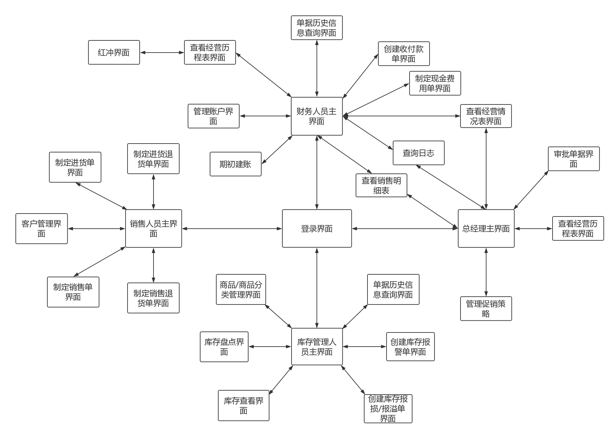
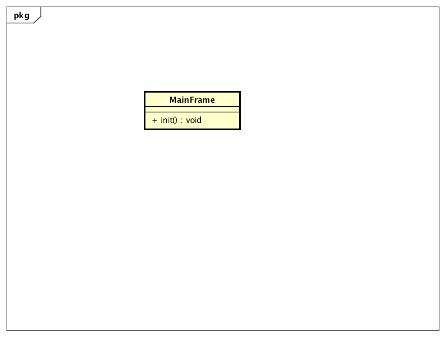
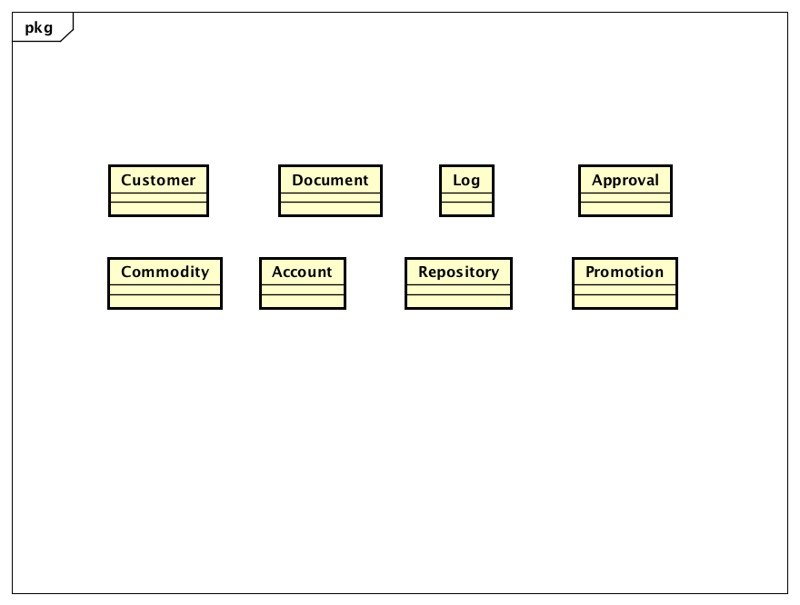

# 体系结构描述文档

## 目录

[TOC]

## 更新历史

| 修改人员 | 日期         | 变更原因                                     | 版本号   |
| ---- | ---------- | ---------------------------------------- | ----- |
| 廖均达  | 2017.10.11 | 完成逻辑包图与开发包图设计                            | 0.01  |
| 訾源   | 2017.10.17 | 修正逻辑包和开发包设计的重大失误                         | 0.02  |
| 訾源   | 2017.10.22 | 整合库存管理人员部分进入文档，添加接口说明文字、图片、以及表格，增加信息视角、运行时进程图、物理部署图 | 1.0.0 |

## 引言

### 编制目的

本报告详细完成对灯具照明行业进销存系统的概要设计，达到指导详细设计和开发的目的，同时实现测试人员及用户的沟通。
本报告面向开发人员、测试人员及最终用户编写，是了解系统的导航。

## 产品概述

参考灯具照明行业进销存系统用例文档和灯具照明行业进销存系统软件规格说明中对产品的概括描述。

## 逻辑视角

灯具照明行业进销存系统中，选择了分层体系结构的风格，将系统分为3层（展示层、业务逻辑层、数据层）能够很好的示意整个高层抽象。展示层包括GUI页面的实现，业务逻辑层包含业务逻辑处理的实现，数据层负责数据的持久化和访问。分层体系结构的逻辑视角和逻辑设计方案如图1和图二所示。

- 图一

- 图二

## 组合视角

### 开发包图

灯具照明行业灯具进销存系统的最终开发包设计如下表所示

| 开发（物理）包               | 依赖的其他开发包                                 |
| --------------------- | ---------------------------------------- |
| mainui                | commodityui repositoryui customerui documentui accountui userui approvalui promotionui logui |
| commodityui           | commodityblservice javafx vo             |
| commodityblservice    | Javarmi vo                               |
| commoditybl           | commodityblservice commoditydataservice po |
| commoditydataservice  | commoditydata po                         |
| commoditydata         | databaseutility po                       |
| repositoryui          | repositoryblservice javafx               |
| repositoryblservice   | Javarmi vo                               |
| repositorybl          | commoditybl repositoryblservice repositorydataservice po documentbl |
| repositorydataservice | repositorydata po                        |
| repositorydata        | po databaseutility                       |
| customerui            | customerblservice vo javafx              |
| customerbl            | customerblservice customerdataservice po documentbl |
| customerblservice     | Javarmi                                  |
| customerdata          | databaseutility customerdataservice po   |
| customerdataservice   | po                                       |
| documentui            | documentblservice vo javafx commodityui  |
| documentbl            | documentblservice documentdataservice po userbl |
| documentblservice     | Javarmi                                  |
| documentdata          | databaseutility documentdataservice po   |
| documentdataservice   | po                                       |
| accountui             | accountblservice javafx vo               |
| accountblservice      | Javarmi vo                               |
| accountbl             | acccountblservice accountdataservice po  |
| accountdataservice    | po                                       |
| accountdata           | accountdataservice po databaseutility    |
| userui                | userblservice javafx                     |
| userblservice         | Javarmi vo                               |
| userbl                | userblservice userdataservice po         |
| userdataservice       | po                                       |
| userdata              | userdataservice po databaseutility       |
| approvalui            | javafx, approvalblservice, vo            |
| approvalblservice     | Javarmi , vo                             |
| approvalbl            | approvalblservice, approvaldataservice, documentbl, po |
| approvaldataservice   | po                                       |
| approvaldata          | approvaldataservice, po, databaseutility |
| promotionui           | javafx, promotionblservice,vo            |
| promotionblservice    | javarmi,vo                               |
| promotionbl           | promtionblservice,  promtiondataservice, commoditybl, po |
| promotiondataservice  | po                                       |
| promotiondata         | promotiondataservice, po, databaseutility |
| logui                 | javafx, logblservice, vo                 |
| logblservice          | javarmi, vo                              |
| logbl                 | logblservice, logdataservice, po         |
| logdataservice        | po                                       |
| logdata               | logdataservice, po, databaseutility      |
| javarmi               |                                          |
| javafx                |                                          |
| databaseutility       | JDBC                                     |

- 客户端开发包图

- 服务器端开发包图

#### 运行时进程

在灯具进销存系统中，会有多个客户端进程和一个服务器端进程，其进程图如下图所示。结合部署图，客户端进程是在客户端机器上运行，服务器端进程是在服务器端机器上运行。

#### 物理部署

灯具进销存系统中客户端构建是放在客户端机器上，服务器端构建是放在服务器端机器上。在客户端节点上，还要部署 RMIStub 构件。由于 Java RMI 构件输入 JDK 8.0 的一部分，所以，在系统 JDK 环境已经设置好的情况下，不需要在独立部署。部署图入下图所示。

## 接口视角

### 模块的职责

服务器端模块和客户端模块视图入下图所示。

客户端和服务器端各层的职责分别由下面两张表来说明

| 层       | 职责                      |
| ------- | ----------------------- |
| 启动模块    | 负责初始化网络通信机制，启动用户界面      |
| 用户界面层   | 基于窗口的灯具进销存客户端用户界面       |
| 客户端网络模块 | 利用 Java RMI 机制查找 RMI 服务 |

| 层        | 职责                                |
| -------- | --------------------------------- |
| 启动模块     | 负责初始化网络通信机制，启动程序                  |
| 业务逻辑层    | 对客户端需要在服务器端进行的请求进行处理，并执行相应的业务逻辑   |
| 服务器端网络模块 | 利用 Java RMI 机制开启 RMI 服务，注册 RMI 服务 |
| 数据层      | 负责数据的持久化及数据访问接口                   |

每一层只是使用下方直接接触的层。层与层之间仅仅是通过接口的调用来完成的。层与层之间调用的接口如下表所示。

| 接口                                       | 服务调用方     | 服务提供方     |
| ---------------------------------------- | --------- | --------- |
| CommodityBLService, AccountBLService, RepositoryBLService, PromotionBLService, CustomerBLService, LogBLService, DocumentBLService, ApprovalBLService, UserBLService | 客户端展示层    | 服务器端业务逻辑层 |
| CommodityDataService, AccountDataService, RepositoryDataService, PromotionDataService, CustomerDataService, LogDataService, DocunmentDataService, ApprovalDataService, UserDataService | 服务器端业务逻辑层 | 服务器端数据层   |

### 用户界面层的分解

根据需求，系统存在 ***<u>（22）</u>***个用户界面：商品/商品分类管理界面，库存盘点界面，库存查看界面，创建库存报损/报溢单界面，创建库存报警单界面，单据历史信息查询界面，制定进货单界面，制定退货单界面，客户管理界面，制定销售单界面，制定销售退货单界面，期初建账界面，创建收付款单界面，管理账户界面，制定现金费用单界面，查询日志界面，查看销售明细表界面，查看经营情况表界面，查看经营历程表界面，红冲界面，审批单据界面，管理促销策略界面。

界面转跳如下图所示。

用户界面类如下：

#### 用户界面层模块职责

| 模块                   | 职责                                       |
| -------------------- | ---------------------------------------- |
| MainFrame            | 界面MainFrame，负责界面的显示和界面的跳转                |
| SalesmanMainFrame    | 销售人员主界面，负责客户管理、制定单据界面的显示和跳转              |
| CustomerManageFrame  | 客户管理界面，负责查看客户列表和对客户进行增加与查找，并负责客户信息界面及其他客户管理操作的显示和跳转 |
| StockMadeFrame       | 制定进货单界面，负责收录进货单的信息和传递，及界面的跳转             |
| StockReturnMadeFrame | 制定进货退货单界面，负责收录进货退货单的信息和传递，及界面的跳转         |
| SalesMadeFrame       | 制定销售单界面，负责收录销售单的信息和传递，及界面的跳转             |
| SalesReturnMadeFrame | 制定销售退货单界面，负责收录销售退货单的信息和传递，及界面的跳转         |

#### 用户界面层模块的接口规范

| 名称                       | 条目   | 详情                                |
| ------------------------ | ---- | --------------------------------- |
|                          | 语法   | `public void init(String[] args)` |
| MainFrame.init           | 前置条件 | 无                                 |
|                          | 后置条件 | 显示主界面                             |
|                          | 语法   | `init(args:String[])`             |
| SalesmanMainFrame.init   | 前置条件 | 用户已登录并已授权，且处于主界面                  |
|                          | 后置条件 | 显示Frame及Panel                     |
|                          | 语法   | `init(args:String[])`             |
| CustomerFrame.init       | 前置条件 | 处于销售人员管理界面                        |
|                          | 后置条件 | 显示Frame及Panel                     |
|                          | 语法   | `init(args:String[])`             |
| StockDocFrame.init       | 前置条件 | 处于销售人员管理界面                        |
|                          | 后置条件 | 显示Frame及Panel                     |
|                          | 语法   | `init(args:String[])`             |
| StockReturnDocFrame.init | 前置条件 | 处于销售人员管理界面                        |
|                          | 后置条件 | 显示Frame及Panel                     |
|                          | 语法   | `init(args:String[])`             |
| SalesDocFrame.init       | 前置条件 | 处于销售人员管理界面                        |
|                          | 后置条件 | 显示Frame及Panel                     |
|                          | 语法   | `init(args:String[])`             |
| SalesReturnDocFrame.init | 前置条件 | 处于销售人员管理界面                        |
|                          | 后置条件 | 显示Frame及Panel                     |

#### 用户界面层模块需要的服务接口

| 服务名                                | 服务                  |
| ---------------------------------- | ------------------- |
| businesslogicservice.UserBLService | 登录界面和系统管理员界面的业务逻辑接口 |
| businesslogicservice.*BLService    | 每个界面都有一个相应的业务逻辑接口   |

#### 用户界面模块设计原理

用户界面利用Java的Javafx来实现

### 业务逻辑层的分解

业务逻辑层包括多个针对显示界面的业务逻辑处理对象。

业务逻辑层设计如下：

#### 业务逻辑层模块的职责

| 模块           | 职责                       |
| ------------ | ------------------------ |
| commoditybl  | 负责实现商品管理、商品分类管理所需要的服务    |
| repositorybl | 负责实现库存查询、库存快照所需要的服务      |
| documentbl   | 负责实现各种单据界面、历史单据查询所需要的服务  |
| userbl       | 负责实现管理用户界面所需要的服务         |
| accountbl    | 负责实现管理账户界面所需要的服务         |
| logbl        | 负责实现日志界面所需要的服务           |
| documentbl   | 负责实现各种单据及与单据有关服务界面所需要的服务 |
| Customerbl   | 负责实现客户管理过程中所需要的服务        |
| approvalbl   | 负责实现各种单据审批所需要的服务         |
| promotionbl  | 负责实现管理促销策略的所需要的服务        |

#### 业务逻辑模块的接口规范

##### commoditybl 模块接口规范

- 提供的服务

  | 名称                            | 条目   | 详情                                       |
  | ----------------------------- | ---- | ---------------------------------------- |
  |                               | 语法   | `public ArrayList<CommodityVO> getCommodityList ()throws RemoteException` |
  | Commodity.getCommodityList    | 前置条件 | 无                                        |
  |                               | 后置条件 | 返回所有商品列表                                 |
  |                               | 语法   | `public ResultMessage addCommodity(CommodityVO newCommodity) throws RemoteException` |
  | Commodity.addCommodity        | 前置条件 | 输入任意非空名称、非空类型、已经存在的商品分类、大于零的数量以及大于零的成本价格 |
  |                               | 后置条件 | 增加新的商品，更新持久化存储内容                         |
  |                               | 语法   | `public ArrayList<CommodityVO> findCommodityByName(String commodityName)throws RemoteException` |
  | Commodity.findCommodityByName | 前置条件 | 输入任意非空商品名称                               |
  |                               | 后置条件 | 根据商品名称查找是否存在相应的商品，若存在匹配的商品则返回相应`ArrayList<CommodityVO>`对象，若不存在匹配项则返回`null` |
  |                               | 语法   | `public CommodityVO findCommodityById(String id)throws RemoteException` |
  | Commodity.findCommodityById   | 前置条件 | 输入不违反商品id格式的字符串                          |
  |                               | 后置条件 | 根据商品id查找是否存在相应的商品，如果存在与输入id完全相同的产品，返回一个CommodityVO对象，否则返回null |
  |                               | 语法   | `public ResultMessage deleteCommodity(String id)throws RemoteException` |
  | Commodity.deleteCommodity     | 前置条件 | 输入不违反商品id格式的字符串                          |
  |                               | 后置条件 | 如果存在与输入商品id对应的商品，删除商品。返回ResultMessage    |
  |                               | 语法   | `public ResultMessage modifyCommodity(CommodityVO commodity)throws RemoteException` |
  | Commodity.modifyCommodity     | 前置条件 | 输入一个非空的CommodityVO对象                     |
  |                               | 后置条件 | 返回ResultMessage                          |

- 需要的服务

  | 服务名                                      | 服务              |
  | ---------------------------------------- | --------------- |
  | CommodityDataService.getAll()            | 得到目前存储的所有商品数据对象 |
  | CommodityDataService.find(String id)     | 根据ID得到商品数据对象    |
  | CommodityDataService.insert(CommodityPO po) | 插入单一持久化对象       |
  | CommodityDataService.update(CommodityPO po) | 更新单一持久化对象       |
  | CommodityDataService.delete(CommodityPO po) | 删除单一持久化对象       |
  | CommodityDataService.findByName(String name) | 根据名称查找多个持久化对象   |

##### repositorybl 模块接口规范

- 提供的服务

  | 名称                              | 条目   | 详情                                       |
  | ------------------------------- | ---- | ---------------------------------------- |
  |                                 | 语法   | `public ArrayList<RepositoryChangeVO> getRepositoryChanges (long startTime, long endTime)throws RemoteException` |
  | Repository.getRepositoryChanges | 前置条件 | 无                                        |
  |                                 | 后置条件 | 返回在startTime和endTime之间（两边均包含）之间所有的库存变化   |
  |                                 | 语法   | `public RepositoryTableVO getRepositoryTable()throws RemoteException` |
  | Repository.getRepositoryTable   | 前置条件 | 无                                        |
  |                                 | 后置条件 | 返回GMT-8时区当前日期的库存快照，包括当天的各种商品的名称，型号，库存数量，库存均价，批次，批号，出厂日期。 |

- 需要的服务

  | 服务名                                      | 服务          |
  | ---------------------------------------- | ----------- |
  | RepositoryDataService.get(long start, long end) | 获取时间段内的库存变化 |

##### customerbl 模块的接口规范

- 提供的服务（供接口）

   | 名称                       | 条目   | 详情                                       |
   | ------------------------ | ---- | ---------------------------------------- |
   |                          | 语法   | `public Arraylist<customer> getCustomerList () throws RemoteException` |
   | Customer.getCustomerList | 前置条件 | 在客户管理进程中                                 |
   |                          | 后置条件 | 返回客户列表                                   |
   |                          | 语法   | `public boolean addCustomer(CustomerVO customer) throws RemoteException` |
   | Customer.addCustomer     | 前置条件 | 已允许增加客户，并已输入有效的客户信息                      |
   |                          | 后置条件 | 增加新的客户信息，更新持久化储存的数据                      |
   |                          | 语法   | `public ArrayList<CustomerVO> findCustomer(String keyword) throws RemoteException` |
   | Customer.findCustomer    | 前置条件 | 在查找客户里输入有效的关键字                           |
   |                          | 后置条件 | 根据关键字进行模糊查找是否存在相应的客户，若存在匹配的客户则返回`CustomerPO`对象列表，若不存在匹配项则返回空列表 |
   |                          | 语法   | `public boolean deleteCustomer(CustomerVO customer) throws RemoteException` |
   | Customer.deleteCustomer  | 前置条件 | 选定需要删除的客户                                |
   |                          | 后置条件 | 删除相应的`Customer`对象，更新持久化存储的数据             |
   |                          | 语法   | `public boolean  modifyCustomer(CustomerVO customer) throws RemoteException` |
   | Customer.modifyCustomer  | 前置条件 | 已输入更改后的有效的客户信息                           |
   |                          | 后置条件 | 根据客户编号和输入的信息更改对应`Customer`对象数据，更新持久化存储的数据 |

- 需要的服务（需接口）
   | 服务名                                      | 服务                  |
   | ---------------------------------------- | ------------------- |
   | CustomerDataService.getAll()             | 得到目前存储的所有的持久化对象     |
   | CustomerDataService.find(String keyword) | 根据关键字模糊查找得到多个持久化对象  |
   | CustomerDataService.insert(CustomerPO po) | 插入一个持久化对象           |
   | CustomerDataService.delete(CustomerPO po) | 删除一个持久化对象           |
   | CustomerDataService.update(CustomerPO po) | 更新一个持久化对象           |
   | DataserviceFactory.getCustomerDatabase   | 得到Customer数据库的服务的引用 |
   | CustomerDataService.insert(CustomerPO po) | 在数据库中插入CustomerPO对象 |

##### documentbl 模块的接口规范

- 提供的服务

  | 名称                               | 条目   | 详情                                       |
  | -------------------------------- | ---- | ---------------------------------------- |
  |                                  | 语法   | `public ResultMessage addAlertDoc (AlertDocVO alertDoc)throws RemoteException` |
  | AlertDoc.addAlertDoc             | 前置条件 | 传入一个非空的AlertDocVO对象，其中的数据域alertDocItems的长度必须大于0 |
  |                                  | 后置条件 | 返回是否成功添加库存报警单                            |
  |                                  | 语法   | `public AlertDocVO getAlertDoc (int docId)throws RemoteException` |
  | AlertDoc.getAlertDoc             | 前置条件 | 传入一个合法的库存报警单编号                           |
  |                                  | 后置条件 | 返回报警单编号对应的库存报警单对象                        |
  |                                  | 语法   | `public ArrayList<AlertDocVO> getAlertDocs(String userid)throws RemoteException` |
  | AlertDoc.getAlertDocs            | 前置条件 | 输入有效的关键字                                 |
  |                                  | 后置条件 | 根据关键字查找是否存在相应的账户，若存在匹配的账户则返回相应`Account`对象，若不存在匹配项则返回`null` |
  |                                  | 语法   | `public void triggered(RepositoryChangeVO change)throws RemoteException` |
  | Doc.triggered                    | 前置条件 | 输入非空的一个RepositoryChange对象                |
  |                                  | 后置条件 | 标记所有因为库存变化导致不满足的库存报警单、存入数据库              |
  |                                  | 语法   | `public ArrayList<HistoryDoc> getHistoryDocs(String useid)throws RemoteException` |
  | HistroyDoc.getHistoryDocs        | 前置条件 | 输入有效的用户ID                                |
  |                                  | 后置条件 | 返回用户历史单据信息                               |
  |                                  | 语法   | `public ReturnMessage addLossAndGainDoc (LossAndGainDocPO lossAndGainDoc)throws RemoteException` |
  | LossAndGainDoc.addLossAndGainDoc | 前置条件 | 传入一个非空的LossAndGainDocPO对象，其中的数据域lossAndGainDocItems的长度必须大于0 |
  |                                  | 后置条件 | 返回是否成功添加库存报损/报溢单                         |
  |                                  | 语法   | `public SaleRecordVO findSaleRecords(saleRecordFilterVO vo, DocType type)` |
  | Doc.findSaleRecords              | 前置条件 | 用户已输入正确的筛选条件并确认                          |
  |                                  | 后置条件 | 返回符合筛选条件的所有单据                            |
  |                                  | 语法   | `public BussinessHitoryVO findDocuments(documentFilterVO vo)` |
  | Doc.findDocuments                | 前置条件 | 用户已输入正确的筛选条件并确认                          |
  |                                  | 后置条件 | 返回符合筛选条件的所有单据                            |
  |                                  | 语法   | `public RevenueAndExpenditureVO findRevenueAndExpenditure(long StartDate,long endDate)` |
  | Doc.findRevenueAndExpenditure    | 前置条件 | 用户已输入正确的筛选条件并确认                          |
  |                                  | 后置条件 | 返回所输入时间段内的收支情况的值对象                       |
  |                                  | 语法   | `public ResultMessage createGiftDoc (GiftDocVO vo)` |
  | Doc.createGiftDoc                | 前置条件 | 礼物列表不为空                                  |
  |                                  | 后置条件 | 持久化更新涉及的对象的数据                            |

- 需要的服务

  | 服务名                                      | 服务                 |
  | ---------------------------------------- | ------------------ |
  | DocDataService.insert(DocPO doc)         | 插入Doc              |
  | DocDataService.find(String id)           | 根据ID得到Doc对象        |
  | DocDataService.update(DocPO doc)         | 更新单一持久化对象          |
  | DocDataService.findByTime(long start, long end) | 获取时间段内的全部单据信息      |
  | DocDataService.findByUser(String userid) | 获取某一用户的全部单据信息      |
  | DocDataService.findSaleRecords           | 返回符合条件的所有单据的持久化对象  |
  | DocDataService.findRevenueAndExpenditure | 返回符合条件的所有单据的持久化对象  |
  | DocDataService.findRevenueAndExpenditure | 返回符合条件的所有单据的持久化对象的 |

- 提供的服务

   | 名称                               | 条目   | 详情                                       |
   | -------------------------------- | ---- | ---------------------------------------- |
   |                                  | 语法   | `public ResultMessage addStockDoc(StockDocVO stockDoc) throws RemoteException` |
   | StockDoc.addStockDoc             | 前置条件 | 已在新建进货单进程中，且已经输入有效的进货单信息：单据编号，供应商，仓库，操作员，入库商品列表，备注，总额合计 |
   |                                  | 后置条件 | 新建进货单，增加库存，并更新持久化数据                      |
   |                                  | 语法   | `public ResultMessage addStockReturnDoc(StockReturnDocVO stockReturnDoc) throws RemoteException` |
   | StockReturnDoc.addStockReturnDoc | 前置条件 | 已在新建进货退货单进程中，且已经输入有效的进货退货单信息：单据编号，供应商，仓库，操作员，入库商品列表，备注，总额合计 |
   |                                  | 后置条件 | 新建进货退货单，减少库存，并更新持久化数据                    |
   |                                  | 语法   | `public ResultMessage addSalesDoc(SalesDocVO salesDoc) throws RemoteException` |
   | SalesDoc.addSaleDoc              | 前置条件 | 已在新建进货单进程中，且已经输入有效的进货单信息:单据编号，客户，业务员，操作员，仓库，出货商品清单，折让前总额，折让，使用代金卷金额，折让后总额，备注 |
   |                                  | 后置条件 | 新建进货单，减少库存，并更新持久化数据                      |
   |                                  | 语法   | `public ResultMessage addSaleReturnDoc(SalesReturnDocVO salesReturnDoc) throws RemoteException` |
   | SalesReturnDoc.addSaleReturnDoc  | 前置条件 | 已在新建进货单进程中，且已经输入有效的进货单信息:单据编号，客户，业务员，操作员，仓库，出货商品清单，折让前总额，折让，使用代金卷金额，折让后总额，备注 |
   |                                  | 后置条件 | 新建进货单，增加库存，并更新持久化数据                      |

- 需要的服务
   | 服务名                                      | 服务                   |
   | ---------------------------------------- | -------------------- |
   | DocDataService.insert(DocPO po)          | 插入一个持久化对象            |
   | DataserviceFactory.getDocDatabase        | 得到Doc数据库的服务的引用       |
   | Commoditydataservice.update(CommodityPO po) | 改变数据库中对应商品库存数量       |
   | DataserviceFactory.getCommodityDatabase  | 得到Commodity数据库的服务的引用 |
   | CustomerDataService.update(CustomerPO po) | 更改数据库中客户的应收应付        |
   | DataserviceFactory.getCustomerDatabase   | 得到Customer数据库的服务的引用  |

- 提供的服务

  | 名称                     | 条目   | 详情                                       |
  | ---------------------- | ---- | ---------------------------------------- |
  |                        | 语法   | `public CostVO createCostDoc()`          |
  | CostDoc.createCostDoc  | 前置条件 | 得到数据                                     |
  |                        | 后置条件 | 返回包含根据所得数据生成的单据编号以及当前操作员的VO对象            |
  |                        | 语法   | `public ResultMessage commitDoc(DocVO doc)` |
  | CostDoc.commitDoc      | 前置条件 | 传入的对象不为`null`，且包含的信息正确有效                 |
  |                        | 后置条件 | 将该单据传送给审批程序，并更新持久化存储内容                   |
  |                        | 语法   | `public String getState(String ID)`      |
  | CostDoc.getState       | 前置条件 | 输入有效的ID                                  |
  |                        | 后置条件 | 根据ID查找相应的单据，返回对应单据的审批状态                  |
  |                        | 语法   | `public CostDocVO getHistoryDoc(String ID)` |
  | CostDoc.getHistoryDoc  | 前置条件 | 输入有效的单据编号(ID)                            |
  |                        | 后置条件 | 得到数据，返回对应的对象                             |
  |                        | 语法   | `public ArrayList<AccountVO> getAccountList` |
  | CostDoc.getAccountList | 前置条件 | 用户请求选择账户                                 |
  |                        | 后置条件 | 返回账户列表                                   |

- 需要的服务（需接口）

  | 服务名                                   | 服务            |
  | ------------------------------------- | ------------- |
  | DocDataService.insert(DocPO po)       | 存储单一持久化对象     |
  | DocDataService.findByUser(int userid) | 得到存储的多个持久化对象  |
  | DocDataService.find(String ID)        | 根据ID得到单一持久化对象 |
  | DocDataService.events()               | 得到存储的多个持久化对象  |
  | AccountDataService.getAll()           | 得到存储的多个持久化对象  |

- 提供的服务

  | 名称                                 | 条目   | 详情                                       |
  | ---------------------------------- | ---- | ---------------------------------------- |
  |                                    | 语法   | `public AccountVO createAccountInOut()`  |
  | AccountInOutDoc.createAccountInOut | 前置条件 | 得到数据                                     |
  |                                    | 后置条件 | 返回根据所得数据生成的单据编号以及当前操作员的AccountVO对象       |
  |                                    | 语法   | `public ResultMessage commitDoc(AccountInOutDocVO doc)` |
  | AccountInOutDoc.commitDoc          | 前置条件 | 传入的对象不为`null`，且包含的信息正确有效                 |
  |                                    | 后置条件 | 将该单据传送给审批程序，并更新持久化存储内容                   |
  |                                    | 语法   | `public String getState(String ID)`      |
  | AccountInOutDoc.getState           | 前置条件 | 输入有效的ID                                  |
  |                                    | 后置条件 | 根据ID查找相应的单据，返回对应单据的审批状态                  |
  |                                    | 语法   | `public AccountInOutDocVO getHistoryDoc(String ID)` |
  | AccountInOutDoc.getHistoryDoc      | 前置条件 | 输入有效的单据编号(ID)                            |
  |                                    | 后置条件 | 得到数据，返回对应的对象                             |
  |                                    | 语法   | `public ArrayList<CustomerVO> getCustomerList()` |
  | AccountInOutDoc.getCustomerList    | 前置条件 | 用户请求选择客户                                 |
  |                                    | 后置条件 | 返回客户列表                                   |
  |                                    | 语法   | `public ArrayList<AccountVO> getAccountList` |
  | AccountInOutDoc.getAccountList     | 前置条件 | 用户请求选择账户                                 |
  |                                    | 后置条件 | 返回账户列表                                   |

- 需要的服务（需接口）

  | 服务名                                     | 服务            |
  | --------------------------------------- | ------------- |
  | DocDataService.insert(DocPO po)         | 存储单一持久化对象     |
  | DocDataService.findByType(DocType type) | 得到存储的多个持久化对象  |
  | DocDataService.find(String ID)          | 根据ID得到单一持久化对象 |
  | CustomerDataService.getAll()            | 得到存储的多个持久化对象  |
  | AccountDataService.getAll()             | 得到存储的多个持久化对象  |

- 提供的服务

  | 名称                            | 条目   | 详情                                       |
  | ----------------------------- | ---- | ---------------------------------------- |
  |                               | 语法   | `public InitVO getInitInfo()`            |
  | Initialization.getInitInfo    | 前置条件 | 用户请求期初建账                                 |
  |                               | 后置条件 | 得到历史数据，返回根据所得数据生成的对象（该对象包括期初的一切信息）       |
  |                               | 语法   | `public ResultMessage commit(InitVO vo)` |
  | Initialization.commit         | 前置条件 | 传入的对象不为`null`，且包含的信息正确有效                 |
  |                               | 后置条件 | 更新持久化存储内容，替换正在使用的账目对象                    |
  |                               | 语法   | `public ArrayList<InitVO> getHistoryInfo()` |
  | Initialization.getHistoryInfo | 前置条件 | 用户请求查看历史期初信息                             |
  |                               | 后置条件 | 返回对应对象的列表                                |

- 需要的服务（需接口）

  | 服务名                                  | 服务           |
  | ------------------------------------ | ------------ |
  | DocDataService.newAccount(InitPO po) | 存储单一持久化对象    |
  | DocDataService.getInitInfo()         | 得到存储的多个持久化对象 |
  | Commodity.getCommodityList()         | 得到存储的多个持久化对象 |
  | CustomerDataService.getAll()         | 得到存储的多个持久化对象 |
  | AccountDataService.getAll()          | 得到存储的多个持久化对象 |

##### accountbl 模块的接口规范

- 提供的服务

  | 名称                     | 条目   | 详情                                       |
  | ---------------------- | ---- | ---------------------------------------- |
  |                        | 语法   | `public ArrayList<AccountVO> getAccountList ()` |
  | Account.getAccountList | 前置条件 | 得到数据                                     |
  |                        | 后置条件 | 返回账户列表                                   |
  |                        | 语法   | `public ResultMessage addAccount(String name, int amount)` |
  | Account.addAccount     | 前置条件 | 金额，名称符合输入规则                              |
  |                        | 后置条件 | 增加新的账户，更新持久化存储内容                         |
  |                        | 语法   | `public ArrayList<AccountVO> findAccount(String keyword)` |
  | Account.findAccount    | 前置条件 | 输入有效的关键字                                 |
  |                        | 后置条件 | 根据关键字查找是否存在相应的账户，若存在匹配的账户则返回相应`Account`对象，若不存在匹配项则返回`null` |
  |                        | 语法   | `public AccountVO getAccount(String name)` |
  | Account.getAccount     | 前置条件 | 输入有效的账户名称                                |
  |                        | 后置条件 | 得到数据，返回名称对应的`Account`对象                  |
  |                        | 语法   | `public ResultMessage deleteAccount(String name)` |
  | Account.deleteAccount  | 前置条件 | 输入有效的账户名称                                |
  |                        | 后置条件 | 删除相应的账户，更新持久化存储内容                        |
  |                        | 语法   | `public ResultMessage modifyAccount(String oldName, String newName)` |
  | Account.modifyAccount  | 前置条件 | 输入有效的账户名称                                |
  |                        | 后置条件 | 更改所修改的账户名称，更新持久化存储的数据                    |

- 需要的服务（需接口）

  | 服务名                                     | 服务                 |
  | --------------------------------------- | ------------------ |
  | AccountDataService.getAll()             | 得到目前存储的所有账户的持久化对象  |
  | AccountDataService.get(String name)     | 根据name得到单一持久对象     |
  | AccountDataService.insert(AccountPO po) | 插入单一持久化对象          |
  | AccountDataService.update(AccountPO po) | 更新单一持久化对象          |
  | AccountDataService.delete(AccountPO po) | 删除单一持久化对象          |
  | AccountDataService.find(String keyword) | 根据关键字查找多个持久化对象     |
  | DataBaseFactory.getAccountDataBase      | 得到Account数据库的服务的引用 |

##### userbl 模块的接口规范

- 提供的服务

  | 名称                  | 条目   | 详情                                       |
  | ------------------- | ---- | ---------------------------------------- |
  |                     | 语法   | `public ArrayList<UserVo> getUserList ()` |
  | User.getUserList    | 前置条件 | 得到数据                                     |
  |                     | 后置条件 | 返回用户列表                                   |
  |                     | 语法   | `public ResultMessage addUser(UserVo vo)` |
  | User.addUser        | 前置条件 | 传入有效的对象                                  |
  |                     | 后置条件 | 增加新的用户，更新持久化存储内容                         |
  |                     | 语法   | `public ArrayList<UserVO> findUser(String keyword)` |
  | User.findUser       | 前置条件 | 输入有效的关键字                                 |
  |                     | 后置条件 | 根据关键字查找是否存在相应的用户，若存在匹配的用户则返回相应对象列表，若不存在匹配项则返回空列表 |
  |                     | 语法   | `public UserVO getUser(String id)`       |
  | User.getUser        | 前置条件 | 输入有效的用户名                                 |
  |                     | 后置条件 | 得到数据，返回名称对应的对象                           |
  |                     | 语法   | `public ResultMessage deleteUser(String ID)` |
  | User.deleteUser     | 前置条件 | 输入有效的用户ID                                |
  |                     | 后置条件 | 删除相应的用户，更新持久化存储内容                        |
  |                     | 语法   | `public void modifyUser(UserVO vo)`      |
  | User.modifyUser     | 前置条件 | 输入有效的用户对象                                |
  |                     | 后置条件 | 更改所修改的用户信息，更新持久化存储的数据                    |
  |                     | 语法   | `public String generateJobNum(UserVO vo)` |
  | User.generateJobNum | 前置条件 | 用户请求添加新的账号                               |
  |                     | 后置条件 | 返回相应字符串                                  |
  |                     | 语法   | `public ResultMessage login(String username, String password)` |
  | User.logIn          | 前置条件 | password符合输入规则                           |
  |                     | 后置条件 | 查找是否存在相应的User，根据输入的password返回登陆验证的结果     |
  |                     | 语法   | `public ResultMessage logOut(UserVo vo)` |
  | User.logOut         | 前置条件 | 传入有效的UserVO对象                            |
  |                     | 后置条件 | 查找是否存在相应的User，根据传入的对象返回登出结果              |

- 需要的服务（需接口）

  | 服务名                                      | 服务                 |
  | ---------------------------------------- | ------------------ |
  | UserDataService.getAll()                 | 得到目前存储的所有用户的持久化对象  |
  | UserDataService.get(String username)     | 根据username得到单一持久对象 |
  | UserDataService.create(UserPO po)        | 插入单一持久化对象          |
  | UserDataService.update(UserPO po)        | 更新单一持久化对象          |
  | UserDataService.delete(UserPO po)        | 删除单一持久化对象          |
  | UserDataService.findUsers(String keyword) | 根据关键字查找多个持久化对象并返回  |
  | DataBaseFactory.getUserDataBase          | 得到Account数据库的服务的引用 |
  | UserDataService.login(UserPO po)         | 插入单一持久化对象          |
  | UserDataService.logout(UserPO po)        | 删除单一持久化对象          |

##### approvalbl 模块的接口规范

- 提供的服务

| 名称                       | 条目   | 详情                                       |
| ------------------------ | ---- | ---------------------------------------- |
|                          | 语法   | `public ArrayList<HistoryDocVO> getDocumentList()` |
| Approval.getDocumentList | 前置条件 | 用户已登录                                    |
|                          | 后置条件 | 返回含有所有处于待审批状态的单据的列表的值对象                  |
|                          | 语法   | `public ResultMessage approve(HistoryDocVO vo)` |
| Approval.approve         | 前置条件 | 用户有正在查看的单据                               |
|                          | 后置条件 | 通过单据，持久化更新涉及的对象的数据                       |
|                          | 语法   | `public ResultMessage approveAll(ArrayList<HistoryDocVO> voList)` |
| Approval.approveAll      | 前置条件 | 用户有选择的要通过的单据                             |
|                          | 后置条件 | 通过所选的单据，持久化更新涉及的对象的数据                    |
|                          | 语法   | `public ResultMessage reject(HistoryDocVO vo)` |
| Approval.reject          | 前置条件 | 用户有正在查看的单据                               |
|                          | 后置条件 | 驳回单据，持久化更新涉及的对象的数据                       |
|                          | 语法   | `public ResultMessage save(HistoryDocVO vo)` |
| Approval.save            | 前置条件 | 有已修改要保存的单据                               |
|                          | 后置条件 | 持久化更新涉及的对象的数据                            |
|                          | 语法   | `public ResultMessage saveAndApprove(HistoryDocVO vo)` |
| Approval.saveAndApprove  | 前置条件 | 有已修改需要保存且同时要通过的单据                        |
|                          | 后置条件 | 通过该单据，持久化更新涉及的对象的数据                      |

- 需要的服务（需接口）

| 服务名                                 | 服务                   |
| ----------------------------------- | -------------------- |
| ApprovalDataService.getDocumentList | 返回所有处于待审批状态的单据的持久化对象 |
| ApprovalDataService.update          | 更新单一的持久化对象           |

#####  

##### promotionbl 模块的接口规范

- 提供的服务

| 名称                         | 条目   | 详情                                       |
| :------------------------- | ---- | ---------------------------------------- |
|                            | 语法   | `public ArrayList<PromotionVO> getPromotionList()` |
| Promotion.getPromotionList | 前置条件 | 用户已登录                                    |
|                            | 后置条件 | 返回含有所有促销策略的值对象的列表                        |
|                            | 语法   | `public ArrayList<PromotionVO> getBenefitsPlan(int customerLevel, ArrayList<String> CommmodityList,double total)` |
| Doc.getBenefitsPlan        | 前置条件 | 所有筛选条件合法                                 |
|                            | 后置条件 | 返回该销售单据所满足的优惠策略的值对象列表                    |
|                            | 语法   | `public ResultMessage createAndave(PromotionVO vo)` |
| Promotion.createAndSave    | 前置条件 | 用户有需要保存的新建的销售策略                          |
|                            | 后置条件 | 新建单据，持久化更新相关的对象的数据                       |
|                            | 语法   | `public ResultMessage modifyAndSave(PromotionVO vo)` |
| Promotion.modifyAndSave    | 前置条件 | 用户有需要保存的修改好的单据                           |
|                            | 后置条件 | 持久化更新相关的对象的数据                            |
|                            | 语法   | `public ResultMessage delete(PromotionVO vo)` |
| Promotion.delete           | 前置条件 | 用户有正在查看的销售策略                             |
|                            | 后置条件 | 删除该销售策略，持久化更新相关的对象的数据                    |

- 需要的服务

| 服务名                                   | 服务           |
| ------------------------------------- | ------------ |
| PromotionDataService.getPromotionList | 返回所有单据的持久化对象 |
| PromotionDataService.insert           | 插入单一持久化对象    |
| PromotionDataSerivice.update          | 更新单一持久化对象    |
| PromotionDataService.delete           | 删除单一持久化对象    |

##### logbl 模块的接口规范

- 提供的服务

  | 名称             | 条目   | 详情                                       |
  | -------------- | ---- | ---------------------------------------- |
  |                | 语法   | `public ArrayList<LogVo> getLogListByTime (long from, long to)` |
  | Log.getLogList | 前置条件 | 输入有效的时间范围                                |
  |                | 后置条件 | 根据时间范围返回日志列表                             |
  |                | 语法   | `public LogVO getLog(String id)`         |
  | Log.getLog     | 前置条件 | 传入有效的id                                  |
  |                | 后置条件 | 根据id返回对应的                                |
  |                | 语法   | `public ResultMessage addLog(LogVO vo)`  |
  | Log.addLog     | 前置条件 | 用户的操作请求需要被记录                             |
  |                | 后置条件 | 增加新的Log，更新持久化存储                          |

- 需要的服务（需接口）

  |                                         |                   |      |      |
  | --------------------------------------- | ----------------- | ---- | ---- |
  | 服务名                                     | 服务                |      |      |
  | LogDataService.findByTime(String range) | 得到目前存储的所有用户的持久化对象 |      |      |
  | LogDataService.find(String id)          | 根据ID得到单一持久对象      |      |      |
  | LogDataService.insert(LogPO po)         | 插入单一持久化对象         |      |      |

### 数据层的分解

#### 数据层模块职责

| 模块                    | 职责                                       |
| --------------------- | ---------------------------------------- |
| CommodityDataService  | 基于sqlite数据库的持久化数据库接口，提供商品、商品分类等的增删改查服务   |
| RepositoryDataService | 基于sqlite数据库的持久化数据库接口，提供库存信息的查询服务         |
| DocDataService        | 基于sqlite数据库的持久化数据库接口，提供单据的增查等服务          |
| AccountDataService    | 基于sqlite数据库的持久化数据库接口，提供账户数据集体载入、保存、增删改查服务 |
| LogDataService        | 基于sqlite数据库的持久化数据库接口，提供日志数据集体载入、保存、增加、查看服务 |
| UserDataService       | 基于sqlite数据库的持久化数据库接口，提供用户集体载入、保存、增删改查服务  |
| CustomerDataService   | 基于sqlite数据库的持久化数据库接口，提供客户信息集体载入、保存、增删改查服务 |
| PromotionDataService  | 基于sqlite数据库的持久化数据库接口，提供促销策略的载入，保存，增删改查等服务 |
| ApprovalDataService   | 基于sqlite数据库的持久化数据库接口，提供单据的审批等服务          |

#### 数据层接口规范

##### commoditydataservice 模块的接口规范

| 名称                              | 条目   | 详情                                       |
| ------------------------------- | ---- | ---------------------------------------- |
|                                 | 语法   | `public ArrayList<CommodityPO> getAll ()` |
| CommodityDataService.getAll     | 前置条件 | 无                                        |
|                                 | 后置条件 | 返回所有商品列表                                 |
|                                 | 语法   | `public ResultMessage insert(CommodityPO po)` |
| CommodityDataService.insert     | 前置条件 | 输入任意非空名称、非空类型、已经存在的商品分类、大于零的数量以及大于零的成本价格 |
|                                 | 后置条件 | 增加新的商品，更新持久化存储内容                         |
|                                 | 语法   | `public ArrayList<CommodityPO> findByName(String commodityName)` |
| CommodityDataService.findByName | 前置条件 | 输入任意非空商品名称                               |
|                                 | 后置条件 | 根据商品名称查找是否存在相应的商品，若存在匹配的商品则返回相应`ArrayList<CommodityPO>`对象，若不存在匹配项则返回`null` |
|                                 | 语法   | `public CommodityPO find(String id)`     |
| CommodityDataService.find       | 前置条件 | 输入不违反商品id格式的字符串                          |
|                                 | 后置条件 | 根据商品id查找是否存在相应的商品，如果存在与输入id完全相同的产品，返回一个CommodityPO对象，否则返回null |
|                                 | 语法   | `public ResultMessage delete(String id)` |
| CommodityDataService.delete     | 前置条件 | 输入不违反商品id格式的字符串                          |
|                                 | 后置条件 | 如果存在与输入商品id对应的商品，删除商品。返回ResultMessage    |
|                                 | 语法   | `public boolean update(CommodityPO commodity)` |
| CommodityDataService.update     | 前置条件 | 输入一个非空的CommodityPO对象                     |
|                                 | 后置条件 | 如果成功更新，返回true，否则返回false                  |

  ##### repositorydataservice 模块的接口规范

| 名称                        | 条目   | 详情                                       |
| ------------------------- | ---- | ---------------------------------------- |
|                           | 语法   | `public ArrayList<RepositoryChangePO> get (long start, long end)` |
| RepositoryDataService.get | 前置条件 | 无                                        |
|                           | 后置条件 | 返回在start和end之间（两边均包含）之间所有的库存变化           |

#####CustomerDataService 模块的接口规范

| 名称                         | 条目   | 详情                                       |
| -------------------------- | ---- | ---------------------------------------- |
|                            | 语法   | `public ArrayList<CustomerPO> getAll() ` |
| CustomerDataService.getAll | 前置条件 | 无                                        |
|                            | 后置条件 | 返回所有的CustomerPO                          |
|                            | 语法   | `public CustomerPO find(String keyword) ` |
| CustomerDataService.find   | 前置条件 | 无                                        |
|                            | 后置条件 | 按关键词进行查找返回相应的CustomerPO结果                |
|                            | 语法   | `public void insert(CustomerPO po) `     |
| CustomerDataService.insert | 前置条件 | 同样ID的po在数据库中不存在                          |
|                            | 后置条件 | 在数据库中增加一个po                              |
|                            | 语法   | `public void delete(CustomerPO po)`      |
| CustomerDataService.delete | 前置条件 | 在数据库中存在同样ID的po                           |
|                            | 后置条件 | 删除一个po                                   |
|                            | 语法   | `public void update(CustomerPO po)`      |
| CustomerDataService.update | 前置条件 | 在数据库中存在同样ID的po                           |
|                            | 后置条件 | 更新一个po                                   |

  ##### documentdataservice 模块的接口规范

| 名称                                       | 条目   | 详情                                       |
| ---------------------------------------- | ---- | ---------------------------------------- |
|                                          | 语法   | `public ResultMessage insert(DocPO doc)` |
| DocDataService.insert                    | 前置条件 | 输入非空doc对象                                |
|                                          | 后置条件 | 返回ResultMessage                          |
|                                          | 语法   | `public ArrayList<DocPO>findByUser(String userid) ` |
| DocDataService.findByUser                | 前置条件 | 如何合法的用户id                                |
|                                          | 后置条件 | 返回该用户所有创建过的单据                            |
|                                          | 语法   | `public Doc find (String id)`            |
| DocDataService.find                      | 前置条件 | 输入合法的单据id                                |
|                                          | 后置条件 | 根据单据id查找`Doc`对象并返回，若不存在匹配项则返回`null`      |
|                                          | 语法   | `public ResultMessage update(DocPO doc)` |
| DocDataService.update                    | 前置条件 | 输入某个已经存在但是做出修改的Doc对象                     |
|                                          | 后置条件 | 返回ResultMessage                          |
|                                          | 语法   | `public ArrayList<DocPO>findByTime(long start, long end)` |
| DocDataService.findByTime                | 前置条件 | 输入两个long                                 |
|                                          | 后置条件 | 返回时间在start和end之间的单据对象                    |
|                                          | 语法   | `public ResultMessage newAccount(InitPO po)` |
| DocDataService.newAccount                | 前置条件 | 同样ID的po在Mapper中不存在                       |
|                                          | 后置条件 | 在数据库中增加一个po记录                            |
|                                          | 语法   | `public ArrayList<DocPO> findSaleRecords(long startDate, long endDate, String Commodity, String customer, String user, String repository)` |
| docDataService.findSaleRecords           | 前置条件 | 筛选条件合法                                   |
|                                          | 后置条件 | 返回符合筛选条件的销售类单据的持久化对象                     |
|                                          | 语法   | `public ArrayList<DocPO> findDocuments(long startDate, long endDate, DocType type, String customer, String user, String repository)` |
| docDataService.findDocuments             | 前置条件 | 筛选条件合法                                   |
|                                          | 后置条件 | 返回符合筛选条件的所有单据的持久化对象                      |
|                                          | 语法   | `public ArrayList<DocPO> findRevenueAndExpenditure(long startDate, long endDate)` |
| docDataService.findRevenueAndExpenditure | 前置条件 | 起始时间小于截止时间                               |
|                                          | 后置条件 | 返回时间段内的财务类单据的持久化对象                       |
|                                          | 语法   | `public ArrayList<InitPO> getInitInfo()` |
| DocDataService.getInitInfo               | 前置条件 | 无                                        |
|                                          | 后置条件 | 返回相应的`InitPO`对象列表                        |
|                                          | 语法   | `public void init()`                     |
| DocDataService.init                      | 前置条件 | 无                                        |
|                                          | 后置条件 | 初始化持久化数据库                                |
|                                          | 语法   | `public void finish()`                   |
| DocDataService.finish                    | 前置条件 | 无                                        |
|                                          | 后置条件 | 结束持久化数据库的使用                              |

##### accountdataservice 模块的接口规范

| 名称                        | 条目   | 详情                                       |
| ------------------------- | ---- | ---------------------------------------- |
|                           | 语法   | `public ResultMessage insert(AccountPO po)` |
| AccountDataService.insert | 前置条件 | 同样ID的po在Mapper中不存在                       |
|                           | 后置条件 | 在数据库中增加一个po记录                            |
|                           | 语法   | `public ArrayList<AccountPO> find(String keyword)` |
| AccountDataService.find   | 前置条件 | 无                                        |
|                           | 后置条件 | 按关键字进行查找返回相应的`AccountPO`对象列表             |
|                           | 语法   | `public AccountPO get(String ID)`        |
| AccountDataService.get    | 前置条件 | 无                                        |
|                           | 后置条件 | 根据ID进行查找返回相应的`AccountPO`结果               |
|                           | 语法   | `public ResultMessage update(AccountPO po)` |
| AccountDataService.update | 前置条件 | 数据库中已经存在相同ID的po                          |
|                           | 后置条件 | 更新一个po                                   |
|                           | 语法   | `public void init()`                     |
| AccountDataService.init   | 前置条件 | 无                                        |
|                           | 后置条件 | 初始化持久化数据库                                |
|                           | 语法   | `public void finish()`                   |
| AccountDataService.finish | 前置条件 | 无                                        |
|                           | 后置条件 | 结束持久化数据库的使用                              |
|                           | 语法   | `public ResultMessage delete(AccountPO po)` |
| AccountDataService.delete | 前置条件 | 在数据库中存在相同ID的po                           |
|                           | 后置条件 | 删除一个po                                   |
|                           | 语法   | `public ArrayList<AccountPO> getAll() `  |
| AccountDataService.getAll | 前置条件 | 无                                        |
|                           | 后置条件 | 返回包含所有`AccountPO`的列表                     |

##### userdataservice 模块的接口规范

| 名称                     | 条目   | 详情                                       |
| ---------------------- | ---- | ---------------------------------------- |
|                        | 语法   | `public ResultMessage insert(UserPO po)` |
| UserDataService.create | 前置条件 | 同样ID的po在Mapper中不存在                       |
|                        | 后置条件 | 在数据库中增加一个po记录                            |
|                        | 语法   | `public ArrayList<UserPO> find(String keyword)` |
| UserDataService.find   | 前置条件 | 无                                        |
|                        | 后置条件 | 按关键字进行查找返回相应的`UserPO`对象列表                |
|                        | 语法   | `public UserPO get(String ID)`           |
| UserDataService.get    | 前置条件 | 无                                        |
|                        | 后置条件 | 根据ID进行查找返回相应的`UserPO`结果                  |
|                        | 语法   | `public ResultMessage update(UserPO po)` |
| UserDataService.update | 前置条件 | 在数据库中存在同样ID的po                           |
|                        | 后置条件 | 更新一个po                                   |
|                        | 语法   | `public void init()`                     |
| UserDataService.init   | 前置条件 | 无                                        |
|                        | 后置条件 | 初始化持久化数据库                                |
|                        | 语法   | `public void finish()`                   |
| UserDataService.finish | 前置条件 | 无                                        |
|                        | 后置条件 | 结束持久化数据库的使用                              |
|                        | 语法   | `public ResultMessage delete(UserPO po)` |
| UserDataService.delete | 前置条件 | 在数据库中存在相同ID的po                           |
|                        | 后置条件 | 删除一个po                                   |
|                        | 语法   | `public ArrayList<UserPO> getAll()`      |
| UserDataService.getAll | 前置条件 | 无                                        |
|                        | 后置条件 | 返回包含所有`UserPO`的列表                        |
|                        | 语法   | `public ResultMessage logIn(UserPO po)`  |
| UserDataService.logIn  | 前置条件 | 同样ID的po在Mapper中不存在                       |
|                        | 后置条件 | 在数据库中增加一个po记录                            |
|                        | 语法   | `public ResultMessage logOut(UserPO po)` |
| UserDataService.logOut | 前置条件 | 再数据库中存在相同ID的po                           |
|                        | 后置条件 | 删除一个po                                   |

##### approvaldata 模块的接口规范

| 名称                       | 条目   | 详情                                       |
| ------------------------ | ---- | ---------------------------------------- |
|                          | 语法   | `public ArrayList<HistoryDocPO> getDocumentList()` |
| Approval.getDocuemntList | 前置条件 | 用户已登录                                    |
|                          | 后置条件 | 返回含有所有处于待审批状态的单据列表的持久对象                  |
|                          | 语法   | `public ResultMessage update(HistoryDocPO po)` |
| Approval.update          | 前置条件 | 在数据库中存在相同ID的po                           |
|                          | 后置条件 | 更新一个po                                   |

##### promotiondata 模块的接口规范

| 名称                                    | 条目   | 详情                                       |
| ------------------------------------- | ---- | ---------------------------------------- |
|                                       | 语法   | `public ArrayList<PromotionPO> getPromotionList()` |
| PromotionDataService.getPromotionList | 前置条件 | 用户已登录                                    |
|                                       | 后置条件 | 返回含有所有销售策略的持久化对象的列表                      |
|                                       | 语法   | `public ResultMessage insert(PromotionPO po)` |
| PromotionDataService.insert           | 前置条件 | 同样ID的po在数据库中不存在                          |
|                                       | 后置条件 | 在数据库中增加一个po记录                            |
|                                       | 语法   | `public ResultMessage update(PromotionPO po)` |
| PromotionDataService.update           | 前置条件 | 在数据库中存在同样ID的po                           |
|                                       | 后置条件 | 更新一个po                                   |
|                                       | 语法   | `public ResultMessage delete(PromotionPO po)` |
| PromotionDataService.delete           | 前置条件 | 在数据库中存在同样ID的po                           |
|                                       | 后置条件 | 删除一个po                                   |
|                                       | 语法   | `public ArrayList<PromotionPO> getBenefitsPlan(int customerLevel, ArrayList<String> commodityList,double total)` |
| PromotionDataService.getBenefitsPlan  | 前置条件 | 无                                        |
|                                       | 后置条件 | 返回满足条件的销售策略的持久化对象的列表                     |

##### logdataservice 模块的接口规范

| 名称                        | 条目   | 详情                                       |
| :------------------------ | ---- | ---------------------------------------- |
|                           | 语法   | `public ResultMessage insert(LogPO po)`  |
| LogDataService.insert     | 前置条件 | 同样ID的po在Mapper中不存在                       |
|                           | 后置条件 | 在数据库中增加一个po记录                            |
|                           | 语法   | `public ArrayList<LogPO> findByTime(long from, long to)` |
| LogDataService.findByTime | 前置条件 | 无                                        |
|                           | 后置条件 | 按范围进行查找返回相应的`LogPO`对象列表                  |
|                           | 语法   | `public LogPO find(String ID)`           |
| LogDataService.find       | 前置条件 | 无                                        |
|                           | 后置条件 | 根据ID进行查找返回相应的`UserPO`结果                  |
|                           | 语法   | `public void init()`                     |
| LogDataService.init       | 前置条件 | 无                                        |
|                           | 后置条件 | 初始化持久化数据库                                |
|                           | 语法   | `public void finish()`                   |
| LogDataService.finish     | 前置条件 | 无                                        |
|                           | 后置条件 | 结束持久化数据库的使用                              |

  ## 信息视角

  #### 数据库表

数据库中包含Commodity表、AlertDoc表、AlertDocItem表、CommodityCategory表、HistoryDoc表、LossAndGainDoc表、LossAndGainDocItem表、RepositoryChange表、Customer表、StockDoc表、StockReturnDoc表、SaleDoc表、SaleReturnDoc表、UserInfo表、UserLog表、Account表、AccountIODoc表、CostDoc表、Log表、InitInfo表 、Promotion表、GiftDoc表、GiftDocItem表 

