# 体系结构描述文档

## 目录

[TOC]

## 更新历史

| 修改人员 | 日期         | 变更原因                                     | 版本号    |
| ---- | ---------- | ---------------------------------------- | ------ |
| 廖均达  | 2017.10.11 | 完成逻辑包图与开发包图设计                            | 0.01   |
| 訾源   | 2017.10.17 | 修正逻辑包和开发包设计的重大失误                         | 0.02   |
| 訾源   | 2017.10.22 | 整合库存管理人员部分进入文档，添加接口说明文字、图片、以及表格，增加信息视角、运行时进程图、物理部署图 | 1.0.0  |
| 廖均达  | 2017.11.1  | 删除logbl接口规范中的addLog接口，添加findLogs接口       | 1.0.1  |
| 廖均达  | 2017.11.6  | 将initbl从docbl中分离                         | 1.0.2  |
| 陈俊宇  | 2017.11.11 | 完善部分bl层前移工作，删除approvaldata               | 1.0.3  |
| 廖均达  | 2017.11.12 | 添加数据库信息表                                 | 1.0.4  |
| 廖均达  | 2017.12.2  | 修改userbl模块接口                             | 1.0.50 |
| 廖均达  | 2017.12.3  | 修改userbl模块接口，删除adminChangePassword及adminChangeName方法，添加changeUser(String id, UserChangeInfo info)方法 | 1.0.51 |
| 廖均达  | 2017.12.4  | 为userbl模块添加logout方法                      | 1.0.52 |
| 廖均达  | 2017.12.6  | 修改initbl模块接口，删除commit、getAllInitInfo接口，添加initiateAccount接口 | 1.0.60 |
| 訾源   | 2018.1.8   | 修改数据层所有模块接口                              | 1.1    |
| 訾源   | 2018.1.12  | 修改commoditybl、repositorybl模块接口           | 1.1.1  |
| 高梦婷  | 2018.1.12  | 修改customerbl模块接口                         | 1.1.2  |
| 陈俊宇  | 2018.1.12  | 删掉docbl 中废弃的findSalesRecord 等接口          | 1.1.3  |
|      |            |                                          |        |
|      |            |                                          |        |

## 引言

### 编制目的

本报告详细完成对灯具照明行业进销存系统的概要设计，达到指导详细设计和开发的目的，同时实现测试人员及用户的沟通。
本报告面向开发人员、测试人员及最终用户编写，是了解系统的导航。

## 产品概述

参考灯具照明行业进销存系统用例文档和灯具照明行业进销存系统软件规格说明中对产品的概括描述。

## 逻辑视角

灯具照明行业进销存系统中，选择了分层体系结构的风格，将系统分为3层（展示层、业务逻辑层、数据层）能够很好的示意整个高层抽象。展示层包括GUI页面的实现，业务逻辑层包含业务逻辑处理的实现，数据层负责数据的持久化和访问。分层体系结构的逻辑视角和逻辑设计方案如图1和图二所示。

- 图一

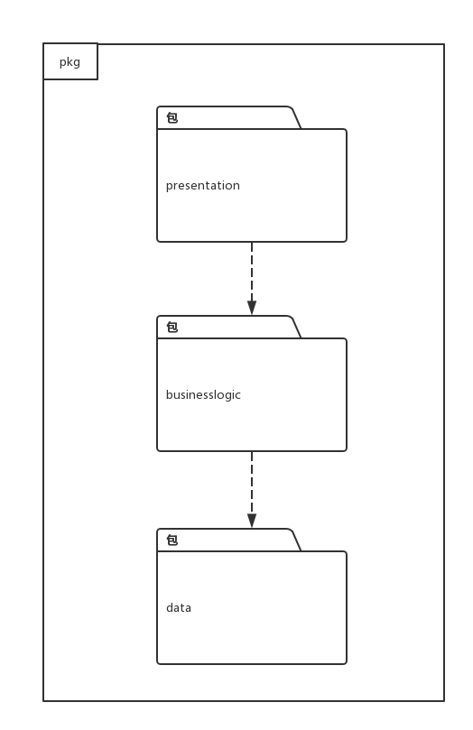

- 图二

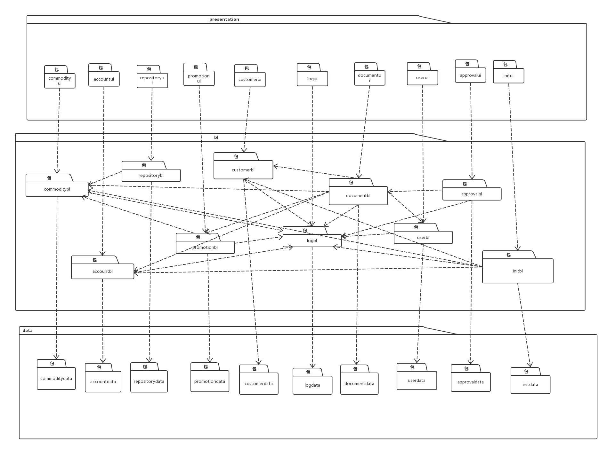

## 组合视角

### 开发包图

灯具照明行业灯具进销存系统的最终开发包设计如下表所示

| 开发（物理）包               | 依赖的其他开发包                                 |
| --------------------- | ---------------------------------------- |
| mainui                | commodityui repositoryui customerui documentui accountui userui approvalui promotionui logui |
| commodityui           | commodityblservice javafx vo             |
| commodityblservice    | Javarmi vo                               |
| commoditybl           | commodityblservice commoditydataservice po |
| commoditydataservice  | commoditydata po                         |
| commoditydata         | databaseutility po                       |
| repositoryui          | repositoryblservice javafx               |
| repositoryblservice   | Javarmi vo                               |
| repositorybl          | commoditybl repositoryblservice repositorydataservice po documentbl |
| repositorydataservice | repositorydata po                        |
| repositorydata        | po databaseutility                       |
| customerui            | customerblservice vo javafx              |
| customerbl            | customerblservice customerdataservice po documentbl |
| customerblservice     | Javarmi                                  |
| customerdata          | databaseutility customerdataservice po   |
| customerdataservice   | po                                       |
| documentui            | documentblservice vo javafx commodityui  |
| documentbl            | documentblservice documentdataservice po userbl |
| documentblservice     | Javarmi                                  |
| documentdata          | databaseutility documentdataservice po   |
| documentdataservice   | po                                       |
| accountui             | accountblservice javafx vo               |
| accountblservice      | Javarmi vo                               |
| accountbl             | acccountblservice accountdataservice po  |
| accountdataservice    | po                                       |
| accountdata           | accountdataservice po databaseutility    |
| userui                | userblservice javafx                     |
| userblservice         | Javarmi vo                               |
| userbl                | userblservice userdataservice po         |
| userdataservice       | po                                       |
| userdata              | userdataservice po databaseutility       |
| approvalui            | javafx, approvalblservice, vo            |
| approvalblservice     | Javarmi , vo                             |
| approvalbl            | approvalblservice, approvaldataservice, documentbl, po |
| approvaldataservice   | po                                       |
| approvaldata          | approvaldataservice, po, databaseutility |
| promotionui           | javafx, promotionblservice,vo            |
| promotionblservice    | javarmi,vo                               |
| promotionbl           | promtionblservice,  promtiondataservice, commoditybl, po |
| promotiondataservice  | po                                       |
| promotiondata         | promotiondataservice, po, databaseutility |
| logui                 | javafx, logblservice, vo                 |
| logblservice          | javarmi, vo                              |
| logbl                 | logblservice, logdataservice, po         |
| logdataservice        | po                                       |
| logdata               | logdataservice, po, databaseutility      |
| javarmi               |                                          |
| javafx                |                                          |
| databaseutility       | JDBC                                     |

- 客户端开发包图

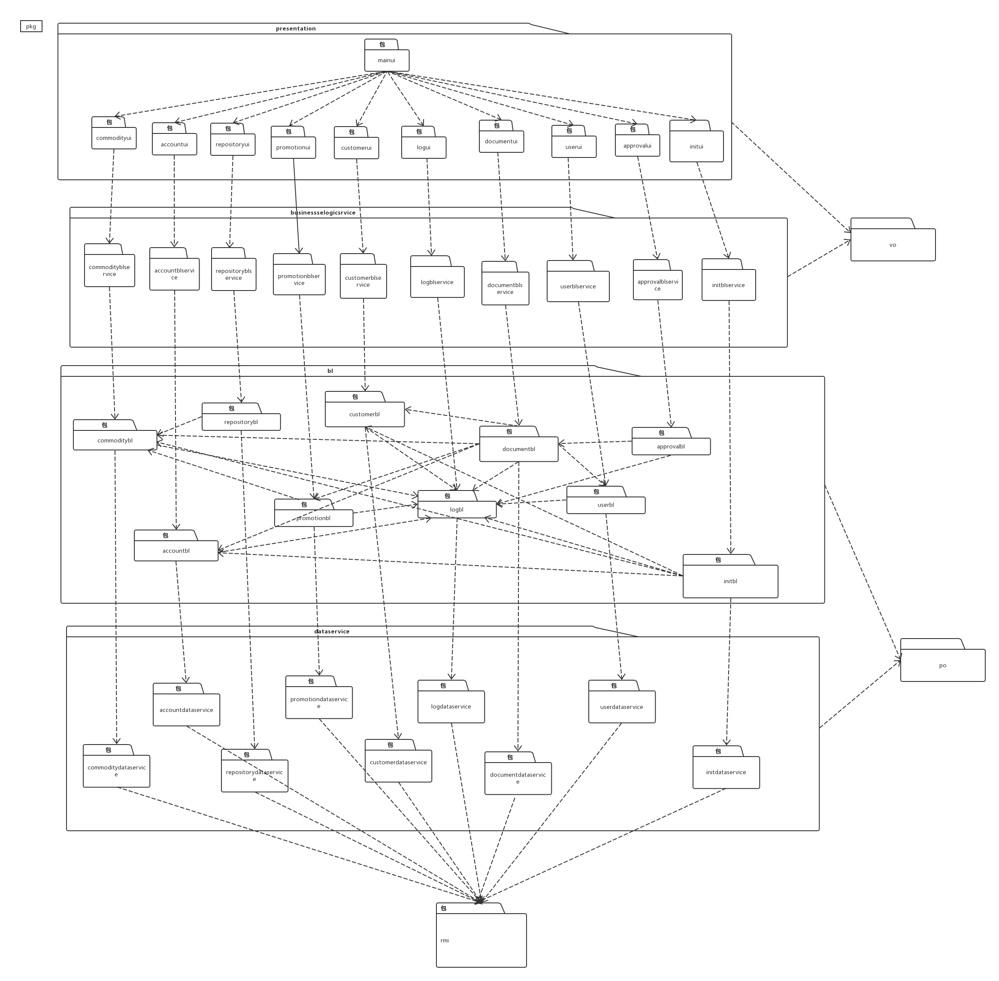

- 服务器端开发包图

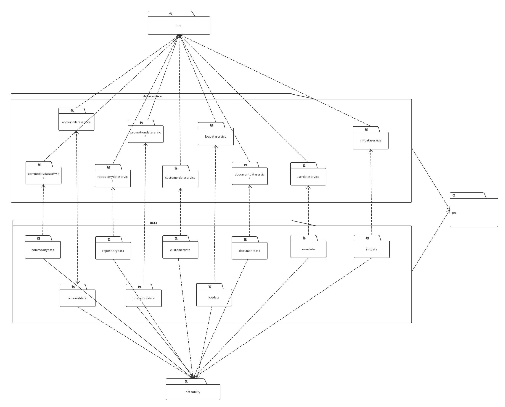

Data层详细包图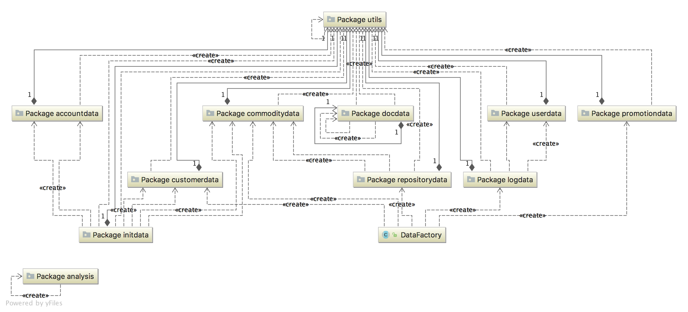

#### 运行时进程

在灯具进销存系统中，会有多个客户端进程和一个服务器端进程，其进程图如下图所示。结合部署图，客户端进程是在客户端机器上运行，服务器端进程是在服务器端机器上运行。

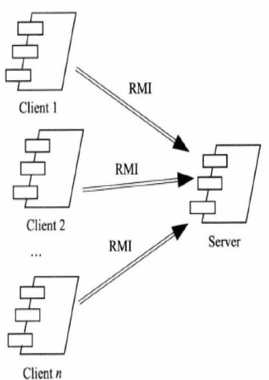

#### 物理部署

灯具进销存系统中客户端构建是放在客户端机器上，服务器端构建是放在服务器端机器上。在客户端节点上，还要部署 RMIStub 构件。由于 Java RMI 构件输入 JDK 8.0 的一部分，所以，在系统 JDK 环境已经设置好的情况下，不需要在独立部署。部署图入下图所示。

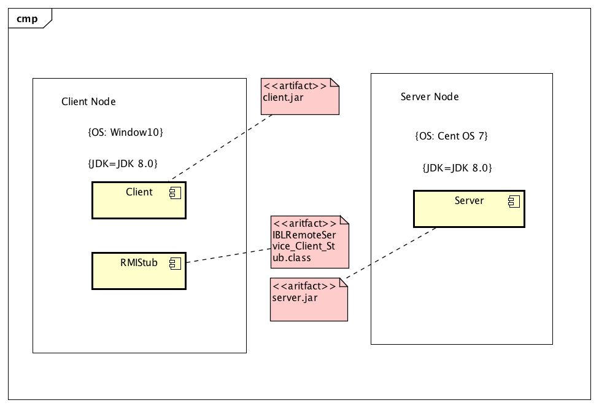

## 接口视角

### 模块的职责

服务器端模块和客户端模块视图入下图所示。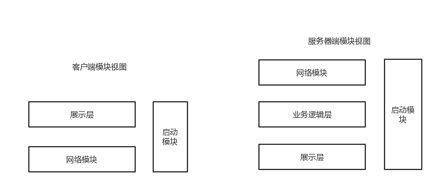

客户端和服务器端各层的职责分别由下面两张表来说明

| 层       | 职责                      |
| ------- | ----------------------- |
| 启动模块    | 负责初始化网络通信机制，启动用户界面      |
| 用户界面层   | 基于窗口的灯具进销存客户端用户界面       |
| 客户端网络模块 | 利用 Java RMI 机制查找 RMI 服务 |

| 层        | 职责                                |
| -------- | --------------------------------- |
| 启动模块     | 负责初始化网络通信机制，启动程序                  |
| 业务逻辑层    | 对客户端的请求进行处理，并执行相应的业务逻辑            |
| 服务器端网络模块 | 利用 Java RMI 机制开启 RMI 服务，注册 RMI 服务 |
| 数据层      | 负责数据的持久化及数据访问接口                   |

每一层只是使用下方直接接触的层。层与层之间仅仅是通过接口的调用来完成的。层与层之间调用的接口如下表所示。

| 接口                                       | 服务调用方  | 服务提供方    |
| ---------------------------------------- | ------ | -------- |
| CommodityBLService, AccountBLService, RepositoryBLService, PromotionBLService, CustomerBLService, LogBLService, DocumentBLService, ApprovalBLService, UserBLService | 客户端展示层 | 客户端业务逻辑层 |
| CommodityDataService, AccountDataService, RepositoryDataService, PromotionDataService, CustomerDataService, LogDataService, DocunmentDataService, ApprovalDataService, UserDataService | 业务逻辑层  | 服务器端数据层  |

### 用户界面层的分解

根据需求，系统存在 ***<u>（22）</u>***个用户界面：商品/商品分类管理界面，库存盘点界面，库存查看界面，创建库存报损/报溢单界面，创建库存报警单界面，单据历史信息查询界面，制定进货单界面，制定退货单界面，客户管理界面，制定销售单界面，制定销售退货单界面，期初建账界面，创建收付款单界面，管理账户界面，制定现金费用单界面，查询日志界面，查看销售明细表界面，查看经营情况表界面，查看经营历程表界面，红冲界面，审批单据界面，管理促销策略界面。

界面转跳如下图所示。

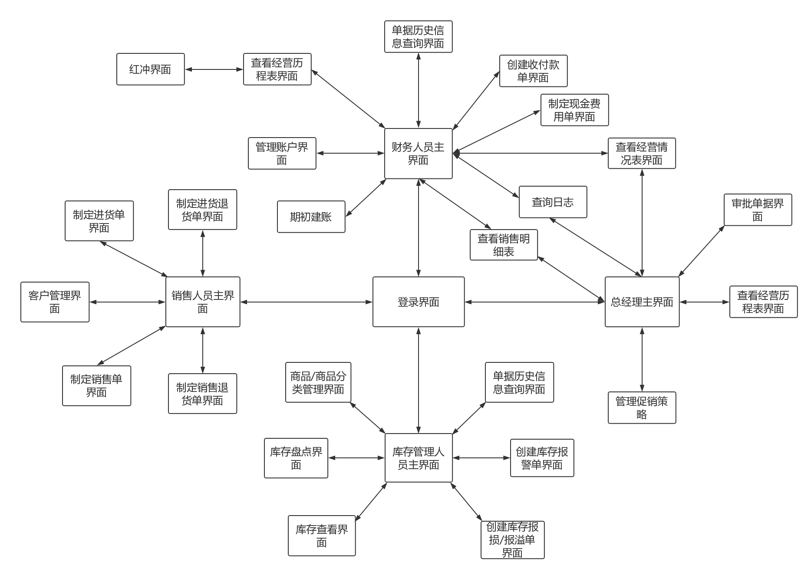

用户界面类如下：

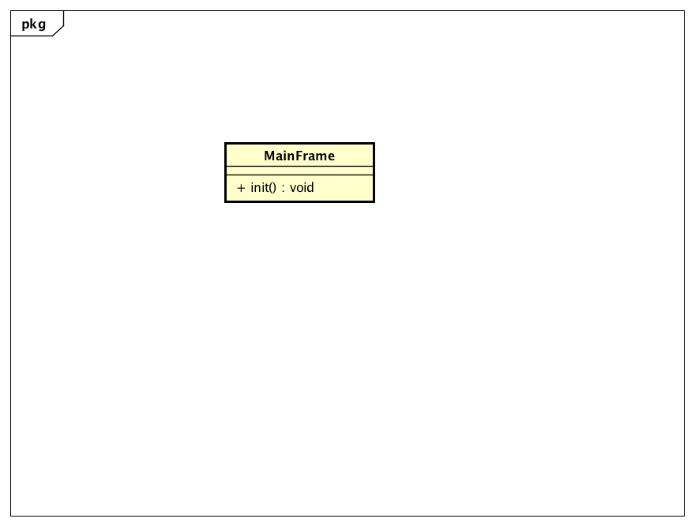

#### 用户界面层模块职责

| 模块                   | 职责                                       |
| -------------------- | ---------------------------------------- |
| MainFrame            | 界面MainFrame，负责界面的显示和界面的跳转                |
| SalesmanMainFrame    | 销售人员主界面，负责客户管理、制定单据界面的显示和跳转              |
| CustomerManageFrame  | 客户管理界面，负责查看客户列表和对客户进行增加与查找，并负责客户信息界面及其他客户管理操作的显示和跳转 |
| StockMadeFrame       | 制定进货单界面，负责收录进货单的信息和传递，及界面的跳转             |
| StockReturnMadeFrame | 制定进货退货单界面，负责收录进货退货单的信息和传递，及界面的跳转         |
| SalesMadeFrame       | 制定销售单界面，负责收录销售单的信息和传递，及界面的跳转             |
| SalesReturnMadeFrame | 制定销售退货单界面，负责收录销售退货单的信息和传递，及界面的跳转         |

#### 用户界面层模块的接口规范

| 名称                       | 条目   | 详情                                |
| ------------------------ | ---- | --------------------------------- |
|                          | 语法   | `public void init(String[] args)` |
| MainFrame.init           | 前置条件 | 无                                 |
|                          | 后置条件 | 显示主界面                             |
|                          | 语法   | `init(args:String[])`             |
| SalesmanMainFrame.init   | 前置条件 | 用户已登录并已授权，且处于主界面                  |
|                          | 后置条件 | 显示Frame及Panel                     |
|                          | 语法   | `init(args:String[])`             |
| CustomerFrame.init       | 前置条件 | 处于销售人员管理界面                        |
|                          | 后置条件 | 显示Frame及Panel                     |
|                          | 语法   | `init(args:String[])`             |
| StockDocFrame.init       | 前置条件 | 处于销售人员管理界面                        |
|                          | 后置条件 | 显示Frame及Panel                     |
|                          | 语法   | `init(args:String[])`             |
| StockReturnDocFrame.init | 前置条件 | 处于销售人员管理界面                        |
|                          | 后置条件 | 显示Frame及Panel                     |
|                          | 语法   | `init(args:String[])`             |
| SalesDocFrame.init       | 前置条件 | 处于销售人员管理界面                        |
|                          | 后置条件 | 显示Frame及Panel                     |
|                          | 语法   | `init(args:String[])`             |
| SalesReturnDocFrame.init | 前置条件 | 处于销售人员管理界面                        |
|                          | 后置条件 | 显示Frame及Panel                     |

#### 用户界面层模块需要的服务接口

| 服务名                                | 服务                  |
| ---------------------------------- | ------------------- |
| businesslogicservice.UserBLService | 登录界面和系统管理员界面的业务逻辑接口 |
| businesslogicservice.*BLService    | 每个界面都有一个相应的业务逻辑接口   |

#### 用户界面模块设计原理

用户界面利用Java的Javafx来实现

### 业务逻辑层的分解

业务逻辑层包括多个针对显示界面的业务逻辑处理对象。

业务逻辑层设计如下：

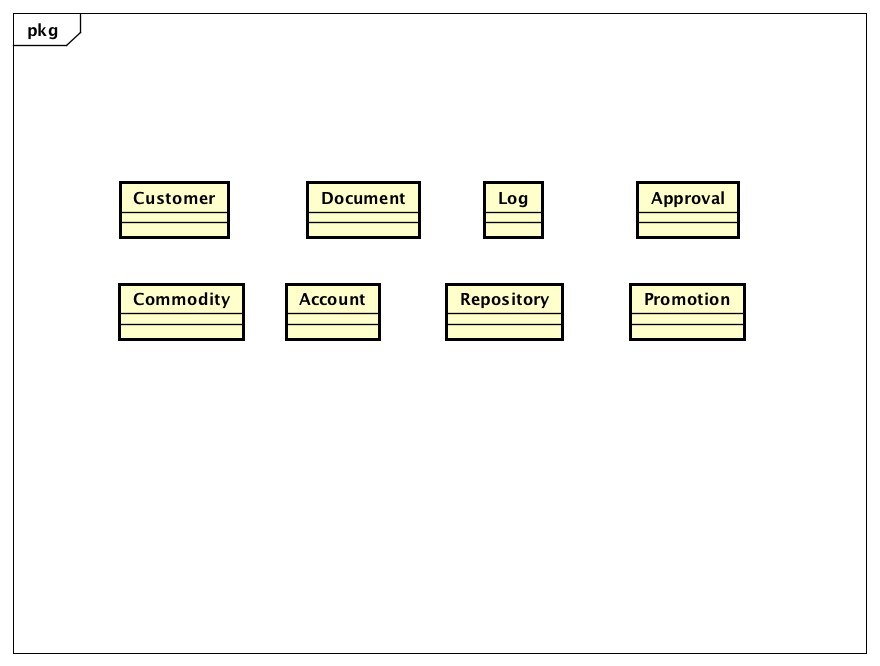

#### 业务逻辑层模块的职责

| 模块           | 职责                       |
| ------------ | ------------------------ |
| commoditybl  | 负责实现商品管理、商品分类管理所需要的服务    |
| repositorybl | 负责实现库存查询、库存快照所需要的服务      |
| documentbl   | 负责实现各种单据界面、历史单据查询所需要的服务  |
| userbl       | 负责实现管理用户界面所需要的服务         |
| accountbl    | 负责实现管理账户界面所需要的服务         |
| logbl        | 负责实现日志界面所需要的服务           |
| documentbl   | 负责实现各种单据及与单据有关服务界面所需要的服务 |
| Customerbl   | 负责实现客户管理过程中所需要的服务        |
| approvalbl   | 负责实现各种单据审批所需要的服务         |
| promotionbl  | 负责实现管理促销策略的所需要的服务        |

#### 业务逻辑模块的接口规范

##### commoditybl 模块接口规范

| 名称                                       | 条目   | 详情                                       |
| ---------------------------------------- | ---- | ---------------------------------------- |
|                                          | 语法   | `public CommodityCategoriesTreeVO getCommodityCategoriesTreeVO() ` |
| Commoditybl.getCommodityCategoriesTreeVO | 前置条件 | 无                                        |
|                                          | 后置条件 | 以商品树状结构返回商品分类                            |
|                                          | 语法   | `public Result<CommodityItemVO> addCommodity(CommodityBuildInfo.CommodityBuilder builder)  ` |
| Commoditybl.addCommodity                 | 前置条件 | 传入一个CommodityBuildInfo.CommodityBuilder，要求含有商品分类id |
|                                          | 后置条件 | 返回Result<CommodityItemVO>                |
|                                          | 语法   | `public List<CommodityItemVO> findCommodityByCategory(int categoryID) ` |
| Commoditybl.findCommodityByCategory      | 前置条件 | 输入任何的合法商品类别id                            |
|                                          | 后置条件 | 根据商品分类查找是否存在相应的商品，返回商品的list              |
|                                          | 语法   | `public CommodityItemVO findCommodityVOByName(String commodityName)  ` |
| Commoditybl.findCommodityVOByName        | 前置条件 | 穿入非空字符串                                  |
|                                          | 后置条件 | 根据商品名称是否存在相应的商品，返回符合项的list               |
|                                          | 语法   | `public ResultMessage deleteCommodity(String id)  ` |
| Commoditybl.deleteCommodity              | 前置条件 | 输入不违反商品id格式的字符串                          |
|                                          | 后置条件 | 如果存在与输入商品id对应的商品，删除商品。返回ResultMessage    |
|                                          | 语法   | `public ResultMessage modifyCommodity(CommodityItemVO commodity) ` |
| Commoditybl.modifyCommodity              | 前置条件 | 传入一个非空的CommodityItemVO对象                 |
|                                          | 后置条件 | 更新商品，返回ResultMessage                     |
|                                          | 语法   | `public ResultMessage addCategory(CommodityCategoryVO newCategory)  ` |
| Commoditybl.addCategory                  | 前置条件 | 传入一个非空的、且与当前分类下其他分类名称不相同的CommodityCategoryVO |
|                                          | 后置条件 | 更新商品分类，返回ResultMessage                   |
|                                          | 语法   | `public ResultMessage deleteCategory(int id)  ` |
| Commoditybl.deleteCategory               | 前置条件 | 传入合法的分类id                                |
|                                          | 后置条件 | 删除商品分类，返回ResultMessage                   |
|                                          | 语法   | `public ResultMessage changeCategoryName(CommodityCategoryVO categroryVO)  ` |
| Commoditybl.changeCategoryName           | 前置条件 | 传入合法的CommodityCategoryVO                 |
|                                          | 后置条件 | 更新商品分类，返回ResultMessage                   |
|                                          | 语法   | `public List<CommodityItemVO> searchCommodity(String keyword)` |
| Commoditybl.searchCommodity              | 前置条件 | 传入非空字符串                                  |
|                                          | 后置条件 | 返回以任意方式匹配的商品列表                           |

- 需要的服务

CommodityDataService的全部接口

##### repositorybl 模块接口规范

- 提供的服务

| 名称                              | 条目   | 详情                                       |
| ------------------------------- | ---- | ---------------------------------------- |
|                                 | 语法   | `public List<RepositoryChangeVO> getRepositoryChanges (Date startDate, Date endDate)` |
| Repository.getRepositoryChanges | 前置条件 | 传入的两个Date对象不能为空                          |
|                                 | 后置条件 | 返回startDate到endDate时间段内所有库存变化项           |
|                                 | 语法   | `public RepositoryTableVO getRepositoryTable()` |
| Repository.getRepositoryTable   | 前置条件 | 无                                        |
|                                 | 后置条件 | 返回当前库存快照信息                               |

- 需要的服务

RepositoryDataService全部方法

##### customerbl 模块的接口规范

- 提供的服务（供接口）

| 名称                          | 条目   | 详情                                       |
| --------------------------- | ---- | ---------------------------------------- |
|                             | 语法   | `public List<customer> getCustomerList()  ` |
| Customer.getCustomerList    | 前置条件 | 在客户管理进程中                                 |
|                             | 后置条件 | 返回客户列表                                   |
|                             | 语法   | `public Result<CusomerVO> createCustomer(CustomerVO vo)  ` |
| Customer.createCustomer     | 前置条件 | 已允许增加客户，并已输入有效的客户信息                      |
|                             | 后置条件 | 增加新的客户信息，更新持久化储存的数据                      |
|                             | 语法   | `public List<CustomerVO> search(String keyword,CustomerType type)  ` |
| Customer.search             | 前置条件 | 在查找客户里输入有效的关键字                           |
|                             | 后置条件 | 根据关键字进行模糊查找是否存在相应的客户，若存在匹配的客户则返回`CustomerVO`对象列表，若不存在匹配项则返回空列表 |
|                             | 语法   | `public ResultMessage deleteCustomer(int customerID)  ` |
| Customer.deleteCustomer     | 前置条件 | 选定需要删除的客户                                |
|                             | 后置条件 | 删除相应的`Customer`对象，更新持久化存储的数据             |
|                             | 语法   | `public ResultMessage modifyCustomer(CustomerChangeInfo changeInfo)  ` |
| Customer.modifyCustomer     | 前置条件 | 已输入更改后的有效的客户信息                           |
|                             | 后置条件 | 根据客户编号和输入的信息更改对应`Customer`对象数据，更新持久化存储的数据 |
|                             | 语法   | `public CustomerVO findCustomerByID(int id)  ` |
| Customer.findCustomerByID   | 前置条件 | 输入的ID符合customer对象ID格式                    |
|                             | 后置条件 | 根据输入的客户id返回对应的`Customer`                 |
|                             | 语法   | `public List<CustomerVO> findCustomerByType(CustomerType type)  ` |
| Customer.findCustomerByType | 前置条件 | 输入了`CustomerType`对象                      |
|                             | 后置条件 | 根据输入的`CustomerType`返回符合条件的`Customer`列表   |

- 需要的服务（需接口）

  CustomerDataService全部方法

##### documentbl 模块的接口规范

- 提供的服务

| 名称                            | 条目   | 详情                                       |
| ----------------------------- | ---- | ---------------------------------------- |
|                               | 语法   | `public DocVO createDoc(DocType type)  ` |
| Doc.createDoc                 | 前置条件 | 传入非空的DocType                             |
|                               | 后置条件 | 返回一个空的DocVO                              |
|                               | 语法   | `public ResultMessage commitDoc(DocVO doc)  ` |
| Doc.commitDoc                 | 前置条件 | 传入对象不为null，且包含信息正确有效                     |
|                               | 后置条件 | 提交Doc                                    |
|                               | 语法   | `public ArrayList<HistoryDocVO> findDocuments(DocumentFilterfilter) ` |
| Doc.findDocuments             | 前置条件 | 传入一个非空DocFilter                          |
|                               | 后置条件 | 返回符合DocFilter的所有Doc                      |
|                               | 语法   | `public ArrayList<BusinessConditionItemVO> getBusinessConditionTable(DocumentFilterfilter)` |
| Doc.getBusinessConditionTable | 前置条件 | 用户已输入正确的筛选条件并确认                          |
|                               | 后置条件 | 返回符合筛选条件的所有销售记录的值对象                      |
|                               | 语法   | `public ArrayList<BussinessHitoryItemVO> getBusinessHistoryTable(DocumentFilter filter)` |
| Doc.getBusinessHistoryTable   | 前置条件 | 用户已输入正确的筛选条件并确认                          |
|                               | 后置条件 | 返回符合筛选条件的所有单据的值对象                        |
|                               | 语法   | `public SalesDetailVO getSalesDetailTable(Date StartDate,Date endDate)` |
| Doc.getSalesDetailTable       | 前置条件 | 用户已输入正确的筛选条件并确认                          |
|                               | 后置条件 | 返回所输入时间段内的收支情况的值对象                       |
|                               | 语法   | `public ResultMessage redflush(DocVO target)  ` |
| Doc.redflush                  | 前置条件 | 传入有效的DocVO对象                             |
|                               | 后置条件 | 将对应红冲单据入账，更新持久化存储，更新显示                   |
|                               | 语法   | `public DocVO redflushAndCopy(DocVO target)  ` |
| Doc.redflushAndCopy           | 前置条件 | 传入有效的DocVO对象                             |
|                               | 后置条件 | 返回各属性取负后的相应的DocVO对象                      |

- 需要的服务（需接口）

参见DocDataService提供的接口

##### accountbl 模块的接口规范

- 提供的服务

| 名称                     | 条目   | 详情                                       |
| ---------------------- | ---- | ---------------------------------------- |
|                        | 语法   | `public ArrayList<AccountVO> getAccountList ()` |
| Account.getAccountList | 前置条件 | 得到数据                                     |
|                        | 后置条件 | 返回账户列表                                   |
|                        | 语法   | `public ResultMessage addAccount(String id, String name, double amount)` |
| Account.addAccount     | 前置条件 | 金额，名称符合输入规则                              |
|                        | 后置条件 | 增加新的账户，更新持久化存储内容                         |
|                        | 语法   | `public ArrayList<AccountVO> findAccounts(String keyword)` |
| Account.findAccounts   | 前置条件 | 输入有效的关键字                                 |
|                        | 后置条件 | 根据关键字查找是否存在相应的账户，若存在匹配的账户则返回相应`Account`对象，若不存在匹配项则返回`null` |
|                        | 语法   | `public AccountVO getAccount(String name)` |
| Account.getAccount     | 前置条件 | 输入有效的账户名称                                |
|                        | 后置条件 | 得到数据，返回名称对应的`Account`对象                  |
|                        | 语法   | `public ResultMessage deleteAccount(String name)` |
| Account.deleteAccount  | 前置条件 | 输入有效的账户名称                                |
|                        | 后置条件 | 删除相应的账户，更新持久化存储内容                        |
|                        | 语法   | `public ResultMessage modifyAccount(String oldName, String newName)` |
| Account.modifyAccount  | 前置条件 | 输入有效的账户名称                                |
|                        | 后置条件 | 更改所修改的账户名称，更新持久化存储的数据                    |

- 需要的服务（需接口）

| 服务名                                     | 服务                 |
| --------------------------------------- | ------------------ |
| AccountDataService.getAll()             | 得到目前存储的所有账户的持久化对象  |
| AccountDataService.get(String name)     | 根据name得到单一持久对象     |
| AccountDataService.insert(AccountPO po) | 插入单一持久化对象          |
| AccountDataService.update(AccountPO po) | 更新单一持久化对象          |
| AccountDataService.delete(AccountPO po) | 删除单一持久化对象          |
| AccountDataService.find(String keyword) | 根据关键字查找多个持久化对象     |
| DataBaseFactory.getAccountDataBase      | 得到Account数据库的服务的引用 |

##### initbl 模块的接口规范

- 提供的服务

| 名称                             | 条目   | 详情                                       |
| ------------------------------ | ---- | ---------------------------------------- |
|                                | 语法   | `public List<InitVO> getInitInfo()`      |
| Initialization.getInitInfo     | 前置条件 | 用户请求查看期初建账的信息                            |
|                                | 后置条件 | 得到历史期初建账信息（包括操作人、时间、下载地址                 |
|                                | 语法   | `public ResultMessage initiateAccount()` |
| Initialization.initiateAccount | 前置条件 | 用户请求期初建账                                 |
|                                | 后置条件 | 创建期初信息进行存储，并更新持久化数据                      |

- 需要的服务（需接口）

| 服务名                                      | 服务           |
| ---------------------------------------- | ------------ |
| InitDataService.createInit(String userID, Date date) | 存储单一持久化对象    |
| InitDataService.getAllInit()             | 得到存储的多个持久化对象 |

##### userbl 模块的接口规范

- 提供的服务

| 名称                      | 条目   | 详情                                       |
| ----------------------- | ---- | ---------------------------------------- |
|                         | 语法   | `public ArrayList<UserVo> getUserList ()` |
| User.getUserList        | 前置条件 | 得到数据                                     |
|                         | 后置条件 | 返回用户列表                                   |
|                         | 语法   | `public ResultMessage addUser(UserVo vo)` |
| User.addUser            | 前置条件 | 传入有效的对象                                  |
|                         | 后置条件 | 增加新的用户，更新持久化存储内容                         |
|                         | 语法   | `public ArrayList<UserVO> findUsers(String keyword)` |
| User.findUsers          | 前置条件 | 输入有效的关键字                                 |
|                         | 后置条件 | 根据关键字查找是否存在相应的用户，若存在匹配的用户则返回相应对象列表，若不存在匹配项则返回空列表 |
|                         | 语法   | `public UserVO getUser(String id)`       |
| User.getUser            | 前置条件 | 输入有效的用户名                                 |
|                         | 后置条件 | 得到数据，返回名称对应的对象                           |
|                         | 语法   | `public ResultMessage deleteUser(String ID)` |
| User.deleteUser         | 前置条件 | 输入有效的用户ID                                |
|                         | 后置条件 | 删除相应的用户，更新持久化存储内容                        |
|                         | 语法   | `public ResultMessage userChangeName(String newName)` |
| User.changeName         | 前置条件 | 传入不为空的password                           |
|                         | 后置条件 | 更改用户的password字段信息，更新持久化存储的数据             |
|                         | 语法   | `public ResultMessage changeName(String id, UserChangeInfo info)` |
| User.changeUser         | 前置条件 | 传入有效的id和`UserChangeInfo`对象               |
|                         | 后置条件 | 根据`UserChangeInfo`中的信息更改用户的信息，更新持久化存储数据  |
|                         | 语法   | `public ResultMessage login(String id, String password)` |
| User.login              | 前置条件 | password符合输入规则                           |
|                         | 后置条件 | 查找是否存在相应的User，根据输入的password返回登陆验证的结果     |
|                         | 语法   | `public ResultMessage userChangePassword(String oldPassword, String newPassword)` |
| User.userChangePassword | 前置条件 | 用户已经登录，且传入不为空的`oldPassword`和`newPassword` |
|                         | 后置条件 | 检查·`oldPassword`是否与持久化数据一致，若一致则修改持久化存储数据 |
|                         | 语法   | `public void logout()`                   |
| User.logout             | 前置条件 | 无                                        |
|                         | 后置条件 | 记录登出信息，更新持久化存储                           |

- 需要的服务（需接口）

| 服务名                                      | 服务                 |
| ---------------------------------------- | ------------------ |
| UserDataService.getAll()                 | 得到目前存储的所有用户的持久化对象  |
| UserDataService.get(String username)     | 根据username得到单一持久对象 |
| UserDataService.insert(UserPO po)        | 插入单一持久化对象          |
| UserDataService.update(UserPO po)        | 更新单一持久化对象          |
| UserDataService.delete(UserPO po)        | 删除单一持久化对象          |
| UserDataService.findUsers(String keyword) | 根据关键字查找多个持久化对象并返回  |
| DataBaseFactory.getUserDataBase          | 得到Account数据库的服务的引用 |
| UserDataService.login(UserPO po)         | 插入单一持久化对象          |
| UserDataService.logout(UserPO po)        | 删除单一持久化对象          |

##### approvalbl 模块的接口规范

- 提供的服务

| 名称                      | 条目   | 详情                                       |
| ----------------------- | ---- | ---------------------------------------- |
|                         | 语法   | `public ResultMessage approve(HistoryDocVO vo)` |
| Approval.approve        | 前置条件 | 用户有正在查看的单据                               |
|                         | 后置条件 | 通过单据，持久化更新涉及的对象的数据                       |
|                         | 语法   | `public ResultMessage reject(HistoryDocVO vo)` |
| Approval.reject         | 前置条件 | 用户有正在查看的单据                               |
|                         | 后置条件 | 驳回单据，持久化更新涉及的对象的数据                       |
|                         | 语法   | `public ResultMessage save(HistoryDocVO vo)` |
| Approval.saveAndApprove | 前置条件 | 有已修改需要保存且同时要通过的单据                        |
|                         | 后置条件 | 通过该单据，持久化更新涉及的对象的数据                      |

##### promotionbl 模块的接口规范

- 提供的服务

| 名称                         | 条目   | 详情                                       |
| :------------------------- | ---- | ---------------------------------------- |
|                            | 语法   | `public ArrayList<PromotionVO> getPromotionList()` |
| Promotion.getPromotionList | 前置条件 | 用户已登录                                    |
|                            | 后置条件 | 返回含有所有促销策略的值对象的列表                        |
|                            | 语法   | `public List<PromotionVO> getSatisfiedPromotion(CustomerGrade level, ArrayList<String> CommmodityList,double total)` |
| Promotion.getBenefitsPlan  | 前置条件 | 所有筛选条件合法                                 |
|                            | 后置条件 | 返回该销售单据所满足的优惠策略的值对象列表                    |
|                            | 语法   | `public BasicCommodityTreeVO create()`   |
| Promotion.create           | 前置条件 | 传入正确的PromotionType                       |
|                            | 后置条件 | 返回一个空的PromotionVO                        |
|                            | 语法   | `public ResultMessage commit(PromotionVO vo)` |
| Promotion.commit           | 前置条件 | 传入正确的PromotionVO                         |
|                            | 后置条件 | 提交Promotion                              |
|                            | 语法   | `public ResultMessage modify(PromotionVO vo)` |
| Promotion.modify           | 前置条件 | 用户有需要保存的修改好的单据                           |
|                            | 后置条件 | 持久化更新相关的对象的数据                            |
|                            | 语法   | `public ResultMessage delete(PromotionVO vo)` |
| Promotion.delete           | 前置条件 | 用户有正在查看的销售策略                             |
|                            | 后置条件 | 删除该销售策略，持久化更新相关的对象的数据                    |

- 需要的服务

| 服务名                                      | 服务                |
| ---------------------------------------- | ----------------- |
| PromotionDataService.getSatisfiedPromotion | 返回符合条件的促销策略的持久化对象 |
| PromotionDataService.getPromotionList    | 返回所有促销策略的持久化对象    |
| PromotionDataService.insert              | 插入单一持久化对象         |
| PromotionDataSerivice.update             | 更新单一持久化对象         |
| PromotionDataService.delete              | 删除单一持久化对象         |

##### logbl 模块的接口规范

- 提供的服务

| 名称             | 条目   | 详情                                       |
| -------------- | ---- | ---------------------------------------- |
|                | 语法   | `public ArrayList<LogVo> getLogListByTime (long from, long to)` |
| Log.getLogList | 前置条件 | 输入有效的时间范围                                |
|                | 后置条件 | 根据时间范围返回日志列表                             |
|                | 语法   | `public LogVO getLog(String id)`         |
| Log.getLog     | 前置条件 | 传入有效的id                                  |
|                | 后置条件 | 根据id返回对应的                                |
|                | 语法   | `public ArrayList<LogVO> findLogs(LogFilter fiter)` |
| Log.findLogs   | 前置条件 | 传入有效的LogFilter对象                         |
|                | 后置条件 | 根据LogFilter中的属性返回对应的LogVO列表              |

- 需要的服务（需接口）

| 服务名                                     | 服务                |      |      |
| --------------------------------------- | ----------------- | ---- | ---- |
| LogDataService.findByTime(String range) | 得到目前存储的所有用户的持久化对象 |      |      |
| LogDataService.find(String id)          | 根据ID得到单一持久对象      |      |      |
| LogDataService.insert(LogPO po)         | 插入单一持久化对象         |      |      |

### 数据层的分解

#### 数据层模块职责

| 模块                    | 职责                                   |
| --------------------- | ------------------------------------ |
| CommodityDataService  | 基于数据库的持久化数据库接口，提供商品、商品分类等的增删改查服务     |
| RepositoryDataService | 基于数据库的持久化数据库接口，提供库存信息的查询服务           |
| DocDataService        | 基于数据库的持久化数据库接口，提供单据的增查等服务            |
| AccountDataService    | 基于数据库的持久化数据库接口，提供账户数据集体载入、保存、增删改查服务  |
| LogDataService        | 基于数据库的持久化数据库接口，提供日志数据集体载入、保存、增加、查看服务 |
| UserDataService       | 基于数据库的持久化数据库接口，提供用户集体载入、保存、增删改查服务    |
| CustomerDataService   | 基于数据库的持久化数据库接口，提供客户信息集体载入、保存、增删改查服务  |
| PromotionDataService  | 基于数据库的持久化数据库接口，提供促销策略的载入，保存，增删改查等服务  |

#### 数据层接口规范

##### commoditydataservice 模块的接口规范

| 名称                                       | 条目   | 详情                                       |
| ---------------------------------------- | ---- | ---------------------------------------- |
|                                          | 语法   | `public List<CommodityItemPO> findByCategory(int categoryID) throws RemoteException` |
| CommodityDataService.findByCategory      | 前置条件 | 传入int表示商品分类                              |
|                                          | 后置条件 | 返回分类下所有商品列表                              |
|                                          | 语法   | `public Date getRecentChangeTime() throws RemoteException;` |
| CommodityDataService.getRecentChangeTime | 前置条件 | 无                                        |
|                                          | 后置条件 | 获取商品最近变更时间                               |
|                                          | 语法   | `public List<CommodityItemPO> getAllCommodity() throws RemoteException` |
| CommodityDataService.getAllCommodity     | 前置条件 | 无                                        |
|                                          | 后置条件 | 获取全部商品，返回商品列表                            |
|                                          | 语法   | `public CommodityItemPO findById(String id) throws RemoteException` |
| CommodityDataService.findById            | 前置条件 | 输入非空字符串                                  |
|                                          | 后置条件 | 返回id与传入字符串一致的商品                          |
|                                          | 语法   | `public CommodityCategoryPO findCategoryById(int id) throws RemoteException` |
| CommodityDataService.findCategoryById    | 前置条件 | 输入一个整形                                   |
|                                          | 后置条件 | 返回与输入匹配的分类                               |
|                                          | 语法   | `public ResultMessage add(CommodityItemPO commodityItemPO) throws RemoteException` |
| CommodityDataService.add                 | 前置条件 | 输入一个非空的CommodityItemPO对象                 |
|                                          | 后置条件 | 持久化商品项，返回ResultMessage                   |
|                                          | 语法   | `public ResultMessage update(CommodityCategoryPO categoryPO) throws RemoteException` |
| CommodityDataService.update              | 前置条件 | 传入非空商品分类                                 |
|                                          | 后置条件 | 更新商品分类，返回ResultMessage                   |
|                                          | 语法   | `public ResultMessage update(CommodityItemPO commodityItemPO) throws RemoteException` |
| CommodityDataService.update              | 前置条件 | 输入非空商品对象                                 |
|                                          | 后置条件 | 更新商品对象，返回ResultMessage                   |
|                                          | 语法   | `public ResultMessage deleteCommodity(String id) throws RemoteException` |
| CommodityDataService.deleteCommodity     | 前置条件 | 输入非空字符串                                  |
|                                          | 后置条件 | 删除与输入对应的商品，返回ResultMessage               |
|                                          | 语法   | `public List<CommodityItemPO> findByName(String name) throws RemoteException` |
| CommodityDataService.findByName          | 前置条件 | 传入非空字符串                                  |
|                                          | 后置条件 | 返回名称与字符串匹配的商品列表                          |
|                                          | 语法   | `List<CommodityCategoryPO> getAllCommodityCategory() throws RemoteException` |
| CommodityDataService.getAllCommodityCategory | 前置条件 | 无                                        |
|                                          | 后置条件 | 返回分类列表                                   |
|                                          | 语法   | `Result<Integer> add(CommodityCategoryPO commodityCategoryPO) throws RemoteException` |
| CommodityDataService.add                 | 前置条件 | 传入非空商品分类对象                               |
|                                          | 后置条件 | 增加商品分类，返回Result<int>                     |
|                                          | 语法   | `ResultMessage deleteCategory(int id) throws RemoteException` |
| CommodityDataService.deleteCategroy      | 前置条件 | 传入一个int                                  |
|                                          | 后置条件 | 删除与该值对应的商品分类，返回ResultMessage             |
|                                          | 语法   | `List<CommodityItemPO> fuzzySearchByName(String key) throws RemoteException` |
| CommodityDataService.fuzzySearchByName   | 前置条件 | 传入非空字符                                   |
|                                          | 后置条件 | 返回名称和传入字符串匹配的商品列表                        |
|                                          | 语法   | `List<CommodityItemPO> fuzzySearchById(String key) throws RemoteException` |
| CommodityDataService.fuzzySearchById     | 前置条件 | 传入非空字符                                   |
|                                          | 后置条件 | 返回id和传入字符串匹配的商品列表                        |
|                                          | 语法   | `List<CommodityItemPO> fuzzySearchByModel(String key) throws RemoteException` |
| CommodityDataServcie.fuzzySearchByModel  | 前置条件 | 传入非空字符                                   |
|                                          | 后置条件 | 返回型号和传入字符串匹配的商品列表                        |

  ##### repositorydataservice 模块的接口规范

| 名称                                       | 条目   | 详情                                       |
| ---------------------------------------- | ---- | ---------------------------------------- |
|                                          | 语法   | `public List<RepositoryChangePO> getRepositoryChanges (Date startDate, Date endDate)` |
| RepositoryDataService.getRepositoryChanges | 前置条件 | 传入的两个Date对象不能为空                          |
|                                          | 后置条件 | 返回startDate到endDate时间段内所有库存变化项           |
|                                          | 语法   | `public RepositoryTablePO getRepositoryTable()` |
| RepositoryDataService.getRepositoryTable | 前置条件 | 无                                        |
|                                          | 后置条件 | 返回当前库存快照信息                               |
|                                          | 语法   | `public ResultMessage changeRepository(RepositoryChangePO changePO) throws RemoteException` |
| RepositoryDataService.changeRepository   | 前置条件 | 传入一个非空RepositoryChangePO                 |
|                                          | 后置条件 | 返回ResultMessage                          |

#####CustomerDataService 模块的接口规范

| 名称                                       | 条目   | 详情                                       |
| ---------------------------------------- | ---- | ---------------------------------------- |
|                                          | 语法   | `public ArrayList<CustomerPO> getAllCustomer() throws RemoteException ` |
| CustomerDataService.getAllCustomer       | 前置条件 | 无                                        |
|                                          | 后置条件 | 返回所有的CustomerPO                          |
|                                          | 语法   | `public TwoTuple<ResultMessage, Integer> insertCustomer(CustomerPO po) throws RemoteException` |
| CustomerDataService.insertCustomer       | 前置条件 | 传入非空customerPo                           |
|                                          | 后置条件 | 返回ResultMessage和插入的customer的编号           |
|                                          | 语法   | `public ResultMessage deleteCustomer(int id) throws RemoteException ` |
| CustomerDataService.deleteCustomer       | 前置条件 | 传入一个int，表示待删除顾客id                        |
|                                          | 后置条件 | 从数据库中删除指定的customer，返回resultMessage       |
|                                          | 语法   | `public ResultMessage updateCustomer(CustomerPO po) throws RemoteException` |
| CustomerDataService.updateCustomer       | 前置条件 | 传入非空CustomerPO，且该对象此前已经被存入到数据库当中         |
|                                          | 后置条件 | 更新传入对象在数据库的信息，返回ResultMessage            |
|                                          | 语法   | `public CustomerPO getCustomerById(int id) throws RemoteException` |
| CustomerDataService.getCustomerById      | 前置条件 | 传入一个int，表示想要获取的对象的编号，要求该id必须合法           |
|                                          | 后置条件 | 根据id获取对应的CustomerPO对象，并返回                |
|                                          | 语法   | `public List<CustomerPO> fuzzySearchByName(String key) throws RemoteException` |
| CustomerDataService.fuzzySearchByName    | 前置条件 | 传入一个非空字符串                                |
|                                          | 后置条件 | 返回名称和该字符串匹配的customerpo的list              |
|                                          | 语法   | `public List<CustomerPO> fuzzySearchByTelephone(String key) throws RemoteException` |
| CustomerDataService.fuzzySearchByTelephone | 前置条件 | 传入一个非空字符串                                |
|                                          | 后置条件 | 返回电话和该字符串匹配的customerpo的list              |
|                                          | 语法   | `public List<CustomerPO> fuzzySearchByAddress(String key) throws RemoteException` |
| CustomerDataService.fuzzySearchByAddress | 前置条件 | 传入一个非空字符串                                |
|                                          | 后置条件 | 返回地址和该字符串匹配的customerpo的list              |
|                                          | 语法   | `public List<CustomerPO> fuzzySearchByGrade(String key) throws RemoteException` |
| CustomerDataService.fuzzySearchByGrade   | 前置条件 | 传入一个非空字符串                                |
|                                          | 后置条件 | 返回等级和该字符串匹配的customerpo的list              |
|                                          | 语法   | `public List<CustomerPO> fuzzySearchByEmail(String key) throws RemoteException` |
| CustomerDataService.fuzzySearchByEmail   | 前置条件 | 传入一个非空字符串                                |
|                                          | 后置条件 | 返回邮箱和该字符串匹配的customerpo的list              |
|                                          | 语法   | `public List<CustomerPO> fuzzySearchById(String key) throws RemoteException` |
| CustomerDataService.fuzzySearchById      | 前置条件 | 传入一个非空字符串                                |
|                                          | 后置条件 | 返回id和该字符串匹配的customerpo的list              |
|                                          | 语法   | `public ResultMessage changeReceivable(int customerId, double amount) throws RemoteException` |
| CustomerDataService.changeReceivable     | 前置条件 | 传入一个已经被存在数据库中的customer的编号，以及一个double数值   |
|                                          | 后置条件 | 变更应收，返回ResultMessage                     |
|                                          | 语法   | `public ResultMessage changeReceivableLimit(int customerId, double amount) throws RemoteException` |
| CustomerDataService.changeReceivableLimit | 前置条件 | 传入一个已经被存在数据库中的customer的编号，以及一个double数值   |
|                                          | 后置条件 | 变更应收额度，返回ResultMessage                   |
|                                          | 语法   | `public ResultMessage changePayable(int customerId, double amount) throws RemoteException` |
| CustomerDataService.changePayable        | 前置条件 | 传入一个已经被存在数据库中的customer的编号，以及一个double数值   |
|                                          | 后置条件 | 变更应付，返回ResultMessage                     |

  ##### documentdataservice 模块的接口规范

| 名称                                | 条目   | 详情                                       |
| --------------------------------- | ---- | ---------------------------------------- |
|                                   | 语法   | `Result<String> commitDoc(DocPO doc) throws RemoteException` |
| DocDataService.commitDoc          | 前置条件 | 输入非空DocType对象                            |
|                                   | 后置条件 | 返回新单据自动生成的编号                             |
|                                   | 语法   | `ResultMessage updateDoc(DocPO doc) throws RemoteException ` |
| DocDataService.updateDoc          | 前置条件 | 传入非空DocPO对象                              |
|                                   | 后置条件 | 持久化DocPO对象。返回ResultMessage               |
|                                   | 语法   | `List<DocPO> findByUserId(String id) throws RemoteException` |
| DocDataService.findByUserId       | 前置条件 | 输入合法的单据id                                |
|                                   | 后置条件 | 根据单据id查找`Doc`对象并返回，若不存在匹配项则返回`null`      |
|                                   | 语法   | `List<DocPO> findByState(DocState docState) throws RemoteException` |
| DocDataService.findByState        | 前置条件 | 传入一个筛选条件                                 |
|                                   | 后置条件 | 返回符合筛选条件的所有单据的值对象                        |
|                                   | 语法   | `List<DocPO> findByType(DocType type) throws RemoteException` |
| DocDataService.findByType         | 前置条件 | 传入非空doctype                              |
|                                   | 后置条件 | 返回和doctype一致的单据列表                        |
|                                   | 语法   | `List<DocPO> findByTime(Date from, Date to) throws RemoteException` |
| DocDataService.findByTime         | 前置条件 | 传入两个非空时间                                 |
|                                   | 后置条件 | 返回两个时间之间的全部单据列表                          |
|                                   | 语法   | `List<DocPO> findByTimeAndType(Date from, Date to, DocType type) throws RemoteException` |
| DocDataService.findByTimeAndType  | 前置条件 | 传入两个非空时间和某个类型                            |
|                                   | 后置条件 | 返回两个时间之间的指定类型的单据列表                       |
|                                   | 语法   | `List<DocPO> findByTypeAndState(DocType type, DocState state) throws RemoteException;` |
| DocDataService.findByTypeAndState | 前置条件 | 传入一个非空doctype和docstate                   |
|                                   | 后置条件 | 返回指定单据类型指定状态的单据列表                        |
|                                   | 语法   | `void sentMail(String creatorId, String header, String content) throws RemoteException` |
| DocDataService.sendMail           | 前置条件 | 传入非空无空格的3个string，要求第一个string表示一个邮箱账号     |
|                                   | 后置条件 | 发送邮件给指定的邮箱                               |

##### accountdataservice 模块的接口规范

| 名称                                | 条目   | 详情                                       |
| --------------------------------- | ---- | ---------------------------------------- |
|                                   | 语法   | `public ResultMessage insert(AccountPO po) throws RemoteException` |
| AccountDataService.insert         | 前置条件 | 向数据库中插入一个账户                              |
|                                   | 后置条件 | 在数据库中增加一个po记录                            |
|                                   | 语法   | `public List<AccountPO> getAll() throws Remotexception ` |
| AccountDataService.getAll         | 前置条件 | 获取全部账户                                   |
|                                   | 后置条件 | 返回账户的list                                |
|                                   | 语法   | `public AccountPO get(String ID)`        |
| AccountDataService.get            | 前置条件 | 传入非空id                                   |
|                                   | 后置条件 | 根据ID进行查找返回相应的`AccountPO`结果               |
|                                   | 语法   | `public ResultMessage update(AccountPO po)` |
| AccountDataService.update         | 前置条件 | 数据库中已经存在相同ID的po                          |
|                                   | 后置条件 | 更新一个po                                   |
|                                   | 语法   | `public ResultMessage delete(String id) throws RemoteException` |
| AccountDataService.delete         | 前置条件 | 传入非空id                                   |
|                                   | 后置条件 | 如果存在对应id对应的账户，删除该账户                      |
|                                   | 语法   | `public ResultMessage add(AccountLogPO logPO) throws RemoteException` |
| AccountDataService.add            | 前置条件 | 增加一个交易记录                                 |
|                                   | 后置条件 | 添加交易记录到数据库中，返回ResultMessage              |
|                                   | 语法   | `public List<AccountPO> fuzzySearchById(String key) throws RemoteException` |
| AccoutDataService.fuzzySearchById | 前置条件 | 根据id模糊匹配账户                               |
|                                   | 后置条件 | 返回全部被匹配到的账户                              |

##### userdataservice 模块的接口规范

| 名称                     | 条目   | 详情                                       |
| ---------------------- | ---- | ---------------------------------------- |
|                        | 语法   | `public ResultMessage insert(UserPO po) throws RemoteException` |
| UserDataService.insert | 前置条件 | 传入非空userpo                               |
|                        | 后置条件 | 在数据库中增加一个po记录                            |
|                        | 语法   | `public UserPO get(String ID) throws RemoteException` |
| UserDataService.get    | 前置条件 | 传入非空id                                   |
|                        | 后置条件 | 根据ID进行查找返回相应的`UserPO`结果                  |
|                        | 语法   | `public ResultMessage update(UserPO po) throws RemoteException` |
| UserDataService.update | 前置条件 | 在数据库中存在同样ID的po                           |
|                        | 后置条件 | 更新一个po                                   |
|                        | 语法   | `public ResultMessage delete(String id) throws RemoteException` |
| UserDataService.delete | 前置条件 | 传入非空String                               |
|                        | 后置条件 | 如果存在id相同的用户，则将其从数据库中删除                   |
|                        | 语法   | `public List<UserPO> getAll()`           |
| UserDataService.getAll | 前置条件 | 无                                        |
|                        | 后置条件 | 获取所有的用户数据对象                              |
|                        | 语法   | `public TwoTuple<UserPO, LoginReturnState> login(String id, String password) throws RemoteException` |
| UserDataService.login  | 前置条件 | 传入非空id, password                         |
|                        | 后置条件 | 如果登录成功，返回UserPO对象和LoginReturnState       |

##### promotiondata 模块的接口规范

| 名称                                       | 条目   | 详情                                       |
| ---------------------------------------- | ---- | ---------------------------------------- |
|                                          | 语法   | `public ArrayList<PromotionPO> getPromotionList()` |
| PromotionDataService.getPromotionList    | 前置条件 | 用户已登录                                    |
|                                          | 后置条件 | 返回含有所有销售策略的持久化对象的列表                      |
|                                          | 语法   | `public ResultMessage insert(PromotionPO po)` |
| PromotionDataService.insert              | 前置条件 | 同样ID的po在数据库中不存在                          |
|                                          | 后置条件 | 在数据库中增加一个po记录                            |
|                                          | 语法   | `public ResultMessage update(PromotionPO po)` |
| PromotionDataService.update              | 前置条件 | 在数据库中存在同样ID的po                           |
|                                          | 后置条件 | 更新一个po                                   |
|                                          | 语法   | `public ResultMessage delete(PromotionPO po)` |
| PromotionDataService.delete              | 前置条件 | 在数据库中存在同样ID的po                           |
|                                          | 后置条件 | 删除一个po                                   |
|                                          | 语法   | `public ArrayList<PromotionPO> getSatisfiedPromotion(CustomerGrade level, ArrayList<String> commodityList,double total)` |
| PromotionDataService.getSatisfiedPromotion | 前置条件 | 无                                        |
|                                          | 后置条件 | 返回满足条件的销售策略的持久化对象的列表                     |

##### logdataservice 模块的接口规范

| 名称                                   | 条目   | 详情                                       |
| :----------------------------------- | ---- | ---------------------------------------- |
|                                      | 语法   | `public ResultMessage insert(LogPO po) throws RemoteException` |
| LogDataService.insert                | 前置条件 | 传入非空logpo                                |
|                                      | 后置条件 | 在数据库中增加一个po记录                            |
|                                      | 语法   | `public List<LogPO> findByTime(Date from, Date to) throws RemoteException ` |
| LogDataService.findByTime            | 前置条件 | 传入两个非空date对象                             |
|                                      | 后置条件 | 按范围进行查找，返回相应的`LogPO`对象列表                 |
|                                      | 语法   | `public List<LogPO> findById(String id) throws RemoteException` |
| LogDataService.findById              | 前置条件 | 传入一个id，表示创建者id                           |
|                                      | 后置条件 | 按id进行查找，返回相应的`LogPO`对象列表                 |
|                                      | 语法   | `public List<LogPO> findByIdentity(Identity identity) throws RemoteException` |
| LogDataService.findByIdentity        | 前置条件 | 传入一个identity                             |
|                                      | 后置条件 | 根据传入的identity进行查找，返回相应的`LogPO`对象列表       |
|                                      | 语法   | `public List<LogPO> findByTimeAndId(Date from, Date to, String id) throws RemoteException` |
| LogDataService.findByTimeAndId       | 前置条件 | 传入两个非空date，string类的id                    |
|                                      | 后置条件 | 按时间范围和id进行查找，返回相应的`LogPO`对象列表            |
|                                      | 语法   | `public List<LogPO> findByTimeAndIdentity(Date from, Date to, Identity identity) throws RemoteException` |
| LogDataService.findByTimeAndIdentity | 前置条件 | 传入两个非空date和identity                      |
|                                      | 后置条件 | 按范围进行查找，返回相应的`LogPO`对象列表                 |

  ## 信息视角

  ### 数据库表

数据库中包含Commodity表、AlertDoc表、AlertDocItem表、CommodityCategory表、HistoryDoc表、LossAndGainDoc表、LossAndGainDocItem表、RepositoryChange表、Customer表、StockDoc表、StockReturnDoc表、SalesDoc表、SalesReturnDoc表、StockDocItem表、UserInfo表、Account表、AccountIODoc表、AccountTransfer表、CostDoc表、CostDocItem表、Log表、InitInfo表 、InitCommodityCategoryInfo表、InitAccountInfo表、InitCustomerInfo表、InitCommodityInfo表、Promotion表、GiftDoc表、GiftDocItem表 

#### CommodtyCategory表：（对应CommodityCategoryPO）

| 名称              | PO对象数据类型 | hibernate数据类型 | 备注          | 含义           |
| --------------- | -------- | ------------- | ----------- | ------------ |
| id              | Int      | int           | Primary key | 商品分类id，不对外显示 |
| name            | String   | string        |             | 分类名称         |
| upperCategoryId | int      | int           |             | 父级分类         |

#### Commodity表：（对应CommodityItemPO）

| 名称               | PO对象数据类型             | hibernate数据类型 | 备注          | 含义                                       |
| ---------------- | -------------------- | ------------- | ----------- | ---------------------------------------- |
| id               | String               | String        | Primary key | 商品编号                                     |
| name             | String               | string        |             | 商品名称                                     |
| categoryId       | int                  | int           |             | 所在分类id，与所在的商品分类的CommodityCategoryPO中的id一致 |
| modelNumber      | String               | string        |             | 商品型号                                     |
| repCount         | int                  | int           |             | 商品库存数量                                   |
| inPrice          | double               | double        |             | 商品的平均进价                                  |
| sellPrice        | double               | double        |             | 商品的平均售价                                  |
| recentInPrice    | double               | double        |             | 商品的最近进价                                  |
| recentSellPrice  | double               | double        |             | 商品的最近售价                                  |
| batch            | String               | string        |             | 商品的批次                                    |
| batchNumber      | String               | string        |             | 商品的批号                                    |
| dataOfProduction | Data(Java.util.Data) | data          |             | 商品出厂日期                                   |

#### RepositoryChange表：（对应RepositoryChangePO对象）

| 名称          | PO对象数据类型             | hibernate数据类型 | 备注          | 含义                                       |
| ----------- | -------------------- | ------------- | ----------- | ---------------------------------------- |
| id          | int                  | int           | primary key | 库存变化项id 不对外显示                            |
| commodityId | String               | string        |             | 对于进/出库商品项id，与变化的商品对应的CommodityItem表中的项的id字段一致 |
| type        | Enum                 | Enum          |             | 库存变化项种类，包括进货，退货，被退货，售出                   |
| count       | int                  | int           |             | 商品变化数量                                   |
| amount      | double               | double        |             | 对应项金额变化                                  |
| time        | Data(Java.util.Data) | data          |             | 进出库项目的时间                                 |

#### AlertDoc表：（对应AlertDocPO对象）

| 名称        | PO对象数据类型             | hibernate数据类型 | 备注          | 含义                     |
| --------- | -------------------- | ------------- | ----------- | ---------------------- |
| id        | String               | string        | primary key | 库存报警单编号                |
| userId    | String               | string        |             | 创建者id（待定，无意外应该是String） |
| time      | Data(Java.util.Data) | data          |             | 创建时间                   |
| comment   | String               | string        |             | 备注信息                   |
| triggered | Boolean              | yes_no        |             | 是否已经触发                 |
| expired   | Boolean              | yes_no        |             | 是否已经通知创建者              |

#### AlertDocItem表：（对应AlertDocItemPO对象）

| 名称          | PO对象数据类型 | hibernate数据类型 | 备注          | 含义                                       |
| ----------- | -------- | ------------- | ----------- | ---------------------------------------- |
| id          | Int      | int           | primary key | 库存报警单条目id 不对外显示                          |
| alertDocId  | String   | string        |             | 条目所属的库存报警单id，与所在的库存报警单所对应的AlertDocPO中的id一致 |
| commodityId | String   | string        |             | 对应报警商品项id，与预警的商品对应的CommodityItem表中id字段一致 |
| count       | int      | int           |             | 预警数量                                     |

#### LossAndGainDoc表：（对应LossAndGainDocPO对象）

| 名称      | PO对象数据类型             | hibernate数据类型 | 备注          | 含义                     |
| ------- | -------------------- | ------------- | ----------- | ---------------------- |
| id      | String               | string        | primary key | 库存报损报溢单编号              |
| userId  | String               | string        |             | 创建者id（待定，无意外应该是String） |
| time    | Data(Java.util.Data) | data          |             | 创建时间                   |
| comment | String               | string        |             | 备注信息                   |

#### LossAndGainDocItem表：（对应LossAndGainDocItemPO对象）

| 名称               | PO对象数据类型 | hibernate数据类型 | 备注          | 含义                                       |
| ---------------- | -------- | ------------- | ----------- | ---------------------------------------- |
| id               | Int      | int           | primary key | 库存报警单条目id 不对外显示                          |
| lossAndGainDocId | String   | string        |             | 条目所属的库存报损报溢单单id，与所在的库存报损报溢单所对应的LossAndGainDocPO中的id一致 |
| commodityId      | String   | string        |             | 对应报损/报溢商品项id，与报损/报溢的商品对应的CommodityItem表中id字段一致 |
| count            | int      | int           |             | 报损/报溢商品数量                                |
| type             | Enum     | Enum          |             | 报损？报溢？                                   |

#### HistoryDoc表：（对应HistoryDocPO对象）

| 名称      | PO对象数据类型 | hibernate数据类型 | 备注          | 含义                        |
| ------- | -------- | ------------- | ----------- | ------------------------- |
| id      | String   | string        | primary key | 历史单据编号                    |
| docId   | String   | string        |             | 历史单据中聚合的单据的编号信息           |
| state   | Enum     | Enum          |             | 单据的状态信息，有已审批通过，已审批未通过，未审批 |
| comment | String   | string        |             | 单据审批的备注信息                 |

#### Customer表：（对应CustomerPO对象）

| 名称              | PO对象数据类型 | hibernate数据类型 | 备注          | 含义                           |
| --------------- | -------- | ------------- | ----------- | ---------------------------- |
| ID              | int      | int           | primary key | 客户编号                         |
| customerType    | Enum     | Enum          |             | 客户的类型（销售商or供应商）              |
| customerGrade   | Enum     | Enum          |             | 客户的等级（一级，二级，三级，四级，五级vip)     |
| name            | String   | String        |             | 客户姓名                         |
| telephone       | String   | String        |             | 客户联系电话                       |
| address         | String   | String        |             | 客户地址                         |
| postage         | String   | String        |             | 客户邮编                         |
| email           | String   | String        |             | 客户电子邮箱                       |
| receivableLimit | double   | double        |             | 客户应收额度，只能由最高权限修改             |
| receivable      | double   | double        |             | 客户应收，不能超过应收额度，由系统自动计算，不能手动更改 |
| payable         | double   | double        |             | 客户应付，由系统自动计算，不能手动更改          |
| salesman        | String   | String        |             | 客户的默认业务员                     |

#### SalesDoc表：（对应SalesDocPO）

| 名称                   | PO对象数据类型 | hibernate数据类型 | 备注          | 含义                              |
| -------------------- | -------- | ------------- | ----------- | ------------------------------- |
| ID                   | String   | String        | primary key | 单据编号                            |
| customerId           | String   | string        |             | 客户id（分类为销售商）                    |
| salesman             | String   | String        |             | 客户的默认业务员                        |
| repository           | String   | String        |             | 仓库（即默认仓库）                       |
| userId               | string   | string        |             | 操作员id，即当前系统使用者                  |
| remarks              | String   | String        |             | 备注                              |
| beforeDiscountAmount | double   | double        |             | 折让前总额，即商品清单列表所有条目totalAmount的总额 |
| discount             | double   | double        |             | 折让（不同的操作员可设置的折让不同）              |
| voucher              | double   | double        |             | 代金券金额                           |
| finalAmount          | double   | double        |             | 最终总额                            |

#### SalesReturnDoc表（对应SalesReturnDocPO）

| 名称                   | PO对象数据类型 | hibernate数据类型 | 备注          | 含义                               |
| -------------------- | -------- | ------------- | ----------- | -------------------------------- |
| ID                   | String   | String        | primary key | 单据编号                             |
| customerId           | String   | String        |             | 客户id（分类为销售商）                     |
| salesman             | String   | String        |             | 客户的默认业务员                         |
| repository           | String   | String        |             | 仓库（即默认仓库）                        |
| userId               | String   | String        |             | 操作员id，即当前系统使用者                   |
| remarks              | String   | String        |             | 备注                               |
| beforeDiscountAmount | double   | double        |             | 折让前总额，即商品清单列表的所有条目totalAmount的总额 |
| discount             | double   | double        |             | 折让（不同的操作员可设置的折让不同）               |
| voucher              | double   | double        |             | 代金券金额                            |
| finalAmount          | double   | double        |             | 最终总额                             |

#### StockDoc表：（对应StockDocPO）

| 名称          | PO对象数据类型 | hibernate数据类型 | 备注          | 含义                             |
| ----------- | -------- | ------------- | ----------- | ------------------------------ |
| ID          | String   | String        | primary key | 单据编号                           |
| customerId  | String   | String        |             | 客户id（分类为供应商）                   |
| repository  | String   | String        |             | 仓库（默认仓库）                       |
| userId      | String   | String        |             | 当前使用系统的操作员id                   |
| remarks     | String   | String        |             | 备注                             |
| totalAmount | double   | double        |             | 总金额，商品清单列表中所有条目的totalAmount的总和 |

#### StockReturnDoc表：（对应StockReturnDocPO对象）

| 名称          | PO对象数据类型 | hibernate数据类型 | 备注          | 含义                             |
| ----------- | -------- | ------------- | ----------- | ------------------------------ |
| ID          | String   | String        | primary key | 单据编号                           |
| customerId  | String   | String        |             | 客户（分类为供应商）                     |
| repository  | String   | String        |             | 仓库（默认仓user                     |
| userId      | String   | String        |             | 当前使用系统的操作员id                   |
| remarks     | String   | String        |             | 备注                             |
| totalAmount | double   | double        |             | 总金额，商品清单列表中所有条目的totalAmount的总和 |

#### StockDocItem表：（对应StockDocItemPO表）

| 名称          | PO对象数据类型 | hibernate数据类型 | 备注          | 含义              |
| ----------- | -------- | ------------- | ----------- | --------------- |
| id          | int      | int           | primary key | 本商品清单条目的id，内部可见 |
| stockDocID  | String   | String        |             | 其对应的进货类单据id     |
| commodityID | String   | String        |             | 其商品id           |
| number      | int      | int           |             | 商品数量            |
| totalAmount | double   | double        |             | 此条目的总价          |
| remarks     | String   | String        |             | 备注              |

#### Account表（对应AccountPO对象）

| 名称     | PO对象数据类型 | hibernate数据类型 | 备注          | 含义   |
| ------ | -------- | ------------- | ----------- | ---- |
| id     | String   | String        | Primary key | 账户编号 |
| name   | String   | string        |             | 账户名称 |
| amount | double   | double        |             | 账户金额 |

#### AccountChange表（对应AccountLogPO对象）

| 名称                | PO对象数据类型       | hibernate数据类型 | 备注          | 含义                                   |
| ----------------- | -------------- | ------------- | ----------- | ------------------------------------ |
| id                | int            | int           | primary key | 账户变化项id，不对外显示                        |
| accountID         | String         | string        |             | 变化项所属的账户id，与所在的账户所对应的AccountPO中的id一致 |
| AccountChangeType | Enum           | Enum          |             | 账户变动的种类，有：收入，支出                      |
| time              | java.util.Date | date          |             | 变动发生的时间                              |
| delta             | double         | double        |             | 变动的金额数目                              |
| amount            | double         | double        |             | 变动之后账户的余额信息                          |

#### AccountIODoc表（对应AccountIODocPO对象）

| 名称         | PO对象数据类型 | hibernate数据类型 | 备注          | 含义             |
| ---------- | -------- | ------------- | ----------- | -------------- |
| id         | String   | string        | primary key | 收付款单编号         |
| ioType     | Enum     | Enum          |             | 收付款单类型：收款单、付款单 |
| customerID | String   | string        |             | 客户id           |
| total      | double   | double        |             | 总的金额           |

#### AccountTransfer表（对应AccountTransferItemPO对象）

| 名称             | PO对象数据类型 | hibernate数据类型 | 备注          | 含义                                       |
| -------------- | -------- | ------------- | ----------- | ---------------------------------------- |
| id             | int      | int           | primary key | 收付款单转账列表条目id，不对外显示                       |
| accountIODocID | String   | string        |             | 条目所属的收付款单id，与所在的收付款单所对应的AccountIODocPO的id一致 |
| accountID      | String   | string        |             | 条目中选择的账户的id，与对应账户AccountPO的id字段一致        |
| amount         | double   | double        |             | 转账的金额                                    |
| comment        | String   | string        |             | 条目中的备注信息                                 |

#### CostDoc表（对应CostDocPO对象）

| 名称        | PO对象数据类型 | hibernate数据类型 | 备注          | 含义                                    |
| --------- | -------- | ------------- | ----------- | ------------------------------------- |
| id        | String   | string        | primary key | 现金费用单id                               |
| accountID | String   | string        |             | 现金费用单中选择的账户的id，与账户所对应的AccountPO中的id一致 |
| total     | double   | double        |             | 现金费用单所需要的总的金额                         |

#### CostDocItem表（对应CostDocItemPO对象）

| 名称        | PO对象数据类型 | hibernate数据类型 | 备注          | 含义                                       |
| --------- | -------- | ------------- | ----------- | ---------------------------------------- |
| id        | int      | int           | primary key | 现金费用单的条目清单中的一个条目的id                      |
| costDocID | String   | string        |             | 该条目所在的现金费用单的id，与该现金费用单对应的CostDocPO的id字段一致 |
| type      | Enum     | Enum          |             | 条目所对应的条目名：住宿、交通、接待、通讯、会议、出差、办公、餐费、其他（ACCOMMODATION, TRANSPORTATION, RECEPTOIN, COMMUNICATION, MEETING, BUSINESS_TRIP, OFFICE, MEAL, OTHER） |
| amount    | double   | double        |             | 该条目所需要的金额                                |
| comment   | String   | string        |             | 一个条目的备注信息                                |

#### Log表（对应LogPO对象）

| 名称      | PO对象数据类型       | hibernate数据类型 | 备注          | 含义            |
| ------- | -------------- | ------------- | ----------- | ------------- |
| id      | String         | string        | primary key | 日志的id         |
| time    | java.util.Date | Date          |             | 日志创建的时间       |
| content | String         | string        |             | 日志记录的内容（即行为   |
| userID  | String         | string        |             | 该条日志记录的操作人员id |

#### UserInfo表（对应UserPO对象）

| 名称         | PO对象数据类型 | hibernate数据类型 | 备注          | 含义                                       |
| ---------- | -------- | ------------- | ----------- | ---------------------------------------- |
| id         | String   | string        | primary key | 用户的id，同时也是该用户的工号                         |
| name       | String   | string        |             | 用户的名称                                    |
| password   | String   | string        |             | 用户的密码                                    |
| identity   | Enum     | Enum          |             | 用户的身份：财务人员(FINANCE)、销售人员(SALE)、总经理(GENERAL)、库存管理人员(REPOSITORY)、系统管理员(SYSTEM_ADMIN) |
| authorized | Boolean  | yes_no        |             | 用户是否被授予最高权限                              |

#### InitInfo表（对应InitPO对象）

| 名称     | PO对象数据类型       | hibernate数据类型 | 备注          | 含义                         |
| ------ | -------------- | ------------- | ----------- | -------------------------- |
| id     | String         | string        | primary key | 期初建账id                     |
| userID | String         | string        |             | 发起此次期初建账的用户id，与UsePO中的id一致 |
| time   | java.util.Date | Date          |             | 此次期初建账的时间                  |

#### InitAccountInfo表（对应InitAccountPO对象）

| 名称     | PO对象数据类型 | hibernate数据类型 | 备注          | 含义                                     |
| ------ | -------- | ------------- | ----------- | -------------------------------------- |
| id     | String   | String        | Primary key | 账户编号，与AccountPO对象中的id一致                |
| name   | String   | string        |             | 期初建账时账户名称                              |
| amount | double   | double        |             | 期初建账时账户金额                              |
| initID | String   | String        |             | 该账户信息所属的期初建账的id，与期初建账对应的InitPO对象中的id一致 |

#### InitCommodityCategoryInfo表（对应InitCommodityCategoryPO）

| 名称              | PO对象数据类型 | hibernate数据类型 | 备注          | 含义                                     |
| --------------- | -------- | ------------- | ----------- | -------------------------------------- |
| id              | Int      | int           | Primary key | 商品分类id，不对外显示                           |
| name            | String   | string        |             | 分类名称                                   |
| upperCategoryId | int      | int           |             | 父级分类                                   |
| initID          | String   | String        |             | 该账户信息所属的期初建账的id，与期初建账对应的InitPO对象中的id一致 |

#### InitCommodityInfo表：（对应InitCommodityItemPO）

| 名称          | PO对象数据类型 | hibernate数据类型 | 备注          | 含义                                       |
| ----------- | -------- | ------------- | ----------- | ---------------------------------------- |
| id          | String   | String        | Primary key | 商品编号                                     |
| name        | String   | string        |             | 商品名称                                     |
| categoryId  | int      | int           |             | 所在分类id，与所在的商品分类的CommodityCategoryPO中的id一致 |
| modelNumber | String   | string        |             | 商品型号                                     |
| inPrice     | double   | double        |             | 期初建账时商品的平均进价                             |
| sellPrice   | double   | double        |             | 期初建账时商品的平均售价                             |
| initID      | String   | String        |             | 该账户信息所属的期初建账的id，与期初建账对应的InitPO对象中的id一致   |

#### InitCustomerInfo（对应InitCustomerPO对象）

| 名称              | PO对象数据类型 | hibernate数据类型 | 备注          | 含义                                |
| --------------- | -------- | ------------- | ----------- | --------------------------------- |
| id              | String   | string        | primary key | 客户编号                              |
| type            | Enum     | Enum          |             | 客户的类型（销售商or供应商）                   |
| grade           | Enum     | Enum          |             | 客户的等级（一级，二级，三级，四级，五级vip)          |
| name            | String   | string        |             | 客户姓名                              |
| telephone       | String   | string        |             | 客户联系电话                            |
| address         | String   | string        |             | 客户地址                              |
| postage         | String   | string        |             | 客户邮编                              |
| email           | String   | string        |             | 客户电子邮箱                            |
| receivableLimit | double   | double        |             | 期初建账时客户应收额度，只能由最高权限修改             |
| receivable      | double   | double        |             | 期初建账时客户应收，不能超过应收额度，由系统自动计算，不能手动更改 |
| payable         | double   | double        |             | 期初建账时客户应付，由系统自动计算，不能手动更改          |
| salesman        | String   | string        |             | 客户的默认业务员                          |
| initID          | String   | string        |             | 该客户信息所对应的期初建账的id，与InitPO中的id一致    |

#### GIftDoc表：（对应GiftDocPO）

| 名称           | PO对象数据类型 | hibernate数据类型 | 备注          | 含义          |
| ------------ | -------- | ------------- | ----------- | ----------- |
| id           | String   | string        | primary key | 赠送单编号       |
| promotionID  | String   | string        |             | 对应的促销策略的id  |
| creatorId    | String   | string        |             | 创建者id       |
| customerID   | int      | int           |             | 销售单所对应客户的ID |
| repositoryID | String   | string        |             | 仓库ID（即默认仓库） |
| total        | double   | double        |             | 赠品总价值       |
| time         | Date     | date          |             | 创建时间        |
| comment      | String   | string        |             | 备注信息        |

#### Promotion表：（对应PromotionPO）

| 名称             | PO对象数据类型 | hibernate数据类型 | 备注          | 含义                         |
| -------------- | -------- | ------------- | ----------- | -------------------------- |
| id             | String   | string        | primary key | 促销策略编号                     |
| name           | String   | string        |             | 促销策略名称                     |
| promotionType  | Enum     | Enum          |             | 促销策略类型，包括针对不同用户、特价包、针对不同总价 |
| time           | Date     | date          |             | 创建时间                       |
| startDate      | Date     | date          |             | 起始时间                       |
| endData        | Date     | date          |             | 截止时间                       |
| customerGrade  | Enum     | Enum          |             | 用户的等级                      |
| total          | double   | double        |             | 促销策略所含商品的总价                |
| off            | double   | double        |             | 价格折让                       |
| voucher        | double   | double        |             | 代金券金额                      |
| voucherEndDate | Date     | date          |             | 代金券截止日期                    |

#### GiftDocItem表：（对应GiftDocItemPO）

| 名称          | PO对象数据类型 | hibernate数据类型 | 备注          | 含义            |
| ----------- | -------- | ------------- | ----------- | ------------- |
| id          | int      | int           | primary key | 赠送单条目ID，不对外显示 |
| promotionID | String   | string        |             | 条目所属促销策略的id   |
| commodityID | String   | string        |             | 对应商品的ID       |
| count       | int      | int           |             | 商品的数量         |
| subtotal    | double   | double        |             | 商品价值小计        |