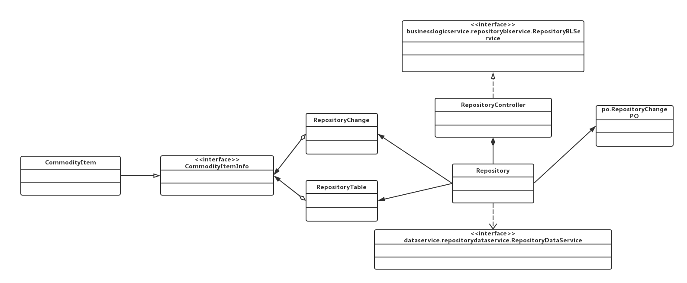
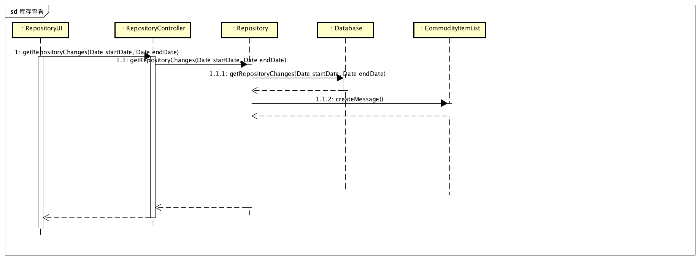
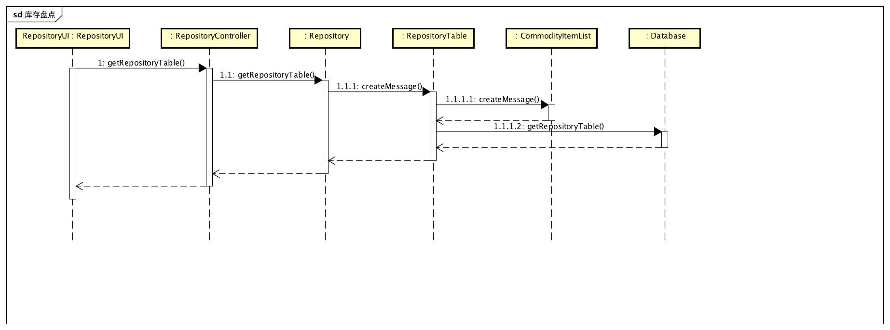

#### 4.1.1 commoditybl模块

##### 1. 模块概述

commoditybl模块承担的需求见需求规格说明文档功能需求及相关非功能需求。

commoditybl模块的职责及接口参见软件体系结构描述文档。

##### 2. 整体结构

根据体系结构的设计，我们将系统分为展示层、业务逻辑层、数据层。每一层之间为了灵活性，我们添加接口，如CommodityBLService、CommodityDataService。为了隔离业务操作和控制操作，添加CommodityController。CommodityPO、CommodityListPO是作为商品、商品分类的持久化对象被添加到设计中。

commoditybl模块的设计如下图所示：

commoditybl模块各个类的职责如下表所示。

| 类                     | 职责                                       |
| --------------------- | ---------------------------------------- |
| CommodityController   | 负责对商品、商品管理逻辑操作进行服务                       |
| Commodity             | 商品、商品管理等与商品有关的领域模型对象，间接拥有商品、商品分类的所有信息，包括商品的价格、库存、名称、型号、编号等一切属性，以及商品分类的全部属性 |
| CommodityTree         | 全部的商品、商品分类信息的模型。拥有所有商品、商品分类、商品从属关系       |
| CommodityItem         | 商品的领域模型对象，拥有商品的一切信息。                     |
| CommodityCategoryItem | 商品分类的领域模型对象，拥有某个分类的一切信息，包括父分类、子分类列表或当前分类下商品列表。 |
| CommodityItemList     | 商品列表的领域对象模型，列表中所有商品信息以及所在分类              |

##### 3. 模块内部类的接口规范

CommodityController类的接口规范：

-  | 名称                                   | 条目   | 详情                                       |
    | ------------------------------------ | ---- | ---------------------------------------- |
    |                                      | 语法   | `public CommodityTree getCommodityTree ()` |
    | CommodityController.getCommodityTree | 前置条件 | Commodity对象已经被创建                         |
    |                                      | 后置条件 | 调用Commodity对象的同名同参数方法                    |
    |                                      | 语法   | `public ResultMessage addCommodity(CommodityVO newCommodity) ` |
    | Commodity.addCommodity               | 前置条件 | 输入任意非空名称、非空类型、已经存在的商品分类、大于零的数量以及大于零的成本价格，且Commodity对象已经被创建 |
    |                                      | 后置条件 | 调用Commodity对象的同名同参数方法                    |
    |                                      | 语法   | `public ArrayList<CommodityVO> findCommodityByName(String commodityName)` |
    | Commodity.findCommodityByName        | 前置条件 | 输入任意非空商品名称，且Commodity对象已经被创建             |
    |                                      | 后置条件 | 调用Commodity对象的同名同参数方法                    |
    |                                      | 语法   | `public CommodityVO findCommodityById(String id)` |
    | Commodity.findCommodityById          | 前置条件 | 输入不违反商品id格式的字符串，且Commodity对象已经被创建        |
    |                                      | 后置条件 | 调用Commodity对象的同名同参数方法                    |
    |                                      | 语法   | `public ResultMessage deleteCommodity(String id)` |
    | Commodity.deleteCommodity            | 前置条件 | 输入不违反商品id格式的字符串，且Commodity对象已经被创建        |
    |                                      | 后置条件 | 调用Commodity对象的同名同参数方法                    |
    |                                      | 语法   | `public ResultMessage modifyCommodity(CommodityVO commodity)` |
    | Commodity.modifyCommodity            | 前置条件 | 传入一个非空的CommodityVO对象，且Commodity对象已经被创建   |
    |                                      | 后置条件 | 调用Commodity对象的同名同参数方法                    |
    |                                      | 语法   | `public ResultMessage addCategory(CommodityCategoryItemVO newCategory)` |
    | Commodity.addCategory                | 前置条件 | 传入一个非空的、且与当前分类下其他分类名称不相同的CommodityCategoryItemVO，且Commodity对象已经被创建 |
    |                                      | 后置条件 | 调用Commodity对象的同名同参数方法                    |
    |                                      | 语法   | `public ResultMessage deleteCategory(String id)` |
    | Commodity.deleteCategory             | 前置条件 | 传入合法的分类id，且Commodity对象已经被创建              |
    |                                      | 后置条件 | 调用Commodity对象的同名同参数方法                    |
    |                                      | 语法   | `public ResultMessage modifyCategory(CommodityCategoryItemVO newCategory)` |
    | Commodity.modifyCategory             | 前置条件 | 传入合法的CommodityCategoryItemVO，且Commodity对象已经被创建 |
    |                                      | 后置条件 | 调用Commodity对象的同名同参数方法                    |

- 需要的服务

  | 服务名                                      | 服务           |
  | ---------------------------------------- | ------------ |
  | Commodity.getCommodityTree()             | 获取所有商品及其分类信息 |
  | Commodity.addCommodity(CommodityVO newCommodity) | 增加商品         |
  | Commodity.findCommodityByName(String commodityName) | 根据名称查找商品     |
  | Commodity.findCommodityById(String id)   | 根据id查找商品     |
  | Commodity.deleteCommodity(String id)     | 删除商品         |
  | Commodity.modifyCommodity(CommodityVO commodity) | 修改商品         |
  | Commodity.addCategory(CommodityCategoryItemVO newCategory) | 增加分类         |
  | Commodity.deleteCategory(String id)      | 删除分类         |
  | Commodity.modifyCategory(CommodityCategoryItemVO newCategory) | 修改分类         |

Commodity类的接口规范：

- | 名称                            | 条目   | 详情                                       |
  | ----------------------------- | ---- | ---------------------------------------- |
  |                               | 语法   | `public CommodityTree getCommodityTree ()` |
  | Commodity.getCommodityTree    | 前置条件 | 无                                        |
  |                               | 后置条件 | 以商品树状结构返回所有商品、及其商品列表                     |
  |                               | 语法   | `public ResultMessage addCommodity(CommodityVO newCommodity) ` |
  | Commodity.addCommodity        | 前置条件 | 输入任意非空名称、非空类型、已经存在的商品分类、大于零的数量以及大于零的成本价格 |
  |                               | 后置条件 | 增加新的商品，更新持久化存储内容                         |
  |                               | 语法   | `public ArrayList<CommodityVO> findCommodityByName(String commodityName)` |
  | Commodity.findCommodityByName | 前置条件 | 输入任意非空商品名称                               |
  |                               | 后置条件 | 根据商品名称查找是否存在相应的商品，若存在匹配的商品则返回相应`ArrayList<CommodityVO>`对象，若不存在匹配项则返回`null` |
  |                               | 语法   | `public CommodityVO findCommodityById(String id)` |
  | Commodity.findCommodityById   | 前置条件 | 输入不违反商品id格式的字符串                          |
  |                               | 后置条件 | 根据商品id查找是否存在相应的商品，如果存在与输入id完全相同的产品，返回一个CommodityVO对象，否则返回null |
  |                               | 语法   | `public ResultMessage deleteCommodity(String id)` |
  | Commodity.deleteCommodity     | 前置条件 | 输入不违反商品id格式的字符串                          |
  |                               | 后置条件 | 如果存在与输入商品id对应的商品，删除商品。返回ResultMessage    |
  |                               | 语法   | `public ResultMessage modifyCommodity(CommodityVO commodity)` |
  | Commodity.modifyCommodity     | 前置条件 | 传入一个非空的CommodityVO对象                     |
  |                               | 后置条件 | 更新商品，返回ResultMessage                     |
  |                               | 语法   | `public ResultMessage addCategory(CommodityCategoryItemVO newCategory)` |
  | Commodity.addCategory         | 前置条件 | 传入一个非空的、且与当前分类下其他分类名称不相同的CommodityCategoryItemVO |
  |                               | 后置条件 | 更新商品分类，返回ResultMessage                   |
  |                               | 语法   | `public ResultMessage deleteCategory(String id)` |
  | Commodity.deleteCategory      | 前置条件 | 传入合法的分类id                                |
  |                               | 后置条件 | 删除商品分类，返回ResultMessage                   |
  |                               | 语法   | `public ResultMessage modifyCategory(CommodityCategoryItemVO newCategory)` |
  | Commodity.modifyCategory      | 前置条件 | 传入合法的CommodityCategoryItemVO             |
  |                               | 后置条件 | 更新商品分类，返回ResultMessage                   |

- 需要的服务

  | 服务名                                      | 服务                 |
  | ---------------------------------------- | ------------------ |
  | CommodityDataService.getAllCommodity()   | 得到目前存储的所有商品数据持久化对象 |
  | CommodityDataService.findById(String id) | 根据ID得到商品数据对象       |
  | CommodityDataService.add(CommodityPO po) | 插入单一商品持久化对象        |
  | CommodityDataService.update(CommodityPO po) | 更新单一商品持久化对象        |
  | CommodityDataService.deleteCommodity(String id) | 删除单一商品持久化对象        |
  | CommodityDataService.findByName(String name) | 根据名称查找多个持久化对象      |
  | CommodityDataService.getAllCommodityCategory() | 获取所有商品分类持久化对象      |
  | CommodityDataServcie.add(CommodityCategoryPO po) | 插入单一商品分类持久化对象      |
  | CommodityDataService.update(CommodityCategoryPO po) | 更新单一商品分类持久化对象      |
  | CommodityDataServcie.deleteCategory(String id) | 删除单一商品分类持久化对象      |

##### 

##### 业务逻辑层的动态模型

下图为添加商品的后，商品模块业务逻辑处理的相关对象之间的协作顺序

下图为删除商品后，商品模块业务逻辑处理的相关对象之间的协作顺序

下图为修改商品后，商品模块业务逻辑处理的相关对象之间的协作顺序

下图为查询商品时，商品模块业务逻辑处理的相关对象之间的协作顺序

下图为获取全部商品、分类信息时，商品模块业务逻辑处理的相关对象之间的协作顺序

下图为增加分类时，商品模块业务逻辑处理的相关对象的协作顺序

下图为修改分类时，商品模块业务逻辑处理的相关对象的协作顺序

下图为删除分类是，商品模块业务逻辑处理的相关对象的协作顺序

#### 4.1.2 repositorybl模块

##### 1. 模块概述

repositorybl模块承担的需求见需求规格说明文档功能需求及相关非功能需求。

repositorybl模块的职责及接口参见软件体系结构描述文档。

##### 2. 整体结构

根据体系结构的设计，我们将系统分为展示层、业务逻辑层、数据层。每一层之间为了灵活性，我们添加接口，如RepositoryBLService、RepositoryDataService。为了隔离业务操作和控制操作，添加RepositoryController。ReposioryTable是作为当前库存表被添加到设计中、RepositoryChange是作为库存变化情况被添加到设计中。

repositorybl模块的设计如下图所示

repositorybl模块各个类的职责如下表所示。

| 类                    | 职责                           |
| -------------------- | ---------------------------- |
| RepositoryController | 负责为获取库存相关信息逻辑操作进行服务          |
| Repository           | 与库存有关的领域模型对象                 |
| RepositoryChange     | 库存变化有关领域模型对象，保存单次变化的全部信息     |
| RepositoryTable      | 当前库存全部信息有关领域对象模型，持有当前库存的全部信息 |

CommodityController类的接口规范：

- 提供的服务

  | 名称                                       | 条目   | 详情                                       |
  | ---------------------------------------- | ---- | ---------------------------------------- |
  |                                          | 语法   | `public ArrayList<RepositoryChangeVO> getRepositoryChanges (Date startDate, Date endDate)throws RemoteException` |
  | RepositoryController.getRepositoryChanges | 前置条件 | Repository对象已经被创建                        |
  |                                          | 后置条件 | 调用Repository中同名同参数方法                     |
  |                                          | 语法   | `public RepositoryTableVO getRepositoryTable()throws RemoteException` |
  | Repository.getRepositoryTable            | 前置条件 | Repository对象已经被创建                        |
  |                                          | 后置条件 | 调用Repository中的同名同参数方法                    |

- 需要的服务

  | 服务名                                      | 服务          |
  | ---------------------------------------- | ----------- |
  | Repository.getRepositoryChanges(Date startData, Date endDate) | 获取时间段内的库存变化 |
  | Repository.getRepositoryTable()          | 获取库存快照      |

Commodity类的接口规范：

- 提供的服务

  | 名称                              | 条目   | 详情                                       |
  | ------------------------------- | ---- | ---------------------------------------- |
  |                                 | 语法   | `public ArrayList<RepositoryChangeVO> getRepositoryChanges (Date startDate, Date endDate)` |
  | Repository.getRepositoryChanges | 前置条件 | 传入的两个Date对象不能为空                          |
  |                                 | 后置条件 | 返回startDate到endDate时间段内所有库存变化项           |
  |                                 | 语法   | `public RepositoryTableVO getRepositoryTable()` |
  | Repository.getRepositoryTable   | 前置条件 | 无                                        |
  |                                 | 后置条件 | 返回当前库存快照信息                               |

- 需要服务

  | 服务名                                      | 服务          |
  | ---------------------------------------- | ----------- |
  | RepositoryDataService.getRepositoryChanges(Date startData, Date endDate) | 获取时间段内的库存变化 |
  | RepositoryDataService.getRepositoryTable() | 获取库存快照      |

下图为库存查看时，库存模块业务逻辑处理的相关对象之间的协作顺序

下图为库存盘点时，库存模块业务逻辑处理的相关对象之间的协作顺序

