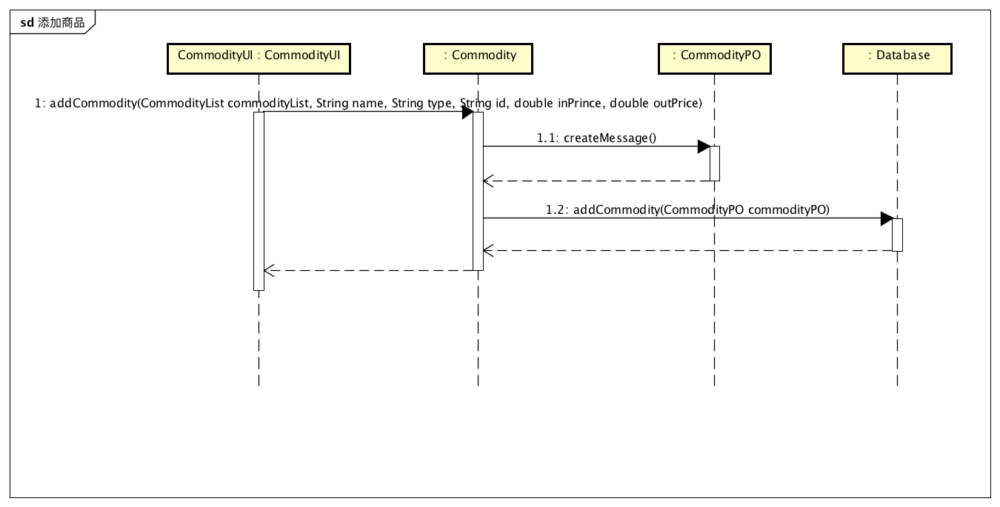
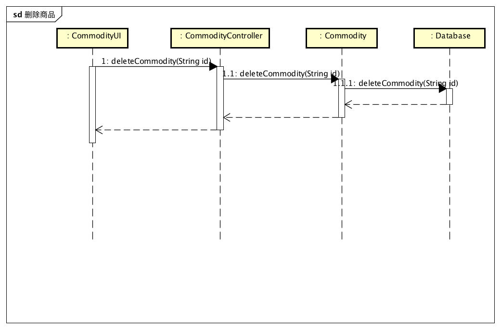
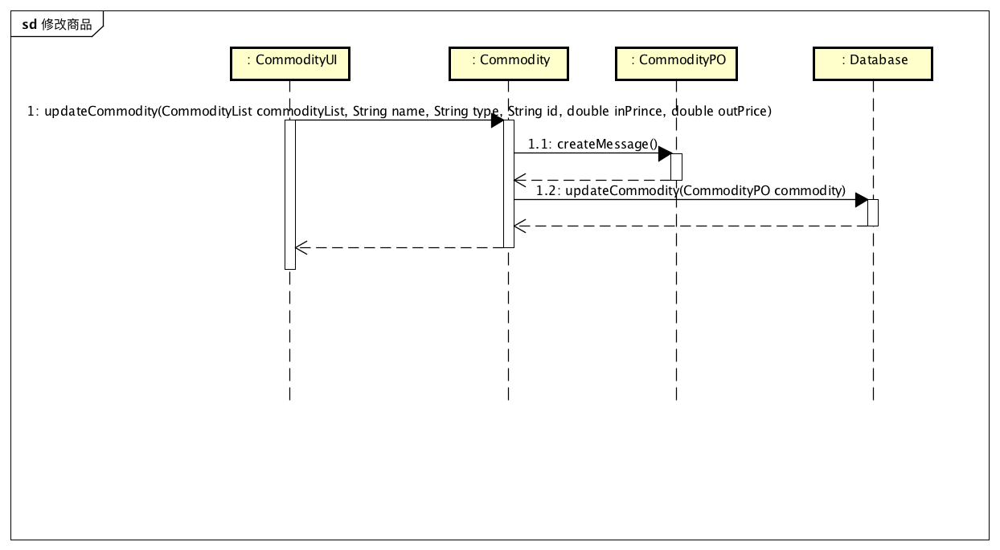
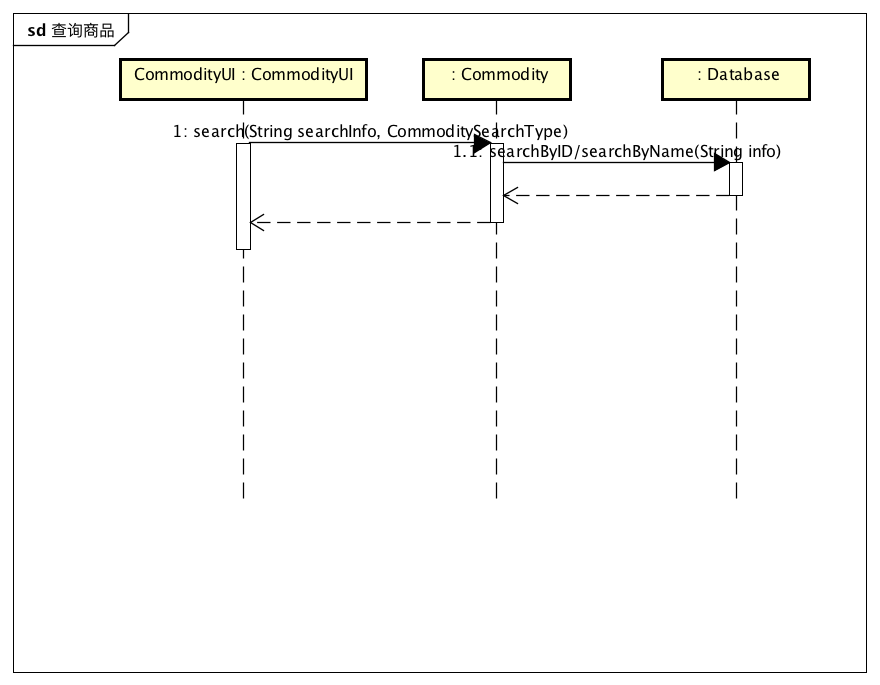
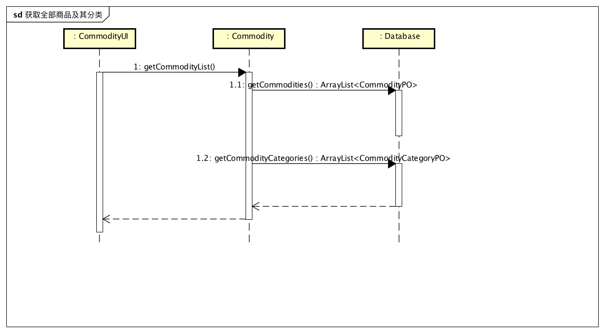
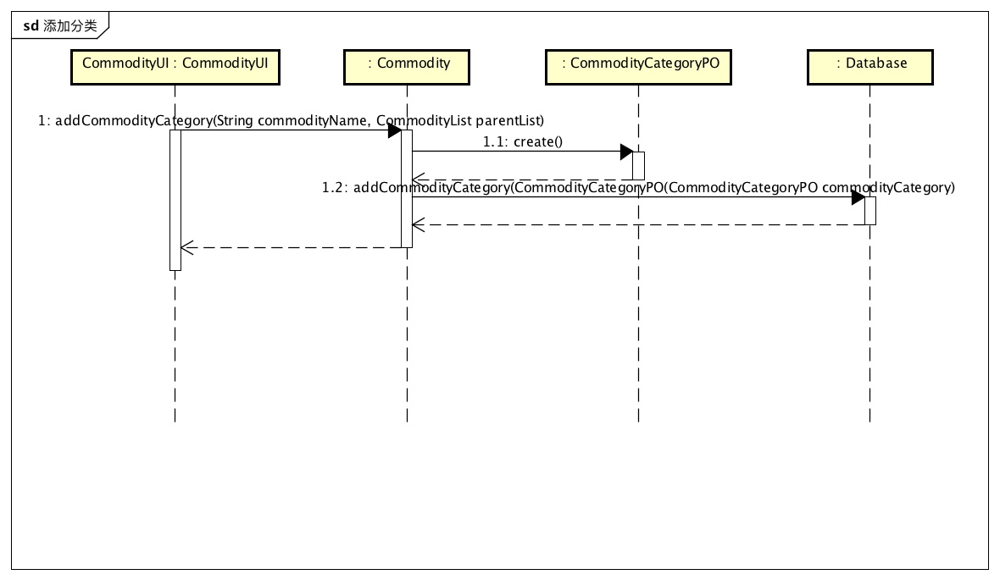
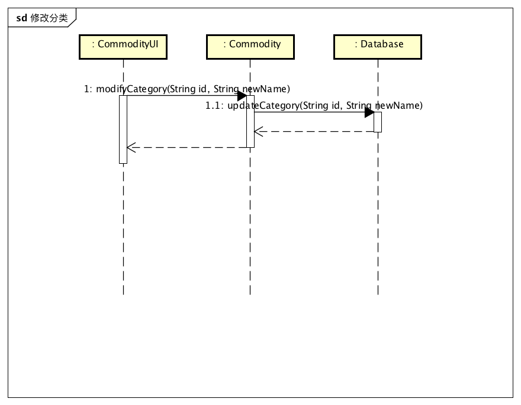

#### 4.1.1 commoditybl模块

##### 1. 模块概述

commoditybl模块承担的需求见需求规格说明文档功能需求及相关非功能需求。

commoditybl模块的职责及接口参见软件体系结构描述文档。

##### 2. 整体结构

根据体系结构的设计，我们将系统分为展示层、业务逻辑层、数据层。每一层之间为了灵活性，我们添加接口，如CommodityBLService、CommodityDataService。为了隔离业务操作和控制操作，添加CommodityController。CommodityPO、CommodityListPO是作为商品、商品分类的持久化对象被添加到设计中。

commoditybl模块的设计如下图所示：

commoditybl模块各个类的职责如下表所示。

| 类                   | 职责                                       |
| ------------------- | ---------------------------------------- |
| CommodityController | 负责对商品、商品管理逻辑操作进行服务                       |
| Commodity           | 商品、商品管理等与商品有关的领域模型对象，拥有商品、商品分类的所有信息，包括商品的价格、库存、名称、型号、编号等一切属性，以及商品分类的全部属性 |

##### 3. 模块内部类的接口规范

- | 名称                            | 条目   | 详情                                       |
  | ----------------------------- | ---- | ---------------------------------------- |
  |                               | 语法   | `public ArrayList<CommodityVO> getCommodityList ()throws RemoteException` |
  | Commodity.getCommodityList    | 前置条件 | 无                                        |
  |                               | 后置条件 | 返回所有商品列表                                 |
  |                               | 语法   | `public ResultMessage addCommodity(CommodityVO newCommodity) throws RemoteException` |
  | Commodity.addCommodity        | 前置条件 | 输入任意非空名称、非空类型、已经存在的商品分类、大于零的数量以及大于零的成本价格 |
  |                               | 后置条件 | 增加新的商品，更新持久化存储内容                         |
  |                               | 语法   | `public ArrayList<CommodityVO> findCommodityByName(String commodityName)throws RemoteException` |
  | Commodity.findCommodityByName | 前置条件 | 输入任意非空商品名称                               |
  |                               | 后置条件 | 根据商品名称查找是否存在相应的商品，若存在匹配的商品则返回相应`ArrayList<CommodityVO>`对象，若不存在匹配项则返回`null` |
  |                               | 语法   | `public CommodityVO findCommodityById(String id)throws RemoteException` |
  | Commodity.findCommodityById   | 前置条件 | 输入不违反商品id格式的字符串                          |
  |                               | 后置条件 | 根据商品id查找是否存在相应的商品，如果存在与输入id完全相同的产品，返回一个CommodityVO对象，否则返回null |
  |                               | 语法   | `public ResultMessage deleteCommodity(String id)throws RemoteException` |
  | Commodity.deleteCommodity     | 前置条件 | 输入不违反商品id格式的字符串                          |
  |                               | 后置条件 | 如果存在与输入商品id对应的商品，删除商品。返回ResultMessage    |
  |                               | 语法   | `public ResultMessage modifyCommodity(CommodityVO commodity)throws RemoteException` |
  | Commodity.modifyCommodity     | 前置条件 | 输入一个非空的CommodityVO对象                     |
  |                               | 后置条件 | 返回ResultMessage                          |

- 需要的服务

  | 服务名                                      | 服务              |
  | ---------------------------------------- | --------------- |
  | CommodityDataService.getAll()            | 得到目前存储的所有商品数据对象 |
  | CommodityDataService.find(String id)     | 根据ID得到商品数据对象    |
  | CommodityDataService.insert(CommodityPO po) | 插入单一持久化对象       |
  | CommodityDataService.update(CommodityPO po) | 更新单一持久化对象       |
  | CommodityDataService.delete(CommodityPO po) | 删除单一持久化对象       |
  | CommodityDataService.findByName(String name) | 根据名称查找多个持久化对象   |

##### 

##### 业务逻辑层的动态模型

下图为添加商品的后，商品模块业务逻辑处理顺序

下图为删除商品后，商品模块业务逻辑处理的相关对象之间的协作顺序

下图为修改商品后，商品模块业务逻辑处理的相关对象之间的协作顺序

下图为查询商品时，商品模块业务逻辑处理的相关对象之间的协作顺序

下图为获取全部商品、分类信息时，商品模块业务逻辑处理的相关对象之间的协作顺序

下图为增加分类时，商品模块业务逻辑处理的相关对象的协作顺序

下图为修改分类时，商品模块业务逻辑处理的相关对象的协作顺序

下图为删除分类是，商品模块业务逻辑处理的相关对象的协作顺序

#### 4.1.2