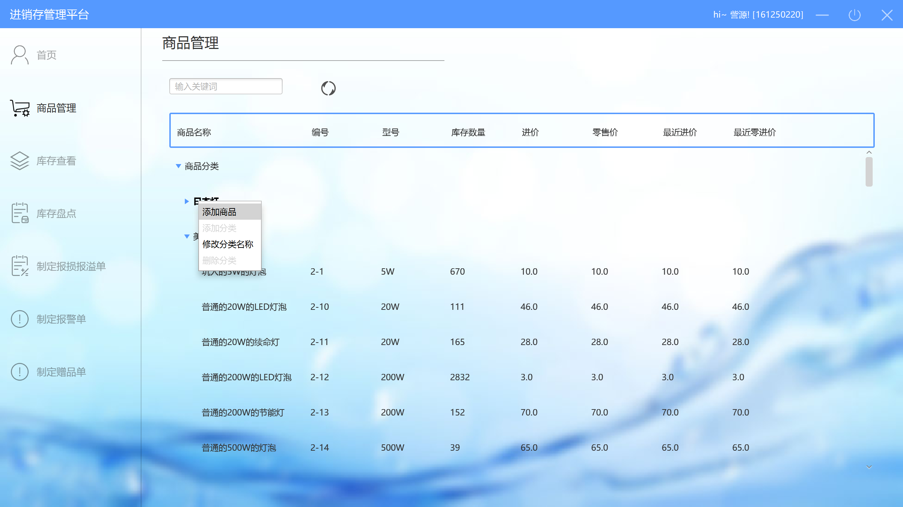
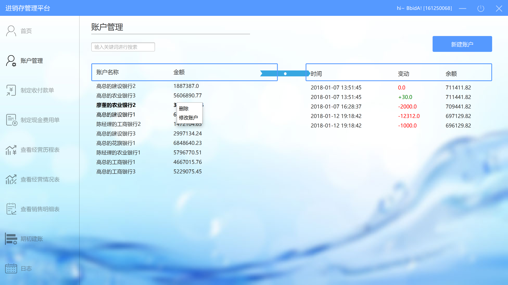

# 用户文档

## 0.更新日志

| 修改日期      | 修改人  | 版本   | 变更原因 |
| --------- | ---- | ---- | ---- |
| 2018/1/12 | 陈俊宇  | 0.1  | 第一版  |

## 1.引言

本文档是灯具进销存系统的用户文档，旨在帮助本系统的使用者快速上手本套系统

程序设计理念：User needs to be truseted(与可能犯的错相比，更重要的是能做什么好的事情)

## 2.操作规程

### 2.1程序安装和运行

客户端：

1. 在客户端机器上配置好JDK 1.8。
2. 运行  .jar文件即可

### 2.2登录

当服务器和客户端都启动完毕并成功连接时，在客户端将会显示出登录界面。在这里输入用户名和密码。

如果用户名称错误，则会显示如下信息

如果密码错误，则会显示如下信息

### 2.2 主页

登录成功后将会跳转到用户的身份所对应的主界面，总经理的主页参见审批单据部分，其他人主页大致相同，以财务人员为例

1. 主界面上面是**标题栏** ，从左到右分别是最小化窗口、注销当前账号，关闭程序三个按钮

   （点击注销账号后退回到登陆界面）

2. 主界面左侧是**功能列表**，显示当前用户所有可以使用的功能。点击某个按钮将会在右侧**功能界面**显示功能的具体信息
3. 标题栏右侧是功能界面**功能界面**，显示当前选择功能的具体内容

在其他三个人的首页中有一个列表显示了最近七天的历史单据，包括单据类型和单据状态，点击某一个单据后会在右面显示该单据的具体内容以及审批意见

### 2.3 销售人员模块

#### 2.3.1客户管理

销售人员点击左面的客户管理按钮，会跳转到下图所示的客户管理界面

鼠标移动到某个用户上方时会显示查看和删除两个按钮，点击查看会跳转到查看客户详情（参见查看客户详情模块），点击删除会删出掉当前用户

左上方有一个输入框可以输入关键词，输入关键字后按确认键后进行模糊搜索

右上角有一个增加客户按钮，点击后会跳转到新建用户界面，详情与查看用户基本一致

#####2.3.1.1查看客户详情

在这个界面上方有两个按钮从左到右分别是编辑和删除，点击编辑后编辑按钮变为保存按钮，可以对用户进行编辑，编辑完成后点击保存即可更新用户信息，点击删除按钮会删除掉当前客户

#### 2.3.2 制定销售单

点击制定销售单后会跳转到**制定销售单**界面

在界面左上角选择商品界面，点击后会跳转到选择商品界面（详情参见选择商品），选择成功后会在商品列表显示已选择的商品

最右边与客户相平的是选择客户的按钮，点击后会跳转到选择客户界面（详情参见选择客户），选择成功后会在按钮左边的横线上填上客户的名字

点击业务员（仓库）右面的选择框会出现一个下拉框选择系统用户（仓库）

当客户和商品都不为空的时候，促销策略右侧的按钮变为可用，点击后会跳转到选择促销策略界面（参见选择促销策略促销策略），选择成功后会在促销策略右边的横线上填写促销策略的名称

在商品列表的下面分别有四个横线具体意义在上方标注，其中折让和带进去金额可编辑，折让前总额和最终总额由系统自己运算得出

鼠标在促销策略和客户的横线上的内容不可编辑，右击的时候都会有清除的按钮，点击后会删除横线上的内容

在商品和客户都不为空的 点击下方的完成并提交按钮，会提交当前销售单

添加商品之后可以鼠标左键双击数量或者单价进行编辑，可以点击右侧的删除按钮将当前商品从商品列表中删除

##### 2.3.2.1 选择客户

在选择客户界面可以通过左上角的输入框进行模糊搜索，左击客户列表中的客户会选中当前客户，点击确定会选择成功并回退到上一层界面，若要放弃选择可以直接点击上方的上一层界面的标签（如途中的制定销售单）

#####2.3.2.2 选择商品

在选择商品界面可以通过左上角的输入框进行模糊搜索，左击商品列表中的商品会选中当前商品，按住shift的同时选择商品会进入多选模式，选择结束后点击确认会选择成功并会痛到上一层界面，若要放弃选择可以直接点击上方的上一层界面的标签（如途中的制定销售单）

#####2.3.2.3 选择促销策略

在选择促销测略时，点击底部的分页标签可以切换促销策略，界面中间显示当前促销策略的具体内容，点击确定后会选择当前促销策略并返回到上一层界面，若要放弃选择可以直接点击上方的上一层界面的标签（如途中的制定销售单）。

#### 2.3.3 销售人员其他用例

销售人员其他用例包括 制定销售退货单、制定进货/退货单，这些单据与销售单基本类似

### 2.4  库存人员模块

#### 2.4.1 商品管理

在库存人员管理界面，点击功能栏中的商品管理按钮后会跳转到商品管理界面，在上方的关键词输入框收入关键词后按确认键会显示筛选结果，点击刷新按钮可以刷新当前商品列表

在商品名称这一纵列上右击鼠标会显示菜单按钮

在商品分类节点上右击鼠标，可以进行添加商品，添加分类，修改分类名称，删除分类等操作，如下图所示

在商品节点上右击鼠标，可以进行修改商品信息，删除商品，趋势预测等操作

#### 2.4.2 库存查看

点击库存查看按钮会跳转到库存查看界面，点击起始时间和终止时间右面的横线会弹出日期选择框，日期选择后点击确认按钮会进行筛选，显示出符合条件的商品列表

#### 2.4.3 库存盘点

点击库存盘点按钮会跳转到库存盘点界面，点击导出按钮后后会弹出路径选择框（详见**导出**），路径选择结束后会将当前表列表中的商品导出到excel文件

#### 2.4.4 制定报损报溢单

#### 2.4.5 其他用例

制定报警单、赠品单与之内搞定报损报溢单大致相同

### 2.5 财务人员模块

#### 2.5.1 账户管理

点击功能栏中的账户管理按钮会跳转到账户管理界面，上方是一个搜索框，输入关键字后按确认键会对账户列表进行筛选。

单击某个账户后会在右侧的列表中显示具体变动情况

点击右上角的新建账户（详见新建账户）

在账户列表上右击会调出菜单栏，可以进行删除（详见删除），修改账户的操作（修改账户与新建账户大体一致）

##### 2.5.1.1 新建账户

在弹窗中填写，点击确认后会更新账户列表，若要取消操作点击弹窗外面即可

##### 2.5.1.2  修改账户

在修改账户界面，可以修改账户的信息，点击确认后会更新账户列表

##### 2.5.2  制定收付款单

点击收付款单按钮后会跳转到制定收付款单界面

点击上方电话簿的图片可以选择客户（参见选择客户），点击收付款单旁边的开关可以切换收/付款单

点击 转账列表中旁边的加号按钮会选择账户（详见添加收付款单项）

右侧的总额不可编辑，自动计算，点击完成并提交按钮后会提交单据

######2.5.2.1 选择账户

可以通过上方搜索框进行账户搜索操作，选择某个账户后，点击确认按钮即可将目标账户添加到收付款单的账户列表中

###### 2.5.2.2 编辑收付款单小项

在收付款单小项列表中双击转账金额列/备注列可以进行编辑，点击右侧删除按钮可以删除此小项

##### 2.5.3 制定现金费用单

点击制定现金费用单按钮后会跳转到制定现金费用单界面，中间是现金费用单小项列表，点击列表旁边的按钮会添加现金费用单小项(详见添加现金费用单小项), 

点击选择账户右边的按钮会选择跳转到选择账户(详见选择账户),选择成功后会在选择账户的横线上写出账户的名字

点击完成并提交按钮会提交单据并显示提交结果

###### 2.5.3.1 添加现金费用单小项

添加小项界面会有一个弹窗，条目名可以选择具体条目，填写其它小项后点击确认会将小项添加到现金费用单列表中，点击弹出框外面会撤销添加小项操作

##### 2.5.4 查看经营历程表

详见总经理的查看经营历程表

##### 2.5.5 查看经营情况表

详见总经理的查看经营情况表

##### 2.5.6 查看销售明细表

详见总经理的查看销售明细表

#####2.5.7 期初建账

点击期初建账后会显示如下所示界面，点击建账，会在下图的列表中新建一份账，可通过点击地址栏的超链接进行下载账目的操作

##### 2.5.8查询日志

详见总经理的查询日志

#### 2.6 总经理模块

##### 2.6.1 审批单据

审批单据界面即为总经理的首页，

此界面中左侧为单据列表，点击单据后会在右面的单据详情界面显示具体单据

下方有审批通过按钮，点击后会通过当前选中的单据，可通过shift + 鼠标左键的方式选中多个单据以达到批量审批的效果

通过按钮右侧为驳回按钮，详见驳回界面

在单据列表上右击鼠标会显示菜单，点击修改单据后会跳转到修改单据界面，此修改界面与正常制定单据五无异

###### 2.6.1.1 驳回

驳回时需要在如图所示的对话框中填写审批意见，点击确定完成驳回操作，点击对话框外可以取消本次操作

##### 2.5.2 管理促销策略

点击管理促销策略后会跳转到如下图所示界面，列表中每一行代表一个促销策略，显示了他们的基本信息，其中截止日期为红色即代表该促销策略已过期

鼠标放到某一列上会显示打开（详见打开促销策略）和失效两个按钮，点击失效按钮后，会将当前选中的促销策略截止时间设为当前时间

右上角有一个新建按钮，点击后会弹出下拉框，点击选择具体要制定哪一种促销策略（详见制定促销策略）

###### 2.6.2.1制定促销策略

共可制定三种促销策略

​	1.针对总价类型的促销策略

​	界面中间部分为赠品列表，右侧必须填写的是信息为名称、起始/截止时间以及 触发条件（当总价大于）

​	2.针对用户级别的促销策略

​	与第一种基本类似，不过触发条件为选择客户等级

​	3.制定组合包

​	此界面中中间的列表为组合包列表此界面中所有条件必填

​	

此上三种促销策略填完必须信息后点击提交即可成功创建促销策略

##### 2.6.3  查看经营历程表

点击功能栏中的查看经营历程表后会跳转到查看经营历程表界面，鼠标放到具体某一行上会有“查看”按钮，点击后会跳转到单据详情界面（详见查看单据详情）

点击右上角的按钮会弹出筛选条件选择框（详见设置删选条件）

左上角的导出按钮会弹出文件选择框并导出目前表中的内容（详见导出）

###### 2.5.4.1 查看单据详情

查看单据详情界面可以看到单据的具体内容，**财务人员**右侧会显示如图中的红冲按钮和红冲并复制按钮，

点击红冲按钮会显示红冲结果，点击红冲并复制按钮会显示红冲结果并跳转到对应单据的制定界面（详见红冲并复制）

###### 2.5.4.2 红冲并复制

红冲并复制的界面如下图所示，单据的制定方式与在其他地方的制定方式相同

###### 2.5.4.3 条件筛选

点击条件筛选按钮以后会显示出如图所示方框，在其中可以选择具体的小项，与其他地方选择商品/客户/用户 无异

点击清空后，会清空掉除时间以外的所有筛选条件

点击确认后，会关闭筛选框并选择所有符合条件的单据

##### 2.6.4 查看经营情况表

点击功能栏中的查看经营情况表之后会跳转到查看经营i情况表界面

页面右上角有导出按钮，点击后详见导出

导出按钮下面有六个快速选择按钮，点击之后会将时间设为今天到今天，一周前到今天等等

也可以通过下面的时间框自定义时间区间，填写之后点击确认会按照筛选条件刷新经营情况表

##### 2.6.5 查看销售明细表

点击查看销售明细表后会跳转到查看销售明细表界面，表中内容为最近的商品销售记录

左上角有导出按钮，详见导出

又想念有展开筛选条件按钮，详见条件筛选

##### 2.6.6 日志

点击功能栏中的日志后会跳转到查询日至界面，可以通过输入时间区间来查询日志

####2.7 系统管理员

##### 2.7.1 系统用户管理

登录管理员帐号后，仅有此一个界面，可以通过右上角的增加用户按钮增加一个新的系统用户（详见增加用户）

将鼠标放到某一列上时会显示 修改和删除两个按钮，点击删除会是那个处选定的用户，点击修改会修改用户信息（详见修改用户）

###### 2.7.1.1 增加用户

新增用户界面为下图所示的对话框，填写完所有信息后点击确认就可以新建用户，点击对话框以外地方就会取消操作

###### 2.7.1.2 修改用户

修改用户为与添加用户相似的对话框，若不需要更改密码则密码与密码确认可以不填，其他操作与添加用户相似

