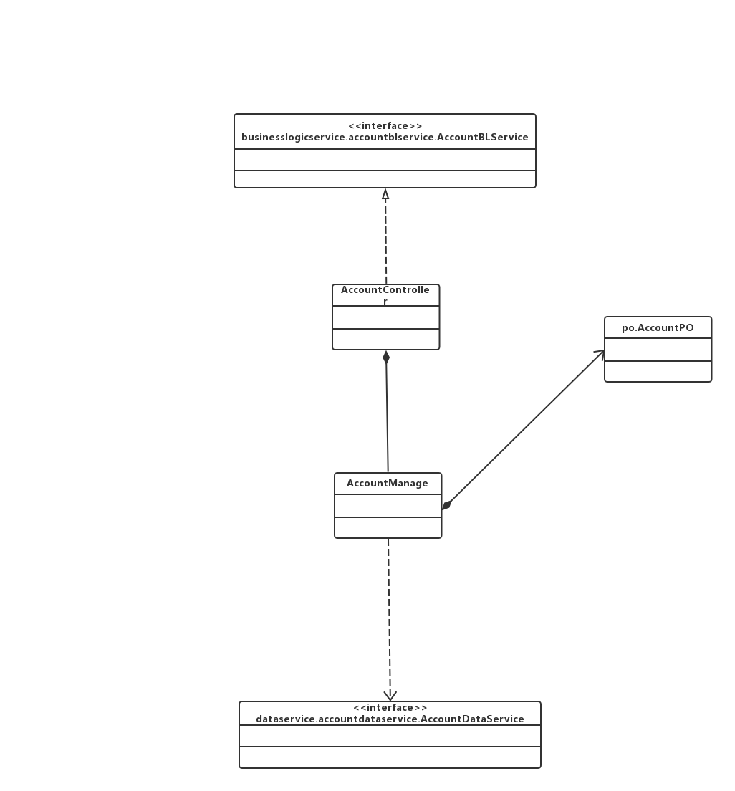

### 业务逻辑层的分解

#### accountbl 模块

##### 模块概述

accountbl模块承担的需求参见需求规格说明文档功能需求及相关非功能需求

accountbl模块的职责及接口参见软件系统结构描述文档accountbl模块的接口规范

##### 整体结构

根据体系结构的设计，我们将系统分为展示层、业务逻辑层、数据层。每一层之间为了增加灵活性，我们会添加接口。比如展示层和业务逻辑层之间，我们添加bussinesslogicservice.accountblservice.AccountBLService接口。业务逻辑层和数据层之间添加dataservice. AccountDataService接口。为了隔离业务逻辑职责和逻辑控制职责，我们增加了AccountController，这样AccountlController会将对账户管理的逻辑业务处理委托给AccountManage对象。AccountPO是作为账户信息的持久化对象被添加到设计模型中去的。

accountbl 模块的设计如下图

accountbl 模块各个类的职责如下表

| 模块                | 职责                                       |
| ----------------- | ---------------------------------------- |
| AccountController | 负责实现对账户管理界面所需要的服务                        |
| AccountManage     | 账户管理的领域模型对象，拥有一次账户管理（增删查改四种操作）所需要的信息：增加操作所需要的账户名称、金额；删除操作需要的账户名；查找操作所需要的关键字；修改操作所需要的账户需要修改的名称。可以帮助完成账户管理界面所需要的服务 |

##### 模块内部的接口规范