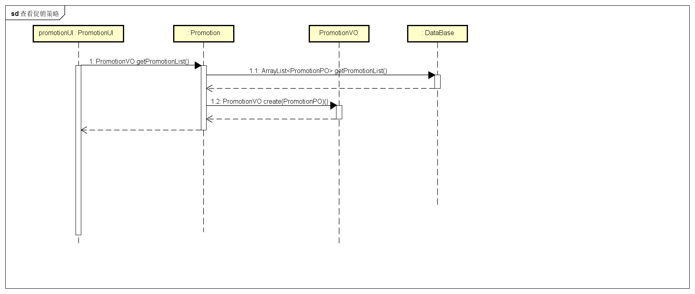

####promotionbl模块

##### 1.模块概述

promotionbl模块承担的需求见需求规格说明文档功能需求及相关非功能需求。

promotionbl模块的职责及接口参见软件体系结构描述文档。

##### 2.整体结构

根据体系结构的设计，我们将系统分为展示层、业务逻辑层、数据层。每一层之间为了增加灵活性，我们会添加接口，比如businesslogicservice.promotionservice.PromotionBLService和dataservice.promotiondataservice.PromotionDataService接口。为了隔离业务逻辑层和逻辑控制职责，我们添加了PromotionController,这样PromotionController会将对促销策略的业务逻辑委托给Promotion对象。PromotionPO是作为促销策略的持久化对象被添加到设计模型中去的。

promotionbl模块的设计如图所示

promotionbl模块个各类的职责如表所示

| 模块                  | 职责                                       |
| ------------------- | ---------------------------------------- |
| PromotionController | 负责实现管理促销策略界面所需要的服务                       |
| Promotion           | 促销策略的领域模型对象，拥有促销策略的所有信息，包括促销策略类型、降价额度、代金券等信息，可以帮助完成管理促销策略界面所需要的服务 |

##### 3.模块内部类的接口规范

######PromotionController的接口规范

- 提供的接口

| 名称                                   | 条目   | 详情                                       |
| ------------------------------------ | ---- | ---------------------------------------- |
|                                      | 语法   | `public ArrayList<PromotionVO> getPromotionList()` |
| PromotionController.getPromotionList | 前置条件 | 已创建一个Promotion领域对象                       |
|                                      | 后置条件 | 调用Promotion领域对象的 getPromotionList方法      |
|                                      | 语法   | `public PromotionVO create(int tag)`     |
| PromotionController.create           | 前置条件 | 已创建一个Promotion领域对象，已添加促销策略的类型            |
|                                      | 后置条件 | 调用Promotion领域对象的create方法                 |
|                                      | 语法   | `public ResultMessage commit(PromotionVO vo)` |
| PromotionController.commit           | 前置条件 | 已创建一个Promotion领域对象，已添加要提交的促销策略的信息        |
|                                      | 后置条件 | 调用Promotion领域对象的commit方法                 |
|                                      | 语法   | `public ResultMessage modify(PromotionVO vo)` |
| PromotionController.modify           | 前置条件 | 已创建一个Promotion领域对象，已经添加要修改的促销策略信息        |
|                                      | 后置条件 | 调用Promotion领域对象的modify方法                 |
|                                      | 语法   | `public ResultMessage delete(PromotionVO vo)` |
| PromotionController.delete           | 前置条件 | 已创建一个Promotion领域对象，已经添加要删除的促销策略          |
|                                      | 后置条件 | 调用Promotion领域对象的delete方法                 |

- 需要的接口

| 服务名                        | 服务              |
| -------------------------- | --------------- |
| Promotion.getPromotion     | 得到一个促销策略的对象     |
| Promotion.getPromotionList | 得到所有促销策略的       |
| Promotion.create           | 新建一个空的促销策略      |
| Promotion.getBenefitsPlan  | 得到满足筛选条件的所有促销策略 |
| Promotion.commit           | 保存一个新建的促销策略     |
| Promotion.modify           | 保存一个修改后的促销策略    |
| Promotion.delete           | 删除一个促销策略        |

######Promotion的接口规范

| 名称                         | 条目   | 详情                                       |
| :------------------------- | ---- | ---------------------------------------- |
|                            | 语法   | `public ArrayList<PromotionVO> getPromotionList()` |
| Promotion.getPromotionList | 前置条件 | 用户已登录                                    |
|                            | 后置条件 | 返回含有所有促销策略的列表的项                          |
|                            | 语法   | `public ArrayList<PromotionVO> getBenefitsPlan(int customerLevel, ArrayList<String> CommmodityList,double total)` |
| Promotion.getBenefitsPlan  | 前置条件 | 所有筛选条件合法                                 |
|                            | 后置条件 | 返回该销售单据所满足的优惠策略的值对象列表                    |
|                            | 语法   | `public PromotionVO create()`            |
| Promotion.create           | 前置条件 | 无                                        |
|                            | 后置条件 | 返回内容为空的促销策略的值对象                          |
|                            | 语法   | `public ResultMessage commit(PromotionVO vo)` |
| Promotion.commit           | 前置条件 | 已添加要提交的促销策略的信息                           |
|                            | 后置条件 | 持久化更新相关的对象的数据                            |
|                            | 语法   | `public ResultMessage modify(PromotionVO vo)` |
| Promotion.modify           | 前置条件 | 已添加修改好的促销策略的信息                           |
|                            | 后置条件 | 持久化更新相关的对象的数据                            |
|                            | 语法   | `public ResultMessage delete(PromotionVO vo)` |
| Promotion.delete           | 前置条件 | 用户有正在查看的销售策略                             |
|                            | 后置条件 | 删除该销售策略，持久化更新相关的对象的数据                    |

- 需要的接口

| 服务名                                   | 服务           |
| :------------------------------------ | ------------ |
| PromotionDataService.getPromotion     | 返回一个赤计划对象    |
| PromotionDataService.getPromotionList | 返回所有单据的持久化对象 |
| PromotionDataService.insert           | 插入单一持久化对象    |
| PromotionDataSerivice.update          | 更新单一持久化对象    |
| PromotionDataService.delete           | 删除单一持久化对象    |

##### 4.业务逻辑层的动态模型

下图为查看促销策略时促销策略业务逻辑处理的相关对象间的协作

下图为新建促销策略时促销策略业务逻辑处理的相关对象间的协作

下图为修改促销策略时促销策略业务逻辑处理的相关对象间的协作

下图为删除销售策略时促销策略业务逻辑处理的相关对象间的协作

#### Approval模块 

##### 1.模块概述

approvalbl模块承担的需求见需求规格说明文档功能需求及相关非功能需求。

approvalbl模块的职责及接口参见软件体系结构描述文档。

##### 2.整体结构

根据体系结构的设计，我们将系统分为展示层、业务逻辑层、数据层。每一层之间为了增加灵活性，我们会添加接口，比如businesslogicservice.approvalblservice.ApprovalBLService和dataservice.approvaldataservice.ApprovalDataService接口。为了隔离业务逻辑层和逻辑控制职责，我们添加了ApprovalController,这样ApprovalController会将对促销策略的业务逻辑委托给Approval对象。

##### 3.模块内部类的接口规范

###### ApprovalController的接口规范

- 提供的接口

| 名称                                 | 条目   | 详情                                       |
| ---------------------------------- | ---- | ---------------------------------------- |
|                                    | 语法   | `public ArrayList<HistoryDocVO> getDocumentList()` |
| ApprovalController.getDocumentList | 前置条件 | 已经创建一个Approval领域对象                       |
|                                    | 后置条件 | 调用Approval领域对象的getDocumentList方法         |
|                                    | 语法   | `public ResultMessage approve(HistoryDocVO vo)` |
| ApprovalController.approve         | 前置条件 | 已经创建一个Approval领域对象，已添加用户要通过的单据           |
|                                    | 后置条件 | 调用Approval领域对象approve方法                  |
|                                    | 语法   | `public ResultMessage approveAll(ArrayList<HistoryDocVO> voList)` |
| ApprovalController.approveAll      | 前置条件 | 已经创建一个Approval领域对象，已添加用户要通过的单据           |
|                                    | 后置条件 | 调用Approval领域对象的approvalALl方法             |
|                                    | 语法   | `public ResultMessage reject(HistoryDocVO vo)` |
| ApprovalController.reject          | 前置条件 | 已经创建一个Approval领域对象，已添加用户要驳回的单据           |
|                                    | 后置条件 | 调用Approval领域对象的reject方法                  |
|                                    | 语法   | `public ResultMessage save(HistoryDocVO vo)` |
| ApprovalController.save            | 前置条件 | 已经创建一个Approval领域对象，已添加用户要保存的修改好的单据       |
|                                    | 后置条件 | 调用Approval领域对象的save方法                    |
|                                    | 语法   | `public ResultMessage saveAndApprove(HistoryDocVO vo)` |
| ApprovalController.saveAndApprove  | 前置条件 | 已经创建一个Approval领域对象，已添加用户要保存的修改好并计划通过的单据  |
|                                    | 后置条件 | 调用Approval领域对象的saveAndApprove方法          |

- 需要的接口

| 服务名                      | 服务             |
| ------------------------ | -------------- |
| Approval.getDocumentList | 返回所有待审批的单据的值对象 |
| Approval.approve         | 通过一个单据         |
| Approval.approveAll      | 通过选择的所有单据      |
| Approval.reject          | 驳回一个单据         |
| Approval.save            | 保存一个修改过的单据     |
| Approval.saveAndApprove  | 保存并通过一个修改过的单据  |

######Approval的接口规范

- 提供的接口（供接口）

| 名称                       | 条目   | 详情                                       |
| ------------------------ | ---- | ---------------------------------------- |
|                          | 语法   | `public ArrayList<HistoryDocVO> getDocumentList()` |
| Approval.getDocumentList | 前置条件 | 用户已登录                                    |
|                          | 后置条件 | 返回含有所有处于待审批状态的单据的列表的值对象                  |
|                          | 语法   | `public ResultMessage approve(HistoryDocVO vo)` |
| Approval.approve         | 前置条件 | 已添加用户要通过的单据                              |
|                          | 后置条件 | 通过单据，持久化更新涉及的对象的数据                       |
|                          | 语法   | `public ResultMessage approveAll(ArrayList<HistoryDocVO> voList)` |
| Approval.approveAll      | 前置条件 | 已添加用户要通过的单据                              |
|                          | 后置条件 | 通过所选的单据，持久化更新涉及的对象的数据                    |
|                          | 语法   | `public ResultMessage reject(HistoryDocVO vo)` |
| Approval.reject          | 前置条件 | 已添加用户要驳回的单据                              |
|                          | 后置条件 | 驳回单据，持久化更新涉及的对象的数据                       |
|                          | 语法   | `public ResultMessage save(HistoryDocVO vo)` |
| Approval.save            | 前置条件 | 已添加用户要保存的修改好的单据                          |
|                          | 后置条件 | 持久化更新涉及的对象的数据                            |
|                          | 语法   | `public ResultMessage saveAndApprove(HistoryDocVO vo)` |
| Approval.saveAndApprove  | 前置条件 | 已添加用户要保存的修改好并计划通过的单据，有已修改需要保存且同时要通过的单据   |
|                          | 后置条件 | 通过该单据，持久化更新涉及的对象的数据                      |

- 需要的服务（需接口）

| 服务名                                 | 服务                   |
| ----------------------------------- | -------------------- |
| ApprovalDataService.getDocumentList | 返回所有处于待审批状态的单据的持久化对象 |
| ApprovalDataService.update          | 更新单一的持久化对象           |

##### 4.业务逻辑层的动态模型

下图为审批单据时审批单据业务逻辑处理的相关对象间的协作

#### Document模块

##### 1.模块概述

##### 2.整体结构

#####3.模块内部类的接口规范

###### DocController的接口规范

| 名称                                      | 条目   | 详情                                       |
| --------------------------------------- | ---- | ---------------------------------------- |
|                                         | 语法   | `public ArrayList<SaleRecordItemVO> findSaleRecords(saleRecordFilterVO vo)` |
| DocController.findSaleRecords           | 前置条件 | 已经创建一个Doc领域对象，已添加筛选条件                    |
|                                         | 后置条件 | 调用Doc领域对象的findSaleRecords方法              |
|                                         | 语法   | `public ArrayList<BussinessHitoryItemVO> findDocuments(documentFilterVO vo)` |
| DocController.findDocuments             | 前置条件 | 已经创建一个Doc领域对象，已添加筛选条件                    |
|                                         | 后置条件 | 调用Doc领域对象的的findDocuments方法               |
|                                         | 语法   | `public RevenueAndExpenditureVO findRevenueAndExpenditure(long StartDate,long endDate)` |
| DocController.findRevenueAndExpenditure | 前置条件 | 已经创建一个Doc领域对象，已添加筛选条件                    |
|                                         | 后置条件 | 调用Doc领域对象的findRevenueAndExpenditure方法    |

###### Doc模块的接口规范

- 提供的接口

| 名称                            | 条目   | 详情                                       |
| ----------------------------- | ---- | ---------------------------------------- |
|                               | 语法   | `public ArrayList<SaleRecordItemVO> findSaleRecords(saleRecordFilterVO vo)` |
| Doc.findSaleRecords           | 前置条件 | 用户已输入正确的筛选条件并确认                          |
|                               | 后置条件 | 返回符合筛选条件的所有单据                            |
|                               | 语法   | `public ArrayList<BussinessHitoryItemVO> findDocuments(documentFilterVO vo)` |
| Doc.findDocuments             | 前置条件 | 用户已输入正确的筛选条件并确认                          |
|                               | 后置条件 | 返回符合筛选条件的所有单据                            |
|                               | 语法   | `public RevenueAndExpenditureVO findRevenueAndExpenditure(long StartDate,long endDate)` |
| Doc.findRevenueAndExpenditure | 前置条件 | 用户已输入正确的筛选条件并确认                          |
|                               | 后置条件 | 返回所输入时间段内的收支情况的值对象                       |

- 需要的接口

| 服务名                     | 服务              |
| ----------------------- | --------------- |
| DocDataService.findDocs | 返回符合筛选条件的单据的持久化 |

##### 4.业务逻辑层的动态模型

下图为查看经营历程表时单据业务逻辑处理的相关对象间的协作

下图为查看经营情况表时单据业务逻辑处理的相关对象间的协作

下图为查看销售明细表时单据业务逻辑处理的相关对象间的协作

