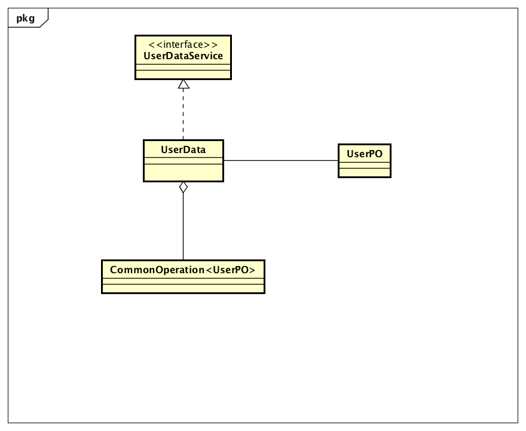
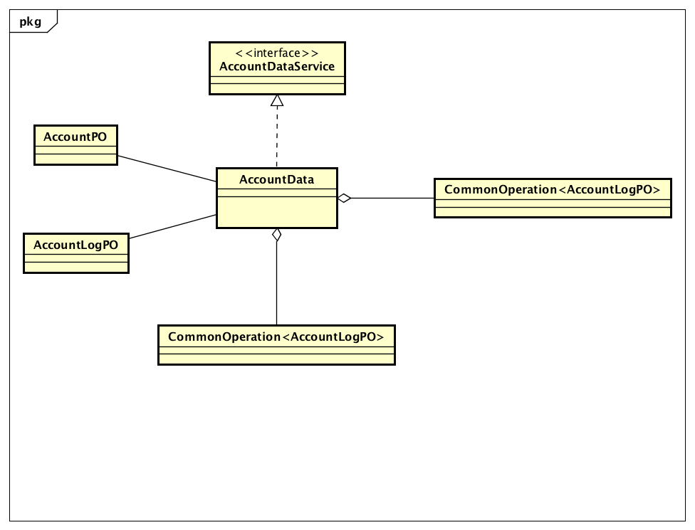
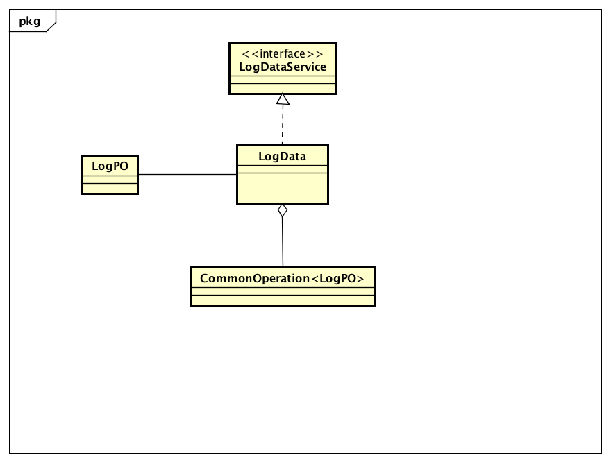
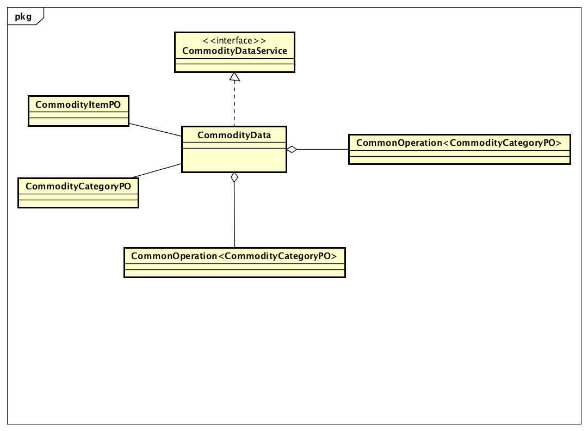
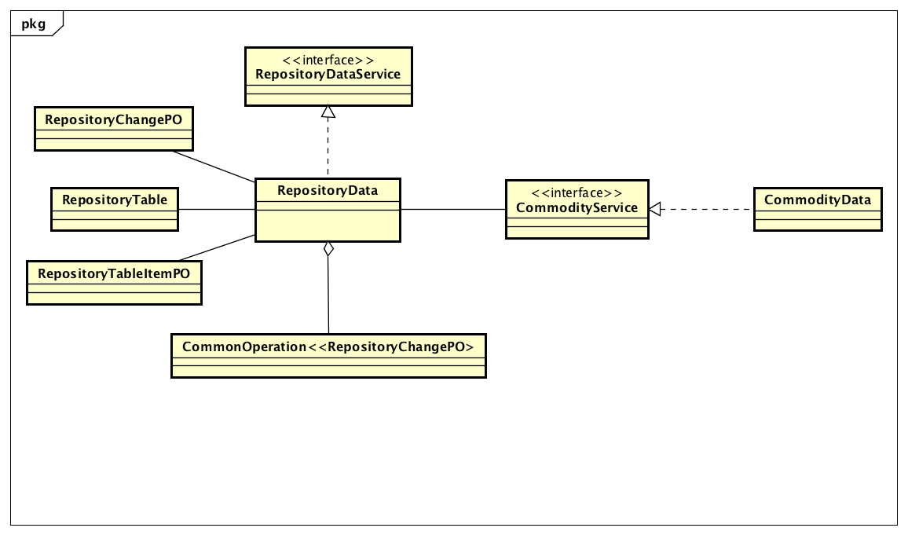
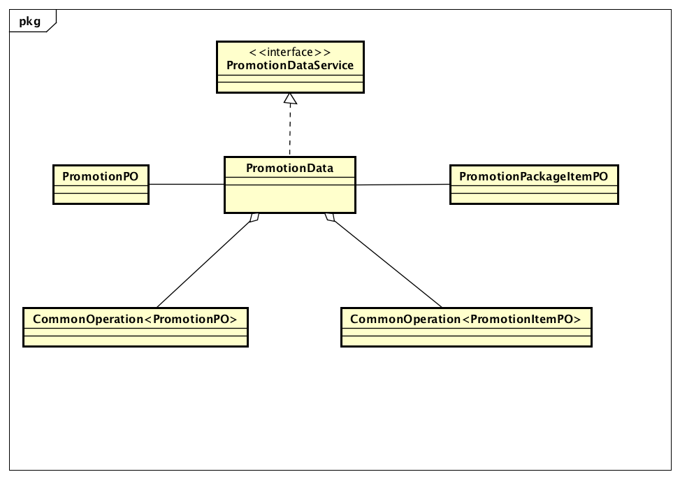
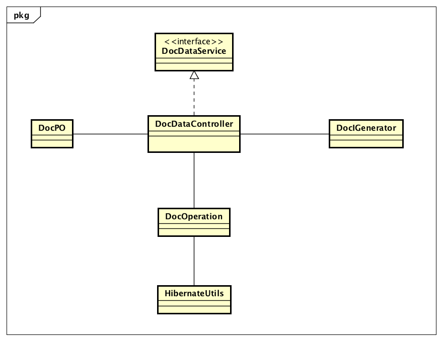
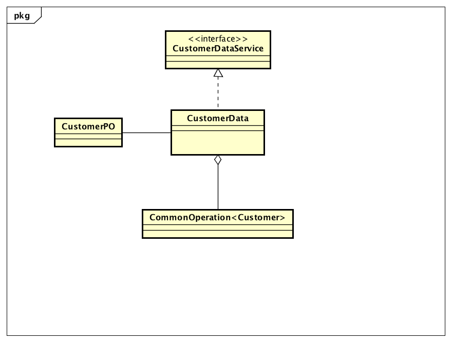
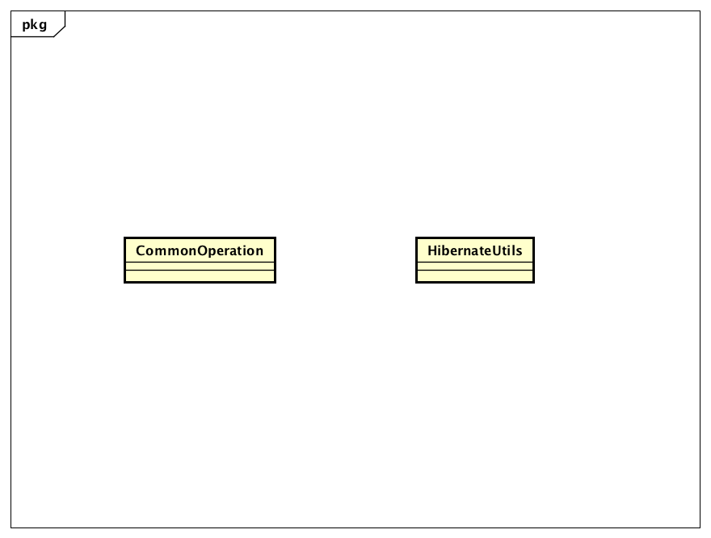

### 数据层的分解

数据层开发包图、模块职责参见体系结构设计文档。

#### 1.1 userdata模块

##### 1.1.1概述

userdata模块负责用户的增删改查、以及登录、登出。具体功能需求和非功能需求可参见需求规格说明文档和体系结构设计文档。

##### 1.1.2向上层提供接口

参见体系结构设计文档。

##### 1.1.3设计图

##### 1.1.4模块内部类

| 名称       | 职责                |
| -------- | ----------------- |
| UserData | 负责用户的增删改查、以及登录、登出 |

##### 1.1.5内部接口

无。

##### 1.1.6需服务

| 定义                                   | 作用              |
| ------------------------------------ | --------------- |
| CommonOperation.add                  | 添加一个数据对象        |
| CommonOperation.getBySingleField     | 根据某个字段获取数据      |
| CommonOperation.update               | 更新数据            |
| CommonOperation.deleteBySingleField  | 根据某个字段删除数据      |
| CommonOperation.getAll               | 获取全部数据          |
| CommonOperation.getListBySingleField | 根据某个字段获取符合条件的数据 |

##### 1.1.7 同层提供服务

| 定义                        | 作用       |
| ------------------------- | -------- |
| UserService.getByIdentity | 根据身份获取用户 |

#### 1.2accountdata模块

##### 1.2.1概述

accountdata模块负责账户的增删改查。具体功能需求和非功能需求可参见需求规格说明文档和体系结构设计文档。

##### 1.2.2向上层提供接口

参见体系结构设计文档。

##### 1.2.3设计图

##### 1.2.4模块内部类

| 名称          | 职责        |
| ----------- | --------- |
| AccountData | 负责账户的增删改查 |

##### 1.2.5内部接口

无。

##### 1.2.6需服务

| 定义                                   | 作用              |
| ------------------------------------ | --------------- |
| CommonOperation.add                  | 添加一个数据对象        |
| CommonOperation.getBySingleField     | 根据某个字段获取数据      |
| CommonOperation.update               | 更新数据            |
| CommonOperation.deleteBySingleField  | 根据某个字段删除数据      |
| CommonOperation.getAll               | 获取全部数据          |
| CommonOperation.getListBySingleField | 根据某个字段获取符合条件的数据 |

#### 1.3 logdata模块

##### 1.3.1概述

logdata实现。具体功能需求和非功能需求可参见需求规格说明文档和体系结构设计文档。

##### 1.3.2向上层提供接口

参见体系结构设计文档。

##### 1.3.3设计图

##### 1.3.4模块内部类

| 名称      | 职责         |
| ------- | ---------- |
| Logdata | 负责日志的记录和获取 |

##### 1.3.5内部接口

无。

##### 1.3.6需服务

| 定义                                   | 作用         |
| ------------------------------------ | ---------- |
| CommonOperation.add                  | 添加一个数据对象   |
| CommonOperation.getDataBetweenTime   | 根据时间区间获取数据 |
| CommonOperation.getListBySingleField | 根据字段获取数据列表 |
| UserService.getByIdentity            | 根据用户身份获取   |

#### 1.4commoditydata模块

##### 1.4.1概述

commoditydata模块负责商品的增删改查、商品分类的增删改。具体功能需求和非功能需求可参见需求规格说明文档和体系结构设计文档。

##### 1.4.2向上层提供的接口

参见体系结构设计文档。

##### 1.4.3设计图

##### 1.4.4模块内部类

| 名称            | 职责                 |
| ------------- | ------------------ |
| CommodityData | 负责商品的增删改查和商品分类的增删改 |

##### 1.4.5内部接口

无。

##### 1.4.6需服务

| 定义                                   | 作用              |
| ------------------------------------ | --------------- |
| CommonOperation.add                  | 添加一个数据对象        |
| CommonOperation.getBySingleField     | 根据某个字段获取数据      |
| CommonOperation.update               | 更新数据            |
| CommonOperation.deleteBySingleField  | 根据某个字段删除数据      |
| CommonOperation.getAll               | 获取全部数据          |
| CommonOperation.getListBySingleField | 根据某个字段获取符合条件的数据 |

#### 1.5repositorydata模块

##### 1.5.1概述

repositorydata模块负责库存的查看和盘点。具体功能需求和非功能需求可参见需求规格说明文档和体系结构设计文档。

##### 1.5.2向上层提供的接口

参见体系结构设计文档。

##### 1.5.3设计图

##### 1.5.4模块内部类

| 名称             | 职责          |
| -------------- | ----------- |
| RepositoryData | 负责库存的查看和盘点。 |

##### 1.5.5内部接口

无。

##### 1.5.6需服务

| 定义                                 | 作用         |
| ---------------------------------- | ---------- |
| CommonOperation.add                | 添加一个数据对象   |
| CommonOperation.getDataBetweenTime | 根据时间区间获取数据 |
| CommodityService.getAllCommodity   | 获取全部商品     |

#### 1.6promotiondata模块

##### 1.6.1概述

promotiondata模块促销策略的管理和添加。

##### 1.6.2向上层提供的接口

参见体系结构设计文档。

##### 1.6.3设计图

##### 1.6.4模块内部类

| 名称            | 职责           |
| ------------- | ------------ |
| PromotionData | 负责促销策略的管理和获取 |

##### 1.6.5内部接口

无。

##### 1.6.6需服务

| 定义                                   | 作用              |
| ------------------------------------ | --------------- |
| CommonOperation.add                  | 添加一个数据对象        |
| CommonOperation.getBySingleField     | 根据某个字段获取数据      |
| CommonOperation.update               | 更新数据            |
| CommonOperation.addList              | 添加List中所有数据     |
| CommonOperation.getAll               | 获取全部数据          |
| CommonOperation.getListBySingleField | 根据某个字段获取符合条件的数据 |

#### 1.7docdata模块

##### 1.7.1概述

docdata模块负责单据的获取，查询，修改，提交。具体功能需求和非功能需求可参见需求规格说明文档和体系结构设计文档。

##### 1.7.2向上层提供的接口

参见体系结构设计文档。

##### 1.7.3设计图

##### 1.7.4模块内部类

| 名称             | 职责                   |
| -------------- | -------------------- |
| DocData        | 负责单据信息获取、查询、修改、提交。   |
| DocIdGenerator | 负责单据id的生成            |
| DocOperation   | 负责承担部分单据的操作职责，类似于工具类 |

##### 1.7.5内部接口

| 定义                              | 作用                   |
| ------------------------------- | -------------------- |
| DocIdGenerator.generateId       | 生成id                 |
| DocOperation.add                | 添加Doc                |
| DocOperation.addItemList        | 添加单据附属的List          |
| DocOperation.update             | 更新Doc                |
| DocOperation.updateItemList     | 更新单据附属的List          |
| DocOperation.getAll             | 根据类名获取全部Doc          |
| DocOperation.getByUserId        | 根据类名和用户id获取Doc       |
| DocOperation.getByState         | 根据状态和类名获取Doc         |
| DocOperation.getItemList        | 根据类名和所在单据的id获取项目List |
| DocOperation.countByTypeAndDate | 根据类别和时间区间            |

##### 1.7.6需服务

| 定义                                   | 作用            |
| ------------------------------------ | ------------- |
| HibernateUtils.getCurrentSession     | 获取当前线程会话      |
| HibernateUtils.closeSession          | 关闭当前线程会话      |
| CommonOperation.getBySingleField     | 根据某一字段获取Doc   |
| CommonOperation.getAll               | 获取全部          |
| CommonOperation.getListBySingleField | 根据单个字段获取全部Doc |
| CommonOperation.getDataBetweenTime   | 根据区间获取数据      |

#### 1.8 customerdata模块

##### 1.8.1概述

customerdata模块负责管理customer的数据。

##### 1.8.2向上层提供接口

参见体系结构设计文档。

##### 1.8.3设计图

##### 1.8.4模块内部类

| 名称           | 职责        |
| ------------ | --------- |
| CustomerData | 负责管理客户信息。 |

##### 1.8.5内部接口

无。

##### 1.8.6需接口

| 定义                                   | 作用              |
| ------------------------------------ | --------------- |
| CommonOperation.add                  | 添加一个数据对象        |
| CommonOperation.getBySingleField     | 根据某个字段获取数据      |
| CommonOperation.update               | 更新数据            |
| CommonOperation.deleteBySingleField  | 根据某字段删除数据       |
| CommonOperation.getAll               | 获取全部数据          |
| CommonOperation.getListBySingleField | 根据某个字段获取符合条件的数据 |

#### 1.9 utils包

##### 1.9.1概述

utils包为其他模块提供了封装好的session操作，以及对于数据增删改查的常用操作。

##### 1.9.2 向上层提供接口

无。

##### 1.9.3设计图

##### 1.9.4模块内部类

| 名称              | 职责                     |
| --------------- | ---------------------- |
| CommonOperation | 通用查询类，负责满足大多数通用数据查询要求。 |
| HibernateUtils  | 负责抽象Hibernate的各种连接操作   |

##### 1.9.5内部接口

无。

##### 1.9.6需接口

无。

##### 1.9.7提供服务

| 定义                                   | 作用               |
| ------------------------------------ | ---------------- |
| HibernateUtils.getCurrentSession     | 获取当前线程对应的session |
| HibernateUtils.closeSession          | 关闭当前线程对应的session |
| CommonOperation.getAll               | 获取全部数据           |
| CommonOperation.getBySingleField     | 根据字段获取数据         |
| CommonOperation.getDataBetweenTime   | 根据时间获取数据         |
| CommonOperation.getListBySingleField | 根据字段获取数据列表       |
| CommonOperation.add                  | 增加数据对象           |
| CommonOperation.deleteBySingleField  | 根据字段删除数据         |
| CommonOperation.addList              | 增加一列数据           |
| CommonOperation.update               | 更新数据             |

