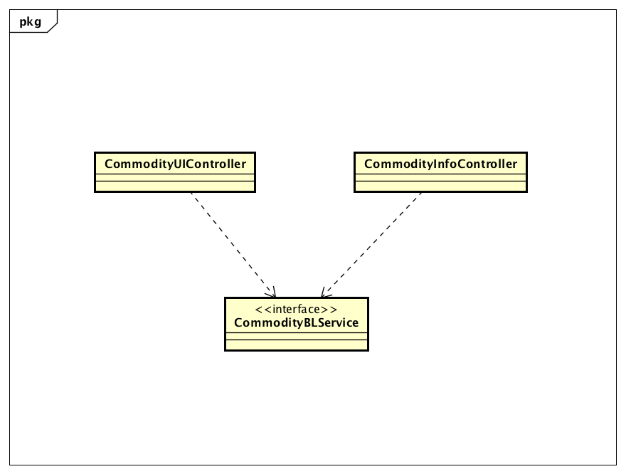
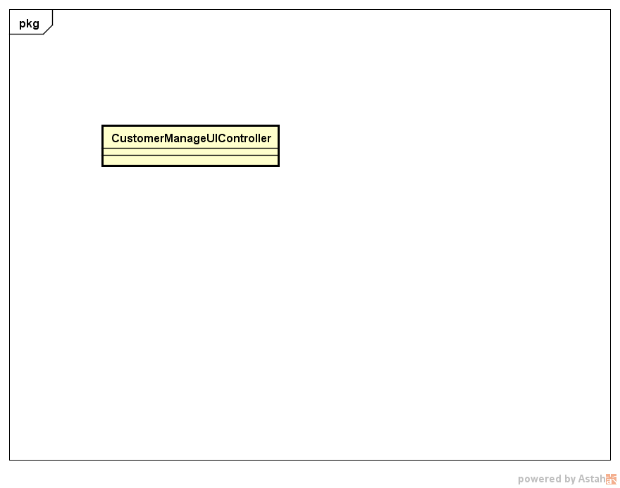

### 1 界面层的分解

#### 1.1 CommodityUI模块

##### 1.1.1 概述

CommodityUI负责库存管理人员进行商品管理、商品分类管理、以及其他人员需要选择商品的UI界面以及响应控制代码。具体功能需求和非功能可参见需求规格说明文档和体系结构设计文档。

##### 1.1.2 设计图

##### 1.1.3 类的职责

| 名称                      | 职责                  |
| ----------------------- | ------------------- |
| CommodityUIController   | 负责商品、商品分类界面的展示和功能   |
| CommodityInfoController | 负责为其他模块选择商品界面的展示和功能 |

##### 1.1.4 接口规范

##### CommodityUIController

需要的接口

| 接口名称                                     | 作用         |
| ---------------------------------------- | ---------- |
| CommodityBLService.getCommodityTreeVO()  | 获取全部商品及其信息 |
| CommodityBLService.addCommodity(CommodityItemVO newCommodity) | 添加商品       |
| CommodityBLService.findCommodityVOByName(String commodityName) | 根据名称查询商品   |
| CommodityBLService.findCommodityVOById(String id) | 根据id查询商品   |
| CommodityBLService.deleteCommodity(String id) | 根据id删除商品   |
| CommodityBLService.modifyCommodity(CommodityItemVO commodity) | 修改商品       |
| CommodityBLService.addCategory(CommodityCategoryVO newCategory) | 增加分类       |
| CommodityBLService.deleteCategory(int id) | 根据分类id删除分类 |
| CommodityBLService.modifyCategory(CommodityCategoryVO categoryItemVO) | 修改分类       |

##### CommodityInfoController

提供接口

| 接口名称                                     | 作用      |
| ---------------------------------------- | ------- |
| CommodityInfoController.getSelectedCommodityVO() | 获取选中的商品 |

需要的接口

| 接口名称                                     | 作用           |
| ---------------------------------------- | ------------ |
| CommodityBLService.getBasicCommodityTreeVO() | 获取全部商品及其基本信息 |

#### 1.2 RepositoryUI模块

##### 1.2.1 概述

RepositoryUI模块负责库存管理人员进行库存盘点、库存查看的UI界面以及响应控制代码。具体功能需求和非功能可参见需求规格说明文档和体系结构设计文档。

##### 1.1.2 设计图

##### 1.2.3 类的职责

| 名称                           | 职责             |
| ---------------------------- | -------------- |
| RepositoryChangeUIController | 负责库存查看界面的展示和功能 |
| RepositoryTableUIController  | 负责库存盘点界面的展示和功能 |

##### 1.2.4 接口规范

##### RepositoryChangeUIController

需要的接口

| 接口名称                                     | 作用            |
| ---------------------------------------- | ------------- |
| RepositoryBLService.getRepositoryChanges(Date startDate, Date endDate) | 获取选取时间内库存变化项目 |

##### RepositoryTableUIController

需要的接口

| 接口名称                                     | 作用     |
| ---------------------------------------- | ------ |
| RepositoryBLService.getRepositoryTable() | 获取库存快照 |

#### 1.3 AlertDocUI

##### 1.3.1 概述

AlertDocUI负责库存管理人员添加库存报警单的UI界面的响应和维护。

##### 1.3.2 设计图

##### 1.3.3 类的职责

| 名称                   | 职责                |
| -------------------- | ----------------- |
| AlertDocUIController | 负责添加库存报警单界面的展示和功能 |

##### 1.3.4 接口规范

##### AlertDocUIController

需要的接口

| 名称                                     | 职责    |
| -------------------------------------- | ----- |
| DocDataService.createDoc(DocType type) | 创建空单据 |
| DocDataService.commitDoc(DocVO doc)    | 提交单据  |

#### 1.4 LossAndGainDocUI

##### 1.4.1 概述

LossAndGainDocUI负责库存管理人员添加库存报损报溢单的UI界面的响应和维护。

##### 1.4.2 设计图

##### 1.4.3 类的职责

| 名称                         | 职责                  |
| -------------------------- | ------------------- |
| LossAndGainDocUIController | 负责添加库存报损报溢单界面的展示和功能 |

##### 1.4.4 接口规范

##### LossAndGainDocUIController

需要的接口

| 名称                                     | 职责    |
| -------------------------------------- | ----- |
| DocDataService.createDoc(DocType type) | 创建空单据 |
| DocDataService.commitDoc(DocVO doc)    | 提交单据  |

#### 1.5 CustomerManageUI模块

##### 1.5.1 概述

CustomerManageUI负责进货销售人员进行客户管理（包括增删改查）的UI界面以及响应控制代码。具体功能需求和非功能可参见需求规格说明文档和体系结构设计文档。

##### 1.5.2 设计图

##### 1.5.3 类的职责

| 名称                         | 职责                      |
| -------------------------- | ----------------------- |
| CustomerManageUIController | 负责客户管理界面，增删改查客户界面的展示和跳转 |

##### 1.5.4 接口规范

##### CustomerManageUIController

需要的接口

| 接口名称                                     | 作用                 |
| ---------------------------------------- | ------------------ |
| CustomerBLService.getCustomerList()      | 获取全部客户信息           |
| CustomerBLService.hasModifyLimitAuthority(String userId) | 根据用户id得到是否可以更改应收额度 |
| CustomerBLService.getNextCustomerID()    | 得到下一个客户ID          |
| CustomerBLService.createCustomer(CustomerVO vo) | 增加客户               |
| CustomerBLService.modifyCustomer(CustomerVO vo) | 修改客户               |
| CustomerBLService.deleteCustomer(String ID) | 删除客户               |
| CustomerBLService.findCustomer(String keyword) | 查找客户               |
| CustomerBLService.findCustomerByType(CustomerType type) | 根据客户类型寻找客户         |
| CustomerBLService.findCustomerByID(int id) | 根据客户ID寻找客户         |

#### 1.6 SalesDocUI模块

##### 1.6.1 概述

SalesDocUI负责进货销售人员进行增加销售单、增加销售退货单的UI界面以及响应控制代码。具体功能需求和非功能可参见需求规格说明文档和体系结构设计文档。

##### 1.6.2 设计图

##### 1.6.3 类的职责

| 名称                   | 职责                      |
| -------------------- | ----------------------- |
| SalesDocUIController | 负责增加销售单、增加销售退货单界面的展示和跳转 |

##### 1.6.4 接口规范

##### SalesDocUIController

需要的接口

| 接口名称                                 | 作用       |
| ------------------------------------ | -------- |
| DocBLService.createDoc(DocType type) | 创建一个空单据  |
| DocBLService.commitDoc(DocVO doc)    | 提交一个完整单据 |
|                                      |          |

#### 1.7 StockDocUI模块

##### 1.7.1 概述

StockDocUI负责进货销售人员进行增加进货单、增加进货退货单的UI界面以及响应控制代码。具体功能需求和非功能可参见需求规格说明文档和体系结构设计文档。

##### 1.7.2 设计图

##### 1.7.3 类的职责

| 名称                   | 职责                      |
| -------------------- | ----------------------- |
| StockDocUIController | 负责增加进货单、增加进货退货单界面的展示和跳转 |

##### 1.7.4 接口规范

##### StockDocUIController

需要的接口

| 接口名称                                 | 作用       |
| ------------------------------------ | -------- |
| DocBLService.createDoc(DocType type) | 创建一个空单据  |
| DocBLService.commitDoc(DocVO doc)    | 提交一个完整单据 |

####  