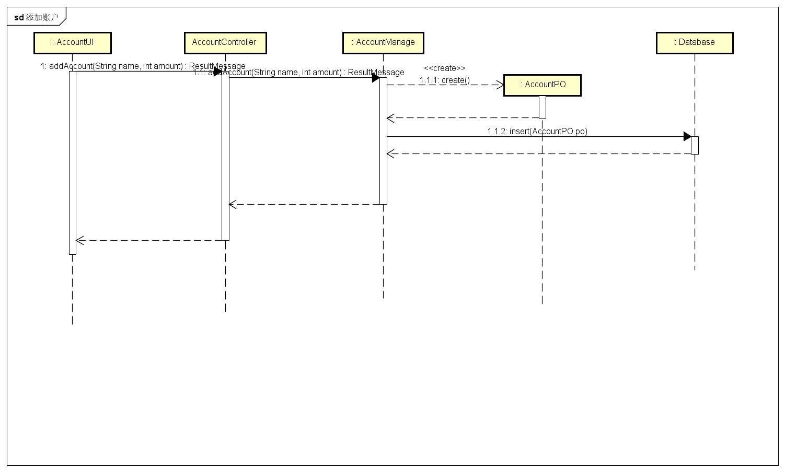
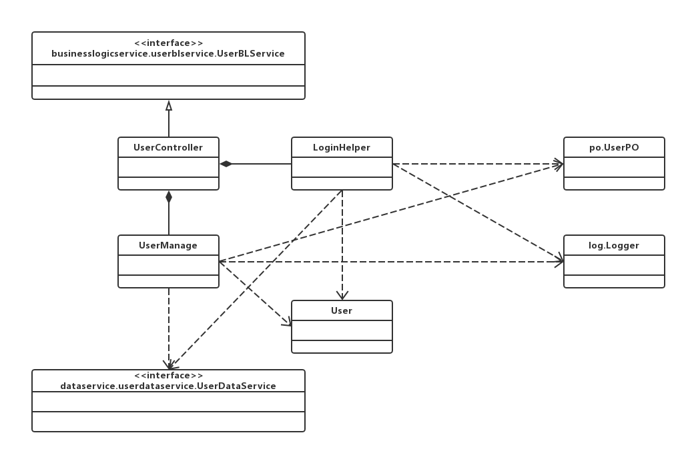

# 详细设计文档

[TOC]

## 引言

### 编制目的

本报告详细完成灯具照明行业进销存系统的详细设计，达到指导后续软件构造的目的，同时实现和测试人员及用户的沟通。本报告面向开发人员、测试人员及最终用户而编写，是了解系统的导航。

## 产品概述

参考灯具照明行业进销存系统用例文档和灯具照明行业进销存系统软件规格说明中对产品的概括描述。

## 体系结构设计概述

请参考进销存系统需求文档对体系结构设计的概述

## 结构视角

### 界面层的分解

### 业务逻辑层的分解

#### commoditybl模块

##### 模块概述

commoditybl模块承担的需求见需求规格说明文档功能需求及相关非功能需求。

commoditybl模块的职责及接口参见软件体系结构描述文档。

##### 整体结构

根据体系结构的设计，我们将系统分为展示层、业务逻辑层、数据层。每一层之间为了灵活性，我们添加接口，如CommodityBLService、CommodityDataService。为了隔离业务操作和控制操作，添加CommodityController。CommodityPO、CommodityListPO是作为商品、商品分类的持久化对象被添加到设计中。

commoditybl模块的设计如下图所示：

commoditybl模块各个类的职责如下表所示。

| 类                     | 职责                                       |
| --------------------- | ---------------------------------------- |
| CommodityController   | 负责对商品、商品管理逻辑操作进行服务                       |
| Commodity             | 商品、商品管理等与商品有关的领域模型对象，间接拥有商品、商品分类的所有信息，包括商品的价格、库存、名称、型号、编号等一切属性，以及商品分类的全部属性 |
| CommodityTree         | 全部的商品、商品分类信息的模型。拥有所有商品、商品分类、商品从属关系       |
| CommodityItem         | 商品的领域模型对象，拥有商品的一切信息。                     |
| CommodityCategoryItem | 商品分类的领域模型对象，拥有某个分类的一切信息，包括父分类、子分类列表或当前分类下商品列表。 |
| CommodityItemList     | 商品列表的领域对象模型，列表中所有商品信息以及所在分类              |

##### 模块内部类的接口规范

######CommodityController类的接口规范：

- | 名称                                   | 条目   | 详情                                       |
  | ------------------------------------ | ---- | ---------------------------------------- |
  |                                      | 语法   | `public CommodityTreeVO getCommodityTree ()` |
  | CommodityController.getCommodityTree | 前置条件 | Commodity对象已经被创建                         |
  |                                      | 后置条件 | 调用Commodity对象的同名同参数方法                    |
  |                                      | 语法   | `public ResultMessage addCommodity(CommodityItemVO newCommodity) ` |
  | Commodity.addCommodity               | 前置条件 | 输入任意非空名称、非空类型、已经存在的商品分类、大于零的数量以及大于零的成本价格，且Commodity对象已经被创建 |
  |                                      | 后置条件 | 调用Commodity对象的同名同参数方法                    |
  |                                      | 语法   | `public ArrayList<CommodityItemVO> findCommodityByName(String commodityName)` |
  | Commodity.findCommodityByName        | 前置条件 | 输入任意非空商品名称，且Commodity对象已经被创建             |
  |                                      | 后置条件 | 调用Commodity对象的同名同参数方法                    |
  |                                      | 语法   | `public CommodityItemVO findCommodityById(String id)` |
  | Commodity.findCommodityById          | 前置条件 | 输入不违反商品id格式的字符串，且Commodity对象已经被创建        |
  |                                      | 后置条件 | 调用Commodity对象的同名同参数方法                    |
  |                                      | 语法   | `public ResultMessage deleteCommodity(String id)` |
  | Commodity.deleteCommodity            | 前置条件 | 输入不违反商品id格式的字符串，且Commodity对象已经被创建        |
  |                                      | 后置条件 | 调用Commodity对象的同名同参数方法                    |
  |                                      | 语法   | `public ResultMessage modifyCommodity(CommodityItemVO commodity)` |
  | Commodity.modifyCommodity            | 前置条件 | 传入一个非空的CommodityVO对象，且Commodity对象已经被创建   |
  |                                      | 后置条件 | 调用Commodity对象的同名同参数方法                    |
  |                                      | 语法   | `public ResultMessage addCategory(CommodityCategoryItemVO newCategory)` |
  | Commodity.addCategory                | 前置条件 | 传入一个非空的、且与当前分类下其他分类名称不相同的CommodityCategoryItemVO，且Commodity对象已经被创建 |
  |                                      | 后置条件 | 调用Commodity对象的同名同参数方法                    |
  |                                      | 语法   | `public ResultMessage deleteCategory(int id)` |
  | Commodity.deleteCategory             | 前置条件 | 传入合法的分类id，且Commodity对象已经被创建              |
  |                                      | 后置条件 | 调用Commodity对象的同名同参数方法                    |
  |                                      | 语法   | `public ResultMessage modifyCategory(CommodityCategoryItemVO newCategory)` |
  | Commodity.modifyCategory             | 前置条件 | 传入合法的CommodityCategoryItemVO，且Commodity对象已经被创建 |
  |                                      | 后置条件 | 调用Commodity对象的同名同参数方法                    |

- 需要的服务

  | 服务名                                      | 服务           |
  | ---------------------------------------- | ------------ |
  | Commodity.getCommodityTree()             | 获取所有商品及其分类信息 |
  | Commodity.addCommodity(CommodityItemVO newCommodity) | 增加商品         |
  | Commodity.findCommodityByName(String commodityName) | 根据名称查找商品     |
  | Commodity.findCommodityById(String id)   | 根据id查找商品     |
  | Commodity.deleteCommodity(String id)     | 删除商品         |
  | Commodity.modifyCommodity(CommodityItemVO commodity) | 修改商品         |
  | Commodity.addCategory(CommodityCategoryItemVO newCategory) | 增加分类         |
  | Commodity.deleteCategory(String id)      | 删除分类         |
  | Commodity.modifyCategory(CommodityCategoryItemVO newCategory) | 修改分类         |

###### Commodity类的接口规范：

- | 名称                            | 条目   | 详情                                       |
  | ----------------------------- | ---- | ---------------------------------------- |
  |                               | 语法   | `public CommodityTreeVO getCommodityTree ()` |
  | Commodity.getCommodityTree    | 前置条件 | 无                                        |
  |                               | 后置条件 | 以商品树状结构返回所有商品、及其商品列表                     |
  |                               | 语法   | `public ResultMessage addCommodity(CommodityItemVO newCommodity) ` |
  | Commodity.addCommodity        | 前置条件 | 输入任意非空名称、非空类型、已经存在的商品分类、大于零的数量以及大于零的成本价格 |
  |                               | 后置条件 | 增加新的商品，更新持久化存储内容                         |
  |                               | 语法   | `public ArrayList<CommodityItemVO> findCommodityByName(String commodityName)` |
  | Commodity.findCommodityByName | 前置条件 | 输入任意非空商品名称                               |
  |                               | 后置条件 | 根据商品名称查找是否存在相应的商品，若存在匹配的商品则返回相应`ArrayList<CommodityItemVO>`对象，若不存在匹配项则返回`null` |
  |                               | 语法   | `public CommodityItemVO findCommodityById(String id)` |
  | Commodity.findCommodityById   | 前置条件 | 输入不违反商品id格式的字符串                          |
  |                               | 后置条件 | 根据商品id查找是否存在相应的商品，如果存在与输入id完全相同的产品，返回一个CommodityVO对象，否则返回null |
  |                               | 语法   | `public ResultMessage deleteCommodity(String id)` |
  | Commodity.deleteCommodity     | 前置条件 | 输入不违反商品id格式的字符串                          |
  |                               | 后置条件 | 如果存在与输入商品id对应的商品，删除商品。返回ResultMessage    |
  |                               | 语法   | `public ResultMessage modifyCommodity(CommodityItemVO commodity)` |
  | Commodity.modifyCommodity     | 前置条件 | 传入一个非空的CommodityVO对象                     |
  |                               | 后置条件 | 更新商品，返回ResultMessage                     |
  |                               | 语法   | `public ResultMessage addCategory(CommodityCategoryItemVO newCategory)` |
  | Commodity.addCategory         | 前置条件 | 传入一个非空的、且与当前分类下其他分类名称不相同的CommodityCategoryItemVO |
  |                               | 后置条件 | 更新商品分类，返回ResultMessage                   |
  |                               | 语法   | `public ResultMessage deleteCategory(String id)` |
  | Commodity.deleteCategory      | 前置条件 | 传入合法的分类id                                |
  |                               | 后置条件 | 删除商品分类，返回ResultMessage                   |
  |                               | 语法   | `public ResultMessage modifyCategory(CommodityCategoryItemVO newCategory)` |
  | Commodity.modifyCategory      | 前置条件 | 传入合法的CommodityCategoryItemVO             |
  |                               | 后置条件 | 更新商品分类，返回ResultMessage                   |

- 需要的服务

  | 服务名                                      | 服务                 |
  | ---------------------------------------- | ------------------ |
  | CommodityDataService.getAllCommodity()   | 得到目前存储的所有商品数据持久化对象 |
  | CommodityDataService.findById(String id) | 根据ID得到商品数据对象       |
  | CommodityDataService.add(CommodityItemPO po) | 插入单一商品持久化对象        |
  | CommodityDataService.update(CommodityItemPO po) | 更新单一商品持久化对象        |
  | CommodityDataService.deleteCommodity(String id) | 删除单一商品持久化对象        |
  | CommodityDataService.findByName(String name) | 根据名称查找多个持久化对象      |
  | CommodityDataService.getAllCommodityCategory() | 获取所有商品分类持久化对象      |
  | CommodityDataServcie.add(CommodityCategoryPO po) | 插入单一商品分类持久化对象      |
  | CommodityDataService.update(CommodityCategoryPO po) | 更新单一商品分类持久化对象      |
  | CommodityDataServcie.deleteCategory(int id) | 删除单一商品分类持久化对象      |

##### 业务逻辑层的动态模型

下图为添加商品的后，商品模块业务逻辑处理的相关对象之间的协作顺序

下图为删除商品后，商品模块业务逻辑处理的相关对象之间的协作顺序

下图为修改商品后，商品模块业务逻辑处理的相关对象之间的协作顺序

下图为查询商品时，商品模块业务逻辑处理的相关对象之间的协作顺序

下图为获取全部商品、分类信息时，商品模块业务逻辑处理的相关对象之间的协作顺序

下图为增加分类时，商品模块业务逻辑处理的相关对象的协作顺序

下图为修改分类时，商品模块业务逻辑处理的相关对象的协作顺序

下图为删除分类是，商品模块业务逻辑处理的相关对象的协作顺序

#### repositorybl模块

##### 模块概述

repositorybl模块承担的需求见需求规格说明文档功能需求及相关非功能需求。

repositorybl模块的职责及接口参见软件体系结构描述文档。

##### 整体结构

根据体系结构的设计，我们将系统分为展示层、业务逻辑层、数据层。每一层之间为了灵活性，我们添加接口，如RepositoryBLService、RepositoryDataService。为了隔离业务操作和控制操作，添加RepositoryController。ReposioryTable是作为当前库存表被添加到设计中、RepositoryChange是作为库存变化情况被添加到设计中。

repositorybl模块的设计如下图所示

repositorybl模块各个类的职责如下表所示。

| 类                    | 职责                           |
| -------------------- | ---------------------------- |
| RepositoryController | 负责为获取库存相关信息逻辑操作进行服务          |
| Repository           | 与库存有关的领域模型对象                 |
| RepositoryChange     | 库存变化有关领域模型对象，保存单次变化的全部信息     |
| RepositoryTable      | 当前库存全部信息有关领域对象模型，持有当前库存的全部信息 |

###### CommodityController类的接口规范：

- 提供的服务

  | 名称                                       | 条目   | 详情                                       |
  | ---------------------------------------- | ---- | ---------------------------------------- |
  |                                          | 语法   | `public ArrayList<RepositoryChangeVO> getRepositoryChanges (Date startDate, Date endDate)throws RemoteException` |
  | RepositoryController.getRepositoryChanges | 前置条件 | Repository对象已经被创建                        |
  |                                          | 后置条件 | 调用Repository中同名同参数方法                     |
  |                                          | 语法   | `public RepositoryTableVO getRepositoryTable()throws RemoteException` |
  | Repository.getRepositoryTable            | 前置条件 | Repository对象已经被创建                        |
  |                                          | 后置条件 | 调用Repository中的同名同参数方法                    |

- 需要的服务

  | 服务名                                      | 服务          |
  | ---------------------------------------- | ----------- |
  | Repository.getRepositoryChanges(Date startData, Date endDate) | 获取时间段内的库存变化 |
  | Repository.getRepositoryTable()          | 获取库存快照      |

###### Commodity类的接口规范：

- 提供的服务

  | 名称                              | 条目   | 详情                                       |
  | ------------------------------- | ---- | ---------------------------------------- |
  |                                 | 语法   | `public ArrayList<RepositoryChangeVO> getRepositoryChanges (Date startDate, Date endDate)` |
  | Repository.getRepositoryChanges | 前置条件 | 传入的两个Date对象不能为空                          |
  |                                 | 后置条件 | 返回startDate到endDate时间段内所有库存变化项           |
  |                                 | 语法   | `public RepositoryTableVO getRepositoryTable()` |
  | Repository.getRepositoryTable   | 前置条件 | 无                                        |
  |                                 | 后置条件 | 返回当前库存快照信息                               |

- 需要服务

  | 服务名                                      | 服务          |
  | ---------------------------------------- | ----------- |
  | RepositoryDataService.getRepositoryChanges(Date startData, Date endDate) | 获取时间段内的库存变化 |
  | RepositoryDataService.getRepositoryTable() | 获取库存快照      |

下图为库存查看时，库存模块业务逻辑处理的相关对象之间的协作顺序

下图为库存盘点时，库存模块业务逻辑处理的相关对象之间的协作顺序

#### Customercustomerbl模块

##### 模块概述

customerbl模块模块承担的需求见需求规格说明文档功能需求及相关非功能需求。

customerbl模块的职责及接口参见软件体系结构描述文档。

##### 整体结构

根据体系结构的设计，我们将系统分为展示层、业务逻辑层、数据层。每一层之间为了增加灵活性，我们会添加接口。比如展示层和业务逻辑层之间，我们添加了businesslogicservice.customerservice.CustomerBLService接口。业务逻辑层和数据层之间，我们添加了dataservice.customerdataservice.CustomerDataService接口。为了隔离业务逻辑层和逻辑控制职责，我们添加了CustomerController,这样CustomerController会将对促销策略的业务逻辑委托给Customer对象。CustomerPO是作为促销策略的持久化对象被添加到设计模型中去的。而Userinfo是根据依赖倒置原则，为了消除循环依赖而产生的接口。

customerbl模块的设计如图所示。

customerbl模块各个类的职责如下表。

| 模块                 | 职责                                       |
| ------------------ | ---------------------------------------- |
| CustomerController | 负责实现对客户管理界面所需要的服务                        |
| Customer           | 客户管理的领域模型对象，拥有一次客户管理（增删查改四种操作）所需要的信息：增加操作所需要的客户姓名、分类、等级、编号等信息；删除操作需要的客户编号；查找操作所需要的关键字；修改操作所需要的客户需要修改的。可以帮助完成客户管理界面所需要的服务 |

##### 模块内部的接口规范

###### CustomerController的接口规范

提供的服务

| 名称                                      | 条目   | 详情                                       |
| --------------------------------------- | ---- | ---------------------------------------- |
|                                         | 语法   | `public ArrayList<CustomerVO> getCustomerList ()` |
| CustomerController.getCustomerList      | 前置条件 | 已创建一个Customer领域对象                        |
|                                         | 后置条件 | 调用Customer领域对象的`getCustomerList`方法       |
|                                         | 语法   | `public boolean askForCreateCustomer(String userID)` |
| CustomerController.askForCreateCustomer | 前置条件 | 已创建一个Customer领域对象                        |
|                                         | 后置条件 | 调用Customer领域对象的`addCustomer`方法           |
|                                         | 语法   | `public ResultMessage createCustomer(CustomerVO)` |
| CustomerController.createCustomer       | 前置条件 | 已创建一个Customer领域对象，已添加姓名、分类、级别等信息，输入符合输入规则 |
|                                         | 后置条件 | 调用Customer领域对象的`createCustomer`方法        |
|                                         | 语法   | `public ResultMessage modifyAccount(CustomerVO vo)` |
| CustomerController.modifyCustomer       | 前置条件 | 已创建一个Customer领域对象，已输入新的信息且输入符合输入规则       |
|                                         | 后置条件 | 调用Customer领域对象的`modifyCustomer`方法        |
|                                         | 语法   | `public ArrayList<CustomerVO> findCustomer(String keyword)` |
| CustomerController.findCustomer         | 前置条件 | 已创建一个Customer领域对象，已输入关键字且输入符合输入规则        |
|                                         | 后置条件 | 调用Customer领域对象的`findCustomer`方法          |
|                                         | 语法   | `public ResultMessage deleteCustomer(CustomerVO vo)` |
| CustomerController.deleteCustomer       | 前置条件 | 已创建一个Customer领域对象                        |
|                                         | 后置条件 | 调用Customer领域对象的`deleteCustomer`方法        |
|                                         | 语法   | `public String getNextCustomerID()`      |
| CustomerController.getNextCustomerID    | 前置条件 | 已创建一个Customer领域对象                        |
|                                         | 后置条件 | 调用Customer领域对象的`getNextCustomerID`方法     |
|                                         | 语法   | `public boolean askForModifyCustomer(String userId) throws  RemoteException` |
| CustomerController.askForModifyCustomer | 前置条件 | 已创建一个Customer领域对象                        |
|                                         | 后置条件 | 调用Customer领域对象的`askForModifyCustomer`方法  |

需要的服务

| 服务名                                      | 服务              |
| ---------------------------------------- | --------------- |
| Customer.askForCreateCustomer(String userID) | 得到用户的可更改应收额度权限  |
| Customer.getCustomerList()               | 得到客户列表          |
| Customer.createCustomer(CustomerVO vo)   | 加入一个客户对象        |
| Customer.modifyCustomer(CustomerVO vo)   | 修改一个客户对象        |
| Customer.deleteCustomer(CustomerVO vo)   | 删除一个客户对象        |
| Customer.getNextCustomerID()             | 得到一个新的客户ID      |
| Customer.findCustomer(String keyword)    | 根据关键字查找得到多个客户对象 |
| Customer.askForModifyCustomer(String userId) | 得到用户的可更改应收额度权限  |

###### Customer的接口规范

提供的服务

| 名称                            | 条目   | 详情                                       |
| ----------------------------- | ---- | ---------------------------------------- |
|                               | 语法   | `public boolean askForCreateCustomer(String userId) throws RemoteException` |
| Customer.askForCreateCustomer | 前置条件 | 在客户管理进程中                                 |
|                               | 后置条件 | 根据权限允许增加客户的相应信息                          |
|                               | 语法   | `public ArrayList<CustomerVO> getCustomerList () throws RemoteException` |
| Customer.getCustomerList      | 前置条件 | 在客户管理进程中                                 |
|                               | 后置条件 | 返回所有的客户列表                                |
|                               | 语法   | `public ResultMessage createCustomer(CustomerVO vo) throws RemoteException` |
| Customer.createCustomer       | 前置条件 | 在增加客户进程中，已经过askForCreateCustomer         |
|                               | 后置条件 | 增加一个客户                                   |
|                               | 语法   | `public ResultMessage modifyCustomer(CustomerVO customer) throws RemoteException` |
| Customer.modifyCustomer       | 前置条件 | 已经askForModifyCustomer                   |
|                               | 后置条件 | 修改一个客户信息                                 |
|                               | 语法   | `public ResultMessage deleteCustomer(CustomerVO customer) throws RemoteException` |
| Customer.deleteCustomer       | 前置条件 | 在客户管理进程中                                 |
|                               | 后置条件 | 更改一个客户信息                                 |
|                               | 语法   | `public int getNextCustomerID() throws  RemoteException` |
| Customer.getNextCustomerID    | 前置条件 | 已经askForCreateCustomer                   |
|                               | 后置条件 | 得到下一个客户编号                                |
|                               | 语法   | `public ArrayList<CustomerVO> findCustomer(String keyword) throws RemoteException` |
| Customer.findCustomer         | 前置条件 | 在客户管理进程中                                 |
|                               | 后置条件 | 得到符合条件的客户                                |
|                               | 语法   | `public boolean askForModifyCustomer(String userId) throws  RemoteException` |
| Customer.askForModifyCustomer | 前置条件 | 在客户管理进程中                                 |
|                               | 后置条件 | 得到是否可以修改客户的应收额度                          |

需要的接口

| 服务名                                      | 服务                   |
| ---------------------------------------- | -------------------- |
| CustomerDataService.getAllCustomer()     | 得到所有的客户持久化对象列表       |
| CustomerDataService.insertCustomer(CustomerPO po) | 插入一个持久化对象            |
| CustomerDataService.updateCustomer(CustomerPO po) | 更新一个持久化对象            |
| CustomerDataService.deleteCustomer(CustomerPO po) | 删除一个持久化对象            |
| CustomerDataService.getNextCustomerID()  | 得到下一个客户编号            |
| CustomerDataService.findCustomer(String keyword) | 根据关键字查找到多个符合条件的持久化对象 |
| UserDataService.isSupreme(String userId) | 根据用户id得到其是否是最高权限     |

##### 业务逻辑层的动态模型

下图为用户输入新客户的姓名、分类、级别等信息后，客户业务逻辑处理的相关对象之间的协作

下图为用户删除账户时账户业务逻辑处理的相关对象之间的协作

下图为用户查查找账户时账户业务逻辑处理的相关对象之间的协作

下图为用户修改账户时账户业务逻辑处理的相关对象之间的协作

#### accountbl 模块

##### 模块概述

accountbl模块承担的需求参见需求规格说明文档功能需求及相关非功能需求

accountbl模块的职责及接口参见软件系统结构描述文档accountbl模块的接口规范

##### 整体结构

根据体系结构的设计，我们将系统分为展示层、业务逻辑层、数据层。每一层之间为了增加灵活性，我们会添加接口。比如展示层和业务逻辑层之间，我们添加bussinesslogicservice.accountblservice.AccountBLService接口。业务逻辑层和数据层之间添加dataservice. AccountDataService接口。为了隔离业务逻辑职责和逻辑控制职责，我们增加了AccountController，这样AccountlController会将对账户管理的逻辑业务处理委托给AccountManage对象。AccountPO是作为账户信息的持久化对象被添加到设计模型中去的。

accountbl 模块的设计如下图

accountbl 模块各个类的职责如下表

| 模块                | 职责                                       |
| ----------------- | ---------------------------------------- |
| AccountController | 负责实现对账户管理界面所需要的服务                        |
| AccountManage     | 账户管理的领域模型对象，拥有一次账户管理（增删查改四种操作）所需要的信息：增加操作所需要的账户名称、金额；删除操作需要的账户名；查找操作所需要的关键字；修改操作所需要的账户需要修改的名称。可以帮助完成账户管理界面所需要的服务 |
| Account           | 账户的领域模型对象，拥有账户的数据（名称、金额、id）， 拥有对更新账户信息的方法 |

##### 模块内部的接口规范

###### AccountController的接口规范

| 名称                               | 条目   | 详情                                       |
| -------------------------------- | ---- | ---------------------------------------- |
|                                  | 语法   | `public ArrayList<AccountVO> getAccountList ()` |
| AccountController.getAccountList | 前置条件 | 已创建一个AccountManage领域对象                   |
|                                  | 后置条件 | 调用AccountManage领域对象的`getAccountList`方法   |
|                                  | 语法   | `public ResultMessage addAccount(String name, int amount)` |
| AccountController.addAccount     | 前置条件 | 已创建一个AccountManage领域对象，已添加名称和金额，输入符合输入规则 |
|                                  | 后置条件 | 调用AccountManage领域对象的`addAccount`方法       |
|                                  | 语法   | `public ArrayList<AccountVO> findAccounts(String keyword)` |
| AccountController.findAccounts   | 前置条件 | 已创建一个AccountManage领域对象，已输入关键字且输入符合输入规则   |
|                                  | 后置条件 | 调用AccountManage领域对象的`findAccount`方法      |
|                                  | 语法   | `public AccountVO getAccount(String name)` |
| AccountController.getAccount     | 前置条件 | 已创建一个AccountManage领域对象，已输入名称且输入符合输入规则    |
|                                  | 后置条件 | 调用AccountManage领域对象的`getAccount`方法       |
|                                  | 语法   | `public ResultMessage deleteAccount(String name)` |
| AccountController.deleteAccount  | 前置条件 | 已创建一个AccountManage领域对象，已输入名称且输入符合输入规则    |
|                                  | 后置条件 | 调用AccountManage领域对象的`deleteAccount`方法    |
|                                  | 语法   | `public ResultMessage modifyAccount(String oldName, String newName)` |
| AccountController.modifyAccount  | 前置条件 | 已创建一个AccountManage领域对象，已输入新的名称且输入符合输入规则  |
|                                  | 后置条件 | 调用AccountManage领域对象的`modifyAccount`方法    |

需要的服务

| 服务名                                      | 服务              |
| ---------------------------------------- | --------------- |
| AccountManage.addAccount(String name, String amount) | 加入一个账户对象        |
| AccountManage.getAccountList()           | 得到账户列表          |
| AccountManage.modifyAccount(String oldName, String newName) | 修改一个账户对象        |
| AccountManage.deleteAccount(String name) | 删除一个账户对象        |
| AccountManage.getAccount(String name)    | 根据名称得到一个账户对象    |
| AccountManage.findAccounts(String keyword) | 根据关键字查找得到多个账户对象 |

###### AccountManage的接口规范

| 名称                           | 条目   | 详情                                       |
| ---------------------------- | ---- | ---------------------------------------- |
|                              | 语法   | `public ArrayList<AccountVO> getAccountList ()` |
| AccountManage.getAccountList | 前置条件 | 得到数据                                     |
|                              | 后置条件 | 返回账户列表                                   |
|                              | 语法   | `public ResultMessage addAccount(String name, int amount)` |
| AccountManage.addAccount     | 前置条件 | 金额，名称符合输入规则                              |
|                              | 后置条件 | 增加新的账户，更新持久化存储内容                         |
|                              | 语法   | `public ArrayList<AccountVO> findAccount(String keyword)` |
| AccountManage.findAccount    | 前置条件 | 输入有效的关键字                                 |
|                              | 后置条件 | 根据关键字查找是否存在相应的账户，若存在匹配的账户则返回相应`Account`对象，若不存在匹配项则返回`null` |
|                              | 语法   | `public AccountVO getAccount(String name)` |
| AccountManage.getAccount     | 前置条件 | 输入有效的账户名称                                |
|                              | 后置条件 | 得到数据，返回名称对应的`Account`对象                  |
|                              | 语法   | `public ResultMessage deleteAccount(String name)` |
| AccountManage.deleteAccount  | 前置条件 | 输入有效的账户名称                                |
|                              | 后置条件 | 删除相应的账户，更新持久化存储内容                        |
|                              | 语法   | `public ResultMessage modifyAccount(String oldName, String newName)` |
| AccountManage.modifyAccount  | 前置条件 | 输入有效的账户名称                                |
|                              | 后置条件 | 更改所修改的账户名称，更新持久化存储的数据                    |

需要的服务（需接口）

| 服务名                                      | 服务                 |
| ---------------------------------------- | ------------------ |
| AccountDataService.getAll()              | 得到目前存储的所有账户的持久化对象  |
| AccountDataService.get(String name)      | 根据name得到单一持久对象     |
| AccountDataService.insert(AccountPO po)  | 插入单一持久化对象          |
| AccountDataService.update(AccountPO po)  | 更新单一持久化对象          |
| AccountDataService.delete(AccountPO po)  | 删除单一持久化对象          |
| AccountDataService.find(String keyword)  | 根据关键字查找多个持久化对象     |
| DataBaseFactory.getAccountDataBase       | 得到Account数据库的服务的引用 |
| Logger.add(OPType op, String itemName, String id) | 记录日志               |

##### 业务逻辑层的动态模型

下图为用户输入新账户的名称和金额后，账户业务逻辑处理的相关对象之间的协作

下图为用户删除账户时账户业务逻辑处理的相关对象之间的协作

下图为用户查查找账户时账户业务逻辑处理的相关对象之间的协作

下图为用户修改账户时账户业务逻辑处理的相关对象之间的协作

#### userbl模块

##### 模块概述

userbl模块承担的需求参见需求规格说明文档功能需求及相关非功能需求

userbl模块的职责及接口参见软件系统结构描述文档userbl模块的接口规范

##### 整体结构

根据体系结构的设计，我们将系统分为展示层、业务逻辑层、数据层。每一层之间为了增加灵活性，我们会添加接口。比如展示层和业务逻辑层之间，我们添加bussinesslogicservice.userblservice.UserBLService接口。业务逻辑层和数据层之间添加dataservice. UserDataService接口。为了隔离业务逻辑职责和逻辑控制职责，我们增加了UserController，这样UserController会将对用户管理的逻辑业务处理委托给UserManage对象，将用户登录登出的逻辑业务处理委托给LoginHelper对象。UserPO是作为用户信息的持久化对象被添加到设计模型中去的。

userbl模块的设计如下图

userbl 模块各个类的职责如下表

| 模块             | 职责                                       |
| -------------- | ---------------------------------------- |
| UserController | 负责实现对账户管理界面所需要的服务                        |
| UserManage     | 账户管理的领域模型对象，拥有一次账户管理（增删查改四种操作）所需要的信息：增加操作所需要的账户名称、金额；删除操作需要的账户名；查找操作所需要的关键字；修改操作所需要的账户需要修改的名称。可以帮助完成账户管理界面所需要的服务 |
| LoginHelper    | 负责实现对应于登录界面所需要的服务                        |
| Logger         | 负责实现对登录以及用户管理的操作的记录                      |
| User           | 用户的领域模型对象，拥有用户对应的数据以及对用户数据进行更改、匹配的方法。    |

##### 模块内部的接口规范

###### UserController的接口规范

| 名称                            | 条目   | 详情                                       |
| ----------------------------- | ---- | ---------------------------------------- |
|                               | 语法   | `public ArrayList<UserVo> getUserList ()` |
| UserController.getUserList    | 前置条件 | 创建了一个UserManage领域模型对象                    |
|                               | 后置条件 | 调用UserManage领域对象的getUserList方法           |
|                               | 语法   | `public ResultMessage addUser(UserVo vo)` |
| UserController.addUser        | 前置条件 | 创建了一个UserManage领域模型对象，且输入符合规则            |
|                               | 后置条件 | 调用UserManage领域对象的addUser方法               |
|                               | 语法   | `public ArrayList<UserVO> findUsers(String keyword)` |
| UserController.findUsers      | 前置条件 | 创建了一个UserManage领域模型对象，且输入符合规则            |
|                               | 后置条件 | 调用UserManage领域对象的findUsers方法             |
|                               | 语法   | `public UserVO getUser(String id)`       |
| UserController.getUser        | 前置条件 | 创建了一个UserManage领域模型对象，且输入符合规则            |
|                               | 后置条件 | 调用UserManage领域对象的getUser方法               |
|                               | 语法   | `public ResultMessage deleteUser(String ID)` |
| UserController.deleteUser     | 前置条件 | 创建了一个UserManage领域模型对象，且输入符合规则            |
|                               | 后置条件 | 调用UserManage领域对象的deleteUser方法            |
|                               | 语法   | `public void modifyUser(UserVO vo)`      |
| UserController.modifyUser     | 前置条件 | 创建了一个UserManage领域模型对象，且输入符合规则            |
|                               | 后置条件 | 调用UserManage领域对象的modifyUser方法            |
|                               | 语法   | `public String generateJobNum(UserVO vo)` |
| UserController.generateJobNum | 前置条件 | 创建了一个UserManage领域模型对象，且输入符合规则            |
|                               | 后置条件 | 调用UserManage领域对象的generateJobNum方法        |
|                               | 语法   | `public ResultMessage login(String username, String password)` |
| UserController.logIn          | 前置条件 | 创建了一个LoginHelper领域模型对象，且输入符合规则           |
|                               | 后置条件 | 调用LoginHelper领域对象的login方法                |
|                               | 语法   | `public ResultMessage logOut(UserVo vo)` |
| UserController.logOut         | 前置条件 | 创建了一个LoginHelper领域模型对象，且输入符合规则           |
|                               | 后置条件 | 调用LoginHelper领域对象的logout方法               |

- 需要的服务（需接口）

参见UserManage和LoginHelper的供接口

###### UserManage和LoginHelper的接口规范

| 名称                        | 条目   | 详情                                       |
| ------------------------- | ---- | ---------------------------------------- |
|                           | 语法   | `public ArrayList<UserVo> getUserList ()` |
| UserManage.getUserList    | 前置条件 | 得到数据                                     |
|                           | 后置条件 | 返回用户列表                                   |
|                           | 语法   | `public ResultMessage addUser(UserVo vo)` |
| UserManage.addUser        | 前置条件 | 传入有效的对象                                  |
|                           | 后置条件 | 增加新的用户，更新持久化存储内容                         |
|                           | 语法   | `public ArrayList<UserVO> findUsers(String keyword)` |
| UserManage.findUsers      | 前置条件 | 输入有效的关键字                                 |
|                           | 后置条件 | 根据关键字查找是否存在相应的用户，若存在匹配的用户则返回相应对象列表，若不存在匹配项则返回空列表 |
|                           | 语法   | `public UserVO getUser(String id)`       |
| UserManage.getUser        | 前置条件 | 输入有效的用户名                                 |
|                           | 后置条件 | 得到数据，返回名称对应的对象                           |
|                           | 语法   | `public ResultMessage deleteUser(String ID)` |
| UserManage.deleteUser     | 前置条件 | 输入有效的用户ID                                |
|                           | 后置条件 | 删除相应的用户，更新持久化存储内容                        |
|                           | 语法   | `public void modifyUser(UserVO vo)`      |
| UserManage.modifyUser     | 前置条件 | 输入有效的用户对象                                |
|                           | 后置条件 | 更改所修改的用户信息，更新持久化存储的数据                    |
|                           | 语法   | `public String generateJobNum(UserVO vo)` |
| UserManage.generateJobNum | 前置条件 | 用户请求添加新的账号                               |
|                           | 后置条件 | 返回相应字符串                                  |
|                           | 语法   | `public ResultMessage login(String username, String password)` |
| LoginHelper.logIn         | 前置条件 | password符合输入规则                           |
|                           | 后置条件 | 查找是否存在相应的User，根据输入的password返回登陆验证的结果     |
|                           | 语法   | `public ResultMessage logOut(UserVo vo)` |
| LoginHelper.logOut        | 前置条件 | 传入有效的UserVO对象                            |
|                           | 后置条件 | 查找是否存在相应的User，根据传入的对象返回登出结果              |

- 需要的服务（需接口）

| 服务名                                      | 服务                 |
| ---------------------------------------- | ------------------ |
| UserDataService.getAll()                 | 得到目前存储的所有用户的持久化对象  |
| UserDataService.get(String username)     | 根据username得到单一持久对象 |
| UserDataService.insert(UserPO po)        | 插入单一持久化对象          |
| UserDataService.update(UserPO po)        | 更新单一持久化对象          |
| UserDataService.delete(UserPO po)        | 删除单一持久化对象          |
| UserDataService.findUsers(String keyword) | 根据关键字查找多个持久化对象并返回  |
| DataBaseFactory.getUserDataBase          | 得到Account数据库的服务的引用 |
| Logger.add(OPType type, String itemName, String id) | 记录用户改动（增删改）日志      |

##### 业务逻辑层的动态模型

下图为用户登录时登录业务逻辑处理的相关对象之间的协作

下图为用户登出时登录业务逻辑处理的相关对象之间的协作

#### logbl 模块

##### 模块概述

lobgl模块承担的需求参见需求规格说明文档功能需求及相关非功能需求

logbl模块的职责及接口参见软件系统结构描述文档log模块的接口规范

##### 整体结构

根据体系结构的设计，我们将系统分为展示层、业务逻辑层、数据层。每一层之间为了增加灵活性，我们会添加接口。比如展示层和业务逻辑层之间，我们添加bussinesslogicservice.logblservice.LogBLService接口。业务逻辑层和数据层之间添加dataservice. LogDataService接口。为了隔离业务逻辑职责和逻辑控制职责，我们增加了AccountController，这样AccountlController会将对账户管理的逻辑业务处理委托给AccountManage对象。AccountPO是作为账户信息的持久化对象被添加到设计模型中去的。

logbl 模块的设计如下图

logbl 模块各个类的职责如下表

| 模块            | 职责                                       |
| ------------- | ---------------------------------------- |
| LogController | 负责实现对查看日志界面所需要的服务                        |
| Log           | 日志查看的领域模型对象，拥有一次日志查看所需要的信息：日志筛选的条件。可以帮助完成账户管理界面所需要的服务 |
| Logger        | 负责提供其他模块的进行日志记录                          |
| SimpleLogger  | 负责实现Logger接口的功能，即日志记录                    |

##### 模块内部的接口规范

###### LogController的接口规范

| 名称                       | 条目   | 详情                                       |
| ------------------------ | ---- | ---------------------------------------- |
|                          | 语法   | `public ArrayList<LogVo> getLogListByTime (Date from, Date to)` |
| LogController.getLogList | 前置条件 | 已创建一个Log领域对象                             |
|                          | 后置条件 | 调用Log领域对象的getLogList                     |
|                          | 语法   | `public ArrayList<LogVO> findLogs(LogFilter filter)` |
| LogController.findLogs   | 前置条件 | 已创建一个Log领域对象，并传入有效的LogFilter对象           |
|                          | 后置条件 | 调用Log领域对象的findLogs方法                     |

LogController需要的服务见Log的接口规范

###### Log的接口规范

| 名称             | 条目   | 详情                                       |
| -------------- | ---- | ---------------------------------------- |
|                | 语法   | `public ArrayList<LogVo> getLogListByTime (long from, long to)` |
| Log.getLogList | 前置条件 | 输入有效的时间范围                                |
|                | 后置条件 | 根据时间范围返回日志列表                             |
|                | 语法   | `public ArrayList<LogVO> findLogs(LogFilter fiter)` |
| Log.findLogs   | 前置条件 | 传入有效的LogFilter对象                         |
|                | 后置条件 | 根据LogFilter中的属性返回对应的LogVO列表              |

需要的服务（需接口）

| 服务名                                      | 服务                |
| ---------------------------------------- | ----------------- |
| LogDataService.findByTime(Date from, Date to) | 得到目前存储的所有用户的持久化对象 |
| LogDataService.find(LogFilter filter)    | 根据filter得到单一持久对象  |
| LogDataService.insert(LogPO po)          | 插入单一持久化对象         |

###### Logger的接口规范

| 名称         | 条目   | 详情                                       |
| ---------- | ---- | ---------------------------------------- |
|            | 语法   | `public void add(OPType type, String itemName, String id);` |
| Logger.add | 前置条件 | 输入符合规范                                   |
|            | 后置条件 | 根据时间范围返回日志列表                             |
|            | 语法   | `public void add(OPType type, Describable description);` |
| Logger.add | 前置条件 | 输入符合规范                                   |
|            | 后置条件 | 根据LogFilter中的属性返回对应的LogVO列表              |

##### 业务逻辑层的动态模型

下图为查看日志时，日志业务逻辑处理的相关对象之间的协作

下图为筛选日志时，日志业务逻辑处理的相关对象之间的协作

#### initbl 模块

##### 模块概述

initbl模块承担的需求参见需求规格说明文档功能需求及相关非功能需求

initbl模块的职责及接口参见软件系统结构描述文档initbl模块的接口规范

##### 整体结构

根据体系结构的设计，我们将系统分为展示层、业务逻辑层、数据层。每一层之间为了增加灵活性，我们会添加接口。比如展示层和业务逻辑层之间，我们添加bussinesslogicservice.initblservice.AccountBLService接口。业务逻辑层和数据层之间添加dataservice. InitDataService接口。为了隔离业务逻辑职责和逻辑控制职责，我们增加了InitController，这样InitController会将对期初建账的逻辑业务处理委托给Init对象。InitPO是作为期初信息的持久化对象被添加到设计模型中去的。

initbl 模块的设计如下图

initbl 模块各个类的职责如下表

| 模块               | 职责                                       |
| ---------------- | ---------------------------------------- |
| InitController   | 负责实现对期初建账界面所需要的服务                        |
| Init             | 期初建账的领域模型对象，拥有一次期初建账的期初信息                |
| InitCustomerList | 负责实现期初建账时对期初客户信息进行管理，拥有完整的客户信息列表以及对这些信息转换成VO和PO的方法 |
| InitAccountList  | 负责实现期初建账时对期初账户信息进行管理，拥有完整的账户信息列表以及对这些信息转换成VO和PO的方法 |
| InitCommodity    | 负责实现期初建账时对期初商品信息进行管理，拥有完整的商品信息（树状结构）以及对这些信息转换成VO和PO的方法 |

##### 模块内部的接口规范

###### InitController的接口规范

| 名称                            | 条目   | 详情                                       |
| ----------------------------- | ---- | ---------------------------------------- |
|                               | 语法   | `public InitVO getInitInfo()`            |
| InitController.getInitInfo    | 前置条件 | 已经创建了一个Init的领域对象                         |
|                               | 后置条件 | 调用Init领域对象的`getInitInfo()`方法             |
|                               | 语法   | `public ResultMessage commit(InitVO vo)` |
| InitController.commit         | 前置条件 | 已经创建了一个Init的领域对象                         |
|                               | 后置条件 | 调用Init领域对象的`commit(InitVO vo)`方法         |
|                               | 语法   | `public ArrayList<InitVO> getHistoryInfo()` |
| InitController.getHistoryInfo | 前置条件 | 已经创建了一个Init的领域对象                         |
|                               | 后置条件 | 调用Init领域对象的`getHistoryInfo()`方法          |

InitController需要的服务见Init的接口规范

###### Init的接口规范

| 名称                  | 条目   | 详情                                       |
| ------------------- | ---- | ---------------------------------------- |
|                     | 语法   | `public InitVO getInitInfo()`            |
| Init.getInitInfo    | 前置条件 | 用户请求期初建账                                 |
|                     | 后置条件 | 得到历史数据，返回根据所得数据生成的对象（该对象包括期初的一切信息）       |
|                     | 语法   | `public ResultMessage commit(InitVO vo)` |
| Init.commit         | 前置条件 | 传入的对象不为`null`，且包含的信息正确有效                 |
|                     | 后置条件 | 更新持久化存储内容，替换正在使用的账目对象                    |
|                     | 语法   | `public ArrayList<InitVO> getHistoryInfo()` |
| Init.getHistoryInfo | 前置条件 | 用户请求查看历史期初信息                             |
|                     | 后置条件 | 返回对应对象的列表                                |

需要的服务（需接口）

| 服务名                                   | 服务           |
| ------------------------------------- | ------------ |
| InitDataService.newAccount(InitPO po) | 存储单一持久化对象    |
| InitDataService.getInitInfo()         | 得到存储的多个持久化对象 |
| CommodityInfo.getCommodityTree()      | 得到商品信息树      |
| AccountInfo.getAccountList()          | 得到账户信息       |
| CustomerInfo.getCustomerList()        | 得到商品信息       |

#### promotionbl模块

##### 模块概述

promotionbl模块承担的需求见需求规格说明文档功能需求及相关非功能需求。

promotionbl模块的职责及接口参见软件体系结构描述文档。

##### 整体结构

根据体系结构的设计，我们将系统分为展示层、业务逻辑层、数据层。每一层之间为了增加灵活性，我们会添加接口，比如businesslogicservice.promotionservice.PromotionBLService和dataservice.promotiondataservice.PromotionDataService接口。为了隔离业务逻辑层和逻辑控制职责，我们添加了PromotionController,这样PromotionController会将对促销策略的业务逻辑委托给Promotion对象。PromotionPO是作为促销策略的持久化对象被添加到设计模型中去的。

promotionbl模块的设计如图所示

promotionbl模块个各类的职责如表所示

| 模块                  | 职责                                       |
| ------------------- | ---------------------------------------- |
| PromotionController | 负责实现管理促销策略界面所需要的服务                       |
| Promotion           | 促销策略的领域模型对象，拥有促销策略的所有信息，包括促销策略类型、降价额度、代金券等信息，可以帮助完成管理促销策略界面所需要的服务 |

##### 模块内部类的接口规范

###### PromotionController的接口规范

- 提供的接口

| 名称                                   | 条目   | 详情                                       |
| ------------------------------------ | ---- | ---------------------------------------- |
|                                      | 语法   | `public ArrayList<PromotionVO> getPromotionList()` |
| PromotionController.getPromotionList | 前置条件 | 已创建一个Promotion领域对象                       |
|                                      | 后置条件 | 调用Promotion领域对象的 getPromotionList方法      |
|                                      | 语法   | `public PromotionVO create(int tag)`     |
| PromotionController.create           | 前置条件 | 已创建一个Promotion领域对象，已添加促销策略的类型            |
|                                      | 后置条件 | 调用Promotion领域对象的create方法                 |
|                                      | 语法   | `public ResultMessage commit(PromotionVO vo)` |
| PromotionController.commit           | 前置条件 | 已创建一个Promotion领域对象，已添加要提交的促销策略的信息        |
|                                      | 后置条件 | 调用Promotion领域对象的commit方法                 |
|                                      | 语法   | `public ResultMessage modify(PromotionVO vo)` |
| PromotionController.modify           | 前置条件 | 已创建一个Promotion领域对象，已经添加要修改的促销策略信息        |
|                                      | 后置条件 | 调用Promotion领域对象的modify方法                 |
|                                      | 语法   | `public ResultMessage delete(PromotionVO vo)` |
| PromotionController.delete           | 前置条件 | 已创建一个Promotion领域对象，已经添加要删除的促销策略          |
|                                      | 后置条件 | 调用Promotion领域对象的delete方法                 |

- 需要的接口

| 服务名                        | 服务              |
| -------------------------- | --------------- |
| Promotion.getPromotion     | 得到一个促销策略的对象     |
| Promotion.getPromotionList | 得到所有促销策略的       |
| Promotion.create           | 新建一个空的促销策略      |
| Promotion.getBenefitsPlan  | 得到满足筛选条件的所有促销策略 |
| Promotion.commit           | 保存一个新建的促销策略     |
| Promotion.modify           | 保存一个修改后的促销策略    |
| Promotion.delete           | 删除一个促销策略        |

###### Promotion的接口规范

| 名称                         | 条目   | 详情                                       |
| :------------------------- | ---- | ---------------------------------------- |
|                            | 语法   | `public ArrayList<PromotionVO> getPromotionList()` |
| Promotion.getPromotionList | 前置条件 | 用户已登录                                    |
|                            | 后置条件 | 返回含有所有促销策略的列表的项                          |
|                            | 语法   | `public ArrayList<PromotionVO> getBenefitsPlan(int customerLevel, ArrayList<String> CommmodityList,double total)` |
| Promotion.getBenefitsPlan  | 前置条件 | 所有筛选条件合法                                 |
|                            | 后置条件 | 返回该销售单据所满足的优惠策略的值对象列表                    |
|                            | 语法   | `public PromotionVO create()`            |
| Promotion.create           | 前置条件 | 无                                        |
|                            | 后置条件 | 返回内容为空的促销策略的值对象                          |
|                            | 语法   | `public ResultMessage commit(PromotionVO vo)` |
| Promotion.commit           | 前置条件 | 已添加要提交的促销策略的信息                           |
|                            | 后置条件 | 持久化更新相关的对象的数据                            |
|                            | 语法   | `public ResultMessage modify(PromotionVO vo)` |
| Promotion.modify           | 前置条件 | 已添加修改好的促销策略的信息                           |
|                            | 后置条件 | 持久化更新相关的对象的数据                            |
|                            | 语法   | `public ResultMessage delete(PromotionVO vo)` |
| Promotion.delete           | 前置条件 | 用户有正在查看的销售策略                             |
|                            | 后置条件 | 删除该销售策略，持久化更新相关的对象的数据                    |

- 需要的接口

| 服务名                                   | 服务           |
| :------------------------------------ | ------------ |
| PromotionDataService.getPromotion     | 返回一个赤计划对象    |
| PromotionDataService.getPromotionList | 返回所有单据的持久化对象 |
| PromotionDataService.insert           | 插入单一持久化对象    |
| PromotionDataSerivice.update          | 更新单一持久化对象    |
| PromotionDataService.delete           | 删除单一持久化对象    |

##### 业务逻辑层的动态模型

下图为查看促销策略时促销策略业务逻辑处理的相关对象间的协作

下图为新建促销策略时促销策略业务逻辑处理的相关对象间的协作

下图为修改促销策略时促销策略业务逻辑处理的相关对象间的协作

下图为删除销售策略时促销策略业务逻辑处理的相关对象间的协作

#### Approval模块

##### 模块概述

approvalbl模块承担的需求见需求规格说明文档功能需求及相关非功能需求。

approvalbl模块的职责及接口参见软件体系结构描述文档。

##### 整体结构

根据体系结构的设计，我们将系统分为展示层、业务逻辑层、数据层。每一层之间为了增加灵活性，我们会添加接口，比如businesslogicservice.approvalblservice.ApprovalBLService和dataservice.approvaldataservice.ApprovalDataService接口。为了隔离业务逻辑层和逻辑控制职责，我们添加了ApprovalController,这样ApprovalController会将对促销策略的业务逻辑委托给Approval对象。

##### 模块内部类的接口规范

###### ApprovalController的接口规范

- 提供的接口

| 名称                                 | 条目   | 详情                                       |
| ---------------------------------- | ---- | ---------------------------------------- |
|                                    | 语法   | `public ArrayList<HistoryDocVO> getDocumentList()` |
| ApprovalController.getDocumentList | 前置条件 | 已经创建一个Approval领域对象                       |
|                                    | 后置条件 | 调用Approval领域对象的getDocumentList方法         |
|                                    | 语法   | `public ResultMessage approve(HistoryDocVO vo)` |
| ApprovalController.approve         | 前置条件 | 已经创建一个Approval领域对象，已添加用户要通过的单据           |
|                                    | 后置条件 | 调用Approval领域对象approve方法                  |
|                                    | 语法   | `public ResultMessage approveAll(ArrayList<HistoryDocVO> voList)` |
| ApprovalController.approveAll      | 前置条件 | 已经创建一个Approval领域对象，已添加用户要通过的单据           |
|                                    | 后置条件 | 调用Approval领域对象的approvalALl方法             |
|                                    | 语法   | `public ResultMessage reject(HistoryDocVO vo)` |
| ApprovalController.reject          | 前置条件 | 已经创建一个Approval领域对象，已添加用户要驳回的单据           |
|                                    | 后置条件 | 调用Approval领域对象的reject方法                  |
|                                    | 语法   | `public ResultMessage save(HistoryDocVO vo)` |
| ApprovalController.save            | 前置条件 | 已经创建一个Approval领域对象，已添加用户要保存的修改好的单据       |
|                                    | 后置条件 | 调用Approval领域对象的save方法                    |
|                                    | 语法   | `public ResultMessage saveAndApprove(HistoryDocVO vo)` |
| ApprovalController.saveAndApprove  | 前置条件 | 已经创建一个Approval领域对象，已添加用户要保存的修改好并计划通过的单据  |
|                                    | 后置条件 | 调用Approval领域对象的saveAndApprove方法          |

- 需要的接口

| 服务名                      | 服务             |
| ------------------------ | -------------- |
| Approval.getDocumentList | 返回所有待审批的单据的值对象 |
| Approval.approve         | 通过一个单据         |
| Approval.approveAll      | 通过选择的所有单据      |
| Approval.reject          | 驳回一个单据         |
| Approval.save            | 保存一个修改过的单据     |
| Approval.saveAndApprove  | 保存并通过一个修改过的单据  |

###### Approval的接口规范

- 提供的接口（供接口）

| 名称                       | 条目   | 详情                                       |
| ------------------------ | ---- | ---------------------------------------- |
|                          | 语法   | `public ArrayList<HistoryDocVO> getDocumentList()` |
| Approval.getDocumentList | 前置条件 | 用户已登录                                    |
|                          | 后置条件 | 返回含有所有处于待审批状态的单据的列表的值对象                  |
|                          | 语法   | `public ResultMessage approve(HistoryDocVO vo)` |
| Approval.approve         | 前置条件 | 已添加用户要通过的单据                              |
|                          | 后置条件 | 通过单据，持久化更新涉及的对象的数据                       |
|                          | 语法   | `public ResultMessage approveAll(ArrayList<HistoryDocVO> voList)` |
| Approval.approveAll      | 前置条件 | 已添加用户要通过的单据                              |
|                          | 后置条件 | 通过所选的单据，持久化更新涉及的对象的数据                    |
|                          | 语法   | `public ResultMessage reject(HistoryDocVO vo)` |
| Approval.reject          | 前置条件 | 已添加用户要驳回的单据                              |
|                          | 后置条件 | 驳回单据，持久化更新涉及的对象的数据                       |
|                          | 语法   | `public ResultMessage save(HistoryDocVO vo)` |
| Approval.save            | 前置条件 | 已添加用户要保存的修改好的单据                          |
|                          | 后置条件 | 持久化更新涉及的对象的数据                            |
|                          | 语法   | `public ResultMessage saveAndApprove(HistoryDocVO vo)` |
| Approval.saveAndApprove  | 前置条件 | 已添加用户要保存的修改好并计划通过的单据，有已修改需要保存且同时要通过的单据   |
|                          | 后置条件 | 通过该单据，持久化更新涉及的对象的数据                      |

- 需要的服务（需接口）

| 服务名                                 | 服务                   |
| ----------------------------------- | -------------------- |
| ApprovalDataService.getDocumentList | 返回所有处于待审批状态的单据的持久化对象 |
| ApprovalDataService.update          | 更新单一的持久化对象           |

##### 业务逻辑层的动态模型

下图为审批单据时审批单据业务逻辑处理的相关对象间的协作

#### Document模块

##### 模块概述

docbl模块承担的需求见需求规格说明文档功能需求及相关非功能需求。

docbl模块的职责及接口参见软件体系结构描述文档。

##### 整体结构

根据体系结构的设计，我们将系统分为展示层、业务逻辑层、数据层。每一层之间为了增加灵活性，我们会添加接口。比如展示层和业务逻辑层之间，我们添加bussinesslogicservice.docblservice.DocBLService接口。业务逻辑层和数据层之间添加dataservice. DocDataService接口。为了隔离业务逻辑职责和逻辑控制职责，我们增加了DocController，这样DocController会将对用户管理的逻辑业务处理委托给UserManage对象，将用户登录登出的逻辑业务处理委托给LoginHelper对象。UserPO是作为用户信息的持久化对象被添加到设计模型中去的。

userbl模块的设计如下图

##### 模块内部类的接口规范

###### DocController的接口规范

| 名称                                      | 条目   | 详情                                       |
| --------------------------------------- | ---- | ---------------------------------------- |
|                                         | 语法   | `public ArrayList<SaleRecordItemVO> findSaleRecords(saleRecordFilterVO vo)` |
| DocController.findSaleRecords           | 前置条件 | 已经创建一个Doc领域对象，已添加筛选条件                    |
|                                         | 后置条件 | 调用Doc领域对象的findSaleRecords方法              |
|                                         | 语法   | `public ArrayList<BussinessHitoryItemVO> findDocuments(documentFilterVO vo)` |
| DocController.findDocuments             | 前置条件 | 已经创建一个Doc领域对象，已添加筛选条件                    |
|                                         | 后置条件 | 调用Doc领域对象的的findDocuments方法               |
|                                         | 语法   | `public RevenueAndExpenditureVO findRevenueAndExpenditure(long StartDate,long endDate)` |
| DocController.findRevenueAndExpenditure | 前置条件 | 已经创建一个Doc领域对象，已添加筛选条件                    |
|                                         | 后置条件 | 调用Doc领域对象的findRevenueAndExpenditure方法    |

###### Doc模块的接口规范

- 提供的接口

| 名称                            | 条目   | 详情                                       |
| ----------------------------- | ---- | ---------------------------------------- |
|                               | 语法   | `public ArrayList<SaleRecordItemVO> findSaleRecords(saleRecordFilterVO vo)` |
| Doc.findSaleRecords           | 前置条件 | 用户已输入正确的筛选条件并确认                          |
|                               | 后置条件 | 返回符合筛选条件的所有单据                            |
|                               | 语法   | `public ArrayList<BussinessHitoryItemVO> findDocuments(documentFilterVO vo)` |
| Doc.findDocuments             | 前置条件 | 用户已输入正确的筛选条件并确认                          |
|                               | 后置条件 | 返回符合筛选条件的所有单据                            |
|                               | 语法   | `public RevenueAndExpenditureVO findRevenueAndExpenditure(long StartDate,long endDate)` |
| Doc.findRevenueAndExpenditure | 前置条件 | 用户已输入正确的筛选条件并确认                          |
|                               | 后置条件 | 返回所输入时间段内的收支情况的值对象                       |

- 需要的接口

| 服务名                     | 服务              |
| ----------------------- | --------------- |
| DocDataService.findDocs | 返回符合筛选条件的单据的持久化 |

##### 4.业务逻辑层的动态模型

下图为查看经营历程表时单据业务逻辑处理的相关对象间的协作

下图为查看经营情况表时单据业务逻辑处理的相关对象间的协作

下图为查看销售明细表时单据业务逻辑处理的相关对象间的协作

### 数据层的分解

## 依赖视角

