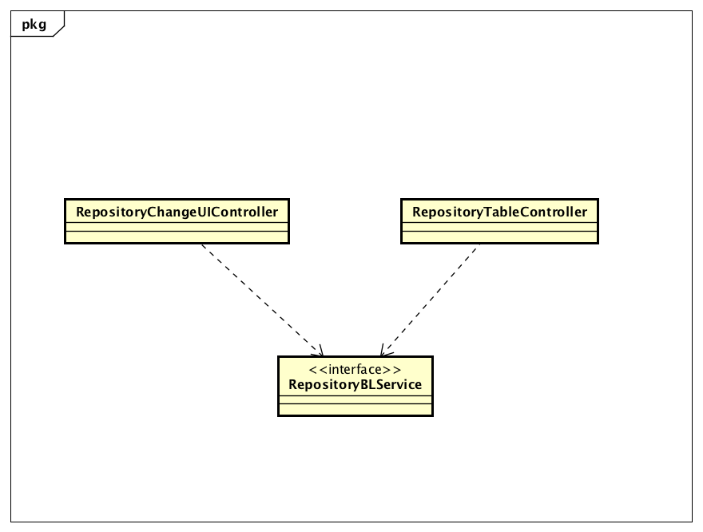
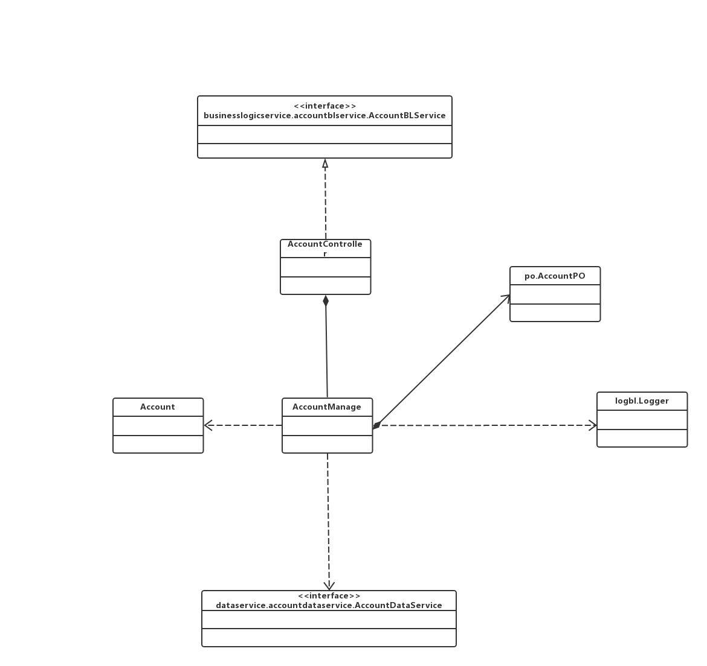
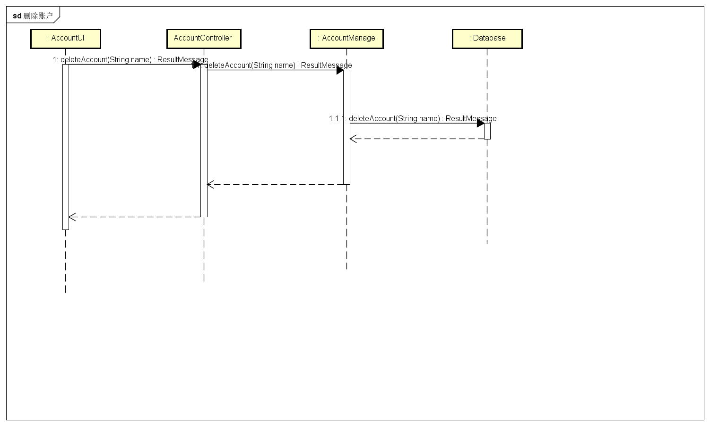
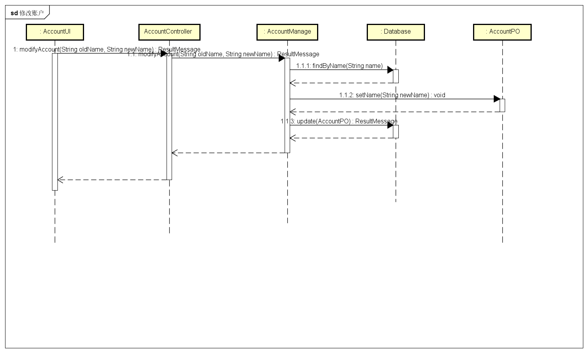
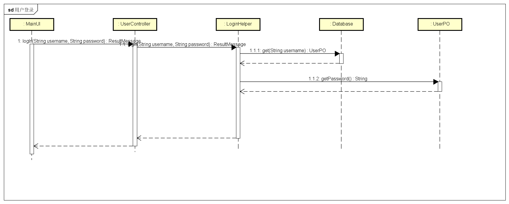

# 详细设计文档

[TOC]

## 修改记录

| 修改时间       | 修改人  | 修改内容     | 版本号  |
| ---------- | ---- | -------- | ---- |
| 2017.11.14 | 全体成员 | 整合详细设计文档 | 1.0  |

## 引言

### 编制目的

本报告详细完成灯具照明行业进销存系统的详细设计，达到指导后续软件构造的目的，同时实现和测试人员及用户的沟通。本报告面向开发人员、测试人员及最终用户而编写，是了解系统的导航。

## 产品概述

参考灯具照明行业进销存系统用例文档和灯具照明行业进销存系统软件规格说明中对产品的概括描述。

## 体系结构设计概述

请参考进销存系统需求文档对体系结构设计的概述

## 结构视角

### 界面层的分解

### 界面层的分解

#### CommodityUI模块

##### 概述

CommodityUI负责库存管理人员进行商品管理、商品分类管理、以及其他人员需要选择商品的UI界面以及响应控制代码。具体功能需求和非功能可参见需求规格说明文档和体系结构设计文档。

##### 设计图

##### 类的职责

| 名称                      | 职责                  |
| ----------------------- | ------------------- |
| CommodityUIController   | 负责商品、商品分类界面的展示和功能   |
| CommodityInfoController | 负责为其他模块选择商品界面的展示和功能 |

##### 接口规范

###### CommodityUIController

需要的接口

| 接口名称                                     | 作用         |
| ---------------------------------------- | ---------- |
| CommodityBLService.getCommodityTreeVO()  | 获取全部商品及其信息 |
| CommodityBLService.addCommodity(CommodityItemVO newCommodity) | 添加商品       |
| CommodityBLService.findCommodityVOByName(String commodityName) | 根据名称查询商品   |
| CommodityBLService.findCommodityVOById(String id) | 根据id查询商品   |
| CommodityBLService.deleteCommodity(String id) | 根据id删除商品   |
| CommodityBLService.modifyCommodity(CommodityItemVO commodity) | 修改商品       |
| CommodityBLService.addCategory(CommodityCategoryVO newCategory) | 增加分类       |
| CommodityBLService.deleteCategory(int id) | 根据分类id删除分类 |
| CommodityBLService.modifyCategory(CommodityCategoryVO categoryItemVO) | 修改分类       |

###### CommodityInfoController

提供接口

| 接口名称                                     | 作用      |
| ---------------------------------------- | ------- |
| CommodityInfoController.getSelectedCommodityVO() | 获取选中的商品 |

需要的接口

| 接口名称                                     | 作用           |
| ---------------------------------------- | ------------ |
| CommodityBLService.getBasicCommodityTreeVO() | 获取全部商品及其基本信息 |

#### RepositoryUI模块

##### 概述

RepositoryUI模块负责库存管理人员进行库存盘点、库存查看的UI界面以及响应控制代码。具体功能需求和非功能可参见需求规格说明文档和体系结构设计文档。

##### 设计图

##### 类的职责

| 名称                           | 职责             |
| ---------------------------- | -------------- |
| RepositoryChangeUIController | 负责库存查看界面的展示和功能 |
| RepositoryTableUIController  | 负责库存盘点界面的展示和功能 |

##### 接口规范

###### RepositoryChangeUIController

需要的接口

| 接口名称                                     | 作用            |
| ---------------------------------------- | ------------- |
| RepositoryBLService.getRepositoryChanges(Date startDate, Date endDate) | 获取选取时间内库存变化项目 |

###### RepositoryTableUIController

需要的接口

| 接口名称                                     | 作用     |
| ---------------------------------------- | ------ |
| RepositoryBLService.getRepositoryTable() | 获取库存快照 |

#### AlertDocUI

##### 概述

AlertDocUI负责库存管理人员添加库存报警单的UI界面的响应和维护。

##### 设计图

##### 类的职责

| 名称                   | 职责                |
| -------------------- | ----------------- |
| AlertDocUIController | 负责添加库存报警单界面的展示和功能 |

##### 接口规范

###### AlertDocUIController

需要的接口

| 名称                                     | 职责    |
| -------------------------------------- | ----- |
| DocDataService.createDoc(DocType type) | 创建空单据 |
| DocDataService.commitDoc(DocVO doc)    | 提交单据  |

#### LossAndGainDocUI

##### 概述

LossAndGainDocUI负责库存管理人员添加库存报损报溢单的UI界面的响应和维护。

##### 设计图

##### 类的职责

| 名称                         | 职责                  |
| -------------------------- | ------------------- |
| LossAndGainDocUIController | 负责添加库存报损报溢单界面的展示和功能 |

##### 接口规范

###### LossAndGainDocUIController

需要的接口

| 名称                                     | 职责    |
| -------------------------------------- | ----- |
| DocDataService.createDoc(DocType type) | 创建空单据 |
| DocDataService.commitDoc(DocVO doc)    | 提交单据  |

#### accountui 模块

##### 模块概述

AccountUI负责库存管理人员进行商品管理、商品分类管理、以及其他人员需要选择商品的UI界面以及响应控制代码。具体功能需求和非功能可参见需求规格说明文档和体系结构设计文档。

##### 设计图

##### 类的职责

| 名称                  | 职责             |
| ------------------- | -------------- |
| AccountUIController | 负责账户管理界面的展示和功能 |

##### 接口规范

###### AccountUIController

需要的接口

| 接口名称                                     | 作用       |
| ---------------------------------------- | -------- |
| AccountBLService.getAccountList          | 获取全部账户信息 |
| AccountBLService.addAccount(String name, int amount) | 添加账户     |
| AccountBLService.getAccount(String name) | 根据名称得到账户 |
| AccountBLService.deleteAccount(String name) | 删除账户     |
| AccountBLService.modifyAccount(String oldName, String newName) | 修改账户名    |

#### lnitui 模块

##### 模块概述

InitUI负责查看期初建账的UI界面以及响应控制代码

##### 设计图

##### 类的职责

| 名称               | 职责                  |
| ---------------- | ------------------- |
| InitUIController | 负责日志查看界面的展示和功能      |
| InitHistoryInfo  | 负责查看历史期初信息的界面的展示和功能 |
| InitBuildInfo    | 负责新建期初的界面的展示和功能     |

##### 接口规范

###### InitUIController

需要的接口

| 接口名称                            | 作用                               |
| ------------------------------- | -------------------------------- |
| InitBLService.getInitInfo()     | 新建期初建账时得到期初建账的所有数据信息（包装在InitVO）中 |
| InitBLService.commit(InitVO vo) | 确认期初建账后，将当前的期初建账信息进行提交           |
| InitBLService.getHistoryInfo()  | 得到历史的所有的期初建账信息                   |

###### InitHistoryInfo

提供的接口

| 接口名称                             | 作用             |
| -------------------------------- | -------------- |
| InitHistoryInfo.getHistoryInfo() | 得到历史的所有的期初建账信息 |

###### InitBuildInfo

| 接口名称                            | 作用                               |
| ------------------------------- | -------------------------------- |
| InitBuildInfo.getInitInfo()     | 新建期初建账时得到期初建账的所有数据信息（包装在InitVO）中 |
| InitBuildInfo.commit(InitVO vo) | 确认期初建账后，将当前的期初建账信息进行提交           |

#### logui 模块

##### 模块概述

LogUI负责查看日志的UI界面以及响应控制代码

##### 设计图

##### 类的职责

| 名称              | 职责             |
| --------------- | -------------- |
| LogUIController | 负责日志查看界面的展示和功能 |

##### 接口规范

##### LogUIController

需要的接口

| 接口名称                                     | 作用             |
| ---------------------------------------- | -------------- |
| LogBLService.getLogListByTime (Date from, Date to) | 获取一定时间范围内的日志记录 |
| LogBLService.findLogs(LogFilter filter)  | 根据筛选条件获得对应日志   |

#### ApprovalUI 模块

##### 概述

ApprovalUI负责总经理进行单据审批的UI界面以及响应控制界面。具体功能需求和非功能可参见需求规格说明文档和体系结构设计文档。

##### 设计图

##### 类的职责

| 名称                   | 职责             |
| -------------------- | -------------- |
| ApprovalUIController | 负责单据审批界面的展示和功能 |

##### 接口规范

需要的接口

##### ApprovalUIController

| 接口名称                                     | 作用                |
| ---------------------------------------- | ----------------- |
| ApprovalBLService.getUnCheckedDoc()      | 获取所有未审批的单据        |
| ApprovalBLService.approve(DocVO doc)     | 通过当前正在查看的单据       |
| ApprovalBLService.approveAll(ArrayList<DocVO> docs) | 通过用户选择的单据         |
| ApprovalBLService.reject(DocVO doc)      | 驳回用户正在查看的单据       |
| ApprovalBLService.save(DocVO doc)        | 保存用户修改好后的单据       |
| ApprovalBLService.saveAndApprove(DocVO doc ) | 保存用户修改好后的单据并通过该单据 |

#### PromotionUI 模块

##### 概述

PromotionUI负责总经理进行促销策略管理的UI界面以及响应控制界面。具体功能需求和非功能可参见需求规格说明文档和体系结构设计文档。

##### 设计图

##### 类的职责

| 名称                    | 职责               |
| --------------------- | ---------------- |
| PromotionUIController | 负责促销策略管理界面的展示和功能 |

##### 接口规范

##### PromotionUIController

需要的接口

| 接口名称                                     | 作用             |
| ---------------------------------------- | -------------- |
| PromotionBLService.getPromotionList()    | 得到所有促销策略的值对象列表 |
| PromotionBLService.create()              | 得到空的促销策略的值对象   |
| PromotionBLService.commit(PromotionVO vo) | 提交当前促销策略       |
| PromotionBLService.modify(PromotionVO vo) | 保存当前修改的促销策略    |
| PromotionBLService.delete(PromotionVO vo) | 删除当前查看的促销爱哦策略  |

#### BusinessHistoryTableUI 模块

##### 概述

BusinessHistoryTableUI 负责总经理和财务人员查看经营历程表的UI界面以及控制响应界面。具体功能需求和非功能需求可以参加爱你需求规格说明文档和体系结构设计文档。

##### 设计图

##### 类的职责

| 名称                               | 职责                 |
| -------------------------------- | ------------------ |
| BusinessHistoryTableUIController | 负责查看经营历程表的界面的展示和功能 |

##### 接口规范

##### BusinessHistoryTableUIController

需要的接口

| 接口名称                                   | 作用          |
| -------------------------------------- | ----------- |
| DocBLService.getBusinessHistoryTable() | 得到经营历程表的值对象 |

#### BusinessConditionTableUI 模块

##### 概述

BusinessConditionTableUI 负责总经理和财务人员查看经营情况表的UI界面以及控制响应界面。具体功能需求和非功能需求可以参加爱你需求规格说明文档和体系结构设计文档。

##### 设计图

##### 类的职责

| 名称                                 | 职责                 |
| ---------------------------------- | ------------------ |
| BusinessConditionTableUIController | 负责查看经营情况表的界面的展示和功能 |

##### 接口规范

##### BusinessHitoryTableUIController

需要的接口

| 接口名称                                     | 作用          |
| ---------------------------------------- | ----------- |
| DocBLService.getBusinessConditionTable() | 得到经营情况表的值对象 |

####  SalesDetailTableUI 模块

#####  概述

 SalesDetailTableUI 负责总经理和财务人员查看销售明细表的UI界面以及控制响应界面。具体功能需求和非功能需求可以参加爱你需求规格说明文档和体系结构设计文档。

##### 设计图

##### 类的职责

| 名称                           | 职责                 |
| ---------------------------- | ------------------ |
| SalesDetailTableUIController | 负责查看销售明细表的界面的展示和功能 |

#####  接口规范

##### SalesDetailTableUIController

需要的接口

| 接口名称                               | 作用          |
| ---------------------------------- | ----------- |
| DocBLService.getSalesDetailTable() | 得到销售明细表的值对象 |

### 业务逻辑层的分解

#### commoditybl模块

##### 模块概述

commoditybl模块承担的需求见需求规格说明文档功能需求及相关非功能需求。

commoditybl模块的职责及接口参见软件体系结构描述文档。

##### 整体结构

根据体系结构的设计，我们将系统分为展示层、业务逻辑层、数据层。每一层之间为了灵活性，我们添加接口，如CommodityBLService、CommodityDataService。为了隔离业务操作和控制操作，添加CommodityController。CommodityPO、CommodityListPO是作为商品、商品分类的持久化对象被添加到设计中。

commoditybl模块的设计如下图所示：

commoditybl模块各个类的职责如下表所示。

| 类                       | 职责   |
| ----------------------- | ---- |
| CommodityController     |      |
| CommodityCategoriesTree |      |
| CommodityInfoImpl       |      |
| CommodityManager        |      |
| BasicCommodityItem      |      |
| CommodityItem           |      |
| CommodityInfo           |      |

##### 模块内部类的接口规范

#####CommodityController类的接口规范：

- 提供的服务

- 参见体系结构设计文档CommodityBLService

- 需要的服务

- 参见CommodityManager提供的接口

  ##### CommodityManager类的接口规范：

- | 名称                                       | 条目   | 详情                                       |
  | ---------------------------------------- | ---- | ---------------------------------------- |
  |                                          | 语法   | `public CommodityCategoriesTreeVO getCommodityCategoriesTreeVO()` |
  | CommodityManager.getCommodityCategoriesTreeVO | 前置条件 | 无                                        |
  |                                          | 后置条件 | 获取最新的商品分类树                               |
  |                                          | 语法   | `public Result<CommodityItemVO> addCommodity(CommodityBuildInfo.CommodityBuilder builder) ` |
  | CommodityManager.addCommodity            | 前置条件 | 传入非空CommodityBuildInfo.CommodityBuilder  |
  |                                          | 后置条件 | 增加新的商品，调用数据层接口更新商品信息                     |
  |                                          | 语法   | `List<CommodityItemVO> findCommodityByCategory(int categoryID)` |
  | CommodityManager.findCommodityByCategory | 前置条件 | 输入合法的商品分类id                              |
  |                                          | 后置条件 | 根据商品分类id查找对应分类下的商品，返回相应`List<CommodityItemVO>`对象 |
  |                                          | 语法   | `List<CommodityItemVO> findCommodityVOByName(String commodityName)` |
  | CommodityManager.findCommodityVOByName   | 前置条件 | 输入非空字符串                                  |
  |                                          | 后置条件 | 根据商品名称查找是否存在相应的商品，返回List<CommodityItemVO>对象 |
  |                                          | 语法   | `public ResultMessage deleteCommodity(String id)` |
  | CommodityManager.deleteCommodity         | 前置条件 | 输入不违反商品id格式的字符串                          |
  |                                          | 后置条件 | 如果存在与输入商品id对应的商品，删除商品。返回ResultMessage    |
  |                                          | 语法   | `public ResultMessage modifyCommodity(CommodityItemVO commodity)` |
  | CommodityManager.modifyCommodity         | 前置条件 | 传入一个非空的CommodityVO对象                     |
  |                                          | 后置条件 | 更新商品，返回ResultMessage                     |
  |                                          | 语法   | `Result<CommodityCategoryVO> addCategory(CommodityCategoryItemVO newCategory)` |
  | CommodityManager.addCategory             | 前置条件 | 传入一个非空的、且与当前分类下其他分类名称不相同的CommodityCategoryItemVO |
  |                                          | 后置条件 | 更新商品分类，返回Result<CommodityCategoryVO>     |
  |                                          | 语法   | `ResultMessage deleteCategory(int id)`   |
  | CommodityManager.deleteCategory          | 前置条件 | 传入合法的分类id                                |
  |                                          | 后置条件 | 删除商品分类，返回ResultMessage                   |
  |                                          | 语法   | `ResultMessage changeCategoryName(CommodityCategoryVO vo)` |
  | CommodityManager.changeCategoryName      | 前置条件 | 传入非空的CommodityCategoryItemVO             |
  |                                          | 后置条件 | 更新商品分类名称，返回ResultMessage                 |

- 需要的服务
- 参见体系结构设计文档CommodityDataService

##### CommodityInfo模块

| 名称                                       | 条目   | 详情                                       |
| ---------------------------------------- | ---- | ---------------------------------------- |
|                                          | 语法   | `BasicCommodityItemVO getBasicCommodityItemVO(String id)` |
| CommodityInfo.getBasicCommodityItemVO    | 前置条件 | 传入非空string                               |
|                                          | 后置条件 | 返回id对应传入string的BasicCommodityItemVO对象    |
|                                          | 语法   | `double getCommodityRecentSellPrice(String id)` |
| CommodityInfo.getCommodityRecentSellPrice | 前置条件 | 传入表示一个商品id的非空字符串                         |
|                                          | 后置条件 | 返回id对应传入string的商品最近售价                    |
|                                          | 语法   | `String getCommodityNameByID(String commodityID)` |
| CommodityInfo.getCommodityNameByID       | 前置条件 | 传入一个表示商品id的非空字符串                         |
|                                          | 后置条件 | 返回id对应传入string的商品的名字                     |
|                                          | 语法   | `String getCommodityCategory(String commodityID)` |
| CommodityInfo.getCommodityCategory       | 前置条件 | 传入一个表示商品id的非空字符串                         |
|                                          | 后置条件 | 返回id对应传入string的商品的名字                     |
|                                          | 语法   | `double getCommodityInPrice(String id)`  |
| CommodityInfo.getCommodityInPrice        | 前置条件 | 传入一个表示商品id的非空字符串                         |
|                                          | 后置条件 | 返回id对应传入string的商品的最近进价                   |
|                                          | 语法   | `double getCostAdjustRevenue()`          |
| CommodityInfo.getCostAdjustRevenue       | 前置条件 | 无                                        |
|                                          | 后置条件 | 返回价格变动引发的收入                              |
|                                          | 语法   | `ResultMessage addCommodityNumber(String id, int count)` |
| CommodityInfo.addCommodityNumber         | 前置条件 | 传入一个表示商品id的非空字符串和一个表示商品变动数量的数字           |
|                                          | 后置条件 | 调用数据层接口变更商品数量，返回ResultMessage            |

##### 业务逻辑层的动态模型

下图为添加商品的后，商品模块业务逻辑处理的相关对象之间的协作顺序

下图为删除商品后，商品模块业务逻辑处理的相关对象之间的协作顺序

下图为修改商品后，商品模块业务逻辑处理的相关对象之间的协作顺序

下图为查询商品时，商品模块业务逻辑处理的相关对象之间的协作顺序

下图为获取全部商品、分类信息时，商品模块业务逻辑处理的相关对象之间的协作顺序

下图为增加分类时，商品模块业务逻辑处理的相关对象的协作顺序

下图为修改分类时，商品模块业务逻辑处理的相关对象的协作顺序

下图为删除分类是，商品模块业务逻辑处理的相关对象的协作顺序

#### repositorybl模块

##### 模块概述

repositorybl模块承担的需求见需求规格说明文档功能需求及相关非功能需求。

repositorybl模块的职责及接口参见软件体系结构描述文档。

##### 整体结构

根据体系结构的设计，我们将系统分为展示层、业务逻辑层、数据层。每一层之间为了灵活性，我们添加接口，如RepositoryBLService、RepositoryDataService。为了隔离业务操作和控制操作，添加RepositoryController。ReposioryTable是作为当前库存表被添加到设计中、RepositoryChange是作为库存变化情况被添加到设计中。

repositorybl模块的设计如下图所示

repositorybl模块各个类的职责如下表所示。

| 类                    | 职责                           |
| -------------------- | ---------------------------- |
| RepositoryController | 负责为获取库存相关信息逻辑操作进行服务          |
| Repository           | 与库存有关的领域模型对象                 |
| RepositoryChange     | 库存变化有关领域模型对象，保存单次变化的全部信息     |
| RepositoryTable      | 当前库存全部信息有关领域对象模型，持有当前库存的全部信息 |

###### CommodityController类的接口规范：

- 提供的服务

  | 名称                                       | 条目   | 详情                                       |
  | ---------------------------------------- | ---- | ---------------------------------------- |
  |                                          | 语法   | `public ArrayList<RepositoryChangeVO> getRepositoryChanges (Date startDate, Date endDate)throws RemoteException` |
  | RepositoryController.getRepositoryChanges | 前置条件 | Repository对象已经被创建                        |
  |                                          | 后置条件 | 调用Repository中同名同参数方法                     |
  |                                          | 语法   | `public RepositoryTableVO getRepositoryTable()throws RemoteException` |
  | Repository.getRepositoryTable            | 前置条件 | Repository对象已经被创建                        |
  |                                          | 后置条件 | 调用Repository中的同名同参数方法                    |

- 需要的服务

  | 服务名                                      | 服务          |
  | ---------------------------------------- | ----------- |
  | Repository.getRepositoryChanges(Date startData, Date endDate) | 获取时间段内的库存变化 |
  | Repository.getRepositoryTable()          | 获取库存快照      |

###### Commodity类的接口规范：

- 提供的服务

  | 名称                              | 条目   | 详情                                       |
  | ------------------------------- | ---- | ---------------------------------------- |
  |                                 | 语法   | `public ArrayList<RepositoryChangeVO> getRepositoryChanges (Date startDate, Date endDate)` |
  | Repository.getRepositoryChanges | 前置条件 | 传入的两个Date对象不能为空                          |
  |                                 | 后置条件 | 返回startDate到endDate时间段内所有库存变化项           |
  |                                 | 语法   | `public RepositoryTableVO getRepositoryTable()` |
  | Repository.getRepositoryTable   | 前置条件 | 无                                        |
  |                                 | 后置条件 | 返回当前库存快照信息                               |

- 需要服务

  | 服务名                                      | 服务          |
  | ---------------------------------------- | ----------- |
  | RepositoryDataService.getRepositoryChanges(Date startData, Date endDate) | 获取时间段内的库存变化 |
  | RepositoryDataService.getRepositoryTable() | 获取库存快照      |

下图为库存查看时，库存模块业务逻辑处理的相关对象之间的协作顺序

下图为库存盘点时，库存模块业务逻辑处理的相关对象之间的协作顺序

#### customerbl模块

##### 模块概述

customerbl模块模块承担的需求见需求规格说明文档功能需求及相关非功能需求。

customerbl模块的职责及接口参见软件体系结构描述文档。

##### 整体结构

根据体系结构的设计，我们将系统分为展示层、业务逻辑层、数据层。每一层之间为了增加灵活性，我们会添加接口。比如展示层和业务逻辑层之间，我们添加了businesslogicservice.customerservice.CustomerBLService接口。业务逻辑层和数据层之间，我们添加了dataservice.customerdataservice.CustomerDataService接口。为了隔离业务逻辑层和逻辑控制职责，我们添加了CustomerController,这样CustomerController会将对促销策略的业务逻辑委托给Customer对象。CustomerPO是作为促销策略的持久化对象被添加到设计模型中去的。而Userinfo是根据依赖倒置原则，为了消除循环依赖而产生的接口。

customerbl模块的设计如图所示。

customerbl模块各个类的职责如下表。

| 模块                 | 职责                                       |
| ------------------ | ---------------------------------------- |
| CustomerController | 负责实现对客户管理界面所需要的服务                        |
| Customer           | 客户管理的领域模型对象，拥有一次客户管理（增删查改四种操作）所需要的信息：增加操作所需要的客户姓名、分类、等级、编号等信息；删除操作需要的客户编号；查找操作所需要的关键字；修改操作所需要的客户需要修改的。可以帮助完成客户管理界面所需要的服务 |

##### 模块内部的接口规范

###### CustomerController的接口规范

提供的服务

| 名称                                      | 条目   | 详情                                       |
| --------------------------------------- | ---- | ---------------------------------------- |
|                                         | 语法   | `public ArrayList<CustomerVO> getCustomerList ()` |
| CustomerController.getCustomerList      | 前置条件 | 已创建一个Customer领域对象                        |
|                                         | 后置条件 | 调用Customer领域对象的`getCustomerList`方法       |
|                                         | 语法   | `public boolean askForCreateCustomer(String userID)` |
| CustomerController.askForCreateCustomer | 前置条件 | 已创建一个Customer领域对象                        |
|                                         | 后置条件 | 调用Customer领域对象的`addCustomer`方法           |
|                                         | 语法   | `public ResultMessage createCustomer(CustomerVO)` |
| CustomerController.createCustomer       | 前置条件 | 已创建一个Customer领域对象，已添加姓名、分类、级别等信息，输入符合输入规则 |
|                                         | 后置条件 | 调用Customer领域对象的`createCustomer`方法        |
|                                         | 语法   | `public ResultMessage modifyAccount(CustomerVO vo)` |
| CustomerController.modifyCustomer       | 前置条件 | 已创建一个Customer领域对象，已输入新的信息且输入符合输入规则       |
|                                         | 后置条件 | 调用Customer领域对象的`modifyCustomer`方法        |
|                                         | 语法   | `public ArrayList<CustomerVO> findCustomer(String keyword)` |
| CustomerController.findCustomer         | 前置条件 | 已创建一个Customer领域对象，已输入关键字且输入符合输入规则        |
|                                         | 后置条件 | 调用Customer领域对象的`findCustomer`方法          |
|                                         | 语法   | `public ResultMessage deleteCustomer(CustomerVO vo)` |
| CustomerController.deleteCustomer       | 前置条件 | 已创建一个Customer领域对象                        |
|                                         | 后置条件 | 调用Customer领域对象的`deleteCustomer`方法        |
|                                         | 语法   | `public String getNextCustomerID()`      |
| CustomerController.getNextCustomerID    | 前置条件 | 已创建一个Customer领域对象                        |
|                                         | 后置条件 | 调用Customer领域对象的`getNextCustomerID`方法     |
|                                         | 语法   | `public boolean askForModifyCustomer(String userId) throws  RemoteException` |
| CustomerController.askForModifyCustomer | 前置条件 | 已创建一个Customer领域对象                        |
|                                         | 后置条件 | 调用Customer领域对象的`askForModifyCustomer`方法  |

需要的服务

| 服务名                                      | 服务              |
| ---------------------------------------- | --------------- |
| Customer.askForCreateCustomer(String userID) | 得到用户的可更改应收额度权限  |
| Customer.getCustomerList()               | 得到客户列表          |
| Customer.createCustomer(CustomerVO vo)   | 加入一个客户对象        |
| Customer.modifyCustomer(CustomerVO vo)   | 修改一个客户对象        |
| Customer.deleteCustomer(CustomerVO vo)   | 删除一个客户对象        |
| Customer.getNextCustomerID()             | 得到一个新的客户ID      |
| Customer.findCustomer(String keyword)    | 根据关键字查找得到多个客户对象 |
| Customer.askForModifyCustomer(String userId) | 得到用户的可更改应收额度权限  |

###### Customer的接口规范

提供的服务

| 名称                            | 条目   | 详情                                       |
| ----------------------------- | ---- | ---------------------------------------- |
|                               | 语法   | `public boolean askForCreateCustomer(String userId) throws RemoteException` |
| Customer.askForCreateCustomer | 前置条件 | 在客户管理进程中                                 |
|                               | 后置条件 | 根据权限允许增加客户的相应信息                          |
|                               | 语法   | `public ArrayList<CustomerVO> getCustomerList () throws RemoteException` |
| Customer.getCustomerList      | 前置条件 | 在客户管理进程中                                 |
|                               | 后置条件 | 返回所有的客户列表                                |
|                               | 语法   | `public ResultMessage createCustomer(CustomerVO vo) throws RemoteException` |
| Customer.createCustomer       | 前置条件 | 在增加客户进程中，已经过askForCreateCustomer         |
|                               | 后置条件 | 增加一个客户                                   |
|                               | 语法   | `public ResultMessage modifyCustomer(CustomerVO customer) throws RemoteException` |
| Customer.modifyCustomer       | 前置条件 | 已经askForModifyCustomer                   |
|                               | 后置条件 | 修改一个客户信息                                 |
|                               | 语法   | `public ResultMessage deleteCustomer(String customerID) throws RemoteException` |
| Customer.deleteCustomer       | 前置条件 | 在客户管理进程中                                 |
|                               | 后置条件 | 更改一个客户信息                                 |
|                               | 语法   | `public int getNextCustomerID() throws  RemoteException` |
| Customer.getNextCustomerID    | 前置条件 | 已经askForCreateCustomer                   |
|                               | 后置条件 | 得到下一个客户编号                                |
|                               | 语法   | `public ArrayList<CustomerVO> findCustomer(String keyword) throws RemoteException` |
| Customer.findCustomer         | 前置条件 | 在客户管理进程中                                 |
|                               | 后置条件 | 得到符合条件的客户                                |
|                               | 语法   | `public boolean askForModifyCustomer(String userId) throws  RemoteException` |
| Customer.askForModifyCustomer | 前置条件 | 在客户管理进程中                                 |
|                               | 后置条件 | 得到是否可以修改客户的应收额度                          |

需要的接口

| 服务名                                      | 服务                   |
| ---------------------------------------- | -------------------- |
| CustomerDataService.getAllCustomer()     | 得到所有的客户持久化对象列表       |
| CustomerDataService.insertCustomer(CustomerPO po) | 插入一个持久化对象            |
| CustomerDataService.updateCustomer(CustomerPO po) | 更新一个持久化对象            |
| CustomerDataService.deleteCustomer(CustomerPO po) | 删除一个持久化对象            |
| CustomerDataService.getNextCustomerID()  | 得到下一个客户编号            |
| CustomerDataService.findCustomer(String keyword) | 根据关键字查找到多个符合条件的持久化对象 |
| UserDataService.isSupreme(String userId) | 根据用户id得到其是否是最高权限     |

##### 业务逻辑层的动态模型

下图为用户输入新客户的姓名、分类、级别等信息后，客户业务逻辑处理的相关对象之间的协作

下图为用户删除账户时账户业务逻辑处理的相关对象之间的协作

下图为用户查查找账户时账户业务逻辑处理的相关对象之间的协作

下图为用户修改账户时账户业务逻辑处理的相关对象之间的协作

#### accountbl 模块

##### 模块概述

accountbl模块承担的需求参见需求规格说明文档功能需求及相关非功能需求

accountbl模块的职责及接口参见软件系统结构描述文档accountbl模块的接口规范

##### 整体结构

根据体系结构的设计，我们将系统分为展示层、业务逻辑层、数据层。每一层之间为了增加灵活性，我们会添加接口。比如展示层和业务逻辑层之间，我们添加bussinesslogicservice.accountblservice.AccountBLService接口。业务逻辑层和数据层之间添加dataservice. AccountDataService接口。为了隔离业务逻辑职责和逻辑控制职责，我们增加了AccountController，这样AccountlController会将对账户管理的逻辑业务处理委托给AccountManage对象。AccountPO是作为账户信息的持久化对象被添加到设计模型中去的。

accountbl 模块的设计如下图

accountbl 模块各个类的职责如下表

| 模块                | 职责                                       |
| ----------------- | ---------------------------------------- |
| AccountController | 负责实现对账户管理界面所需要的服务                        |
| AccountManage     | 账户管理的领域模型对象，拥有一次账户管理（增删查改四种操作）所需要的信息：增加操作所需要的账户名称、金额；删除操作需要的账户名；查找操作所需要的关键字；修改操作所需要的账户需要修改的名称。可以帮助完成账户管理界面所需要的服务 |
| Account           | 账户的领域模型对象，拥有账户的数据（名称、金额、id）， 拥有对更新账户信息的方法 |

##### 模块内部的接口规范

###### AccountController的接口规范

| 名称                               | 条目   | 详情                                       |
| -------------------------------- | ---- | ---------------------------------------- |
|                                  | 语法   | `public ArrayList<AccountVO> getAccountList ()` |
| AccountController.getAccountList | 前置条件 | 已创建一个AccountManage领域对象                   |
|                                  | 后置条件 | 调用AccountManage领域对象的`getAccountList`方法   |
|                                  | 语法   | `public ResultMessage addAccount(String name, int amount)` |
| AccountController.addAccount     | 前置条件 | 已创建一个AccountManage领域对象，已添加名称和金额，输入符合输入规则 |
|                                  | 后置条件 | 调用AccountManage领域对象的`addAccount`方法       |
|                                  | 语法   | `public ArrayList<AccountVO> findAccounts(String keyword)` |
| AccountController.findAccounts   | 前置条件 | 已创建一个AccountManage领域对象，已输入关键字且输入符合输入规则   |
|                                  | 后置条件 | 调用AccountManage领域对象的`findAccount`方法      |
|                                  | 语法   | `public AccountVO getAccount(String name)` |
| AccountController.getAccount     | 前置条件 | 已创建一个AccountManage领域对象，已输入名称且输入符合输入规则    |
|                                  | 后置条件 | 调用AccountManage领域对象的`getAccount`方法       |
|                                  | 语法   | `public ResultMessage deleteAccount(String name)` |
| AccountController.deleteAccount  | 前置条件 | 已创建一个AccountManage领域对象，已输入名称且输入符合输入规则    |
|                                  | 后置条件 | 调用AccountManage领域对象的`deleteAccount`方法    |
|                                  | 语法   | `public ResultMessage modifyAccount(String oldName, String newName)` |
| AccountController.modifyAccount  | 前置条件 | 已创建一个AccountManage领域对象，已输入新的名称且输入符合输入规则  |
|                                  | 后置条件 | 调用AccountManage领域对象的`modifyAccount`方法    |

需要的服务

| 服务名                                      | 服务              |
| ---------------------------------------- | --------------- |
| AccountManage.addAccount(String name, String amount) | 加入一个账户对象        |
| AccountManage.getAccountList()           | 得到账户列表          |
| AccountManage.modifyAccount(String oldName, String newName) | 修改一个账户对象        |
| AccountManage.deleteAccount(String name) | 删除一个账户对象        |
| AccountManage.getAccount(String name)    | 根据名称得到一个账户对象    |
| AccountManage.findAccounts(String keyword) | 根据关键字查找得到多个账户对象 |

###### AccountManage的接口规范

| 名称                           | 条目   | 详情                                       |
| ---------------------------- | ---- | ---------------------------------------- |
|                              | 语法   | `public ArrayList<AccountVO> getAccountList ()` |
| AccountManage.getAccountList | 前置条件 | 得到数据                                     |
|                              | 后置条件 | 返回账户列表                                   |
|                              | 语法   | `public ResultMessage addAccount(String name, int amount)` |
| AccountManage.addAccount     | 前置条件 | 金额，名称符合输入规则                              |
|                              | 后置条件 | 增加新的账户，更新持久化存储内容                         |
|                              | 语法   | `public ArrayList<AccountVO> findAccount(String keyword)` |
| AccountManage.findAccount    | 前置条件 | 输入有效的关键字                                 |
|                              | 后置条件 | 根据关键字查找是否存在相应的账户，若存在匹配的账户则返回相应`Account`对象，若不存在匹配项则返回`null` |
|                              | 语法   | `public AccountVO getAccount(String name)` |
| AccountManage.getAccount     | 前置条件 | 输入有效的账户名称                                |
|                              | 后置条件 | 得到数据，返回名称对应的`Account`对象                  |
|                              | 语法   | `public ResultMessage deleteAccount(String name)` |
| AccountManage.deleteAccount  | 前置条件 | 输入有效的账户名称                                |
|                              | 后置条件 | 删除相应的账户，更新持久化存储内容                        |
|                              | 语法   | `public ResultMessage modifyAccount(String oldName, String newName)` |
| AccountManage.modifyAccount  | 前置条件 | 输入有效的账户名称                                |
|                              | 后置条件 | 更改所修改的账户名称，更新持久化存储的数据                    |

需要的服务（需接口）

| 服务名                                      | 服务                 |
| ---------------------------------------- | ------------------ |
| AccountDataService.getAll()              | 得到目前存储的所有账户的持久化对象  |
| AccountDataService.get(String name)      | 根据name得到单一持久对象     |
| AccountDataService.insert(AccountPO po)  | 插入单一持久化对象          |
| AccountDataService.update(AccountPO po)  | 更新单一持久化对象          |
| AccountDataService.delete(AccountPO po)  | 删除单一持久化对象          |
| AccountDataService.find(String keyword)  | 根据关键字查找多个持久化对象     |
| DataBaseFactory.getAccountDataBase       | 得到Account数据库的服务的引用 |
| Logger.add(OPType op, String itemName, String id) | 记录日志               |

##### 业务逻辑层的动态模型

下图为用户输入新账户的名称和金额后，账户业务逻辑处理的相关对象之间的协作

下图为用户删除账户时账户业务逻辑处理的相关对象之间的协作

下图为用户查查找账户时账户业务逻辑处理的相关对象之间的协作

下图为用户修改账户时账户业务逻辑处理的相关对象之间的协作

#### userbl模块

##### 模块概述

userbl模块承担的需求参见需求规格说明文档功能需求及相关非功能需求

userbl模块的职责及接口参见软件系统结构描述文档userbl模块的接口规范

##### 整体结构

根据体系结构的设计，我们将系统分为展示层、业务逻辑层、数据层。每一层之间为了增加灵活性，我们会添加接口。比如展示层和业务逻辑层之间，我们添加bussinesslogicservice.userblservice.UserBLService接口。业务逻辑层和数据层之间添加dataservice. UserDataService接口。为了隔离业务逻辑职责和逻辑控制职责，我们增加了UserController，这样UserController会将对用户管理的逻辑业务处理委托给UserManage对象，将用户登录登出的逻辑业务处理委托给LoginHelper对象。UserPO是作为用户信息的持久化对象被添加到设计模型中去的。

userbl模块的设计如下图

userbl 模块各个类的职责如下表

| 模块             | 职责                                       |
| -------------- | ---------------------------------------- |
| UserController | 负责实现对账户管理界面所需要的服务                        |
| UserManage     | 账户管理的领域模型对象，拥有一次账户管理（增删查改四种操作）所需要的信息：增加操作所需要的账户名称、金额；删除操作需要的账户名；查找操作所需要的关键字；修改操作所需要的账户需要修改的名称。可以帮助完成账户管理界面所需要的服务 |
| LoginHelper    | 负责实现对应于登录界面所需要的服务                        |
| Logger         | 负责实现对登录以及用户管理的操作的记录                      |
| User           | 用户的领域模型对象，拥有用户对应的数据以及对用户数据进行更改、匹配的方法。    |

##### 模块内部的接口规范

###### UserController的接口规范

| 名称                            | 条目   | 详情                                       |
| ----------------------------- | ---- | ---------------------------------------- |
|                               | 语法   | `public ArrayList<UserVo> getUserList ()` |
| UserController.getUserList    | 前置条件 | 创建了一个UserManage领域模型对象                    |
|                               | 后置条件 | 调用UserManage领域对象的getUserList方法           |
|                               | 语法   | `public ResultMessage addUser(UserVo vo)` |
| UserController.addUser        | 前置条件 | 创建了一个UserManage领域模型对象，且输入符合规则            |
|                               | 后置条件 | 调用UserManage领域对象的addUser方法               |
|                               | 语法   | `public ArrayList<UserVO> findUsers(String keyword)` |
| UserController.findUsers      | 前置条件 | 创建了一个UserManage领域模型对象，且输入符合规则            |
|                               | 后置条件 | 调用UserManage领域对象的findUsers方法             |
|                               | 语法   | `public UserVO getUser(String id)`       |
| UserController.getUser        | 前置条件 | 创建了一个UserManage领域模型对象，且输入符合规则            |
|                               | 后置条件 | 调用UserManage领域对象的getUser方法               |
|                               | 语法   | `public ResultMessage deleteUser(String ID)` |
| UserController.deleteUser     | 前置条件 | 创建了一个UserManage领域模型对象，且输入符合规则            |
|                               | 后置条件 | 调用UserManage领域对象的deleteUser方法            |
|                               | 语法   | `public void modifyUser(UserVO vo)`      |
| UserController.modifyUser     | 前置条件 | 创建了一个UserManage领域模型对象，且输入符合规则            |
|                               | 后置条件 | 调用UserManage领域对象的modifyUser方法            |
|                               | 语法   | `public String generateJobNum(UserVO vo)` |
| UserController.generateJobNum | 前置条件 | 创建了一个UserManage领域模型对象，且输入符合规则            |
|                               | 后置条件 | 调用UserManage领域对象的generateJobNum方法        |
|                               | 语法   | `public ResultMessage login(String username, String password)` |
| UserController.logIn          | 前置条件 | 创建了一个LoginHelper领域模型对象，且输入符合规则           |
|                               | 后置条件 | 调用LoginHelper领域对象的login方法                |
|                               | 语法   | `public ResultMessage logOut(UserVo vo)` |
| UserController.logOut         | 前置条件 | 创建了一个LoginHelper领域模型对象，且输入符合规则           |
|                               | 后置条件 | 调用LoginHelper领域对象的logout方法               |

- 需要的服务（需接口）

参见UserManage和LoginHelper的供接口

###### UserManage和LoginHelper的接口规范

| 名称                        | 条目   | 详情                                       |
| ------------------------- | ---- | ---------------------------------------- |
|                           | 语法   | `public ArrayList<UserVo> getUserList ()` |
| UserManage.getUserList    | 前置条件 | 得到数据                                     |
|                           | 后置条件 | 返回用户列表                                   |
|                           | 语法   | `public ResultMessage addUser(UserVo vo)` |
| UserManage.addUser        | 前置条件 | 传入有效的对象                                  |
|                           | 后置条件 | 增加新的用户，更新持久化存储内容                         |
|                           | 语法   | `public ArrayList<UserVO> findUsers(String keyword)` |
| UserManage.findUsers      | 前置条件 | 输入有效的关键字                                 |
|                           | 后置条件 | 根据关键字查找是否存在相应的用户，若存在匹配的用户则返回相应对象列表，若不存在匹配项则返回空列表 |
|                           | 语法   | `public UserVO getUser(String id)`       |
| UserManage.getUser        | 前置条件 | 输入有效的用户名                                 |
|                           | 后置条件 | 得到数据，返回名称对应的对象                           |
|                           | 语法   | `public ResultMessage deleteUser(String ID)` |
| UserManage.deleteUser     | 前置条件 | 输入有效的用户ID                                |
|                           | 后置条件 | 删除相应的用户，更新持久化存储内容                        |
|                           | 语法   | `public void modifyUser(UserVO vo)`      |
| UserManage.modifyUser     | 前置条件 | 输入有效的用户对象                                |
|                           | 后置条件 | 更改所修改的用户信息，更新持久化存储的数据                    |
|                           | 语法   | `public String generateJobNum(UserVO vo)` |
| UserManage.generateJobNum | 前置条件 | 用户请求添加新的账号                               |
|                           | 后置条件 | 返回相应字符串                                  |
|                           | 语法   | `public ResultMessage login(String username, String password)` |
| LoginHelper.logIn         | 前置条件 | password符合输入规则                           |
|                           | 后置条件 | 查找是否存在相应的User，根据输入的password返回登陆验证的结果     |
|                           | 语法   | `public ResultMessage logOut(UserVo vo)` |
| LoginHelper.logOut        | 前置条件 | 传入有效的UserVO对象                            |
|                           | 后置条件 | 查找是否存在相应的User，根据传入的对象返回登出结果              |

- 需要的服务（需接口）

| 服务名                                      | 服务                 |
| ---------------------------------------- | ------------------ |
| UserDataService.getAll()                 | 得到目前存储的所有用户的持久化对象  |
| UserDataService.get(String username)     | 根据username得到单一持久对象 |
| UserDataService.insert(UserPO po)        | 插入单一持久化对象          |
| UserDataService.update(UserPO po)        | 更新单一持久化对象          |
| UserDataService.delete(UserPO po)        | 删除单一持久化对象          |
| UserDataService.findUsers(String keyword) | 根据关键字查找多个持久化对象并返回  |
| DataBaseFactory.getUserDataBase          | 得到Account数据库的服务的引用 |
| Logger.add(OPType type, String itemName, String id) | 记录用户改动（增删改）日志      |

##### 业务逻辑层的动态模型

下图为用户登录时登录业务逻辑处理的相关对象之间的协作

下图为用户登出时登录业务逻辑处理的相关对象之间的协作

#### logbl 模块

##### 模块概述

lobgl模块承担的需求参见需求规格说明文档功能需求及相关非功能需求

logbl模块的职责及接口参见软件系统结构描述文档log模块的接口规范

##### 整体结构

根据体系结构的设计，我们将系统分为展示层、业务逻辑层、数据层。每一层之间为了增加灵活性，我们会添加接口。比如展示层和业务逻辑层之间，我们添加bussinesslogicservice.logblservice.LogBLService接口。业务逻辑层和数据层之间添加dataservice. LogDataService接口。为了隔离业务逻辑职责和逻辑控制职责，我们增加了AccountController，这样AccountlController会将对账户管理的逻辑业务处理委托给AccountManage对象。AccountPO是作为账户信息的持久化对象被添加到设计模型中去的。

logbl 模块的设计如下图

logbl 模块各个类的职责如下表

| 模块            | 职责                                       |
| ------------- | ---------------------------------------- |
| LogController | 负责实现对查看日志界面所需要的服务                        |
| Log           | 日志查看的领域模型对象，拥有一次日志查看所需要的信息：日志筛选的条件。可以帮助完成账户管理界面所需要的服务 |
| Logger        | 负责提供其他模块的进行日志记录                          |
| SimpleLogger  | 负责实现Logger接口的功能，即日志记录                    |

##### 模块内部的接口规范

###### LogController的接口规范

| 名称                             | 条目   | 详情                                       |
| ------------------------------ | ---- | ---------------------------------------- |
|                                | 语法   | `public ArrayList<LogVo> getLogListByTime (Date from, Date to)` |
| LogController.getLogListByTime | 前置条件 | 已创建一个Log领域对象                             |
|                                | 后置条件 | 调用Log领域对象的getLogList                     |
|                                | 语法   | `public ArrayList<LogVO> findLogs(LogFilter filter)` |
| LogController.findLogs         | 前置条件 | 已创建一个Log领域对象，并传入有效的LogFilter对象           |
|                                | 后置条件 | 调用Log领域对象的findLogs方法                     |

LogController需要的服务见Log的接口规范

###### Log的接口规范

| 名称             | 条目   | 详情                                       |
| -------------- | ---- | ---------------------------------------- |
|                | 语法   | `public ArrayList<LogVo> getLogListByTime (long from, long to)` |
| Log.getLogList | 前置条件 | 输入有效的时间范围                                |
|                | 后置条件 | 根据时间范围返回日志列表                             |
|                | 语法   | `public ArrayList<LogVO> findLogs(LogFilter fiter)` |
| Log.findLogs   | 前置条件 | 传入有效的LogFilter对象                         |
|                | 后置条件 | 根据LogFilter中的属性返回对应的LogVO列表              |

需要的服务（需接口）

| 服务名                                      | 服务                |
| ---------------------------------------- | ----------------- |
| LogDataService.findByTime(Date from, Date to) | 得到目前存储的所有用户的持久化对象 |
| LogDataService.find(LogFilter filter)    | 根据filter得到单一持久对象  |
| LogDataService.insert(LogPO po)          | 插入单一持久化对象         |

###### Logger的接口规范

| 名称         | 条目   | 详情                                       |
| ---------- | ---- | ---------------------------------------- |
|            | 语法   | `public void add(OPType type, String itemName, String id);` |
| Logger.add | 前置条件 | 输入符合规范                                   |
|            | 后置条件 | 根据时间范围返回日志列表                             |
|            | 语法   | `public void add(OPType type, Describable description);` |
| Logger.add | 前置条件 | 输入符合规范                                   |
|            | 后置条件 | 根据LogFilter中的属性返回对应的LogVO列表              |

##### 业务逻辑层的动态模型

下图为查看日志时，日志业务逻辑处理的相关对象之间的协作

下图为筛选日志时，日志业务逻辑处理的相关对象之间的协作

#### initbl 模块

##### 模块概述

initbl模块承担的需求参见需求规格说明文档功能需求及相关非功能需求

initbl模块的职责及接口参见软件系统结构描述文档initbl模块的接口规范

##### 整体结构

根据体系结构的设计，我们将系统分为展示层、业务逻辑层、数据层。每一层之间为了增加灵活性，我们会添加接口。比如展示层和业务逻辑层之间，我们添加bussinesslogicservice.initblservice.AccountBLService接口。业务逻辑层和数据层之间添加dataservice. InitDataService接口。为了隔离业务逻辑职责和逻辑控制职责，我们增加了InitController，这样InitController会将对期初建账的逻辑业务处理委托给Init对象。InitPO是作为期初信息的持久化对象被添加到设计模型中去的。

initbl 模块的设计如下图

initbl 模块各个类的职责如下表

| 模块               | 职责                                       |
| ---------------- | ---------------------------------------- |
| InitController   | 负责实现对期初建账界面所需要的服务                        |
| Init             | 期初建账的领域模型对象，拥有一次期初建账的期初信息                |
| InitCustomerList | 负责实现期初建账时对期初客户信息进行管理，拥有完整的客户信息列表以及对这些信息转换成VO和PO的方法 |
| InitAccountList  | 负责实现期初建账时对期初账户信息进行管理，拥有完整的账户信息列表以及对这些信息转换成VO和PO的方法 |
| InitCommodity    | 负责实现期初建账时对期初商品信息进行管理，拥有完整的商品信息（树状结构）以及对这些信息转换成VO和PO的方法 |

##### 模块内部的接口规范

###### InitController的接口规范

| 名称                            | 条目   | 详情                                       |
| ----------------------------- | ---- | ---------------------------------------- |
|                               | 语法   | `public InitVO getInitInfo()`            |
| InitController.getInitInfo    | 前置条件 | 已经创建了一个Init的领域对象                         |
|                               | 后置条件 | 调用Init领域对象的`getInitInfo()`方法             |
|                               | 语法   | `public ResultMessage commit(InitVO vo)` |
| InitController.commit         | 前置条件 | 已经创建了一个Init的领域对象                         |
|                               | 后置条件 | 调用Init领域对象的`commit(InitVO vo)`方法         |
|                               | 语法   | `public ArrayList<InitVO> getHistoryInfo()` |
| InitController.getHistoryInfo | 前置条件 | 已经创建了一个Init的领域对象                         |
|                               | 后置条件 | 调用Init领域对象的`getHistoryInfo()`方法          |

InitController需要的服务见Init的接口规范

###### Init的接口规范

| 名称                  | 条目   | 详情                                       |
| ------------------- | ---- | ---------------------------------------- |
|                     | 语法   | `public InitVO getInitInfo()`            |
| Init.getInitInfo    | 前置条件 | 用户请求期初建账                                 |
|                     | 后置条件 | 得到历史数据，返回根据所得数据生成的对象（该对象包括期初的一切信息）       |
|                     | 语法   | `public ResultMessage commit(InitVO vo)` |
| Init.commit         | 前置条件 | 传入的对象不为`null`，且包含的信息正确有效                 |
|                     | 后置条件 | 更新持久化存储内容，替换正在使用的账目对象                    |
|                     | 语法   | `public ArrayList<InitVO> getHistoryInfo()` |
| Init.getHistoryInfo | 前置条件 | 用户请求查看历史期初信息                             |
|                     | 后置条件 | 返回对应对象的列表                                |

需要的服务（需接口）

| 服务名                                   | 服务           |
| ------------------------------------- | ------------ |
| InitDataService.newAccount(InitPO po) | 存储单一持久化对象    |
| InitDataService.getInitInfo()         | 得到存储的多个持久化对象 |
| CommodityInfo.getCommodityTree()      | 得到商品信息树      |
| AccountInfo.getAccountList()          | 得到账户信息       |
| CustomerInfo.getCustomerList()        | 得到商品信息       |

#### promotionbl模块

##### 模块概述

promotionbl模块承担的需求见需求规格说明文档功能需求及相关非功能需求。

promotionbl模块的职责及接口参见软件体系结构描述文档。

##### 整体结构

根据体系结构的设计，我们将系统分为展示层、业务逻辑层、数据层。每一层之间为了增加灵活性，我们会添加接口，比如businesslogicservice.promotionservice.PromotionBLService和dataservice.promotiondataservice.PromotionDataService接口。为了隔离业务逻辑层和逻辑控制职责，我们添加了PromotionController,这样PromotionController会将对促销策略的业务逻辑委托给Promotion对象。PromotionPO是作为促销策略的持久化对象被添加到设计模型中去的。

promotionbl模块的设计如图所示

promotionbl模块个各类的职责如表所示

| 模块                  | 职责                                       |
| ------------------- | ---------------------------------------- |
| PromotionController | 负责实现管理促销策略界面所需要的服务                       |
| Promotion           | 促销策略的领域模型对象，拥有促销策略的所有信息，包括促销策略类型、降价额度、代金券等信息，可以帮助完成管理促销策略界面所需要的服务 |

##### 模块内部类的接口规范

###### PromotionController的接口规范

- 提供的接口

| 名称                                   | 条目   | 详情                                       |
| ------------------------------------ | ---- | ---------------------------------------- |
|                                      | 语法   | `public ArrayList<PromotionVO> getPromotionList()` |
| PromotionController.getPromotionList | 前置条件 | 已创建一个Promotion领域对象                       |
|                                      | 后置条件 | 调用Promotion领域对象的 getPromotionList方法      |
|                                      | 语法   | `public PromotionVO create(int tag)`     |
| PromotionController.create           | 前置条件 | 已创建一个Promotion领域对象，已添加促销策略的类型            |
|                                      | 后置条件 | 调用Promotion领域对象的create方法                 |
|                                      | 语法   | `public ResultMessage commit(PromotionVO vo)` |
| PromotionController.commit           | 前置条件 | 已创建一个Promotion领域对象，已添加要提交的促销策略的信息        |
|                                      | 后置条件 | 调用Promotion领域对象的commit方法                 |
|                                      | 语法   | `public ResultMessage modify(PromotionVO vo)` |
| PromotionController.modify           | 前置条件 | 已创建一个Promotion领域对象，已经添加要修改的促销策略信息        |
|                                      | 后置条件 | 调用Promotion领域对象的modify方法                 |
|                                      | 语法   | `public ResultMessage delete(PromotionVO vo)` |
| PromotionController.delete           | 前置条件 | 已创建一个Promotion领域对象，已经添加要删除的促销策略          |
|                                      | 后置条件 | 调用Promotion领域对象的delete方法                 |

- 需要的接口

| 服务名                        | 服务              |
| -------------------------- | --------------- |
| Promotion.getPromotion     | 得到一个促销策略的对象     |
| Promotion.getPromotionList | 得到所有促销策略的       |
| Promotion.create           | 新建一个空的促销策略      |
| Promotion.getBenefitsPlan  | 得到满足筛选条件的所有促销策略 |
| Promotion.commit           | 保存一个新建的促销策略     |
| Promotion.modify           | 保存一个修改后的促销策略    |
| Promotion.delete           | 删除一个促销策略        |

###### Promotion的接口规范

| 名称                         | 条目   | 详情                                       |
| :------------------------- | ---- | ---------------------------------------- |
|                            | 语法   | `public ArrayList<PromotionVO> getPromotionList()` |
| Promotion.getPromotionList | 前置条件 | 用户已登录                                    |
|                            | 后置条件 | 返回含有所有促销策略的列表的项                          |
|                            | 语法   | `public ArrayList<PromotionVO> getBenefitsPlan(int customerLevel, ArrayList<String> CommmodityList,double total)` |
| Promotion.getBenefitsPlan  | 前置条件 | 所有筛选条件合法                                 |
|                            | 后置条件 | 返回该销售单据所满足的优惠策略的值对象列表                    |
|                            | 语法   | `public PromotionVO create()`            |
| Promotion.create           | 前置条件 | 无                                        |
|                            | 后置条件 | 返回内容为空的促销策略的值对象                          |
|                            | 语法   | `public ResultMessage commit(PromotionVO vo)` |
| Promotion.commit           | 前置条件 | 已添加要提交的促销策略的信息                           |
|                            | 后置条件 | 持久化更新相关的对象的数据                            |
|                            | 语法   | `public ResultMessage modify(PromotionVO vo)` |
| Promotion.modify           | 前置条件 | 已添加修改好的促销策略的信息                           |
|                            | 后置条件 | 持久化更新相关的对象的数据                            |
|                            | 语法   | `public ResultMessage delete(PromotionVO vo)` |
| Promotion.delete           | 前置条件 | 用户有正在查看的销售策略                             |
|                            | 后置条件 | 删除该销售策略，持久化更新相关的对象的数据                    |

- 需要的接口

| 服务名                                   | 服务           |
| :------------------------------------ | ------------ |
| PromotionDataService.getPromotion     | 返回一个赤计划对象    |
| PromotionDataService.getPromotionList | 返回所有单据的持久化对象 |
| PromotionDataService.insert           | 插入单一持久化对象    |
| PromotionDataSerivice.update          | 更新单一持久化对象    |
| PromotionDataService.delete           | 删除单一持久化对象    |

##### 业务逻辑层的动态模型

下图为查看促销策略时促销策略业务逻辑处理的相关对象间的协作

下图为新建促销策略时促销策略业务逻辑处理的相关对象间的协作

下图为修改促销策略时促销策略业务逻辑处理的相关对象间的协作

下图为删除销售策略时促销策略业务逻辑处理的相关对象间的协作

#### Approval模块

##### 模块概述

approvalbl模块承担的需求见需求规格说明文档功能需求及相关非功能需求。

approvalbl模块的职责及接口参见软件体系结构描述文档。

##### 整体结构

根据体系结构的设计，我们将系统分为展示层、业务逻辑层、数据层。每一层之间为了增加灵活性，我们会添加接口，比如businesslogicservice.approvalblservice.ApprovalBLService和dataservice.approvaldataservice.ApprovalDataService接口。为了隔离业务逻辑层和逻辑控制职责，我们添加了ApprovalController,这样ApprovalController会将对促销策略的业务逻辑委托给Approval对象。

##### 模块内部类的接口规范

###### ApprovalController的接口规范

- 提供的接口

| 名称                                 | 条目   | 详情                                       |
| ---------------------------------- | ---- | ---------------------------------------- |
|                                    | 语法   | `public ArrayList<HistoryDocVO> getDocumentList()` |
| ApprovalController.getDocumentList | 前置条件 | 已经创建一个Approval领域对象                       |
|                                    | 后置条件 | 调用Approval领域对象的getDocumentList方法         |
|                                    | 语法   | `public ResultMessage approve(HistoryDocVO vo)` |
| ApprovalController.approve         | 前置条件 | 已经创建一个Approval领域对象，已添加用户要通过的单据           |
|                                    | 后置条件 | 调用Approval领域对象approve方法                  |
|                                    | 语法   | `public ResultMessage approveAll(ArrayList<HistoryDocVO> voList)` |
| ApprovalController.approveAll      | 前置条件 | 已经创建一个Approval领域对象，已添加用户要通过的单据           |
|                                    | 后置条件 | 调用Approval领域对象的approvalALl方法             |
|                                    | 语法   | `public ResultMessage reject(HistoryDocVO vo)` |
| ApprovalController.reject          | 前置条件 | 已经创建一个Approval领域对象，已添加用户要驳回的单据           |
|                                    | 后置条件 | 调用Approval领域对象的reject方法                  |
|                                    | 语法   | `public ResultMessage save(HistoryDocVO vo)` |
| ApprovalController.save            | 前置条件 | 已经创建一个Approval领域对象，已添加用户要保存的修改好的单据       |
|                                    | 后置条件 | 调用Approval领域对象的save方法                    |
|                                    | 语法   | `public ResultMessage saveAndApprove(HistoryDocVO vo)` |
| ApprovalController.saveAndApprove  | 前置条件 | 已经创建一个Approval领域对象，已添加用户要保存的修改好并计划通过的单据  |
|                                    | 后置条件 | 调用Approval领域对象的saveAndApprove方法          |

- 需要的接口

| 服务名                      | 服务             |
| ------------------------ | -------------- |
| Approval.getDocumentList | 返回所有待审批的单据的值对象 |
| Approval.approve         | 通过一个单据         |
| Approval.approveAll      | 通过选择的所有单据      |
| Approval.reject          | 驳回一个单据         |
| Approval.save            | 保存一个修改过的单据     |
| Approval.saveAndApprove  | 保存并通过一个修改过的单据  |

###### Approval的接口规范

- 提供的接口（供接口）

| 名称                       | 条目   | 详情                                       |
| ------------------------ | ---- | ---------------------------------------- |
|                          | 语法   | `public ArrayList<HistoryDocVO> getDocumentList()` |
| Approval.getDocumentList | 前置条件 | 用户已登录                                    |
|                          | 后置条件 | 返回含有所有处于待审批状态的单据的列表的值对象                  |
|                          | 语法   | `public ResultMessage approve(HistoryDocVO vo)` |
| Approval.approve         | 前置条件 | 已添加用户要通过的单据                              |
|                          | 后置条件 | 通过单据，持久化更新涉及的对象的数据                       |
|                          | 语法   | `public ResultMessage approveAll(ArrayList<HistoryDocVO> voList)` |
| Approval.approveAll      | 前置条件 | 已添加用户要通过的单据                              |
|                          | 后置条件 | 通过所选的单据，持久化更新涉及的对象的数据                    |
|                          | 语法   | `public ResultMessage reject(HistoryDocVO vo)` |
| Approval.reject          | 前置条件 | 已添加用户要驳回的单据                              |
|                          | 后置条件 | 驳回单据，持久化更新涉及的对象的数据                       |
|                          | 语法   | `public ResultMessage save(HistoryDocVO vo)` |
| Approval.save            | 前置条件 | 已添加用户要保存的修改好的单据                          |
|                          | 后置条件 | 持久化更新涉及的对象的数据                            |
|                          | 语法   | `public ResultMessage saveAndApprove(HistoryDocVO vo)` |
| Approval.saveAndApprove  | 前置条件 | 已添加用户要保存的修改好并计划通过的单据，有已修改需要保存且同时要通过的单据   |
|                          | 后置条件 | 通过该单据，持久化更新涉及的对象的数据                      |

- 需要的服务（需接口）

| 服务名                                 | 服务                   |
| ----------------------------------- | -------------------- |
| ApprovalDataService.getDocumentList | 返回所有处于待审批状态的单据的持久化对象 |
| ApprovalDataService.update          | 更新单一的持久化对象           |

##### 业务逻辑层的动态模型

下图为审批单据时审批单据业务逻辑处理的相关对象间的协作

#### documentbl模块

##### 模块概述

docbl模块承担的需求见需求规格说明文档功能需求及相关非功能需求。

docbl模块的职责及接口参见软件体系结构描述文档。

##### 整体结构

根据体系结构的设计，我们将系统分为展示层、业务逻辑层、数据层。每一层之间为了增加灵活性，我们会添加接口。比如展示层和业务逻辑层之间，我们添加bussinesslogicservice.docblservice.DocBLService接口。业务逻辑层和数据层之间添加dataservice. DocDataService接口。为了隔离业务逻辑职责和逻辑控制职责，我们增加了DocController，这样DocController会将单据的逻辑业务处理委托给Doc类，Doc类是各种具体单据类的父类（抽象类），具体的单据的属性与方法由具体的子类提供，HistoryDoc主要用于单据历史信息查询和单据审批。

docbl模块的设计如下图

##### 模块内部类的接口规范

###### DocController的接口规范

| 名称                                      | 条目   | 详情                                       |
| --------------------------------------- | ---- | ---------------------------------------- |
|                                         | 语法   | `public ArrayList<SaleRecordItemVO> findSaleRecords(saleRecordFilterVO vo)` |
| DocController.findSaleRecords           | 前置条件 | 已经创建一个Doc领域对象，已添加筛选条件                    |
|                                         | 后置条件 | 调用Doc领域对象的findSaleRecords方法              |
|                                         | 语法   | `public ArrayList<BussinessHitoryItemVO> findDocuments(documentFilterVO vo)` |
| DocController.findDocuments             | 前置条件 | 已经创建一个Doc领域对象，已添加筛选条件                    |
|                                         | 后置条件 | 调用Doc领域对象的的findDocuments方法               |
|                                         | 语法   | `public RevenueAndExpenditureVO findRevenueAndExpenditure(long StartDate,long endDate)` |
| DocController.findRevenueAndExpenditure | 前置条件 | 已经创建一个Doc领域对象，已添加筛选条件                    |
|                                         | 后置条件 | 调用Doc领域对象的findRevenueAndExpenditure方法    |
|                                         | 语法   | `public ArrayList<BussinessHitoryItemVO> findDocuments(DocumentFilter filter)` |
| DocController.findBusinessHistory       | 前置条件 | 已经创建一个Doc领域对象                            |
|                                         | 后置条件 | 调用Doc领域对象的findBusinessHistory方法          |
|                                         | 语法   | `public ResultMessage redflush(DocVO target)  ` |
| DocController.redflush                  | 前置条件 | 已经创建一个Doc领域对象，传入有效的DocVO对象               |
|                                         | 后置条件 | 调用Doc领域对象的redflush对象                     |
|                                         | 语法   | `public ResultMessage commitDoc(DocVO doc)  ` |
| DocController.commitDoc                 | 前置条件 | 已经创建一个Doc领域对象，传入对象不为null，且包含信息正确有效       |
|                                         | 后置条件 | 调用Doc领域对象的commitDoc方法                    |

###### Doc模块的接口规范

- 提供的接口

| 名称                            | 条目   | 详情                                       |
| ----------------------------- | ---- | ---------------------------------------- |
|                               | 语法   | `public DocVO createDoc(DocType type)  ` |
| Doc.createDoc                 | 前置条件 | 传入非空的DocType                             |
|                               | 后置条件 | 返回一个空的DocVO                              |
|                               | 语法   | `public ResultMessage commitDoc(DocVO doc)  ` |
| Doc.commitDoc                 | 前置条件 | 传入对象不为null，且包含信息正确有效                     |
|                               | 后置条件 | 提交Doc                                    |
|                               | 语法   | `public ArrayList<HistoryDocVO> findDocuments(DocFilter filter) ` |
| Doc.findDocuments             | 前置条件 | 传入一个非空DocFilter                          |
|                               | 后置条件 | 返回符合DocFilter的所有Doc                      |
|                               | 语法   | `public ArrayList<SaleRecordItemVO> findSaleRecords(SaleRecordFilter filter)` |
| Doc.findSaleRecords           | 前置条件 | 用户已输入正确的筛选条件并确认                          |
|                               | 后置条件 | 返回符合筛选条件的所有销售记录的值对象                      |
|                               | 语法   | `public ArrayList<BussinessHitoryItemVO> findDocuments(DocumentFilter filter)` |
| Doc.findBusinessHistory       | 前置条件 | 用户已输入正确的筛选条件并确认                          |
|                               | 后置条件 | 返回符合筛选条件的所有单据的值对象                        |
|                               | 语法   | `public RevenueAndExpenditureVO findRevenueAndExpenditure(Date StartDate,Date endDate)` |
| Doc.findRevenueAndExpenditure | 前置条件 | 用户已输入正确的筛选条件并确认                          |
|                               | 后置条件 | 返回所输入时间段内的收支情况的值对象                       |
|                               | 语法   | `public ResultMessage redflush(DocVO target)  ` |
| Doc.redflush                  | 前置条件 | 传入有效的DocVO对象                             |
|                               | 后置条件 | 将对应红冲单据入账，更新持久化存储，更新显示                   |
|                               | 语法   | `public DocVO redflushAndCopy(DocVO target)  ` |
| Doc.redflushAndCopy           | 前置条件 | 传入有效的DocVO对象                             |
|                               | 后置条件 | 返回各属性取负后的相应的DocVO对象                      |

- 需要的接口

| 名称                             | 服务          |
| ------------------------------ | ----------- |
| DocDataService.createDoc       | 得到一个DocPO对象 |
| DocDataService.commitDoc       | 插入一个持久化对象   |
| DocDataService.getDocs         | 得到多个持久化对象   |
| DocDataService.findDocuments   | 查找多个持久化对象   |
| AccountInfo.getAccountList     | 得到账户列表      |
| CustomerInfo.getCustomerList   | 得到客户信息列表    |
| CommodityInfo.getCommodityTree | 得到商品        |
| Logger.add                     | 提供日志记录接口    |
| UserInfo.getUserID             | 得到创建者信息     |

##### 4.业务逻辑层的动态模型

下图为查看经营历程表时单据业务逻辑处理的相关对象间的协作

下图为查看经营情况表时单据业务逻辑处理的相关对象间的协作

下图为查看销售明细表时单据业务逻辑处理的相关对象间的协作

### 数据层的分解

数据层开发包图、模块职责参见体系结构设计文档。

#### userdata模块

##### 概述

userdata模块负责用户的增删改查、以及登录、登出。具体功能需求和非功能需求可参见需求规格说明文档和体系结构设计文档。

##### 向上层提供接口

| 名称                                     | 条目   | 详情                                       |
| -------------------------------------- | ---- | ---------------------------------------- |
|                                        | 语法   | `public ResultMessage insert(UserPO po)` |
| UserDataController.insert              | 前置条件 | 无                                        |
|                                        | 后置条件 | 在数据库中增加一个po记录                            |
|                                        | 语法   | `public ArrayList<UserPO> getAll()`      |
| UserDataController.getAll              | 前置条件 | 无                                        |
|                                        | 后置条件 | 返回包含所有`UserPO`的列表                        |
|                                        | 语法   | `public UserPO get(String ID)`           |
| UserDataController.get                 | 前置条件 | 无                                        |
|                                        | 后置条件 | 根据ID进行查找返回相应的`UserPO`结果                  |
|                                        | 语法   | `public ResultMessage update(UserPO po) throws RemoteException` |
| UserDataController.update              | 前置条件 | 在数据库中存在同样ID的po                           |
|                                        | 后置条件 | 更新一个po                                   |
|                                        | 语法   | `public ResultMessage delete(UserPO po) throws RemoteException` |
| UserDataController.delete              | 前置条件 | 在数据库中存在相同ID的po                           |
|                                        | 后置条件 | 删除一个po                                   |
|                                        | 语法   | `public UserPO login(String name, String password) throws RemoteException` |
| UserDataController.login               | 前置条件 | 无                                        |
|                                        | 后置条件 | 如果用户名和密码与数据库中信息匹配，返回用户的PO对象              |
|                                        | 语法   | `public Date getRecentChangeTime() throws RemoteException` |
| UserDataController.getRecentChangeTime | 前置条件 | 无                                        |
|                                        | 后置条件 | 返回用户数据最近更新时间                             |

##### 设计图

##### 模块内部类

| 名称                 | 职责                |
| ------------------ | ----------------- |
| UserDataController | 负责用户的增删改查、以及登录、登出 |

##### 内部接口

无。

##### 需接口

无。

#### accountdata模块

##### 概述

accountdata模块负责账户的增删改查。具体功能需求和非功能需求可参见需求规格说明文档和体系结构设计文档。

##### 向上层提供接口

| 名称                                       | 条目   | 详情                                       |
| ---------------------------------------- | ---- | ---------------------------------------- |
|                                          | 语法   | `public ResultMessage insert(AccountPO po) throws RemoteException` |
| AccountDataController.insert             | 前置条件 | 无                                        |
|                                          | 后置条件 | 在数据库中增加一个po记录，返回ResultMessage            |
|                                          | 语法   | `public AccountPO get(String ID) throws RemoteException` |
| AccountDataController.get                | 前置条件 | 无                                        |
|                                          | 后置条件 | 根据ID进行查找返回相应的`AccountPO`结果               |
|                                          | 语法   | `public ResultMessage update(AccountPO po) throws RemoteException` |
| AccountDataController.update             | 前置条件 | 数据库中已经存在相同ID的po                          |
|                                          | 后置条件 | 更新一个po                                   |
|                                          | 语法   | `public ResultMessage delete(AccountPO po) throws RemoteException` |
| AccountDataController.delete             | 前置条件 | 数据库中已经存在相同ID的po                          |
|                                          | 后置条件 | 删除一个po                                   |
|                                          | 语法   | `public ArrayList<AccountPO> getAll() throws RemoteException ` |
| AccountDataController.getAll             | 前置条件 | 无                                        |
|                                          | 后置条件 | 返回包含所有`AccountPO`的列表                     |
|                                          | 语法   | `public Date getRecentChangeTime() throws RemoteException` |
| AccountDataController.getRecentChangeTime | 前置条件 | 无                                        |
|                                          | 后置条件 | 返回数据项最近变更时间                              |

##### 设计图

##### 模块内部类

| 名称                    | 职责        |
| --------------------- | --------- |
| AccountDataController | 负责账户的增删改查 |

##### 内部接口

无。

##### 需接口

无。

#### logdata模块

##### 概述

logdata实现。具体功能需求和非功能需求可参见需求规格说明文档和体系结构设计文档。

##### 向上层提供接口

| 名称                       | 条目   | 详情                                       |
| :----------------------- | ---- | ---------------------------------------- |
|                          | 语法   | `public ResultMessage insert(LogPO po) throws RemoteException` |
| LogDataController.insert | 前置条件 | 无                                        |
|                          | 后置条件 | 在数据库中增加一个po记录                            |
|                          | 语法   | `public ArrayList<LogPO> find(LogFilter)throws RemoteException` |
| LogDataController.find   | 前置条件 | 传入非空LogFilter                            |
|                          | 后置条件 | 返回符合条件的条件的Log                            |

##### 设计图

##### 模块内部类

| 名称                 | 职责                |
| ------------------ | ----------------- |
| UserDataController | 负责用户的增删改查、以及登录、登出 |

##### 内部接口

无。

##### 需接口

无。（PS：日志不进行缓存操作）

#### commoditydata模块

##### 概述

commoditydata模块负责商品的增删改查、商品分类的增删改。具体功能需求和非功能需求可参见需求规格说明文档和体系结构设计文档。

##### 向上层提供的接口

| 名称                                       | 条目   | 详情                                       |
| ---------------------------------------- | ---- | ---------------------------------------- |
|                                          | 语法   | `public ArrayList<CommodityItemPO> getAllCommodity ()throws RemoteException` |
| CommodityDataController.getAllCommodity  | 前置条件 | 无                                        |
|                                          | 后置条件 | 返回所有商品列表                                 |
|                                          | 语法   | `public CommodityItemPO findById(String id)throws RemoteException` |
| CommodityDataController.findById         | 前置条件 | 输入任意非空名称、非空类型、已经存在的商品分类、大于零的数量以及大于零的成本价格 |
|                                          | 后置条件 | 增加新的商品，更新持久化存储内容                         |
|                                          | 语法   | `public ArrayList<CommodityItemPO> findByName(String name)throws RemoteException` |
| CommodityDataController.findByName       | 前置条件 | 输入任意非空商品名称                               |
|                                          | 后置条件 | 根据商品名称查找是否存在相应的商品，若存在匹配的商品则返回相应`ArrayList<CommodityPO>`对象，若不存在匹配项则返回`null` |
|                                          | 语法   | `public ResultMessage add(CommodityItemPO commodityItem)throws RemoteException` |
| CommodityDataController.add              | 前置条件 | 输入非空CommodityItemPO对象                    |
|                                          | 后置条件 | 如果没有重复，则持久化数据对象。返回ResultMessage          |
|                                          | 语法   | `public ResultMessage delete(String id)throws RemoteException` |
| CommodityDataController.delete           | 前置条件 | 输入不违反商品id格式的字符串                          |
|                                          | 后置条件 | 如果存在与输入商品id对应的商品，删除商品。返回ResultMessage    |
|                                          | 语法   | `public ResultMessage update(CommodityItemPO commodity)throws RemoteException` |
| CommodityDataController.update           | 前置条件 | 输入一个非空的CommodityItemPO对象                 |
|                                          | 后置条件 | 返回ResultMessage                          |
|                                          | 语法   | `public ArrayList<CommodityCategoryPO> getAllCommodityCategory()throws RemoteException` |
| CommodityDataController.getAllCommodityCategory | 前置条件 | 无                                        |
|                                          | 后置条件 | 返回所有商品分类信息                               |
|                                          | 语法   | `public ResultMessage add(CommodityCategoryPO commodityCategory)throws RemoteException` |
| CommodityDataController.add              | 前置条件 | 输入非空CommodityCategoryPO对象                |
|                                          | 后置条件 | 如果没有重复，则持久化数据对象。返回ResultMessage          |
|                                          | 语法   | `public ResultMessage update(CommodityCategoryPO commodityCategory)throws RemoteException` |
| CommodityDataController.update           | 前置条件 | 输入非空CommodityCategoryPO对象                |
|                                          | 后置条件 | 更新商品分类数据对象。返回ResultMessage               |
|                                          | 语法   | `public ResultMessage deleteCategory(int id)throws RemoteException` |
| CommodityDataController.deleteCategory   | 前置条件 | 无                                        |
|                                          | 后置条件 | 删除数字对应的商品分类。返回ResultMessage              |
|                                          | 语法   | `public Date getRecentChangeTime() throws RemoteException` |
| CommodityDataController.getRecentChangeTime | 前置条件 | 无                                        |
|                                          | 后置条件 | 获取商品及其分类信息最近更新时间                         |

##### 设计图

##### 模块内部类

| 名称                      | 职责                 |
| ----------------------- | ------------------ |
| CommodityDataController | 负责商品的增删改查和商品分类的增删改 |

##### 内部接口

无。

##### 需接口

无。

#### repositorydata模块

##### 概述

repositorydata模块负责库存的查看和盘点。具体功能需求和非功能需求可参见需求规格说明文档和体系结构设计文档。

##### 向上层提供的接口

| 名称                                       | 条目   | 详情                                       |
| ---------------------------------------- | ---- | ---------------------------------------- |
|                                          | 语法   | `public ArrayList<RepositoryChangePO> getRepositoryChanges (Date startDate, Date endDate) throws RemoteException` |
| RepositoryDataService.getRepositoryChanges | 前置条件 | 传入的两个Date对象不能为空                          |
|                                          | 后置条件 | 返回startDate到endDate时间段内所有库存变化项           |
|                                          | 语法   | `public RepositoryTablePO getRepositoryTable() throws RemoteException` |
| RepositoryDataService.getRepositoryTable | 前置条件 | 无                                        |
|                                          | 后置条件 | 返回当前库存快照信息                               |

##### 设计图

##### 模块内部类

| 名称                       | 职责          |
| ------------------------ | ----------- |
| RepositoryDataController | 负责库存的查看和盘点。 |

##### 内部接口

无。

##### 需接口

无。

#### promotiondata模块

##### 概述

promotiondata模块促销策略的管理和添加。

##### 向上层提供的接口

| 名称                                       | 条目   | 详情                                       |
| ---------------------------------------- | ---- | ---------------------------------------- |
|                                          | 语法   | `public ArrayList<PromotionPO> getPromotionList()throws RemoteException` |
| PromotionDataController.getPromotionList | 前置条件 | 用户已登录                                    |
|                                          | 后置条件 | 返回含有所有销售策略的持久化对象的列表                      |
|                                          | 语法   | `public ResultMessage insert(PromotionPO po)throws RemoteException` |
| PromotionDataController.insert           | 前置条件 | 同样ID的po在数据库中不存在                          |
|                                          | 后置条件 | 在数据库中增加一个po记录                            |
|                                          | 语法   | `public ResultMessage update(PromotionPO po)throws RemoteException` |
| PromotionDataController.update           | 前置条件 | 在数据库中存在同样ID的po                           |
|                                          | 后置条件 | 更新一个po                                   |
|                                          | 语法   | `public ResultMessage delete(PromotionPO po)throws RemoteException` |
| PromotionDataController.delete           | 前置条件 | 在数据库中存在同样ID的po                           |
|                                          | 后置条件 | 删除一个po                                   |
|                                          | 语法   | `public ArrayList<PromotionPO> getBenefitsPlan(int customerLevel, ArrayList<String> commodityList,double total)throws RemoteException` |
| PromotionDataController.getBenefitsPlan  | 前置条件 | 无                                        |
|                                          | 后置条件 | 返回满足条件的销售策略的持久化对象的列表                     |
|                                          | 语法   | `public Date getRecentChangeTime() throws RemoteException` |
| PromotionDataController.getRecentChangeTime | 前置条件 | 无                                        |
|                                          | 后置条件 | 获取促销策略最近变更时间                             |

##### 设计图

##### 模块内部类

| 名称                      | 职责           |
| ----------------------- | ------------ |
| PromotionDataController | 负责促销策略的管理和获取 |

##### 内部接口

无。

##### 需接口

无。

#### docdata模块

##### 概述

docdata模块负责单据的获取，查询，修改，提交。具体功能需求和非功能需求可参见需求规格说明文档和体系结构设计文档。

##### 向上层提供的接口

| 名称                                       | 条目   | 详情                                       |
| ---------------------------------------- | ---- | ---------------------------------------- |
|                                          | 语法   | `public String createDod(DocType type)`  |
| DocDataController.createDoc              | 前置条件 | 输入非空DocType对象                            |
|                                          | 后置条件 | 返回新单据自动生成的编号                             |
|                                          | 语法   | `public ResultMessage commitDoc(DocPO doc) ` |
| DocDataController.commitDoc              | 前置条件 | 传入非空DocPO对象                              |
|                                          | 后置条件 | 持久化DocPO对象。返回ResultMessage               |
|                                          | 语法   | `public Date getRecentChangeTime() throws RemoteException` |
| DocDataController.getRecentChangeTime    | 前置条件 | 无                                        |
|                                          | 后置条件 | 获取单据信息最近变化时间                             |
|                                          | 语法   | `public ArrayList<DocPO> findSaleRecords(SaleRecordFilter filter) throws RemoteException` |
| DocDataController.findSaleRecords        | 前置条件 | 用户已输入正确的筛选条件并确认                          |
|                                          | 后置条件 | 返回符合筛选条件的所有销售记录的值对象                      |
|                                          | 语法   | `public ArrayList<BussinessHitoryItemPO> findDocuments(DocumentFilter filter) throws RemoteException` |
| DocDataController.findDocuments          | 前置条件 | 传入一个筛选条件                                 |
|                                          | 后置条件 | 返回符合筛选条件的所有单据的值对象                        |
|                                          | 语法   | `public RevenueAndExpenditurePO findRevenueAndExpenditure(Date StartDate,Date endDate)throws RemoteException` |
| DocDataController.findRevenueAndExpenditure | 前置条件 | 用户已输入正确的筛选条件并确认                          |
|                                          | 后置条件 | 返回所输入时间段内的收支情况的值对象                       |

##### 设计图

##### 模块内部类

| 名称                | 职责                 |
| ----------------- | ------------------ |
| DocDataController | 负责单据信息获取、查询、修改、提交。 |

##### 内部接口

无。

##### 需接口

无。

#### customerdata模块

##### 概述

待添加。

##### 向上层提供接口

| 名称                                       | 条目   | 详情                                       |
| ---------------------------------------- | ---- | ---------------------------------------- |
|                                          | 语法   | `public ArrayList<CustomerPO> getAll() throws RemoteException ` |
| CustomerDataController.getAll            | 前置条件 | 无                                        |
|                                          | 后置条件 | 返回所有的CustomerPO                          |
|                                          | 语法   | `public CustomerPO find(String keyword) throws RemoteException ` |
| CustomerDataController.find              | 前置条件 | 无                                        |
|                                          | 后置条件 | 按关键词进行查找返回相应的CustomerPO结果                |
|                                          | 语法   | `public void insert(CustomerPO po) throws RemoteException` |
| CustomerDataController.insert            | 前置条件 | 同样ID的po在数据库中不存在                          |
|                                          | 后置条件 | 在数据库中增加一个po                              |
|                                          | 语法   | `public void delete(CustomerPO po) throws RemoteException` |
| CustomerDataController.delete            | 前置条件 | 在数据库中存在同样ID的po                           |
|                                          | 后置条件 | 删除一个po                                   |
|                                          | 语法   | `public void update(CustomerPO po)throws RemoteException` |
| CustomerDataController.update            | 前置条件 | 在数据库中存在同样ID的po                           |
|                                          | 后置条件 | 更新一个po                                   |
|                                          | 语法   | `public Date getRecentChangeTime() throws RemoteException` |
| CustomerDataController.getRecentChangeTime | 前置条件 | 无                                        |
|                                          | 后置条件 | 获取数据最近变化时间。                              |

##### 设计图

##### 模块内部类

| 名称                     | 职责        |
| ---------------------- | --------- |
| CustomerDataController | 负责管理客户信息。 |

##### 内部接口

无。

##### 需接口

无。

## 依赖视角

