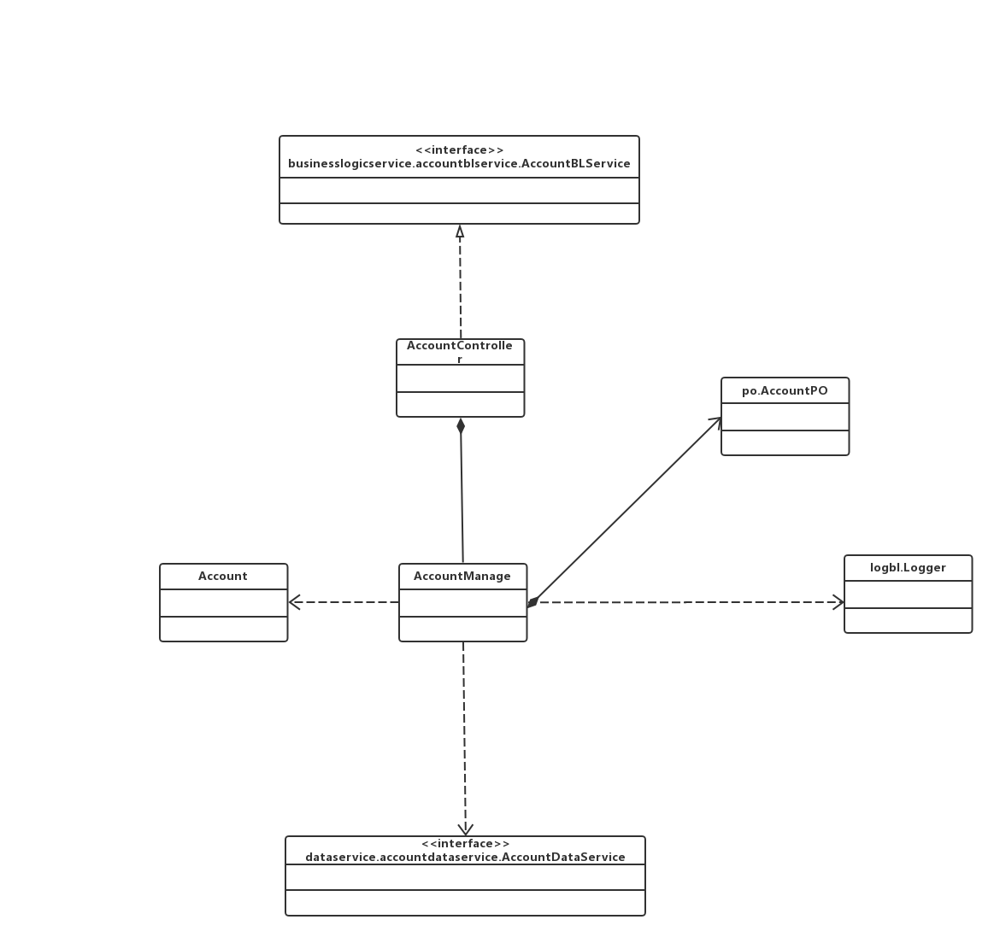
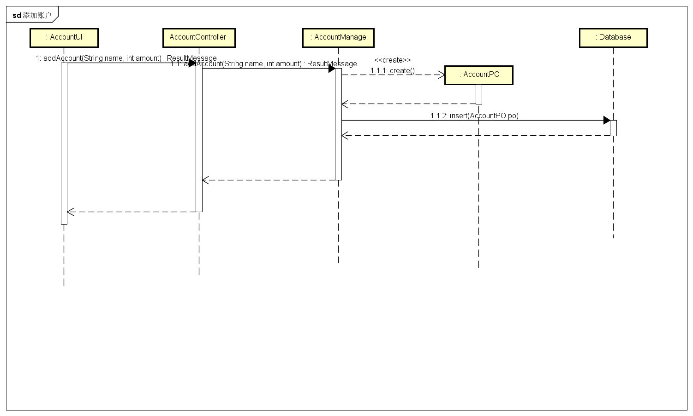
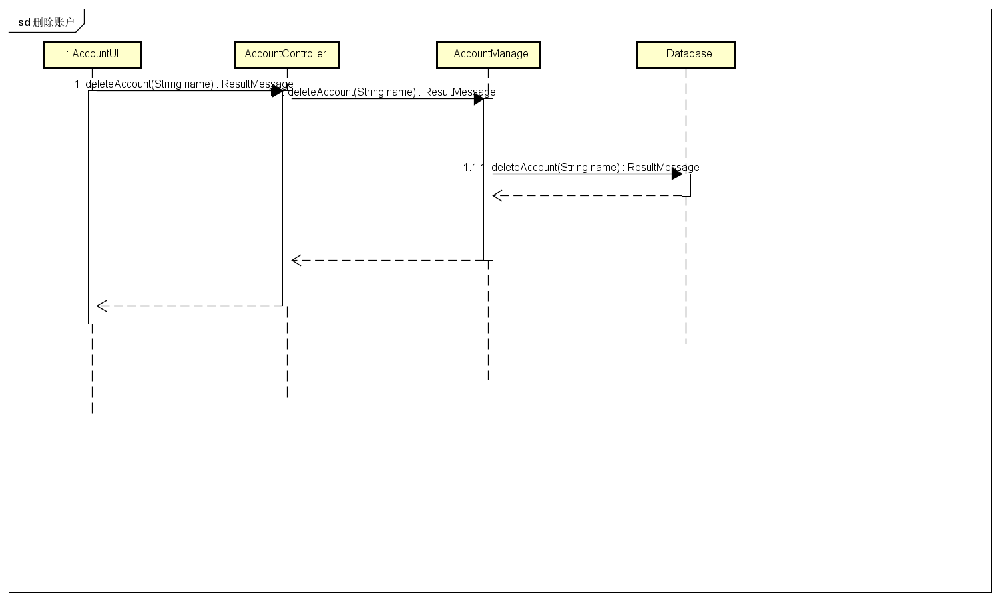
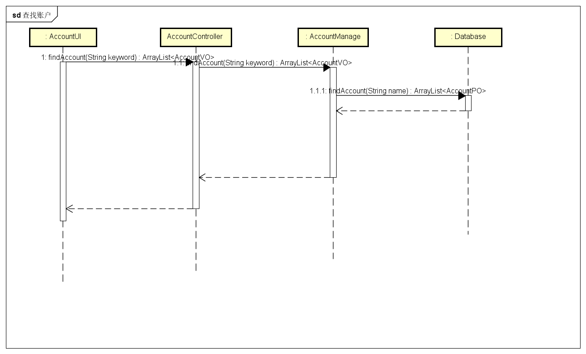
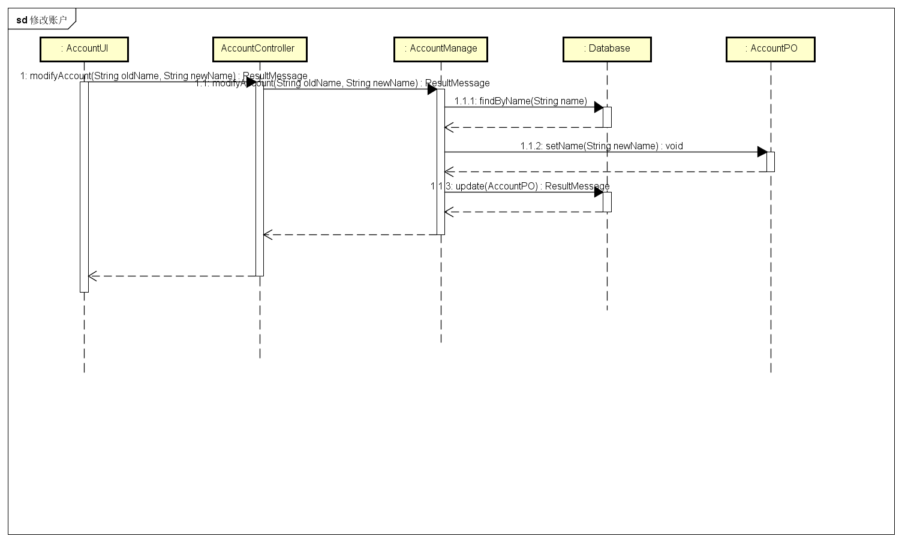
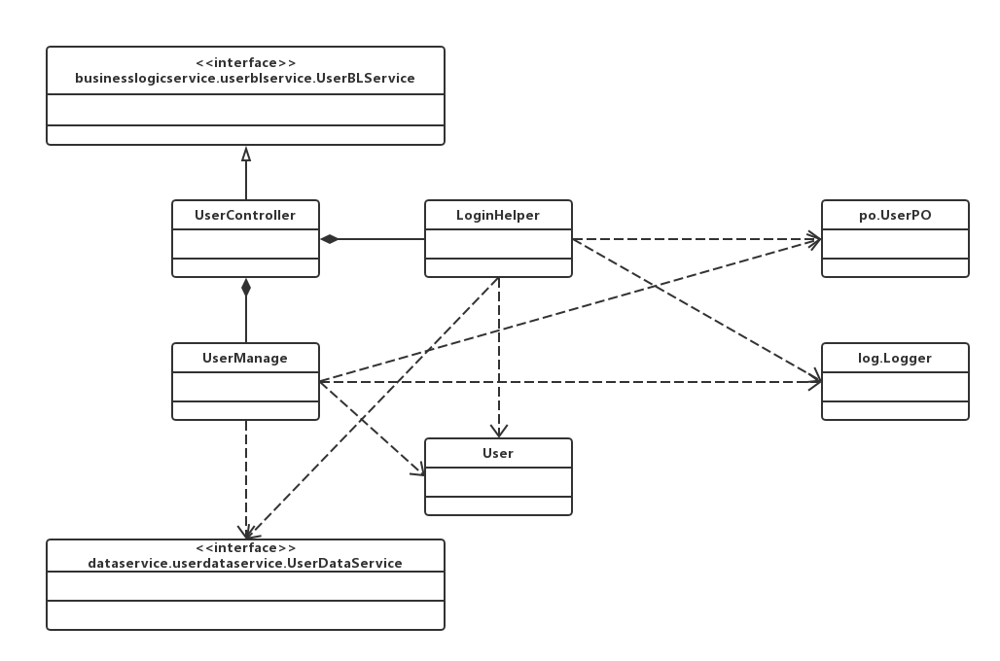
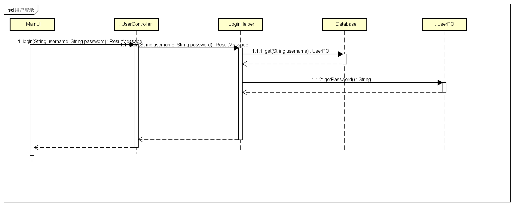
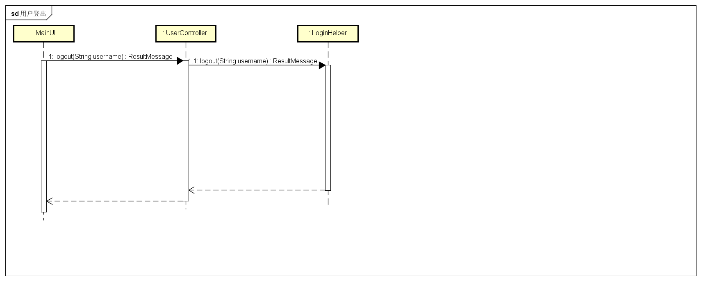

### 界面展示层的分解

#### accountui 模块

##### 模块概述

accountui模块负责实现账户管理界面的显示

### 业务逻辑层的分解

#### accountbl 模块

##### 模块概述

accountbl模块承担的需求参见需求规格说明文档功能需求及相关非功能需求

accountbl模块的职责及接口参见软件系统结构描述文档accountbl模块的接口规范

##### 整体结构

根据体系结构的设计，我们将系统分为展示层、业务逻辑层、数据层。每一层之间为了增加灵活性，我们会添加接口。比如展示层和业务逻辑层之间，我们添加bussinesslogicservice.accountblservice.AccountBLService接口。业务逻辑层和数据层之间添加dataservice. AccountDataService接口。为了隔离业务逻辑职责和逻辑控制职责，我们增加了AccountController，这样AccountlController会将对账户管理的逻辑业务处理委托给AccountManage对象。AccountPO是作为账户信息的持久化对象被添加到设计模型中去的。

accountbl 模块的设计如下图

accountbl 模块各个类的职责如下表

| 模块                | 职责                                       |
| ----------------- | ---------------------------------------- |
| AccountController | 负责实现对账户管理界面所需要的服务                        |
| AccountManage     | 账户管理的领域模型对象，拥有一次账户管理（增删查改四种操作）所需要的信息：增加操作所需要的账户名称、金额；删除操作需要的账户名；查找操作所需要的关键字；修改操作所需要的账户需要修改的名称。可以帮助完成账户管理界面所需要的服务 |
| Account           | 账户的领域模型对象，拥有账户的数据（名称、金额、id）， 拥有对更新账户信息的方法 |

##### 模块内部的接口规范

AccountController的接口规范

| 名称                               | 条目   | 详情                                       |
| -------------------------------- | ---- | ---------------------------------------- |
|                                  | 语法   | `public ArrayList<AccountVO> getAccountList ()` |
| AccountController.getAccountList | 前置条件 | 已创建一个AccountManage领域对象                   |
|                                  | 后置条件 | 调用AccountManage领域对象的`getAccountList`方法   |
|                                  | 语法   | `public ResultMessage addAccount(String name, int amount)` |
| AccountController.addAccount     | 前置条件 | 已创建一个AccountManage领域对象，已添加名称和金额，输入符合输入规则 |
|                                  | 后置条件 | 调用AccountManage领域对象的`addAccount`方法       |
|                                  | 语法   | `public ArrayList<AccountVO> findAccounts(String keyword)` |
| AccountController.findAccounts   | 前置条件 | 已创建一个AccountManage领域对象，已输入关键字且输入符合输入规则   |
|                                  | 后置条件 | 调用AccountManage领域对象的`findAccount`方法      |
|                                  | 语法   | `public AccountVO getAccount(String name)` |
| AccountController.getAccount     | 前置条件 | 已创建一个AccountManage领域对象，已输入名称且输入符合输入规则    |
|                                  | 后置条件 | 调用AccountManage领域对象的`getAccount`方法       |
|                                  | 语法   | `public ResultMessage deleteAccount(String name)` |
| AccountController.deleteAccount  | 前置条件 | 已创建一个AccountManage领域对象，已输入名称且输入符合输入规则    |
|                                  | 后置条件 | 调用AccountManage领域对象的`deleteAccount`方法    |
|                                  | 语法   | `public ResultMessage modifyAccount(String oldName, String newName)` |
| AccountController.modifyAccount  | 前置条件 | 已创建一个AccountManage领域对象，已输入新的名称且输入符合输入规则  |
|                                  | 后置条件 | 调用AccountManage领域对象的`modifyAccount`方法    |

需要的服务

| 服务名                                      | 服务              |
| ---------------------------------------- | --------------- |
| AccountManage.addAccount(String name, String amount) | 加入一个账户对象        |
| AccountManage.getAccountList()           | 得到账户列表          |
| AccountManage.modifyAccount(String oldName, String newName) | 修改一个账户对象        |
| AccountManage.deleteAccount(String name) | 删除一个账户对象        |
| AccountManage.getAccount(String name)    | 根据名称得到一个账户对象    |
| AccountManage.findAccounts(String keyword) | 根据关键字查找得到多个账户对象 |

AccountManage的接口规范

| 名称                           | 条目   | 详情                                       |
| ---------------------------- | ---- | ---------------------------------------- |
|                              | 语法   | `public ArrayList<AccountVO> getAccountList ()` |
| AccountManage.getAccountList | 前置条件 | 得到数据                                     |
|                              | 后置条件 | 返回账户列表                                   |
|                              | 语法   | `public ResultMessage addAccount(String name, int amount)` |
| AccountManage.addAccount     | 前置条件 | 金额，名称符合输入规则                              |
|                              | 后置条件 | 增加新的账户，更新持久化存储内容                         |
|                              | 语法   | `public ArrayList<AccountVO> findAccount(String keyword)` |
| AccountManage.findAccount    | 前置条件 | 输入有效的关键字                                 |
|                              | 后置条件 | 根据关键字查找是否存在相应的账户，若存在匹配的账户则返回相应`Account`对象，若不存在匹配项则返回`null` |
|                              | 语法   | `public AccountVO getAccount(String name)` |
| AccountManage.getAccount     | 前置条件 | 输入有效的账户名称                                |
|                              | 后置条件 | 得到数据，返回名称对应的`Account`对象                  |
|                              | 语法   | `public ResultMessage deleteAccount(String name)` |
| AccountManage.deleteAccount  | 前置条件 | 输入有效的账户名称                                |
|                              | 后置条件 | 删除相应的账户，更新持久化存储内容                        |
|                              | 语法   | `public ResultMessage modifyAccount(String oldName, String newName)` |
| AccountManage.modifyAccount  | 前置条件 | 输入有效的账户名称                                |
|                              | 后置条件 | 更改所修改的账户名称，更新持久化存储的数据                    |

需要的服务（需接口）

| 服务名                                      | 服务                 |
| ---------------------------------------- | ------------------ |
| AccountDataService.getAll()              | 得到目前存储的所有账户的持久化对象  |
| AccountDataService.get(String name)      | 根据name得到单一持久对象     |
| AccountDataService.insert(AccountPO po)  | 插入单一持久化对象          |
| AccountDataService.update(AccountPO po)  | 更新单一持久化对象          |
| AccountDataService.delete(AccountPO po)  | 删除单一持久化对象          |
| AccountDataService.find(String keyword)  | 根据关键字查找多个持久化对象     |
| DataBaseFactory.getAccountDataBase       | 得到Account数据库的服务的引用 |
| Logger.add(OPType op, String itemName, String id) | 记录日志               |

##### 业务逻辑层的动态模型

下图为用户输入新账户的名称和金额后，账户业务逻辑处理的相关对象之间的协作

下图为用户删除账户时账户业务逻辑处理的相关对象之间的协作

下图为用户查查找账户时账户业务逻辑处理的相关对象之间的协作

下图为用户修改账户时账户业务逻辑处理的相关对象之间的协作

#### userbl模块

##### 模块概述

userbl模块承担的需求参见需求规格说明文档功能需求及相关非功能需求

userbl模块的职责及接口参见软件系统结构描述文档userbl模块的接口规范

##### 整体结构

根据体系结构的设计，我们将系统分为展示层、业务逻辑层、数据层。每一层之间为了增加灵活性，我们会添加接口。比如展示层和业务逻辑层之间，我们添加bussinesslogicservice.userblservice.UserBLService接口。业务逻辑层和数据层之间添加dataservice. UserDataService接口。为了隔离业务逻辑职责和逻辑控制职责，我们增加了UserController，这样UserController会将对用户管理的逻辑业务处理委托给UserManage对象，将用户登录登出的逻辑业务处理委托给LoginHelper对象。UserPO是作为用户信息的持久化对象被添加到设计模型中去的。

userbl模块的设计如下图

userbl 模块各个类的职责如下表

| 模块             | 职责                                       |
| -------------- | ---------------------------------------- |
| UserController | 负责实现对账户管理界面所需要的服务                        |
| UserManage     | 账户管理的领域模型对象，拥有一次账户管理（增删查改四种操作）所需要的信息：增加操作所需要的账户名称、金额；删除操作需要的账户名；查找操作所需要的关键字；修改操作所需要的账户需要修改的名称。可以帮助完成账户管理界面所需要的服务 |
| LoginHelper    | 负责实现对应于登录界面所需要的服务                        |
| Logger         | 负责实现对登录以及用户管理的操作的记录                      |
| User           | 用户的领域模型对象，拥有用户对应的数据以及对用户数据进行更改、匹配的方法。    |

##### 模块内部的接口规范

- UserController的接口规范

| 名称                            | 条目   | 详情                                       |
| ----------------------------- | ---- | ---------------------------------------- |
|                               | 语法   | `public ArrayList<UserVo> getUserList ()` |
| UserController.getUserList    | 前置条件 | 创建了一个UserManage领域模型对象                    |
|                               | 后置条件 | 调用UserManage领域对象的getUserList方法           |
|                               | 语法   | `public ResultMessage addUser(UserVo vo)` |
| UserController.addUser        | 前置条件 | 创建了一个UserManage领域模型对象，且输入符合规则            |
|                               | 后置条件 | 调用UserManage领域对象的addUser方法               |
|                               | 语法   | `public ArrayList<UserVO> findUsers(String keyword)` |
| UserController.findUsers      | 前置条件 | 创建了一个UserManage领域模型对象，且输入符合规则            |
|                               | 后置条件 | 调用UserManage领域对象的findUsers方法             |
|                               | 语法   | `public UserVO getUser(String id)`       |
| UserController.getUser        | 前置条件 | 创建了一个UserManage领域模型对象，且输入符合规则            |
|                               | 后置条件 | 调用UserManage领域对象的getUser方法               |
|                               | 语法   | `public ResultMessage deleteUser(String ID)` |
| UserController.deleteUser     | 前置条件 | 创建了一个UserManage领域模型对象，且输入符合规则            |
|                               | 后置条件 | 调用UserManage领域对象的deleteUser方法            |
|                               | 语法   | `public void modifyUser(UserVO vo)`      |
| UserController.modifyUser     | 前置条件 | 创建了一个UserManage领域模型对象，且输入符合规则            |
|                               | 后置条件 | 调用UserManage领域对象的modifyUser方法            |
|                               | 语法   | `public String generateJobNum(UserVO vo)` |
| UserController.generateJobNum | 前置条件 | 创建了一个UserManage领域模型对象，且输入符合规则            |
|                               | 后置条件 | 调用UserManage领域对象的generateJobNum方法        |
|                               | 语法   | `public ResultMessage login(String username, String password)` |
| UserController.logIn          | 前置条件 | 创建了一个LoginHelper领域模型对象，且输入符合规则           |
|                               | 后置条件 | 调用LoginHelper领域对象的login方法                |
|                               | 语法   | `public ResultMessage logOut(UserVo vo)` |
| UserController.logOut         | 前置条件 | 创建了一个LoginHelper领域模型对象，且输入符合规则           |
|                               | 后置条件 | 调用LoginHelper领域对象的logout方法               |

- 需要的服务（需接口）

参见UserManage和LoginHelper的供接口

- UserManage和LoginHelper的接口规范

| 名称                        | 条目   | 详情                                       |
| ------------------------- | ---- | ---------------------------------------- |
|                           | 语法   | `public ArrayList<UserVo> getUserList ()` |
| UserManage.getUserList    | 前置条件 | 得到数据                                     |
|                           | 后置条件 | 返回用户列表                                   |
|                           | 语法   | `public ResultMessage addUser(UserVo vo)` |
| UserManage.addUser        | 前置条件 | 传入有效的对象                                  |
|                           | 后置条件 | 增加新的用户，更新持久化存储内容                         |
|                           | 语法   | `public ArrayList<UserVO> findUsers(String keyword)` |
| UserManage.findUsers      | 前置条件 | 输入有效的关键字                                 |
|                           | 后置条件 | 根据关键字查找是否存在相应的用户，若存在匹配的用户则返回相应对象列表，若不存在匹配项则返回空列表 |
|                           | 语法   | `public UserVO getUser(String id)`       |
| UserManage.getUser        | 前置条件 | 输入有效的用户名                                 |
|                           | 后置条件 | 得到数据，返回名称对应的对象                           |
|                           | 语法   | `public ResultMessage deleteUser(String ID)` |
| UserManage.deleteUser     | 前置条件 | 输入有效的用户ID                                |
|                           | 后置条件 | 删除相应的用户，更新持久化存储内容                        |
|                           | 语法   | `public void modifyUser(UserVO vo)`      |
| UserManage.modifyUser     | 前置条件 | 输入有效的用户对象                                |
|                           | 后置条件 | 更改所修改的用户信息，更新持久化存储的数据                    |
|                           | 语法   | `public String generateJobNum(UserVO vo)` |
| UserManage.generateJobNum | 前置条件 | 用户请求添加新的账号                               |
|                           | 后置条件 | 返回相应字符串                                  |
|                           | 语法   | `public ResultMessage login(String username, String password)` |
| LoginHelper.logIn         | 前置条件 | password符合输入规则                           |
|                           | 后置条件 | 查找是否存在相应的User，根据输入的password返回登陆验证的结果     |
|                           | 语法   | `public ResultMessage logOut(UserVo vo)` |
| LoginHelper.logOut        | 前置条件 | 传入有效的UserVO对象                            |
|                           | 后置条件 | 查找是否存在相应的User，根据传入的对象返回登出结果              |

- 需要的服务（需接口）

| 服务名                                      | 服务                 |
| ---------------------------------------- | ------------------ |
| UserDataService.getAll()                 | 得到目前存储的所有用户的持久化对象  |
| UserDataService.get(String username)     | 根据username得到单一持久对象 |
| UserDataService.insert(UserPO po)        | 插入单一持久化对象          |
| UserDataService.update(UserPO po)        | 更新单一持久化对象          |
| UserDataService.delete(UserPO po)        | 删除单一持久化对象          |
| UserDataService.findUsers(String keyword) | 根据关键字查找多个持久化对象并返回  |
| DataBaseFactory.getUserDataBase          | 得到Account数据库的服务的引用 |
| Logger.add(OPType type, String itemName, String id) | 记录用户改动（增删改）日志      |

##### 业务逻辑层的动态模型

下图为用户登录时登录业务逻辑处理的相关对象之间的协作

下图为用户登出时登录业务逻辑处理的相关对象之间的协作

#### logbl 模块

##### 模块概述

lobgl模块承担的需求参见需求规格说明文档功能需求及相关非功能需求

logbl模块的职责及接口参见软件系统结构描述文档log模块的接口规范

##### 整体结构

根据体系结构的设计，我们将系统分为展示层、业务逻辑层、数据层。每一层之间为了增加灵活性，我们会添加接口。比如展示层和业务逻辑层之间，我们添加bussinesslogicservice.logblservice.LogBLService接口。业务逻辑层和数据层之间添加dataservice. LogDataService接口。为了隔离业务逻辑职责和逻辑控制职责，我们增加了AccountController，这样AccountlController会将对账户管理的逻辑业务处理委托给AccountManage对象。AccountPO是作为账户信息的持久化对象被添加到设计模型中去的。

logbl 模块的设计如下图

logbl 模块各个类的职责如下表

| 模块            | 职责                                       |
| ------------- | ---------------------------------------- |
| LogController | 负责实现对查看日志界面所需要的服务                        |
| Log           | 日志查看的领域模型对象，拥有一次日志查看所需要的信息：日志筛选的条件。可以帮助完成账户管理界面所需要的服务 |
| Logger        | 负责提供其他模块的进行日志记录                          |
| SimpleLogger  | 负责实现Logger接口的功能，即日志记录                    |

##### 模块内部的接口规范

###### LogController的接口规范

| 名称                       | 条目   | 详情                                       |
| ------------------------ | ---- | ---------------------------------------- |
|                          | 语法   | `public ArrayList<LogVo> getLogListByTime (Date from, Date to)` |
| LogController.getLogList | 前置条件 | 已创建一个Log领域对象                             |
|                          | 后置条件 | 调用Log领域对象的getLogList                     |
|                          | 语法   | `public ArrayList<LogVO> findLogs(LogFilter filter)` |
| LogController.findLogs   | 前置条件 | 已创建一个Log领域对象，并传入有效的LogFilter对象           |
|                          | 后置条件 | 调用Log领域对象的findLogs方法                     |

LogController需要的服务见Log的接口规范

###### Log的接口规范

| 名称             | 条目   | 详情                                       |
| -------------- | ---- | ---------------------------------------- |
|                | 语法   | `public ArrayList<LogVo> getLogListByTime (long from, long to)` |
| Log.getLogList | 前置条件 | 输入有效的时间范围                                |
|                | 后置条件 | 根据时间范围返回日志列表                             |
|                | 语法   | `public ArrayList<LogVO> findLogs(LogFilter fiter)` |
| Log.findLogs   | 前置条件 | 传入有效的LogFilter对象                         |
|                | 后置条件 | 根据LogFilter中的属性返回对应的LogVO列表              |

需要的服务（需接口）

| 服务名                                      | 服务                |
| ---------------------------------------- | ----------------- |
| LogDataService.findByTime(Date from, Date to) | 得到目前存储的所有用户的持久化对象 |
| LogDataService.find(LogFilter filter)    | 根据filter得到单一持久对象  |
| LogDataService.insert(LogPO po)          | 插入单一持久化对象         |

###### Logger的接口规范

| 名称         | 条目   | 详情                                       |
| ---------- | ---- | ---------------------------------------- |
|            | 语法   | `public void add(OPType type, String itemName, String id);` |
| Logger.add | 前置条件 | 输入符合规范                                   |
|            | 后置条件 | 根据时间范围返回日志列表                             |
|            | 语法   | `public void add(OPType type, Describable description);` |
| Logger.add | 前置条件 | 输入符合规范                                   |
|            | 后置条件 | 根据LogFilter中的属性返回对应的LogVO列表              |

##### 业务逻辑层的动态模型

下图为查看日志时，日志业务逻辑处理的相关对象之间的协作

下图为筛选日志时，日志业务逻辑处理的相关对象之间的协作

#### initbl 模块

##### 模块概述

initbl模块承担的需求参见需求规格说明文档功能需求及相关非功能需求

initbl模块的职责及接口参见软件系统结构描述文档initbl模块的接口规范

##### 整体结构

根据体系结构的设计，我们将系统分为展示层、业务逻辑层、数据层。每一层之间为了增加灵活性，我们会添加接口。比如展示层和业务逻辑层之间，我们添加bussinesslogicservice.initblservice.AccountBLService接口。业务逻辑层和数据层之间添加dataservice. InitDataService接口。为了隔离业务逻辑职责和逻辑控制职责，我们增加了InitController，这样InitController会将对期初建账的逻辑业务处理委托给Init对象。InitPO是作为期初信息的持久化对象被添加到设计模型中去的。

initbl 模块的设计如下图

initbl 模块各个类的职责如下表

| 模块               | 职责                                       |
| ---------------- | ---------------------------------------- |
| InitController   | 负责实现对期初建账界面所需要的服务                        |
| Init             | 期初建账的领域模型对象，拥有一次期初建账的期初信息                |
| InitCustomerList | 负责实现期初建账时对期初客户信息进行管理，拥有完整的客户信息列表以及对这些信息转换成VO和PO的方法 |
| InitAccountList  | 负责实现期初建账时对期初账户信息进行管理，拥有完整的账户信息列表以及对这些信息转换成VO和PO的方法 |
| InitCommodity    | 负责实现期初建账时对期初商品信息进行管理，拥有完整的商品信息（树状结构）以及对这些信息转换成VO和PO的方法 |

##### 模块内部的接口规范

###### InitController的接口规范

| 名称                            | 条目   | 详情                                       |
| ----------------------------- | ---- | ---------------------------------------- |
|                               | 语法   | `public InitVO getInitInfo()`            |
| InitController.getInitInfo    | 前置条件 | 已经创建了一个Init的领域对象                         |
|                               | 后置条件 | 调用Init领域对象的`getInitInfo()`方法             |
|                               | 语法   | `public ResultMessage commit(InitVO vo)` |
| InitController.commit         | 前置条件 | 已经创建了一个Init的领域对象                         |
|                               | 后置条件 | 调用Init领域对象的`commit(InitVO vo)`方法         |
|                               | 语法   | `public ArrayList<InitVO> getHistoryInfo()` |
| InitController.getHistoryInfo | 前置条件 | 已经创建了一个Init的领域对象                         |
|                               | 后置条件 | 调用Init领域对象的`getHistoryInfo()`方法          |

InitController需要的服务见Init的接口规范

###### Init的接口规范

| 名称                  | 条目   | 详情                                       |
| ------------------- | ---- | ---------------------------------------- |
|                     | 语法   | `public InitVO getInitInfo()`            |
| Init.getInitInfo    | 前置条件 | 用户请求期初建账                                 |
|                     | 后置条件 | 得到历史数据，返回根据所得数据生成的对象（该对象包括期初的一切信息）       |
|                     | 语法   | `public ResultMessage commit(InitVO vo)` |
| Init.commit         | 前置条件 | 传入的对象不为`null`，且包含的信息正确有效                 |
|                     | 后置条件 | 更新持久化存储内容，替换正在使用的账目对象                    |
|                     | 语法   | `public ArrayList<InitVO> getHistoryInfo()` |
| Init.getHistoryInfo | 前置条件 | 用户请求查看历史期初信息                             |
|                     | 后置条件 | 返回对应对象的列表                                |

需要的服务（需接口）

| 服务名                                   | 服务           |
| ------------------------------------- | ------------ |
| InitDataService.newAccount(InitPO po) | 存储单一持久化对象    |
| InitDataService.getInitInfo()         | 得到存储的多个持久化对象 |
| CommodityInfo.getCommodityTree()      | 得到商品信息树      |
| AccountInfo.getAccountList()          | 得到账户信息       |
| CustomerInfo.getCustomerList()        | 得到商品信息       |